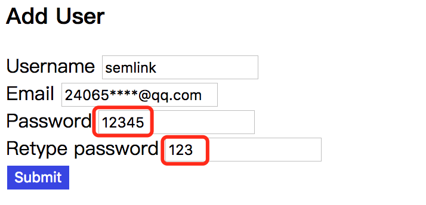

表单是几乎每个 Web 应用程序的一部分。虽然 Angular 为我们提供了几个内置 validators (验证器)，但在实际工作中为了满足项目需求，我们经常需要为应用添加一些自定义验证功能。接下来我们将着重介绍，如何自定义 validator 指令。

## Built-in Validators

Angular 提供了一些内置的 validators，我们可以在 Template-Driven 或 Reactive 表单中使用它们。
如果你对 **Template-Driven** 和 **Reactive** 表单还不了解的话，可以参考 Angular 4.x Forms 系列中 [Template Driven Forms](https://segmentfault.com/a/1190000009037539) 和 [Reactive Forms](https://segmentfault.com/a/1190000009041192) 这两篇文章。

在写本文时，Angular 支持的内建 validators 如下：

- required - 设置表单控件值是非空的
- email - 设置表单控件值的格式是 email
- minlength - 设置表单控件值的最小长度
- maxlength - 设置表单控件值的最大长度
- pattern - 设置表单控件的值需匹配 pattern 对应的模式

在使用内建 validators 之前，我们需要根据使用的表单类型 (Template-Driven 或 Reactive)，导入相应的模块，对于 `Template-Driven` 表单，我们需要导入 `FormsModule`。

具体示例如下：

```typescript
import { NgModule } from '@angular/core';
import { BrowserModule } from '@angular/platform-browser';
import { FormsModule } from '@angular/forms';

@NgModule({
  imports: [BrowserModule, FormsModule], // we add FormsModule here
  declarations: [AppComponent],
  bootstrap: [AppComponent]
})
export class AppModule {}
```

一旦导入了 `FormsModule` 模块，我们就可以在应用中使用该模块提供的所有指令：

```html
<form novalidate>
  <input type="text" name="name" ngModel required>
  <input type="text" name="street" ngModel minlength="3">
  <input type="text" name="city" ngModel maxlength="10">
  <input type="text" name="zip" ngModel pattern="[A-Za-z]{5}">
</form>
```

而对于 `Reactive` 表单，我们就需要导入 `ReactiveFormsModule` 模块：

```typescript
import { ReactiveFormsModule } from '@angular/forms';

@NgModule({
  imports: [BrowserModule, ReactiveFormsModule],
  ...
})
export class AppModule {}
```

可以直接使用 `FormControl` 和 `FormGroup` API 创建表单：

```typescript
@Component()
class Cmp {

  form: FormGroup;

  ngOnInit() {
    this.form = new FormGroup({
      name: new FormControl('', Validators.required)),
      street: new FormControl('', Validators.minLength(3)),
      city: new FormControl('', Validators.maxLength(10)),
      zip: new FormControl('', Validators.pattern('[A-Za-z]{5}'))
    });
  }
}
```

也可以利用 `FormBuilder` 提供的 API，采用更便捷的方式创建表单：

```typescript
@Component()
class Cmp {

  constructor(private fb: FormBuilder) {}

  ngOnInit() {
    this.form = this.fb.group({
      name: ['', Validators.required],
      street: ['', Validators.minLength(3)],
      city: ['', Validators.maxLength(10)],
      zip: ['', Validators.pattern('[A-Za-z]{5}')]
    });
  }
}
```

需要注意的是，我们还需要使用 `[formGroup]` 指令将表单模型与 DOM 中的表单对象关联起来，具体如下：

```html
<form novalidate [formGroup]="form">
  ...
</form>
```

接下来我们来介绍一下如何自定义 validator 指令。

## Building a custom validator directive

在实际开发前，我们先来介绍一下具体需求：我们有一个新增用户的表单页面，
里面包含 4 个输入框，分为用于保存用户输入的 `username`、`email`、`password`、`confirmPassword` 信息。具体的 UI 效果图如下：


## Setup (基础设置)

**1.定义 user 接口**

```typescript
export interface User {
    username: string; // 必填，5-8个字符
    email: string; // 必填，有效的email格式
    password: string; // 必填，值要与confirmPassword值一样
    confirmPassword: string; // 必填，值要与password值一样
}
```

**2.导入 ReactiveFormsModule**

// app.module.ts

```typescript
import { NgModule, CUSTOM_ELEMENTS_SCHEMA } from '@angular/core';
import { BrowserModule } from '@angular/platform-browser';
import { ReactiveFormsModule } from '@angular/forms';

import { AppComponent } from './app.component';

@NgModule({
  imports: [BrowserModule, ReactiveFormsModule],
  declarations: [AppComponent],
  bootstrap: [AppComponent]
})
export class AppModule { }
```

**3.初始化 AppComponent**

// app.component.html

```html
<div>
  <h3>Add User</h3>
  <form novalidate (ngSubmit)="saveUser()" [formGroup]="user">
    <div>
      <label for="">Username</label>
      <input type="text" formControlName="username">
      <div class="error" *ngIf="user.get('username').invalid && 
          user.get('username').touched">
        Username is required (minimum 5 characters, maximum 8 characters).
      </div>
      <!--<pre *ngIf="user.get('username').errors" class="margin-20">
        {{ user.get('username').errors | json }}</pre>-->
    </div>
    <div>
      <label for="">Email</label>
      <input type="email" formControlName="email">
      <div class="error" *ngIf="user.get('email').invalid && user.get('email').touched">
        Email is required and format should be <i>24065****@qq.com</i>.
      </div>
      <!--<pre *ngIf="user.get('email').errors" class="margin-20">
        {{ user.get('email').errors | json }}</pre>-->
    </div>
    <div>
      <label for="">Password</label>
      <input type="password" formControlName="password">
      <div class="error" *ngIf="user.get('password').invalid && 
          user.get('password').touched">
        Password is required
      </div>
      <!--<pre *ngIf="user.get('password').errors" class="margin-20">
        {{ user.get('password').errors | json }}</pre>-->
    </div>
    <div>
      <label for="">Retype password</label>
      <input type="password" formControlName="confirmPassword" validateEqual="password">
      <div class="error" *ngIf="user.get('confirmPassword').invalid && 
          user.get('confirmPassword').touched">
        Password mismatch
      </div>
      <!--<pre *ngIf="user.get('confirmPassword').errors" class="margin-20">
        {{ user.get('confirmPassword').errors | json }}</pre>-->
    </div>
    <button type="submit" class="btn-default" [disabled]="user.invalid">Submit</button>
  </form>
</div>
```

// app.component.ts

```typescript
import { Component, OnInit } from '@angular/core';
import { FormGroup, FormBuilder, Validators } from '@angular/forms';

export interface User {
  username: string; // 必填，5-8个字符
  email: string; // 必填，有效的email格式
  password: string; // 必填，值要与confirmPassword值一样
  confirmPassword: string; // 必填，值要与password值一样
}

@Component({
  moduleId: module.id,
  selector: 'exe-app',
  templateUrl: 'app.component.html',
  styles: [`
    .error {
      border: 1px dashed red;
      color: red;
      padding: 4px;
    }

    .btn-default {
      border: 1px solid;
      background-color: #3845e2;
      color: #fff;
    }

    .btn-default:disabled {
      background-color: #aaa;
    }

  `]
})
export class AppComponent implements OnInit {
  public user: FormGroup;

  constructor(public fb: FormBuilder) { }


  ngOnInit() {
    this.user = this.fb.group({
      username: ['', [Validators.required, Validators.minLength(5), 
                      Validators.maxLength(8)]],
      email: ['', [Validators.required, Validators.email]],
      password: ['', [Validators.required]],
      confirmPassword: ['', [Validators.required]]
    });
  }

  saveUser(): void {

  }
}
```

## Custom confirm password validator

接下来我们来实现自定义 `equal-validator` 指令：

// equal-validator.directive.ts

```typescript
import { Directive, forwardRef, Attribute } from '@angular/core';
import { Validator, AbstractControl, NG_VALIDATORS } from '@angular/forms';

@Directive({
    selector: '[validateEqual][formControlName],[validateEqual][formControl],
                 [validateEqual][ngModel]',
    providers: [
        { provide: NG_VALIDATORS, useExisting: forwardRef(() => EqualValidator), 
              multi: true }
    ]
})
export class EqualValidator implements Validator {
    constructor(@Attribute('validateEqual') public validateEqual: string) { }

    validate(c: AbstractControl): { [key: string]: any } {
        // self value (e.g. retype password)
        let v = c.value; // 获取应用该指令，控件上的值

        // control value (e.g. password)
        let e = c.root.get(this.validateEqual); // 获取进行值比对的控件

        // value not equal
        if (e && v !== e.value) 
         return {
            validateEqual: false
         }
        return null;
    }
}
```

上面的代码很长，我们来分解一下。

### Directive declaration

```typescript
@Directive({
    selector: '[validateEqual][formControlName],[validateEqual] 
        [formControl],[validateEqual][ngModel]',
    providers: [
        { provide: NG_VALIDATORS, useExisting: forwardRef(() => EqualValidator), 
        multi: true }
    ]
})
```

首先，我们使用 `@Directive` 装饰器来定义指令。然后我们设置该指令的 Metadata 信息：

- selector - 定义指令在 HTML 代码中匹配的方式
- providers - 注册EqualValidator

其中 forwardRef 的作用，请参考 - [Angular 2 Forward Reference](https://segmentfault.com/a/1190000008626276)

### Class defintion

```typescript
export class EqualValidator implements Validator {
    constructor(@Attribute('validateEqual') public validateEqual: string) {}

    validate(c: AbstractControl): { [key: string]: any } {}
}
```

我们的 `EqualValidator` 类必须实现 `Validator` 接口：

```typescript
export interface Validator {
  validate(c: AbstractControl): ValidationErrors|null;
  registerOnValidatorChange?(fn: () => void): void;
}
```

该接口要求定义一个 `validate()` 方法，因此我们的 `EqualValidator` 类中就需要实现 `Validator` 接口中定义的 `validate` 方法。
此外在构造函数中，我们通过 `@Attribute('validateEqual')` 装饰器来获取 `validateEqual` 属性上设置的值。

### Validate implementation

```typescript
validate(c: AbstractControl): { [key: string]: any } {
    // self value (e.g. retype password)
    let v = c.value; // 获取应用该指令，控件上的值

    // control value (e.g. password)
    let e = c.root.get(this.validateEqual); // 获取进行值比对的控件

    // value not equal
    if (e && v !== e.value) 
     return { // 若不相等，返回验证失败信息
        validateEqual: false
     }
    return null;
}
```

## Use custom validator

要在我们的表单中使用自定义验证器，我们需要将其导入到我们的应用程序模块中

```typescript
import { NgModule, CUSTOM_ELEMENTS_SCHEMA } from '@angular/core';
import { BrowserModule } from '@angular/platform-browser';
import { ReactiveFormsModule } from '@angular/forms';

import { EqualValidator } from './equal-validator.directive';

import { AppComponent } from './app.component';

@NgModule({
  imports: [BrowserModule, ReactiveFormsModule],
  declarations: [AppComponent, EqualValidator],
  bootstrap: [AppComponent]
})
export class AppModule { }
```

以上代码成功运行后，我们来验证一下刚实现的功能。

看起来一切很顺利，但请继续看下图：



什么情况，password 输入框的值已经变成 12345 了，还能验证通过。为什么会出现这个问题呢？
因为我们的只在 confirmPassword 输入框中应用 `validateEqual` 指令。
所以 password 输入框的值发生变化时，是不会触发验证的。接下来我们来看一下如何修复这个问题。

## Solution

我们将重用我们的 validateEqual 验证器并添加一个 `reverse` 属性 。

```html
<div>
  <label for="">Password</label>
  <input type="text" formControlName="password" validateEqual="confirmPassword" 
         reverse="true">
  <div class="error" *ngIf="user.get('password').invalid && 
      user.get('password').touched">
    Password is required
  </div>
  <!--<pre *ngIf="user.get('password').errors" class="margin-20">
    {{ user.get('password').errors | json }}</pre>-->
</div>
<div>
  <label for="">Retype password</label>
  <input type="text" formControlName="confirmPassword" validateEqual="password">
  <div class="error" *ngIf="user.get('confirmPassword').invalid && 
      user.get('confirmPassword').touched">
    Password mismatch
  </div>
  <!--<pre *ngIf="user.get('confirmPassword').errors" class="margin-20">
    {{ user.get('confirmPassword').errors | json }}</pre>-->
</div>
```

- 若未设置 `reverse` 属性或属性值为 false，实现的功能跟前面的一样。
- 若 `reverse` 的值设置为 true，我们仍然会执行相同的验证，但错误信息不是添加到当前控件，而是添加到目标控件上。

在上面的示例中，我们设置 password 输入框的 reverse 属性为 true，即 `reverse="true"`。
当 password 输入框的值与 confirmPassword 输入框的值不相等时，我们将把错误信息添加到 confirmPassword 控件上。具体实现如下：

// equal-validator.directive.ts

```typescript
import { Directive, forwardRef, Attribute } from '@angular/core';
import { Validator, AbstractControl, NG_VALIDATORS } from '@angular/forms';

@Directive({
    selector: '[validateEqual][formControlName],[validateEqual][formControl],    
          [validateEqual][ngModel]',
    providers: [
        { provide: NG_VALIDATORS, useExisting: forwardRef(() => EqualValidator), 
              multi: true }
    ]
})
export class EqualValidator implements Validator {
    constructor(@Attribute('validateEqual') public validateEqual: string,
        @Attribute('reverse') public reverse: string) { }

    private get isReverse() {
        if (!this.reverse) return false;
        return this.reverse === 'true';
    }

    validate(c: AbstractControl): { [key: string]: any } {
        // self value
        let v = c.value;

        /**
         * 检索此控件的顶级祖先。
         * 
         * readonly root: AbstractControl;
         */
        // control vlaue
        let e = c.root.get(this.validateEqual);

        // value not equal
        // 未设置reverse的值或值为false
        if (e && v !== e.value && !this.isReverse) { 
            return {
                validateEqual: false
            }
        }

        /**
          * 返回对象的可枚举属性和方法的名称。
          * o 包含属性和方法的对象。这可以是您创建的对象或现有的文档对象模型（DOM）对象。
          * 
          * keys(o: any): string[];
          */
        // value equal and reverse
        // 若值相等且reverse的值为true，则删除validateEqual异常信息
        if (e && v === e.value && this.isReverse) { 
            delete e.errors['validateEqual'];
            if (!Object.keys(e.errors).length) e.setErrors(null);
        }

        // value not equal and reverse
        // 若值不相等且reverse的值为true，则把异常信息添加到比对的目标控件上
        if (e && v !== e.value && this.isReverse) { 
            e.setErrors({ validateEqual: false });
        }
        return null;
    }
}
```

以上代码运行后，成功解决了我们的问题。
其实解决该问题还有其它的方案，我们可以基于 `password` 和 `confirmPassword` 来创建 `FormGroup` 对象，然后添加自定义验证来实现上述的功能。

---

## FAQ

### [AbstractControl].root

```typescript
/**
 * 检索此控件的顶级祖先。
 */
readonly root: AbstractControl;
```

### Object.(o: any)

```typescript
/**
  * 返回对象的可枚举属性和方法的名称。
  * @param o 包含属性和方法的对象。这可以是您创建的对象或现有的文档对象模型（DOM）对象。
*/
keys(o: any): string[];
```

### delete

```typescript
const obj = {'name': 'liucl', 'age': 25, 'address': 'qingdao'};
console.log(obj);
delete obj.name;
console.log(obj);
delete obj['address'];
console.log(obj);
```

```text
// 输出：
Object { name: "liucl", age: 25, address: "qingdao" }
Object { age: 25, address: "qingdao" }
Object { age: 25 }
```

### forwardRef

```typescript
/**
 * 允许引用尚未定义的引用。
 *
 * 例如，
 *
 * 当我们需要为依赖注入(DI)的目的而引用的`token`被声明时，但还没有被定义，`forwardRef`被使用。
 * 
 * 当我们在创建查询时使用的`token`还没有被定义的时候，也被使用。
 *
 * ### Example
 * {@example core/di/ts/forward_ref/forward_ref_spec.ts region='forward_ref'}
 * @experimental
 */
export declare function forwardRef(forwardRefFn: ForwardRefFn): Type<any>;
```