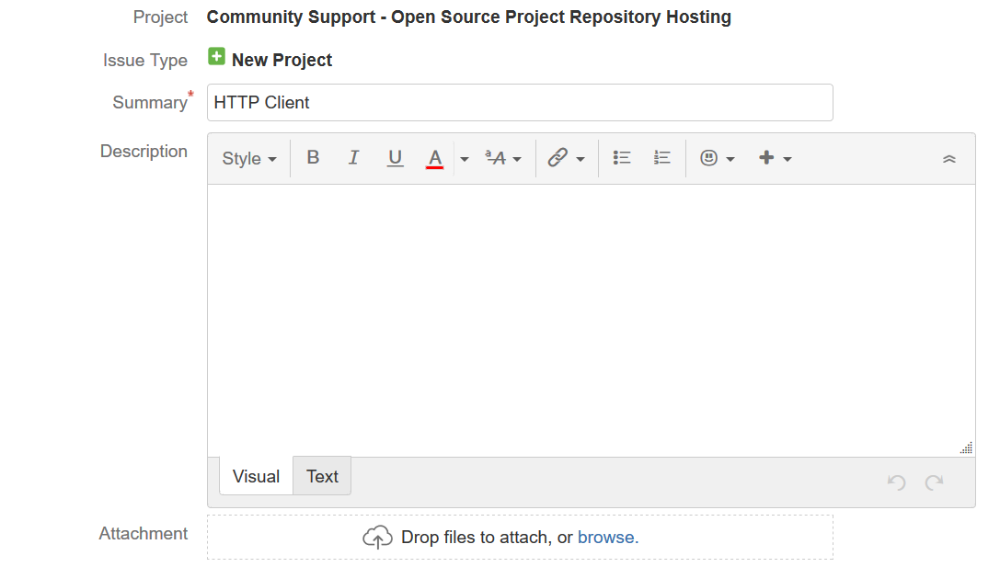
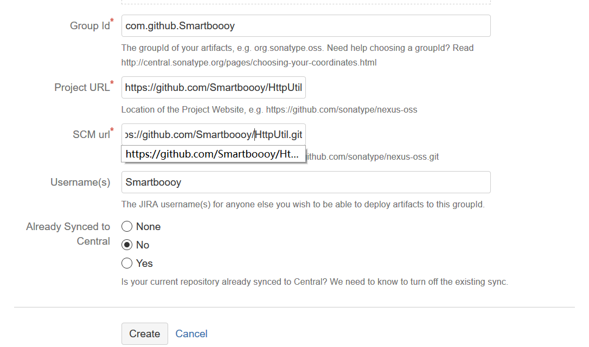
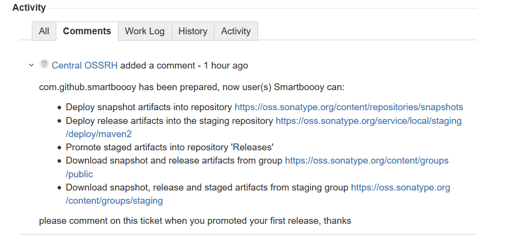
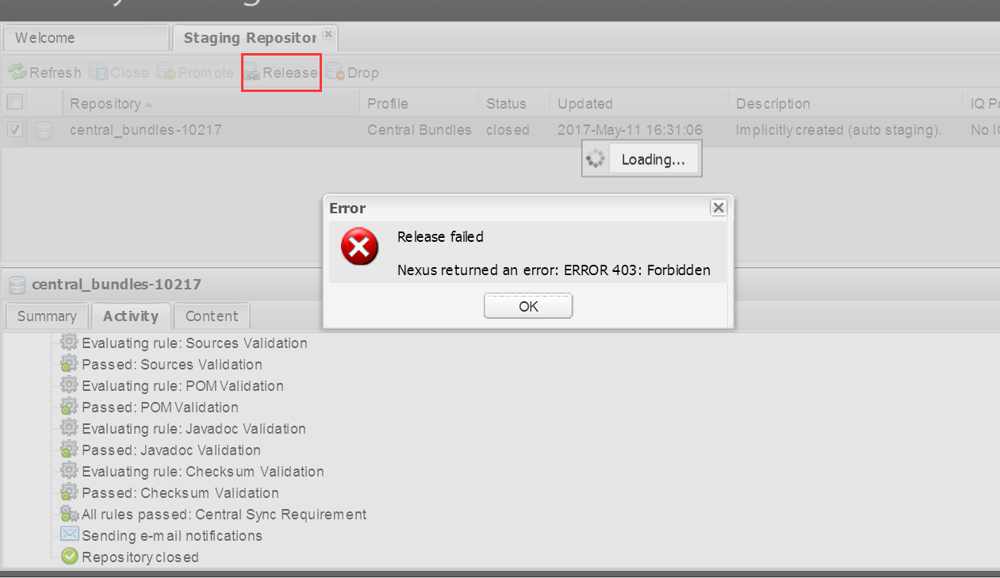
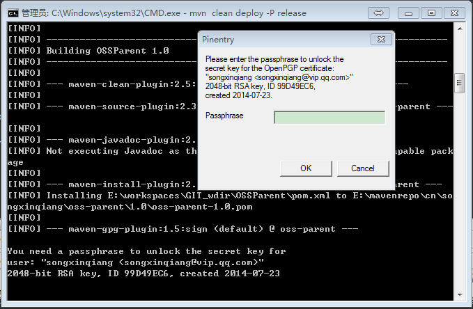

>摘要: maven的神威，我想用过的人都会说好的，用多了难免就会有将自己写的代码也发布到中央仓库的想法，
本文就结合我自己的经历简单介绍一下怎样将构件发布到maven的中央仓库。

>这里需要说明的是，我的发布过程是参考了开源中国里面的两篇博客的（@黄勇 的http://my.oschina.net/huangyong/blog/226738 和 @路小磊 的http://my.oschina.net/looly/blog/270767 ），在此向他们表示感谢。

闲话不多说，下面正式开始。
### 1、注册Sonatype的账户
maven中央仓库是有一个叫做Sonatype的公司在维护的，在发布构件之前需要到
https://issues.sonatype.org/secure/Signup!default.jspa 去注册一个账号，记住自己的用户名和密码，以后要用。

同时，还要记住一个地址，将来在查询自己所发布构件状态和进行一些操作的时候要使用，
https://oss.sonatype.org/ 。

### 2、提交发布申请
提交申请，在这里是创建一个issue的形式，创建地址：
https://issues.sonatype.org/secure/CreateIssue.jspa?issuetype=21&pid=10134

在填写issue信息的时候，有一些需要注意的地方：

- `group id`就是别人在使用你的构件的时候在pom.xml里面进行定位的坐标的一部分，
而且尽量应该是你的站点的url倒序，参考java包命名的规范。

- `project url`这个是项目的站点，一般是用作说明的

- `SCM url`这个构件的源代码的url，便于别人查看源代码，当然这个得是公网能够访问的，
不要是什么内部的svn地址什么的哈，我是用的是开源中国的GIT@OSC,也推荐大家使用




其他的就没有什么了，提交之后就等工作人员确认吧，有时候工作人员会问你些你没有明确的内容，只需要回答就好。
需要注意的是，这个系统的工作人员是在美国上班的，经过我的等待和观察，他们会在北京时间的22:00开始上班、处理issue，所以在这个时间之前就不要去查询状态了，人家还没有上班呢。

等到工作人员在你创建的issue下面回复你说“配置已经修改……”（还有几个链接）的时候就说明
审批已经通过了，你就可以进行构件的上传了。



### 3、上传之前的准备
如果是 Windows 操作系统，需要下载 Gpg4win 软件来生成密钥对，linux的直接安装gpg软件包就行。
建议大家下载 Gpg4win-Vanilla 版本，因为它仅包括 GnuPG，这个工具才是我们所需要的。

安装 GPG 软件后，打开命令行窗口，依次做以下操作：
##### 1. 查看是否安装成功
```
gpg --version
```
能够显示 GPG 的版本信息，说明安装成功了。

##### 2. 生成密钥对
```
gpg --gen-key
```

此时需要输入姓名、邮箱等字段，其它字段可使用默认值，此外，还需要输入一个 Passphase，
相当于一个密钥库的密码，一定不要忘了，也不要告诉别人，最好记下来，因为后面会用到。

##### 3. 查看公钥
```
gpg --list-keys
```
输出如下信息：
```
C:/Users/刘春龙/AppData/Roaming/gnupg/pubring.gpg
-------------------------------------------------
pub   2048R/0D46B4C5 2017-05-11
uid       [ultimate] liuchunlong <631521383@qq.com>
sub   2048R/0BFA9DC6 2017-05-11
```

可见这里的公钥的 ID 是：82DC852E，很明显是一个 16 进制的数字，马上就会用到。

##### 4. 将公钥发布到 GPG 密钥服务器
```
gpg --keyserver hkp://pool.sks-keyservers.net --send-keys 0D46B4C5
```
此后，可使用本地的私钥来对上传构件进行数字签名，而下载该构件的用户可通过上传的公钥来
验证签名，也就是说，大家可以验证这个构件是否由本人上传的，因为有可能该构件被坏人给篡改了。

##### 5. 查询公钥是否发布成功
```
gpg --keyserver hkp://pool.sks-keyservers.net --recv-keys 0D46B4C5
```
实际上就是从 key server 上通过公钥 ID 来接收公钥，此外，也可以到 sks-keyservers.net
上通过公钥 ID 去查询。
```
C:\Users\刘春龙>gpg --keyserver hkp://pool.sks-keyservers.net --recv-keys 0D46B4C5
gpg: requesting key 0D46B4C5 from hkp server pool.sks-keyservers.net
gpg: key 0D46B4C5: "liuchunlong <631521383@qq.com>" not changed
gpg: Total number processed: 1
gpg:              unchanged: 1
```

### 4、配置maven
找你所使用的maven的配置文件<mvn_home>/conf/settings.xml，在配置文件中找到`<servers>`节点，
这个节点默认是注释了的，我们就在这个猪似的外边增加一个<servers>的配置
```
<server>
  <id>sonatype-nexus-snapshots</id>
  <username>用户名</username>
  <password>密码</password>
</server>
<server>
  <id>sonatype-nexus-staging</id>
  <username>用户名</username>
  <password>密码</password>
</server>
```
这里的id是将来要在pom.xml里面使用的，所以务必记好。
用户名和密码就是在Sonatype上面注册的用户名和密码。

### 5、配置pom.xml
接下来就是重头戏了，pom.xml是一个maven项目的重点配置，一个项目的所有配置都可以由这个文件来描述，
文件中的所有配置都有默认值，也就是说所有的配置都是可选配置，但是为了把构件发布到中央仓库，我们必须配置一些关键信息，否则再发布时是不会通过了。

这些必须明确致命的信息包括：name、description、url、licenses、developers、scm等
基本信息，此外，使用了 Maven 的 profile 功能，只有在 release 的时候，创建源码包、
创建文档包、使用 GPG 进行数字签名。此外，snapshotRepository 与 repository 中
的 id 一定要与 settings.xml 中 server 的 id 保持一致。

````
<?xml version="1.0" encoding="UTF-8"?>
<project xmlns="http://maven.apache.org/POM/4.0.0"
         xmlns:xsi="http://www.w3.org/2001/XMLSchema-instance"
         xsi:schemaLocation="http://maven.apache.org/POM/4.0.0 http://maven.apache.org/xsd/maven-4.0.0.xsd">
    <modelVersion>4.0.0</modelVersion>

    <parent>
        <groupId>org.sonatype.oss</groupId>
        <artifactId>oss-parent</artifactId>
        <version>7</version>
    </parent>

    <properties>
        <project.reporting.outputEncoding>UTF-8</project.reporting.outputEncoding>
        <compiler.plugin.version>3.5.1</compiler.plugin.version>
        <jdk.version>1.8</jdk.version>
    </properties>


    <groupId>com.github.fnpac</groupId>
    <artifactId>httputil</artifactId>
    <version>1.0.0</version>
    <packaging>jar</packaging>
    <name>HttpUtil</name>
    <description>WeChat Software Development Kit</description>
    <inceptionYear>2017</inceptionYear>
    <url />

    <licenses>
        <license>
            <name>The Apache Software License, Version 2.0</name>
            <url>http://www.apache.org/licenses/LICENSE-2.0.txt</url>
            <distribution>repo</distribution>
        </license>
    </licenses>

    <issueManagement>
        <system>github</system>
        <url>https://github.com/fnpac/HttpUtil/issues</url>
    </issueManagement>

    <developers>
        <developer>
            <name>fnpac</name>
            <email>631521383@qq.com</email>
            <roles>
                <role>Project Manager</role>
            </roles>
        </developer>
    </developers>

    <scm>
        <url>git@github.com:fnpac/HttpUtil.git</url>
        <connection>scm:git:git@github.com:fnpac/HttpUtil.git</connection>
        <developerConnection>scm:git:git@github.com:fnpac/HttpUtil.git</developerConnection>
        <tag />
    </scm>

    <dependencies>
    </dependencies>

    <build>
        <plugins>
            <plugin>
                <groupId>org.apache.maven.plugins</groupId>
                <artifactId>maven-failsafe-plugin</artifactId>
            </plugin>
        </plugins>

        <pluginManagement>
            <plugins>
                <plugin>
                    <groupId>org.apache.maven.plugins</groupId>
                    <artifactId>maven-compiler-plugin</artifactId>
                    <version>${compiler.plugin.version}</version>
                    <configuration>
                        <source>${jdk.version}</source>
                        <target>${jdk.version}</target>
                        <encoding>${project.build.sourceEncoding}</encoding>
                        <showWarnings>true</showWarnings>
                    </configuration>
                </plugin>
                <plugin>
                    <groupId>org.apache.maven.plugins</groupId>
                    <artifactId>maven-failsafe-plugin</artifactId>
                    <version>2.19.1</version>
                    <executions>
                        <execution>
                            <id>integration-test</id>
                            <goals>
                                <goal>integration-test</goal>
                            </goals>
                        </execution>
                        <execution>
                            <id>verify</id>
                            <goals>
                                <goal>verify</goal>
                            </goals>
                        </execution>
                    </executions>
                </plugin>
            </plugins>
        </pluginManagement>
    </build>
</project>
````

#### 坑

**千万千万注意：如果你在“提交发布申请”这一步，填写的“group id”存在大写字母，例如：**


**请注意查看工作人员的回复，**


```
com.github.fnpac has been prepared, now user(s) fnpac can:
```
也就是给你创建的**GroupID为"com.github.fnpac",小写！！！**，所以上面**pom文件配置的组件的GroupID一定也要设置的是小写**！
否则会提示你：




### 6、上传构件
待构件编写完成，就可以进行上传、发布了。在命令行进入项目pom.xml所在路径，执行：

```
mvn clean deploy -P sonatype-oss-release
```
在稍后些时候会要你输入gpg密钥库的密码，输入即可完成上传，具体时间取决于网络情况。



当然有时候不会弹出输入密码的输入框，只是提示需要输入密码，根据gpg插件的官网解释
（http://maven.apache.org/plugins/maven-gpg-plugin/usage.html ），需要加上
密码作为参数执行命令，即：
```
mvn clean deploy -Psonatype-oss-release -Dgpg.passphrase=密码
```

### 7、在OSS中发布构件
构件上传之后需要在OSS系统中对操作进行确认，将构件发布，进入https://oss.sonatype.org/
使用你的用户名和密码登陆之后，在左边菜单找到“Staging Repositories”，点击，在右上方有一个输入搜索框输入你的groupid进行快速定位，可以发现这时你的构件状态是“open”，
勾选你的构件，查看校验的结果信息，如果没有错误就可以点击刚才勾选的checkbox上面右边一点的“close”按钮，在弹出框中“confirm”，这里又需要校验一次，稍后结果会通过邮箱通知。

等成功后（系统自动进行，很快的），再次登录系统找到你的构件，这是状态已经是“closed”的了，
再次勾选，然后点击“close”旁边的“release”，在弹出框中进行“confirm”，稍后结果会通过邮件进行通知。


### 8、通知sonatype的工作人员关闭issue
回到issue系统，找到你的那个申请发布构件的issue，在下面回复工作人员，说明构件已经发布，
待工作人员确认后，会关闭这个issue。

### 9、使用构件
一切完成后并不可以马上就使用你所发布的issue，得等系统将你的构件同步到中央仓库之后才可以使用，这个时间至少要2个小时，然后就可以在中央仓库的搜索页面
（http://search.maven.org/ ）搜到你的构件啦，

赶快截图，向他人炫耀一下吧。
### 10、特别说明
上面的系统是不是很繁琐？别担心，这只是第一次使用你的groupid发布构件，经实践证明，
第一次成功之后，以后就可以使用你的groupid发布任何的构件了，只需要你的groupid没有变就行，（当然不能发布重复构件哈），不用这么麻烦。

以后的发布流程：

1. 构件准备好之后，在命令行上传构建；
2. 在https://oss.sonatype.org/ “close”并“release”构件；
3. 等待同步好（大约2小时多）之后，就可以使用了