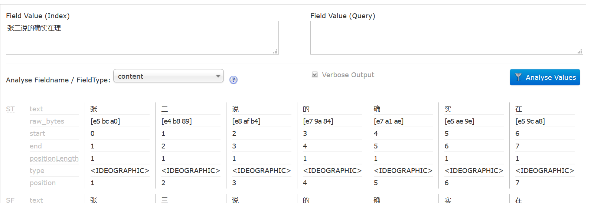
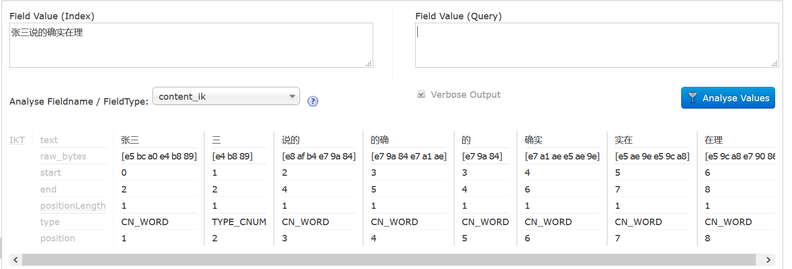
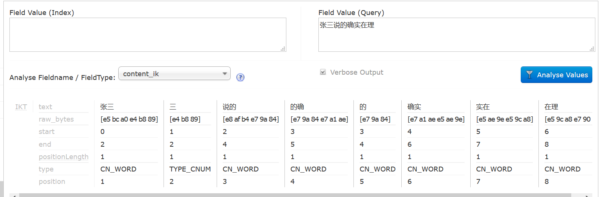
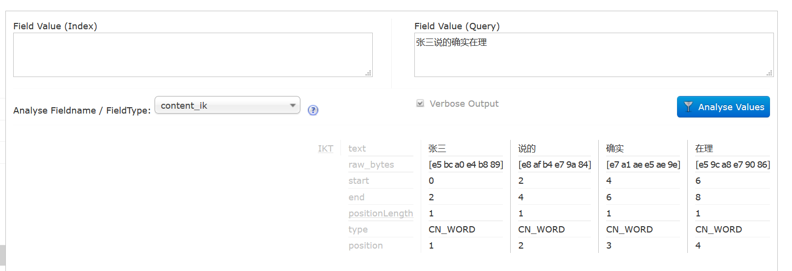

`IK Analyzer`是一款结合了词典和文法分析算法的中文分词组件，基于字符串匹配，支持用户词典扩展定义，支持细粒度和智能切分，比如：

张三说的确实在理

智能分词的结果是：

```
张三 |  说的 |  确实 |  在理 
```

最细粒度分词结果：

```
张三 |  三 |  说的 |  的确 |  的 |  确实 |  实在 |  在理
```

### 整合IK Analyzer

比mmseg4j要简单很多，[下载](https://code.google.com/p/ik-analyzer/downloads/list)`IKAnalyzer2012FF_hf1.jar`,
放到目录：`D:\apache-tomcat-8.0.9\webapps\solr\WEB-INF\lib`，

修改配置文件`schema.xml`，添加代码：

```xml
<field name="content_ik" type="text_ik" indexed="true" stored="true"/> 
<fieldType name="text_ik" class="solr.TextField">
      <analyzer type="index" isMaxWordLength="false" class="org.wltea.analyzer.lucene.IKAnalyzer"/>
      <analyzer type="query" isMaxWordLength="true" class="org.wltea.analyzer.lucene.IKAnalyzer"/>
</fieldType>
```

查询采用IK自己的最大分词法,索引则采用它的细粒度分词法

重启服务，来看看IKAnalyzer的分词效果怎么样







默认分词器进行最细粒度切分。

### 基于配置的词典扩充

IK分词器还支持通过配置 IKAnalyzer.cfg.xml 文件来扩充您的专有词典以及停止词典（过滤词典）。 

1. 部署IKAnalyzer.cfg.xml 

IKAnalyzer.cfg.xml 部署在代码根目彔下（ 对亍 web 项目，通常是 WEB-INF/classes目彔）同hibernate、log4j等配置文件相同。 

2. 词典文件的编辑与部署 

分词器的词典文件格式是无 BOM 的 UTF-8 编码的中文文本文件，文件扩展名不
限。词典中，每个中文词汇独立占一行，使用\r\n 的 DOS 方式换行。（注，如果您不
了解什么是无 BOM 的 UTF-8 格式， 请保证您的词典使用 UTF-8 存储，并在文件的
头部添加一空行）。您可以参考分词器源码org.wltea.analyzer.dic 包下的.dic文件。 
词典文件应部署在 Java 的资源路径下，即 ClassLoader 能够加载的路径中。（推
荐同IKAnalyzer.cfg.xml 放在一起） 

3. IKAnalyzer.cfg.xml 文件的配置 

```xml
<?xml version="1.0" encoding="UTF-8"?>
<!DOCTYPE properties SYSTEM "http://java.sun.com/dtd/properties.dtd">  
<properties>  
	<comment>IK Analyzer 扩展配置</comment>
	<!--用户可以在这里配置自己的扩展字典 
	<entry key="ext_dict">ext.dic;</entry> 
	-->
	<!--用户可以在这里配置自己的扩展停止词字典-->
	<entry key="ext_stopwords">stopword.dic;</entry> 
	
</properties>
```

在配置文件中，用户可一次配置多个词典文件。文件名使用“;”号分隔。文件路径为相对java包的起始根路径。


### 优化

事实上前面的FieldType配置其实存在问题，根据目前最新的IK版本IK Analyzer 2012FF_hf1.zip，
索引时使用最细粒度分词，查询时最大分词（智能分词）实际上是不生效的。

解决办法：

编译<https://github.com/ittalks/Tonic_tika_solr_zookeeper/tree/master/IKAnalyzer2012ff>，将生成的`IKAnalyzer2012ff.jar`

>注：改Jar已经集成了`IKAnalyzer.cfg.xml`，请勿重复`基于配置的词典扩充`一节。

如果想通过配置 IKAnalyzer.cfg.xml 文件来扩充您的专有词典以及停止词典（过滤词典），
只需要fork改项目，然后修改配置，重新打包`IKAnalyzer2012ff_4.10.3.jar`。

放到目录：`D:\apache-tomcat-8.0.9\webapps\solr\WEB-INF\lib`，
修改配置文件`schema.xml`，添加代码：

```xml
<fieldType name="content_ik" class="solr.TextField" >
    <analyzer type="index">
        <tokenizer class="org.wltea.analyzer.lucene.IKAnalyzerSolrFactory" useSmart="false"/>
    </analyzer> 
    <analyzer type="query">
        <tokenizer class="org.wltea.analyzer.lucene.IKAnalyzerSolrFactory" useSmart="true"/>
    </analyzer> 
</fieldType>
```

启动Solr，你会发现如下日志：

```text
18-Aug-2017 17:25:08.714 INFO [main] org.apache.catalina.startup.Catalina.start Server startup in 8357 ms
加载扩展词典：ext.dic
加载扩展停止词典：stopword.dic
```

现在有效果了。


