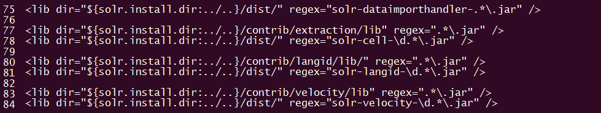

运行环境：
- JDK8
- Tomcat8
- Solr:6.5.1

>注：
>1.建议打开两个连接linux的窗口，一个负责 solr压缩目录，另外一个负责tomcat下的目录，这样在使用过程中就不需要来回切换路径。
>2.以下的Solr所有配置在Window中一样适用，除了操作文件的过程需要命令外，其他没有任何不同。
>3.在操作前请先将用户切换到root，否则有些操作可能不成功。或者在操作的每个命令前加上sudo。如创建文件夹命令：sudo mkdir solr
>4.如果可以请将solr运行在solr自带的Jetty服务器内, 在solr5.21之后已经删除war包。有兴趣可以看看Solr的wiki说明： [Why No War](https://wiki.apache.org/solr/WhyNoWar)

开始之前先说明后面目录结构代表的意思：

1. `<tomcat>`: 指Tomcat的安装目录。  
2. `<solrhome>`: 存放 home、contrib、dist三个文件夹的目录
3. `<solr>`:  Tomcat的webapps文件夹内的web应用solr
4. `<solr-6.5.1>`：解压solr压缩包之后的目录

例如：　Tomcat的webapps文件夹内的solr表示为： <tomcat>/webapps/solr/ 

## 第一步：

首先下载Solr,然后将 `.tgz` 格式的压缩文件，上传到linux系统中，我这里使用的软件是SecureFX，也可以使用WinSCP。看个人喜好，只要能上传文件到linux即可。

**1.使用linux的 `ll` 命令查看当前目录下的所有文件,当看到目录下有 `solr-6.5.1.tgz` 时候说明上传成功。**

**2.当前目录解压Solr，使用命令:**

```text
tar -zxvf solr-6.5.1.tgz
```

执行命令之后就可以看到 solr-6.5.1文件夹了

现在可以通过 `cd ./solr-6.5.1/` 命令，进入文件夹


**3.切换到Tomcat安装目录，进入 `<tomcat>/webapps/` 目录内创建solr文件夹**

```text
mkdir solr
```


接着在 `<solr-6.5.1>` 目录内，执行以下命令

```text
cp -rf ./server/solr-webapp/webapp/* /opt/tomcat-solr/webapps/solr/
```

将 `<solr-6.5.1>/server/solr-webapp/webapp/` 内的所有文件复制到  `<tomcat>/webapps/solr/`

当看到solr目录中 多出了如下文件复制成功。


**4.接着进入 `<solr-6.5.1>/server/lib` 目录内, 可以看到众多的依赖包，虽然很多但是我们只需要其中几个而已**

我们只需要 metrics 开头的jar文件即可。现在执行如下命令

```text
cp metrics-core-3.1.2.jar  metrics-ganglia-3.1.2.jar metrics-graphite-3.1.2.jar metrics-jvm-3.1.2.jar /opt/tomcat-solr/webapps/solr/WEB-INF/lib/

cp ./ext/* /opt/tomcat-solr/webapps/solr/WEB-INF/lib/
```

拷贝 metrics 开头的文件中除了metrics-jetty9-3.1.2之外的其他文件到 `<tomcat>/webapps/solr/` 目录内

拷贝 ext 文件夹下的所有文件到 `<tomcat>/webapps/solr/` 目录内

然后在 `<tomcat>/webapps/solr/WEB-INF/` 下创建java文件的编译目录 classes

```text
mkdir classes
```

现在WEB-INF下的结构如下


进入 `<solr-6.5.1>/server/resources/` 目录下，将日志的配置文件复制 `<tomcat>/webapps/solr/WEB-INF/classes/`


```text
cp ./log4j.properties /opt/tomcat-solr/webapps/solr/WEB-INF/classes/
```


## 第二步：

**1.在 `<tomcat>` 根目录内创建solrhome文件夹用于存放solr的功能模块需要的库、solr jar文件、以及 solr的主目录(home)**

创建solrhome文件夹

```text
mkdir solrhome
```

当然也可以在其他地方创建没有强制一定要放在 Tomcat 根目录下


复制 `<solr-6.5.1>` 根目录下的dist、contrib 两个文件夹

```text
cp -rf ./dist/ ./contrib/ /opt/tomcat-solr/solrhome/
```

>注：如果到现在还是只开着一个linux命令窗口，那么你会发现在两个路径切换是多么麻烦的一件事情。所以请打开两个窗口。

在 `<tomcat>/solrhome/` 内创建home文件夹,home文件是solr的主目录。用于存放solr核心 core

```text
mkdir home
```

这时候solrhome文件目录结构如下


**2.复制 `<solr-6.5.1>/server/solr/` 内的所有文件到 `<tomcat>/solrhome/home/` 内**

```text
cp -rf ./server/solr/* /opt/tomcat-solr/solrhome/home/
```

home目录结构如下


继续在home文件夹下创建第一个核心 mycore(名称随意)

```text
mkdir mycore
```

home目录结构如下


再复制 `<solr-6.5.1>/example/example-DIH/solr/solr/` 内所有核心core的配置文件到 `<tomcat>/solrhome/home/mycore/` 目录下

```text
cp -rf example/example-DIH/solr/solr/* /opt/tomcat-solr/solrhome/home/mycore/
```

现在mycore的文件夹结构如下


core.properties可以设置新的核心名称

>如：name=myCore1

不设置默认显示文件夹名称, 下一步 进入conf文件夹下配置属性文件


**3.修改功能模块地址和sorl jar文件地址, 这里以 `<tomcat>/solrhome/` 目录为例(如果你安装其他目录，请参考目录设置文件中的地址),我使用的vim编辑器,先打开solrconfig.xml** 

```text
vim solrconfig.xml
```

移动光标到路径上，然后进入vim可视化模式 `Ctrl+v` 模式。选中的部分为高亮。按d键删除多行


修改后结果如下



每个核心core都有一个存放索引文件和日志的目录 data

如果有需要修改，可以在下图位置修改data路径


默认在核心core根目录下，如果不使用默认路径可以修改为存放data的路径 例如：


**4.好了，solrhome的设置基本完成，那么最后就是关联solr web应用和home目录(不是solrhome)**

打开 `<tomcat>/webapps/solr/WEB-INF/` 目录下的web.xml配置文件


修改entry地址如下


>注：1.此处使用的是我自己设置的 home 目录，所以设置路径时候根据个人设置的 home 路径设置配置文件
>2.记得打开 <！-- --> 注释
>3.是home路径不是 solrhome。home文件下存储的是核心core

然后跳到web.xml配置文件最后。注释掉一下两个标签


如果不注释，那么访问solr的时候会出现一下错误：

 HTTP Status 403 - Access to the requested resource has been denied：拒绝访问
 
最后一步

进入 `<tomcat>/bin/` 目录执行 `./startup.sh` 命令，启动Tomcat

这时候就可以访问solr试试


当出现以上界面，说明 solr可以访问了。上图也显示了创建了核心 core，如果需要可以在home下创建多个核心core。

>注：访问solr时候在网址后面需要添加/index.html路径否则无法访问。
web.xml中已经设置了欢迎页面是index.html依然无法访问solr。
出现该问题原因，应该是solr版本问题，在旧版本中，将solr部署到Tomcat下可以成功的访问(5.2.1之前solr还有war包)。
如果直接将solr运行在自带的Jetty服务器内，可以通过 http://localhost/solr 地址直接访问，不需要添加 /index.html。
所以可以的话请将solr运行在自带的Jetty服务器上，以避免出现不可预知的情况。


