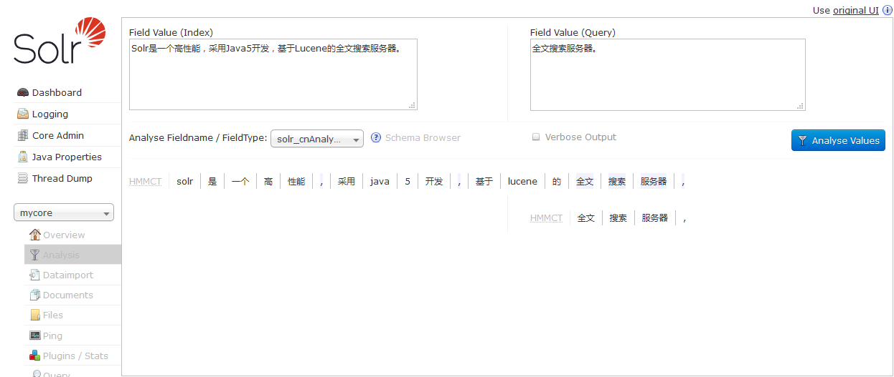
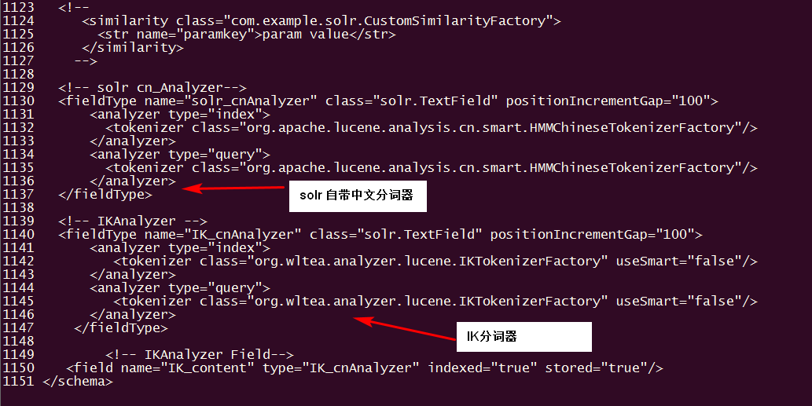
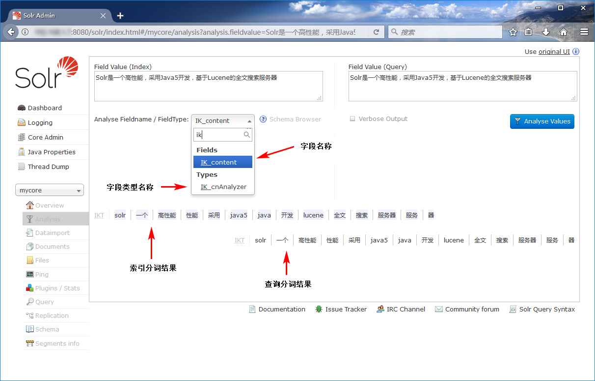
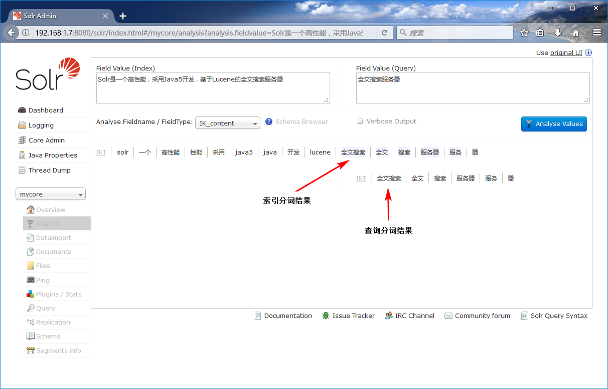
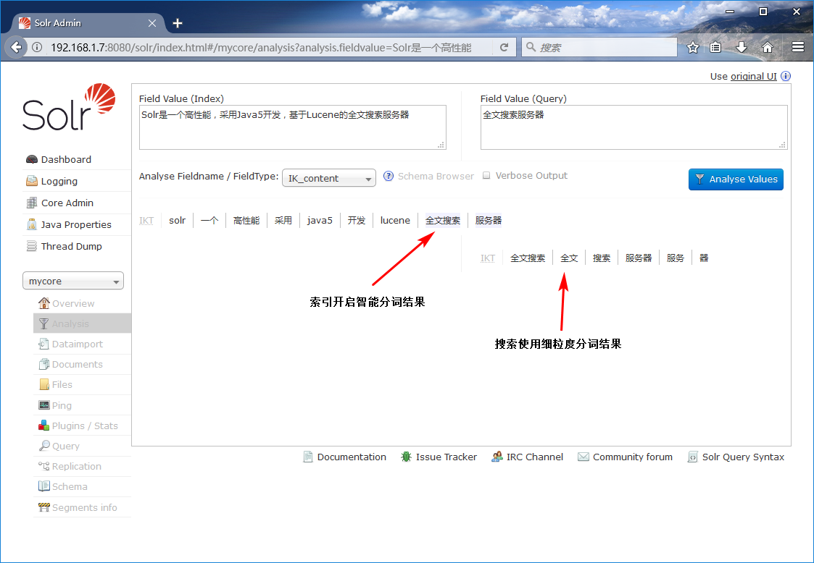

Solr作为搜索应用服务器，我们在使用过程中，不可避免的要使用中文搜索。
以下介绍solr自带的**中文分词器**和**第三方分词器IKAnalyzer**。

注：下面操作在Linux下执行，所添加的配置在windonws下依然有效。

运行环境
- Solr：6.5.1
- 系统 : Linux

以下是设置solr中文分词器的方法。

>注：开始之前，假定你已经成功登录solr的界面，并创建了core。

## 一、使用 solr 自带中文分词器

**1、进入解压好的solr文件夹根目录下执行以下命令**

```text
cp ./contrib/analysis-extras/lucene-libs/lucene-analyzers-smartcn-6.5.1.jar /opt/tomcat-solr/webapps/solr/WEB-INF/lib/
```

复制`lucene-analyzers-smartcn-6.5.1.jar`该文件到 Tomcat下的 solr web应用中的lib目录下，不清楚的可以看执行命令的地址。
复制的文件就是 solr自带的中文分词器。

**2、进入core目录下的conf文件夹**

打开`managed-schema`文件，跳至文件最后，在最后添加新的字段类型如下

```xml
<!--solr cnAnalyzer-->
<fieldType name="solr_cnAnalyzer" class="solr.TextField" positionIncrementGap="100">
  <analyzer type="index">
    <tokenizer class="org.apache.lucene.analysis.cn.smart.HMMChineseTokenizerFactory"/>
  </analyzer>
  <analyzer type="query">
    <tokenizer class="org.apache.lucene.analysis.cn.smart.HMMChineseTokenizerFactory"/>
  </analyzer>
</fieldType>
```

- fieldType: 定义字段类型
- name: 字段类型名称(可以理解为Java的数据类型名称。例如：int、double、String等Java中的数据类型名称)
- class: 数据类型（默认文本数据即可,还有其他的例如：字符串、浮点、整形等）

```text
<!-- 字符串 -->
<fieldType name="string" class="solr.StrField" sortMissingLast="true" />
<!-- 布尔类型 -->
<fieldType name="boolean" class="solr.BoolField" sortMissingLast="true"/>
<!-- 整形 -->
<fieldType name="int" class="solr.TrieIntField" precisionStep="0" positionIncrementGap="0"/>
<!-- 浮点 -->
<fieldType name="float" class="solr.TrieFloatField" precisionStep="0" positionIncrementGap="0"/>
```

- positionIncrementGap: 一个doc中的属性有多个值时候，设置每个属性之间的增量值和multiValued属性配合使用(避免错误匹配)。
- type: 分词生效的范围，两个参数分别是 index和query，表示创建索引和搜索时候都生效。不写默认情况下两者均生效。

3、添加完毕之后，保存退出并重新启动Tomcat服务器，继续访问solr。在创建的core中 Analyzer测试中文分词。



测试之后，可以看到短语确实被分割了，但是有些停止词没有被去掉(的、是)，也没有去除符号(，),可以在属性上添加words添加停词字典。

那么我们下面试试第三方的分词器.

## 二、solr 第三方中文分词器 IKAnalyzer

在使用IKAnalyzer分词器之前，先说明由于作者在12年之后没有更新，导致旧版本的分词器和新版本的solr无法匹配。
因此在源码的基础上做些改动，以兼容新版的solr。

**1、首先修改分词器：**

IK的分词器`IKTokenizer`类实现了抽象类`Tokenizer`。

在`IKTokenizer`的构造方法中调用了父类`Tokenizer`的构造方法，代码如下

```java
public IKTokenizer(Reader in, boolean useSmart) {
    super(in);
    offsetAtt = addAttribute(OffsetAttribute.class);
    termAtt = addAttribute(CharTermAttribute.class);
    typeAtt = addAttribute(TypeAttribute.class);
    _IKImplement = new IKSegmenter(input, useSmart);
}
```

Tokenizer构造器：

```java
protected Tokenizer(AttributeFactory factory) {
    super(factory);
}
```

可以看到上面的代码中，构造器调用了父类的构造器，出现不兼容的原因是因为现在的抽象类Tokenizer的构造方法中接受的是 `AttributeFactory` 这个类型，
而IKTokenizer传递的`Reader`不匹配。

所以在此基础上做了如下修改:

```java
//分析器调用
public IKTokenizer(Reader in, boolean useSmart) {
    offsetAtt = addAttribute(OffsetAttribute.class);
    termAtt = addAttribute(CharTermAttribute.class);
    typeAtt = addAttribute(TypeAttribute.class);
    _IKImplement = new IKSegmenter(input, useSmart);
}

//分词器工厂调用
public IKTokenizer(AttributeFactory factory, boolean useSmart) {
    super(factory);
    offsetAtt = addAttribute(OffsetAttribute.class);
    termAtt = addAttribute(CharTermAttribute.class);
    typeAtt = addAttribute(TypeAttribute.class);
    _IKImplement = new IKSegmenter(input, useSmart);
}
```

在第一个代码中删除了调用父类构造器的过程，主要用于分析器调用，然后第二个是因为在设置配置文件managed-schema中设置分析器和构造器结合使用的时候需要用到工厂类，
因此在此处也创建了一个新的构造方法，接收一个AttributeFactory类型的参数，下面会看到他的用处。

**2、分析器 IKAnalyzer:**

IK分析器中IKAnalyzer重写父抽象类Analyzer中的createComponents方法,原代码如下

```java
/**
* 重载Analyzer接口，构造分词组件
*/
@Override
protected TokenStreamComponents createComponents(String fieldName, final Reader in) {
    Tokenizer _IKTokenizer = new IKTokenizer(in, this.useSmart());
    return new TokenStreamComponents(_IKTokenizer);
}
```

由于现在的Analyzer的抽象方法createComponents，只需要一个fieldName参数，并不需要Reader，因此直接删除Reader即可。
同时因为分词器中也不需要Reader对象,在原来的分词器IKAnalyzer是接收Reader对象后又传递给了父类的构造器，但是在新版的solr中不需要了，而且分词器IKAnalyzer中也没有使用该对象。

```java
@Override
protected TokenStreamComponents createComponents(String fieldName) {
    IKTokenizer it = new IKTokenizer(useSmart);
    return new Analyzer.TokenStreamComponents(it);
}
```

其实并没更改什么，去掉了Reader，然后创建分词器实例返回。如果这时候在managed-schema配置文件中设置分析器已经可以使用了如下：

```xml
<fieldType name="IK_cnAnalyzer" class="solr.TextField">
　　<analyzer class="org.wltea.analyzer.lucene.IKAnalyzer"/>
</fieldType>
```

直接指定修改后的IK分词器给分析器。

在单独给分析器指定分词器时候，不要在 fieldType(字段类型) 加上positionIncrementGap 参数，否则会报错：

　　java.lang.RuntimeException: Can't set positionIncrementGap on custom analyzer class org.wltea.analyzer.lucene.IKAnalyzer

直接使用solr中文分析器时候，同样无法指定 fieldType 的属性positionIncrementGap，那么应该 solr 在直接设定分析器的时候是无法指定该属性的。

>注：analyzer(分析器)上还可以设置 type属性，告诉solr在什么时候会生效。分别是index和query，在创建索引时候生效，在查询时候生效。默认不写同时生效.
>class：直接指定的分析器(Analyzer)不能是分词的工厂类(Factory)或者分词器(Tokenizer)

上面的修改已经可以使用分析器了，但是如果和分词器和过滤器配合使用，那么必须创建一个可以生产分词器的工厂类。
该工厂类实org.apache.lucene.analysis.util.TokenizerFactory抽象类.而且必须实现create方法。

同时还要在构造器中调用父接口的构造器，并传递一个Map类型的参数。

**3、IKTokenizerFactory工厂类**

```text
package org.wltea.analyzer.lucene;

import java.util.Map;

import org.apache.lucene.analysis.Tokenizer;
import org.apache.lucene.analysis.util.TokenizerFactory;
import org.apache.lucene.util.AttributeFactory;

/**
 * IK分词工厂类。 用于配置文件中分析器添加分词器(必须工厂类)。
 */
public final class IKTokenizerFactory extends TokenizerFactory {

    private boolean useSmart;

    // 从页面传递的值中。设置 useSmart 的值
    public IKTokenizerFactory(Map<String, String> args) {
        super(args);
        /*
         * 判断Map容器中是否存在useSmart，如果有获取该key对应的value。
         * 如果没有,则设置默认值，也就是第三个参数 false
         */
        useSmart = this.getBoolean(args, "useSmart", false);// 执行完，useSmart会被从map移除
        if (!args.isEmpty()) {
            throw new IllegalArgumentException("Unknown parameters: " + args);
        }
    }

    @Override
    public Tokenizer create(AttributeFactory factory) {
        return new IKTokenizer(factory, useSmart);
    }
}
```

可以看到该分词器实现父类的create方法时候接受了一个AttributeFactory, 是不是很熟悉，在上面修改的IKTokenizer中新增的构造器内接受该类型的参数，并调用父类的构造器，又将参数传递给了父类。

因此IKTokenizer中的第二个构造器就是用于该工厂调用并传递参数，然后创建实例返回。

至于另外一个问题，构造器必须调用父类的构造器，然后创建Map类型的参数，传递给父类构造器，是因为父类TokenizerFactory只有一个带参数的构造器，没有默认构造器。
子类IKTokenizerFactory在初始化过程中，必须调用父类的构造器。即使传递null值给父类。

而Map容器的作用是：在配置文件managed-schema中，设置分词器的时候，可以传递参数。用于设置分词器中的参数，例如上面的 useSmart，就是用于IK分词器是否开启智能分词的开关。

至此修改全部完毕，最后只需要将修改后的编译文件放入IK的jar包内即可。注意包路径为

```
org.wltea.analyzer.lucene
```

如果觉得修改麻烦，可以直接下载修改后的文件[下载地址]()。

**4、IK在Linux上的设置方式**

先将IK的jar文件和配置文件上传到Linux系统中


复制 IK jar包到 solr/WEB-INF/lib 目录下

```text
cp IKAnalyzer2012FF_u1-6.5.1.jar /opt/tomcat-solr/webapps/solr/WEB-INF/lib/
```

复制配置文件到 solr/WEB-INF/classes目录下(没有classes，则创建)

```text
cp ext.dic IKAnalyzer.cfg.xml stopword.dic /opt/tomcat-solr/webapps/solr/WEB-INF/classes/
```

进入solrhome中打开managed-schema文件，添加IKAnalyzer

我的路径配置路径：/opt/tomcat-solr/solrhome/mycore/conf，请根具个人路径修改配置文件

5、在上面添加solr中文分词器后面重新加入以下代码

```xml
<!-- IKAnalyzer -->
<fieldType name="IK_cnAnalyzer" class="solr.TextField" positionIncrementGap="100">
    <analyzer type="index">
        <tokenizer class="org.wltea.analyzer.lucene.IKTokenizerFactory" useSmart="false"/>
    </analyzer>
    <analyzer type="query">
        <tokenizer class="org.wltea.analyzer.lucene.IKTokenizerFactory" useSmart="flase"/>
    </analyzer>
</fieldType>

<!-- IKAnalyzer Field-->
<field name="IK_content" type="IK_cnAnalyzer" indexed="true" stored="true"/>
```

在analyzer(分析器)中设置了 index和query说明创建索引和查询的时候都使用分词，因此如果有特殊要求，可以指定索引和查询时候设置不同的分词器。

useSmart为工厂对象的构造方法接受的参数，就是上面说到的分词工厂类中的Map接受该参数。

设置是否使用智能分词.默认为false，使用细粒度分词

>注：此处的class只能是工厂对象，并由工厂对象负责创建分词器实例。
工厂对象需要继承org.apache.lucene.analysis.util.TokenizerFactory这个抽象类，
并实现其中的create方法，实现的工厂对象必须用final修饰。

添加分词结果后的managed-schema文件如下：



**6、添加完保存之后，重新访问 solr，然后在 core的 Analyzer中测试结果如下**



因为新增的字段 IK_content，指定的字段类型是IK_cnAnalyzer，该类型使用的是IK中文分词器，所以使用指定字段或者字段类型，分词结果是一样的。

**7、设置ik的扩展词库**

在/opt/tomcat-solr/webapps/solr/WEB-INF/classes 目录下的可以设置ik的扩展字典


现在打开配置文件 IKAnalyzer.cfg.xml


然后在打开扩展字典配置文件 ext.dic 添加 全文搜索、服务器。然后重启 Tomcat。


8、重启Tomcat服务器之后，继续分词查看结果如下



很显然扩展字典生效了，出现了新增的全文搜索、服务器两个词组，因此如有需要可以在扩展字典中添加词组。
至于后面重复出现词组(分词后的)，是因为IK分词子默认开启了细粒度的分词，如果需要开启智能分词可以将配置文件中的 useSmart 设置为true即可。 

下面是开启智能分词后的结果：



可以根据需求是否开启智能分词，至此solr的中文分词到此结束。

>总结：
设置solr的分词只需要将分词器的jar包放入solr的依赖文件内，
然后在核心core中的managed-schema设置需要的分词即可。
