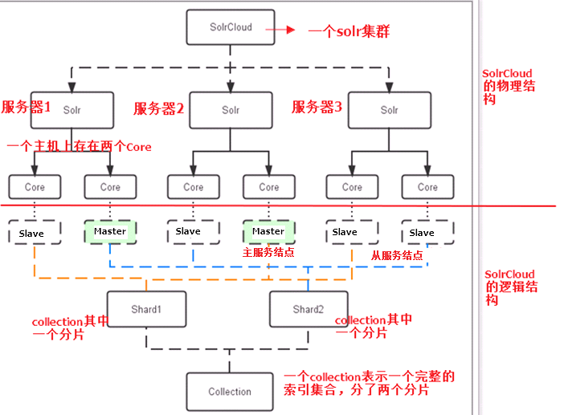
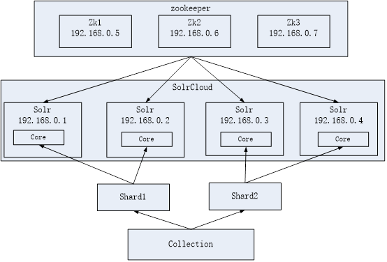
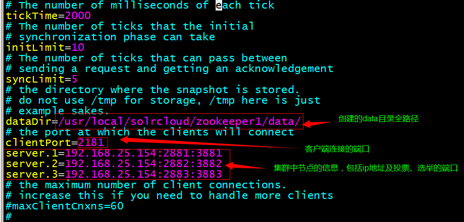
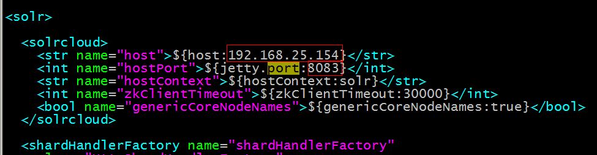
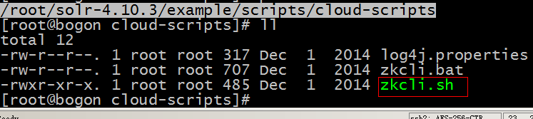
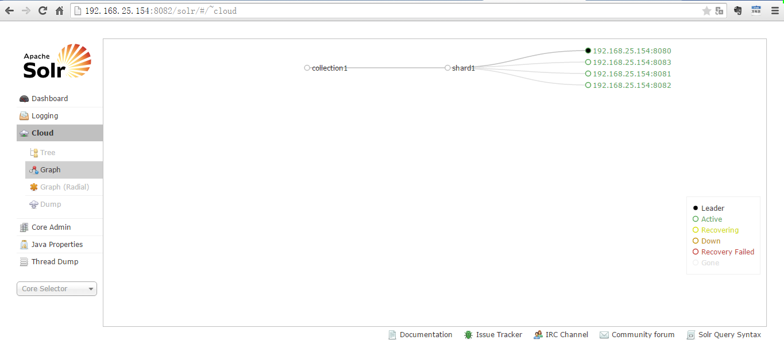
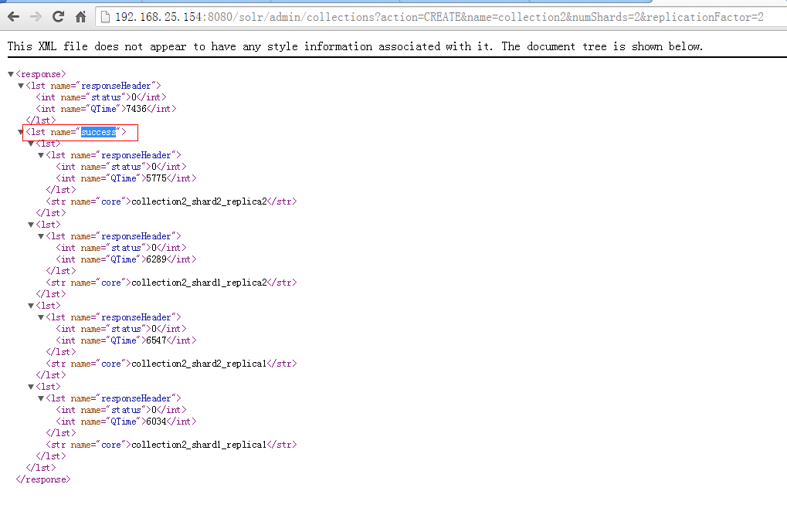
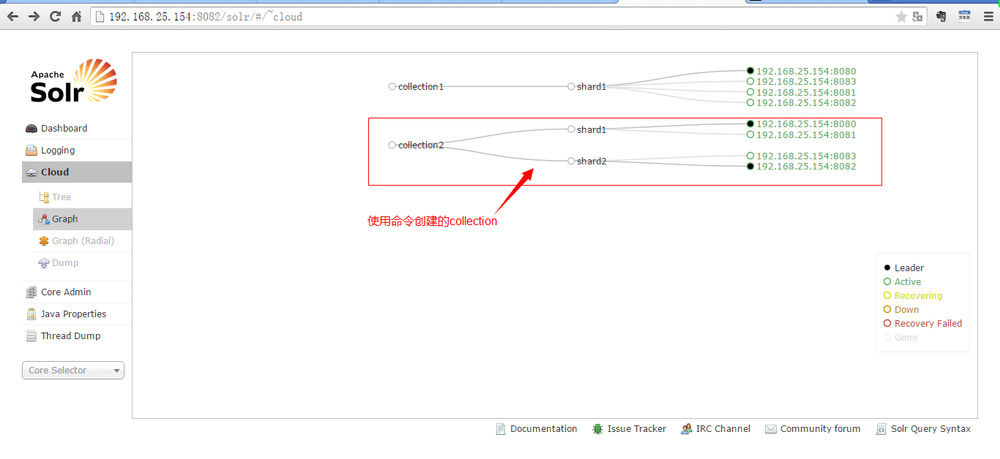
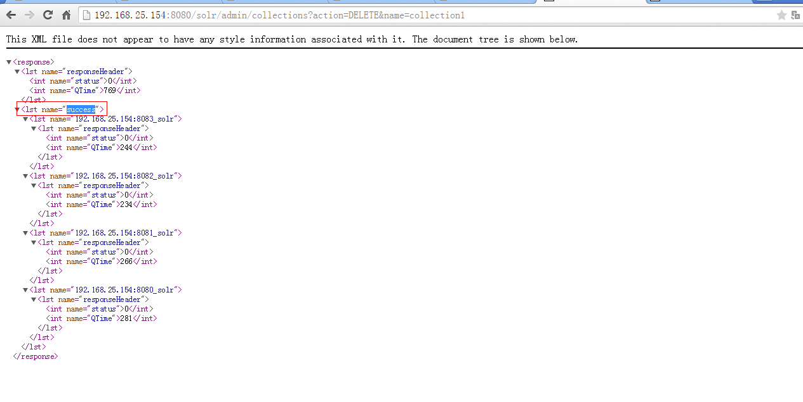
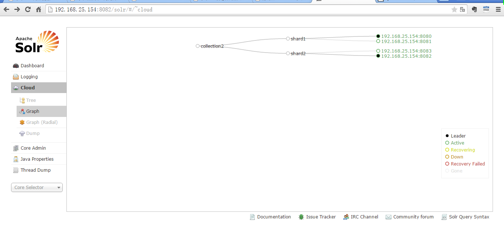

## 1.什么是SolrCloud

SolrCloud(solr 云)是Solr提供的分布式搜索方案，当你需要大规模，容错，分布式索引和检索能力时使用SolrCloud。

当一个系统的索引数据量少的时候是不需要使用SolrCloud的，当索引量很大，搜索请求并发很高，这时需要使用SolrCloud来满足这些需求。

SolrCloud是基于Solr和Zookeeper的分布式搜索方案，它的主要思想是使用Zookeeper作为集群的配置信息中心。

它有几个特色功能：
```
1）集中式的配置信息
2）自动容错
3）近实时搜索
4）查询时自动负载均衡
```

### 1.1  Zookeeper是个什么玩意？

顾名思义zookeeper就是动物园管理员，他是用来管hadoop（大象）、Hive(蜜蜂)、pig(小猪)的管理员， 
Apache Hbase和 Apache Solr 的分布式集群都用到了zookeeper；
Zookeeper:是一个分布式的、开源的程序协调服务，是hadoop项目下的一个子项目。

### 1.2   Zookeeper可以干哪些事情

#### 1、配置管理

在我们的应用中除了代码外，还有一些就是各种配置。比如数据库连接等。一般我们都是使用配置文件的方式，在代码中引入这些配置文件。
但是当我们只有一种配置，只有一台服务器，并且不经常修改的时候，使用配置文件是一个很好的做法，
但是如果我们配置非常多，有很多服务器都需要这个配置，而且还可能是动态的话，使用配置文件就不是个好主意了。

这个时候往往需要寻找一种集中管理配置的方法，我们在这个集中的地方修改了配置，所有对这个配置感兴趣的都可以获得变更。
比如我们可以把配置放在数据库里，然后所有需要配置的服务都去这个数据库读取配置。
但是，因为很多服务的正常运行都非常依赖这个配置，所以需要这个集中提供配置服务的服务具备很高的可靠性。
一般我们可以用一个集群来提供这个配置服务，但是用集群提升可靠性，那如何保证配置在集群中的一致性呢？ 
这个时候就需要使用一种实现了一致性协议的服务了。

Zookeeper就是这种服务，它使用Zab这种一致性协议来提供一致性。
现在有很多开源项目使用Zookeeper来维护配置，比如在HBase中，客户端就是连接一个Zookeeper，获得必要的HBase集群的配置信息，然后才可以进一步操作。
还有在开源的消息队列Kafka中，也使用Zookeeper来维护broker的信息。
在Alibaba开源的SOA框架Dubbo中也广泛的使用Zookeeper管理一些配置来实现服务治理。

#### 2、名字服务

名字服务这个就很好理解了。
比如为了通过网络访问一个系统，我们得知道对方的IP地址，但是IP地址对人非常不友好，这个时候我们就需要使用域名来访问。

但是计算机是不能识别域名的。怎么办呢？如果我们每台机器里都备有一份域名到IP地址的映射，这个倒是能解决一部分问题，
但是如果域名对应的IP发生变化了又该怎么办呢？于是我们有了DNS这个东西。我们只需要访问一个大家熟知的(known)的点，它就会告诉你这个域名对应的IP是什么。

在我们的应用中也会存在很多这类问题，特别是在我们的服务特别多的时候，如果我们在本地保存服务的地址的时候将非常不方便，
但是如果我们只需要访问一个大家都熟知的访问点，这里提供统一的入口，那么维护起来将方便得多了。

#### 3、分布式锁

其实在第一篇文章中已经介绍了Zookeeper是一个分布式协调服务。这样我们就可以利用Zookeeper来协调多个分布式进程之间的活动。
比如在一个分布式环境中，为了提高可靠性，我们的集群的每台服务器上都部署着同样的服务。
但是，一件事情如果集群中的每个服务器都进行的话，那相互之间就要协调，编程起来将非常复杂。而如果我们只让一个服务进行操作，那又存在单点。

通常还有一种做法就是使用分布式锁，在某个时刻只让一个服务去干活，当这台服务出问题的时候锁释放，立即fail over到另外的服务。
这在很多分布式系统中都是这么做，这种设计有一个更好听的名字叫Leader Election(leader选举)。比如HBase的Master就是采用这种机制。
但要注意的是分布式锁跟同一个进程的锁还是有区别的，所以使用的时候要比同一个进程里的锁更谨慎的使用。

#### 4、集群管理

在分布式的集群中，经常会由于各种原因，比如硬件故障，软件故障，网络问题，有些节点会进进出出。
有新的节点加入进来，也有老的节点退出集群。
这个时候，集群中其他机器需要感知到这种变化，然后根据这种变化做出对应的决策。
比如我们是一个分布式存储系统，有一个中央控制节点负责存储的分配，当有新的存储进来的时候我们要根据现在集群目前的状态来分配存储节点。
这个时候我们就需要动态感知到集群目前的状态。

还有，比如一个分布式的SOA架构中，服务是一个集群提供的，当消费者访问某个服务时，就需要采用某种机制发现现在有哪些节点可以提供该服务
(这也称之为服务发现，比如Alibaba开源的SOA框架Dubbo就采用了Zookeeper作为服务发现的底层机制)。
还有开源的Kafka队列就采用了Zookeeper作为Consumer的上下线管理。

## 2.Solr集群的结构



## 3.Solr集群的搭建

本教程的这套安装是单机版的安装，所以采用伪集群的方式进行安装，如果是真正的生产环境，将伪集群的ip改下就可以了，步骤是一样的。

SolrCloud结构图如下：



使用伪分布式实现solr集群。

需要三个zookeeper实例，四个tomcat实例（对应四个solr core），可以在一台虚拟机上模拟。

建议虚拟机1G以上内存。

## 4.Zookeeper集群的搭建

### 4.1、环境

三个zookeeper实例。Zookeeper也是Java开发的所以需要安装JDK。

1. Linux系统
2. Jdk环境。
3. Zookeeper

### 4.2、Zookeeper的安装步骤

**第一步：把zookeeper的安装包上传到服务器**

**第二步：解压缩**

```text
[root@bogon ~]# tar -zxvf zookeeper-3.4.6.tar.gz    // v 显示进度
[root@bogon ~]#
```

**第三步：在`/usr/local/`目录下创建一个`solrcloud`目录。把`zookeeper`解压后的文件夹复制到此目录下三份。分别命名为zookeeper1、2、3**

```text
[root@bogon ~]# mkdir /usr/local/solrcloud
[root@bogon ~]# mv zookeeper-3.4.6 /usr/local/solrcloud/zookeeper1
[root@bogon ~]# cd /usr/local/solrcloud
[root@bogon solrcloud]# ll
total 4
drwxr-xr-x. 10 1000 1000 4096 Feb 20  2014 zookeeper1
[root@bogon solrcloud]# cp -r zookeeper1/ zookeeper2
[root@bogon solrcloud]# cp -r zookeeper1/ zookeeper3
[root@bogon solrcloud]#
```

**第四步：配置zookeeper**

1. 在每个zookeeper文件夹下创建一个data目录。

2. 在data文件夹下创建一个文件名称为`myid`，文件的内容就是此zookeeper的编号1、2、3
    
    ```text
    [root@bogon data]# echo 1 >> myid
    [root@bogon data]# ll
    total 4
    -rw-r--r--. 1 root root 2 Sep 17 23:43 myid
    [root@bogon data]# cat myid
    1
    [root@bogon data]#
    ```
    
    在zookeeper2、3文件夹下分别创建data目录和myid文件
    
    ```text
    [root@bogon solrcloud]# mkdir zookeeper2/data
    [root@bogon solrcloud]# echo 2 >> zookeeper2/data/myid
    [root@bogon solrcloud]# ll zookeeper2/data
    total 4
    -rw-r--r--. 1 root root 2 Sep 17 23:44 myid
    [root@bogon solrcloud]# cat zookeeper2/data/myid
    2
    [root@bogon solrcloud]# mkdir zookeeper3/data        
    [root@bogon solrcloud]# echo 3 >> zookeeper3/data/myid
    [root@bogon solrcloud]#
    ```

3. 把zookeeper1下conf目录下的`zoo_sample.cfg`文件复制一份改名为`zoo.cfg`
4. 修改`zoo.cfg`的配置
    
    
    
5. 启动zookeeper。

    进入zookeeper1/bin目录下。
    
    - 启动zookeeper：./zkServer.sh start
    - 关闭：./zkServer.sh stop
    - 查看状态：./zkServer.sh status
    
    ```text
    [root@bogon solrcloud]# zookeeper1/bin/zkServer.sh status
    JMX enabled by default
    Using config: /usr/local/solrcloud/zookeeper1/bin/../conf/zoo.cfg
    Mode: follower
    [root@bogon solrcloud]# zookeeper2/bin/zkServer.sh status
    JMX enabled by default
    Using config: /usr/local/solrcloud/zookeeper2/bin/../conf/zoo.cfg
    Mode: leader
    [root@bogon solrcloud]# zookeeper3/bin/zkServer.sh status
    JMX enabled by default
    Using config: /usr/local/solrcloud/zookeeper3/bin/../conf/zoo.cfg
    Mode: follower
    [root@bogon solrcloud]#
    ```

## 5.Solr实例的搭建

**第一步**：创建4个tomcat实例，修改其端口。8080-8083

**第二步**：解压solr-4.10.3.tar.gz压缩包。从压缩包中复制solr.war到tomcat。

**第三步**：启动tomcat解压war包。把solr-4.10.3目录下example目录下的关于日志相关的jar包添加到solr工程中。

**第四步**：创建solrhome。并修改tomcat下solr的web.xml指定solrhome的位置。

**第五步**：增加中文分词、数据导入插件等。

## 6.solr集群的搭建

### 6.1、第一步 修改solr.xml

修改`solrhome`下的`solr.xml`文件，指定当前实例运行的ip地址及端口号。

solr运行在tomcat下，即指定tomcat的ip和端口号。



#### 6.2、第二步 配置文件集中管理

把`solrhome`中的配置文件上传到zookeeper集群。

使用zookeeper的客户端上传。

客户端命令位置：`/root/solr-4.10.3/example/scripts/cloud-scripts`



```text
./zkcli.sh -zkhost 192.168.25.154:2181,192.168.25.154:2182,192.168.25.154:2183 
-cmd upconfig -confdir /usr/local/solrcloud/solrhome1/collection1/conf -confname myconf
```

红色字体部分的ip表示zookeeper集群的ip地址以及对应的端口。

查看配置文件是否上传成功：

```text
[root@bogon bin]# ./zkCli.sh
Connecting to localhost:2181
[zk: localhost:2181(CONNECTED) 0] ls /
[configs, zookeeper]
[zk: localhost:2181(CONNECTED) 1] ls /configs
[myconf]
[zk: localhost:2181(CONNECTED) 2] ls /configs/myconf
[admin-extra.menu-top.html, currency.xml, protwords.txt, mapping-FoldToASCII.txt, _schema_analysis_synonyms_english.json, _rest_managed.json, solrconfig.xml, _schema_analysis_stopwords_english.json, stopwords.txt, lang, spellings.txt, mapping-ISOLatin1Accent.txt, admin-extra.html, xslt, synonyms.txt, scripts.conf, update-script.js, velocity, elevate.xml, admin-extra.menu-bottom.html, clustering, schema.xml]
[zk: localhost:2181(CONNECTED) 3]
```

##### 扩展

**上传配置文件到zookeeper**

```text
java -classpath .:/usr/local/solrcloud/solr-lib/* org.apache.solr.cloud.ZkCLI -cmd upconfig -zkhost master:2188 -confdir /usr/local/solrcloud/config-files/ -confname myconf
```

**链接zookeeper的配置内容**

```text
java -classpath .:/usr/local/solrcloud/solr-lib/* org.apache.solr.cloud.ZkCLI -cmd linkconfig -collection collection -confname myconf -zkhost master:2188
```

**Config Startup Bootstrap Params**

有两种不同的方式可以使用系统属性将您的初始配置文件上传到ZooKeeper，在你第一次启动Solr。

请记住，这些仅用于首次启动或覆盖配置文件(每当您使用这些系统属性启动Solr时，当`conf set`名称匹配时，ZooKeeper中的配置文件都可能会被覆盖)

1. 查看`solr.xml`并上传找到的每个SolrCore conf。
    'config set'名称将使用SolrCore的collection名称，collections将使用名称匹配的'config set'。
    
    - bootstrap_conf：
        没有默认值。
        如果您在启动时传递`-Dbootstrap_conf = true`，则您配置的每个SolrCore将自动上传配置文件，并将其链接到SolrCore所属的collection

2. 将给定的目录以给定的名称作为`conf set`上传。没有将collection链接到`conf set`。但是，如果只存在一个`conf set`，那么collection会自动链接到它。
    
    - bootstrap_confdir：
        没有默认值。
        如果您在启动时通过传递`-Dbootstrap_confdir = <directory>`，那么配置文件的指定目录将被上传到ZooKeeper，并由以下系统属性的定义指定`conf set`名称
    
    - collection.configName：
        collection.configName默认为configuration1。
        指定`conf set`的名称
        
3. -DzkRun: 在Solr中启动一个**内嵌的zooKeeper服务器**，该服务会管理集群的相关配置。
    单机版（测试）使用，如果是集群，用下面的-DzkHost来替换，含义一样
    
    ```text
    JAVA_OPTS="$JAVA_OPTS -DzkRun  -Dbootstrap_conf=true -DnumShards=2"  
    ```
    
4. -DzkHost: 跟上面参数的含义一样，允许配置一个ip和端口来指定用那个zookeeper服务器进行协调

    ```text
    JAVA_OPTS = "$JAVA_OPTS   
    -DzkHost=192.168.56.11:2181,192.168.56.12:2181,192.168.56.13:2181  
    -Dbootstrap_conf=true  
    -DnumShards=2"
    ```

#### 6.3、第三步

修改每一台solr的tomcat的bin目录下catalina.sh文件中加入`DzkHost`指定zookeeper服务器地址：

```text
JAVA_OPTS=“-DzkHost=192.168.25.154:2181,192.168.25.154:2182,192.168.25.154:2183"
```

红色字体的ip表示zookeeper集群的ip以及端口号（可以使用vim的查找功能查找到JAVA_OPTS的定义的位置，然后添加）

#### 6.4、第四步

重新启动tomcat



一个主节点多个备份节点，集群只有一片。

#### 6.5、第五步

创建一个两片的collection，每片是一主一备。
 
使用以下命令创建：

```text
http://192.168.25.154:8080/solr/admin/collections?
action=CREATE&name=collection2&numShards=2&replicationFactor=2
```





注意：

如果提示`Error loading class 'solr.DataImportHandler'`错误，则
把`solr-6.0.1/dist/solr-dataimporthandler-6.0.1.jar`复制到`/usr/local/apache-tomcat-8.5.5/webapps/solr/WEB-INF/lib`
(即tomcat下的solr项目的lib目录)目录下；再重启就可以了。

#### 6.6、第六步

删除collection1.

```text
http://192.168.25.154:8080/solr/admin/collections?action=DELETE&name=collection1
```





## 7.Solr集群的使用

使用solrj操作集群环境的索引库。

### 7.1、Solrj测试

```java
public class SolrCloudTest {

    @Test
    public void testAddDocument() throws Exception {
        //创建一个和solr集群的连接
        //参数就是zookeeper的地址列表，使用逗号分隔
        String zkHost = "192.168.25.154:2181,192.168.25.154:2182,192.168.25.154:2183";
        CloudSolrServer solrServer = new CloudSolrServer(zkHost);
        //设置默认的collection
        solrServer.setDefaultCollection("collection2");
        //创建一个文档对象
        SolrInputDocument document = new SolrInputDocument();
        //向文档中添加域
        document.addField("id", "test001");
        document.addField("item_title", "测试商品");
        //把文档添加到索引库
        solrServer.add(document);
        //提交
        solrServer.commit();
    }
    
    @Test
    public void deleteDocument() throws SolrServerException, IOException {
        //创建一个和solr集群的连接
        //参数就是zookeeper的地址列表，使用逗号分隔
        String zkHost = "192.168.25.154:2181,192.168.25.154:2182,192.168.25.154:2183";
        CloudSolrServer solrServer = new CloudSolrServer(zkHost);
        //设置默认的collection
        solrServer.setDefaultCollection("collection2");
        
        solrServer.deleteByQuery("*:*");
        solrServer.commit();
    }
}
```

## 7.2.Solrj和spring集成

修改spring的配置文件，添加集群版的配置：

```xml
<!-- 集群版 -->
<bean id="cloudSolrServer" class="org.apache.solr.client.solrj.impl.CloudSolrServer">
    <constructor-arg name="zkHost" value="192.168.25.154:2181,192.168.25.154:2182,192.168.25.154:2183"></constructor-arg>
    <property name="defaultCollection" value="collection2"></property>
</bean>
```
