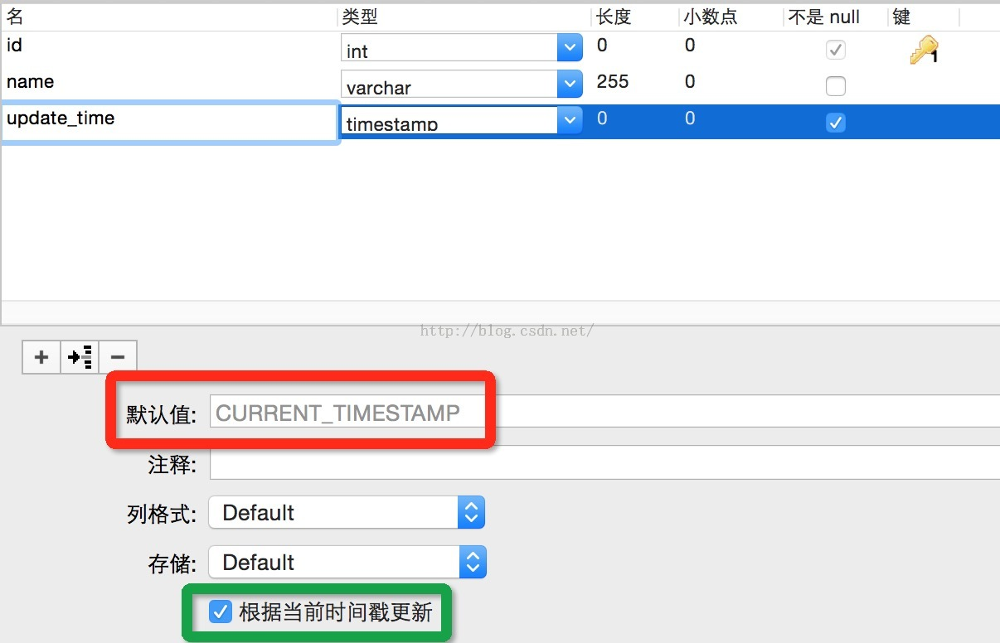

假设表有3个字段：id、name、update_time，希望在**新增记录**时能自动设置`update_time`字段为当前时间 

设置`DEFAULT CURRENT_TIMESTAMP`即可

```
CREATE TABLE `test` (
 `id` int NOT NULL,
 `name` varchar(255),
 `update_time` timestamp DEFAULT CURRENT_TIMESTAMP,
 PRIMARY KEY (`id`)
 ) COMMENT='';
```

如果使用Navicat建表就是在图红框中选择默认值为`CURRENT_TIMESTAMP`

如果希望在**更新记录**时能自动更新`update_time`字段，设置`ON UPDATE CURRENT_TIMESTAMP`

```
CREATE TABLE `test` (
 `id` int NOT NULL,
 `name` varchar(255),
 `update_time` timestamp ON UPDATE CURRENT_TIMESTAMP DEFAULT CURRENT_TIMESTAMP,
 PRIMARY KEY (`id`)
 ) COMMENT='';
```

如果使用Navicat建表就是在图绿框中勾选上根据当前时间戳更新

这样设置之后，即使直接通过Navicat工具修改了name字段，那么update_time也会自动更新，除非手动设置了update_time字段

