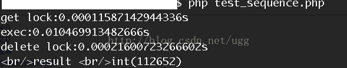
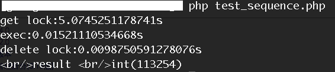
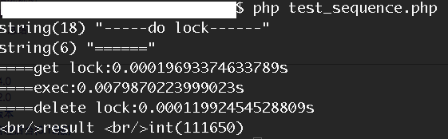
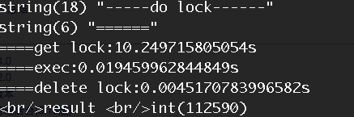

# 原理

## 背景
在很多**互联网产品应用**中，有些场景需要**加锁处理**，比如：秒杀，全局递增ID，楼层生成等等。
大部分的解决方案是**基于DB实现**的，**Redis为单进程单线程模式**，**采用队列模式将并发访问变成串行访问**，且多客户端对Redis的连接并不存在竞争关系。
其次Redis提供一些命令SETNX，GETSET，可以方便实现分布式锁机制。

## Redis命令介绍
使用Redis实现分布式锁，有两个重要函数需要介绍

### SETNX命令（SET if Not Exists）

- 语法： 
```
SETNX key value
```
- 功能：
**当且仅当 key 不存在，将 key 的值设为 value ，并返回1**；
**若给定的 key 已经存在，则 SETNX 不做任何动作，并返回0**。

### GETSET命令
- 语法： 
```
GETSET key value
```
- 功能：
**将给定 key 的值设为 value ，并返回 key 的旧值 (old value)**，
当 key 存在但不是字符串类型时，返回一个错误，当key不存在时，返回nil。

### GET命令
- 语法： 
```
GET key
```
- 功能： 
返回 key 所关联的字符串值，如果 key 不存在那么返回特殊值 nil 。

### DEL命令
- 语法： 
```
DEL key [KEY …]
```
- 功能： 
删除给定的一个或多个 key ,不存在的 key 会被忽略。

兵贵精，不在多。分布式锁，我们就依靠这四个命令。但在具体实现，还有很多细节，需要仔细斟酌，因为在分布式并发多进程中，任何一点出现差错，都会导致死锁，hold住所有进程。

## 加锁实现
SETNX 可以直接加锁操作，比如说对某个关键词foo加锁，客户端可以尝试 `SETNX foo.lock <current unix time>`
- 如果返回1，表示客户端已经获取锁，可以往下操作，操作完成后，通过 `DEL foo.lock` 命令来释放锁。
- 如果返回0，说明foo已经被其他客户端上锁，如果锁是非堵塞的，可以选择返回调用。如果是堵塞调用，就需要进入下一个重试循环，直至成功获得锁或者重试超时。

理想是美好的，现实是残酷的。仅仅使用SETNX加锁带有竞争条件的，在某些特定的情况会造成死锁错误。

### 处理死锁
在上面的处理方式中，如果获取锁的客户端端执行时间过长，进程被kill掉，或者因为其他异常崩溃，导致无法释放锁，就会造成死锁。所以，需要对加锁要做时效性检测。

因此，我们在加锁时，把当前时间戳作为value存入此锁中，通过当前时间戳和Redis中的时间戳进行对比，如果超过一定差值，认为锁已经时效，防止锁无限期的锁下去。

但是，在大并发情况，如果同时检测锁失效，并简单粗暴的删除死锁，再通过SETNX上锁，可能会导致竞争条件的产生，即多个客户端同时获取锁。

情景描述如下：
```
C1获取锁，并崩溃。C2和C3调用SETNX上锁返回0后，获得foo.lock的时间戳，通过比对时间戳，发现锁超时。

C2 向foo.lock发送DEL命令。
C2 向foo.lock发送SETNX获取锁。

C3 向foo.lock发送DEL命令，此时C3发送DEL时，其实DEL掉的是C2的锁。
C3 向foo.lock发送SETNX获取锁。
```
此时C2和C3都获取了锁，产生竞争条件，如果在更高并发的情况，可能会有更多客户端获取锁。

所以，DEL锁的操作，不能直接使用在锁超时的情况下，幸好我们有GETSET方法，假设我们现在有另外一个客户端C4，看看如何使用GETSET方式，避免这种情况产生。

```
C1获取锁，并崩溃。C2和C3调用SETNX上锁返回0后，调用GET命令获得foo.lock的时间戳T1，通过比对时间戳，发现锁超时。

C4(调用SETNX上锁返回0后，调用GET命令获得foo.lock的时间戳T1，通过比对时间戳，发现锁超时)向foo.lock发送GESET命令，
GETSET foo.lock <current unix time>
并得到foo.lock中老的时间戳T2

如果T1=T2，说明C4获得锁。
如果T1!=T2，说明C4之前有另外一个客户端C5通过调用GETSET方式获取并更改了时间戳，C4未获得锁。只能进入下次循环中。
```
### 存在得问题
**现在唯一的问题是，C4设置foo.lock的新时间戳，是否会对T5获取得锁产生影响？**

其实我们可以看到**C4和C5只有在调用GET命令获得foo.lock的时间戳，通过比对时间戳，发现锁超时后**，
**几乎同时调用GETSET方式获取锁，执行的时间差值极小，并且写入foo.lock中的都是有效时间戳，所以对锁并没有影响**。

为了让这个锁更加强壮，获取锁的客户端，应该在调用关键业务时，再次调用GET方法获取T1，和写入的T0时间戳进行对比，以免锁因其他情况被执行DEL意外解开而不知。
但是如果遇到上面描述得问题，则T0则会与T1不一致，当然差别会很小。

以上步骤和情况，很容易从其他参考资料中看到。

**客户端处理和失败的情况非常复杂，不仅仅是崩溃这么简单。**

- <font style="font-weight:bold;font-style:italic;" color="red">可能是客户端因为某些操作被阻塞了相当长时间(此时其它客户端检测到当前客户端持有得锁超时，然后尝试加锁，并加锁成功)，
    此后客户端恢复执行状态，执行完任务，紧接着 DEL 命令被尝试执行(但这时锁却在另外的客户端手上)。</font>
    
- 可能因为处理不当，导致死锁。

- 可能因为sleep设置不合理，导致Redis在大并发下被压垮。

### GET返回nil时应该走哪种逻辑？

##### 第一种走循环走setnx逻辑
C1客户端获取锁，并且处理完后，DEL掉锁。

**在DEL锁之前**，C2通过SETNX向foo.lock设置时间戳T0 发现有客户端获取锁，进入GET操作。 
C2 向foo.lock发送GET命令，获取返回值T1(nil)(因为此时C1执行DEL删除锁)。 

**C2 循环，进入下一次SETNX逻辑**。

##### 第二种走超时逻辑
C1客户端获取锁，并且处理完后，DEL掉锁。

**在DEL锁之前**，C2通过SETNX向foo.lock设置时间戳T0 发现有客户端获取锁，进入GET操作。 
C2 向foo.lock发送GET命令，获取返回值T1(nil)(因为此时C1执行DEL删除锁)。 

**C2 通过`T0>T1+expire`对比，进入GETSET流程**。 

C2调用GETSET向foo.lock发送T0时间戳，返回foo.lock的原值T2，C2如果T2=T1相等，获得锁，如果T2!=T1，未获得锁。

##### 分析
两种逻辑貌似都是OK，但是从逻辑处理上来说，**当GET返回nil，表示锁是被删除的，而不是超时，应该走SETNX逻辑加锁**。

>对于"第二种走超时逻辑"是否会造成死锁，尚不清楚，不过推荐采用第一种方式。

##### GETSET返回nil时应该怎么处理？
前提：假设C4客户端获取锁后由于异常退出等原因未正常释放锁，导致锁超时。
此时，C1、C2和C3客户端同时请求获取锁。C1、C2和C3客户端调用GET接口，
C1返回T1，此时C3网络情况更好，快速进入获取锁，并执行DEL删除锁，C2返回T2(nil)，C1和C2都进入超时处理逻辑。 

**C1向foo.lock发送GETSET命令，获取返回值T11(nil)**。 C1比对C1和C11发现两者不同，处理逻辑认为未获取锁。

C2 向foo.lock发送GETSET命令，获取返回值T22(C1写入的时间戳)。 C2比对C2和C22发现两者不同，处理逻辑认为未获取锁。

<font style="font-weight:bold;font-style:italic;" color="red">此时C1和C2都认为未获取锁，其实C1是已经获取锁了，但是他的处理逻辑没有考虑GETSET返回nil的情况</font>，只是单纯的用GET和GETSET值就行对比，至于为什么会出现这种情况？
一种是多客户端时，每个客户端连接Redis的后，发出的命令并不是连续的，导致从单客户端看到的好像连续的命令，到Redis server后，这两条命令之间可能已经插入大量的其他客户端发出的命令，比如DEL,SETNX等。
第二种情况，多客户端之间时间不同步，或者不是严格意义的同步。

### 时间戳的问题
我们看到foo.lock的value值为时间戳，所以要在多客户端情况下，保证锁有效，一定要同步各服务器的时间，如果各服务器间，时间有差异。时间不一致的客户端，在判断锁超时，就会出现偏差，从而产生竞争条件。
锁的超时与否，严格依赖时间戳，时间戳本身也是有精度限制，假如我们的时间精度为秒，从加锁到执行操作再到解锁，一般操作肯定都能在一秒内完成。这样的话，我们上面的CASE，就很容易出现。所以，最好把时间精度提升到毫秒级。这样的话，可以保证毫秒级别的锁是安全的。

### 分布式锁的问题
1. 必要的超时机制：获取锁的客户端一旦崩溃，一定要有过期机制，否则其他客户端都降无法获取锁，造成死锁问题。
2. 分布式锁，多客户端的时间戳不能保证严格意义的一致性，所以在某些特定因素下，有可能存在问题。要适度的机制，可以承受小概率的事件产生。
3. 只对关键处理节点加锁，良好的习惯是，把相关的资源准备好，比如连接数据库后，调用加锁机制获取锁，直接进行操作，然后释放，尽量减少持有锁的时间。
4. 在持有锁期间要不要CHECK锁，如果需要严格依赖锁的状态，最好在关键步骤中做锁的CHECK检查机制，但是根据我们的测试发现，在大并发时，每一次CHECK锁操作，都要消耗掉几个毫秒，而我们的整个持锁处理逻辑才不到10毫秒，玩客没有选择做锁的检查。
5. sleep学问，为了减少对Redis的压力，获取锁尝试时，循环之间一定要做sleep操作。但是sleep时间是多少是门学问。需要根据自己的Redis的QPS，加上持锁处理时间等进行合理计算。
6. 至于为什么不使用Redis的muti，expire，watch等机制，可以查一参考资料，找下原因。

## 锁测试数据
### 未使用sleep
第一种，锁测试时未做sleep。

单次请求，加锁，执行，解锁时间 



可以看到加锁和解锁时间都很快，当我们使用
```
ab -n1000 -c100 'http://sandbox6.wanke.etao.com/test/test_sequence.PHP?tbpm=t'
```
AB 并发100累计1000次请求，对这个方法进行压测时。 



我们会发现，**获取锁的时间变长**，同时**持有锁后，执行时间也变长**，而**delete锁的时间，将近10ms时间**，**为什么会这样**？

1. 持有锁后，我们的**执行逻辑中包含了再次调用Redis操作**，在大并发情况下，Redis执行明显变慢。
2. 锁的删除时间变长，从之前的0.2ms，变成9.8ms，性能下降近50倍。

在这种情况下，我们压测的QPS(每秒查询率QPS:Queries Per Second,是对一个特定的查询服务器在规定时间内所处理流量多少的衡量标准)为49，最终发现QPS和压测总量有关，当我们并发100总共100次请求时，QPS得到110多。


### 当我们使用sleep时
单次执行请求时



我们看到，和不使用sleep机制时，性能相当。

当使用相同的压测条件进行压测时



获取锁的时间明显变长，而锁的释放时间明显变短，仅是不采用sleep机制的一半。 
当然执行时间变长就是因为，我们在执行过程中，重新创建数据库连接，导致时间变长的。

同时我们可以对比下Redis的命令执行压力情况 


上图中**细高部分**是为**未采用sleep机制**时的压测图，**矮胖部分**为**采用sleep机制**的压测图，
**通过上图看到压力减少50%左右，当然，sleep这种方式还有个缺点QPS下降明显，在我们的压测条件下，仅为35，并且有部分请求出现超时情况。**

不过综合各种情况后，我们还是决定**采用sleep机制，主要是为了防止在大并发情况下把Redis压垮**，很不行，我们之前碰到过，所以肯定会采用sleep机制。