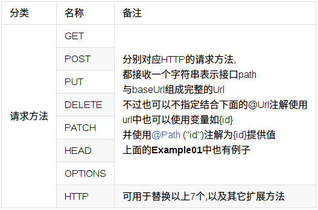
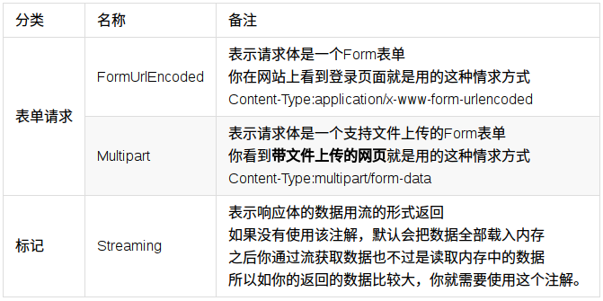
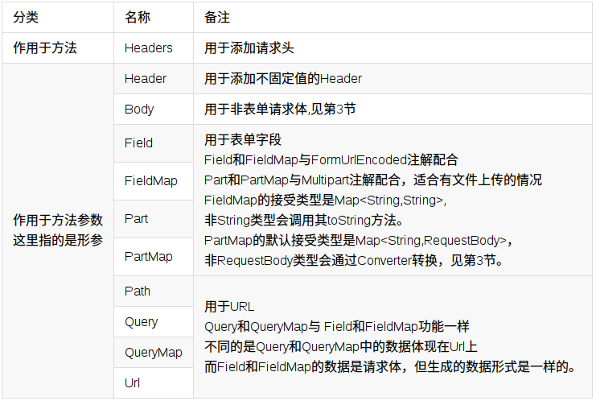
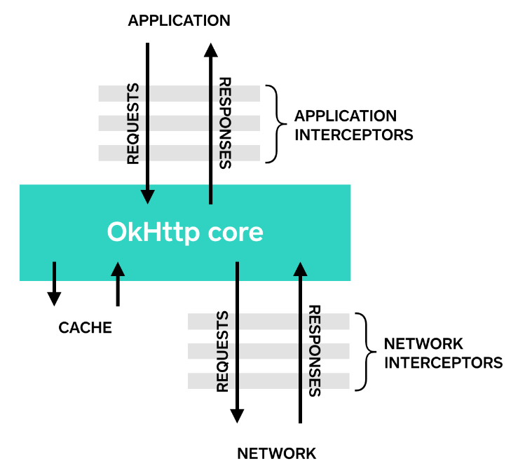
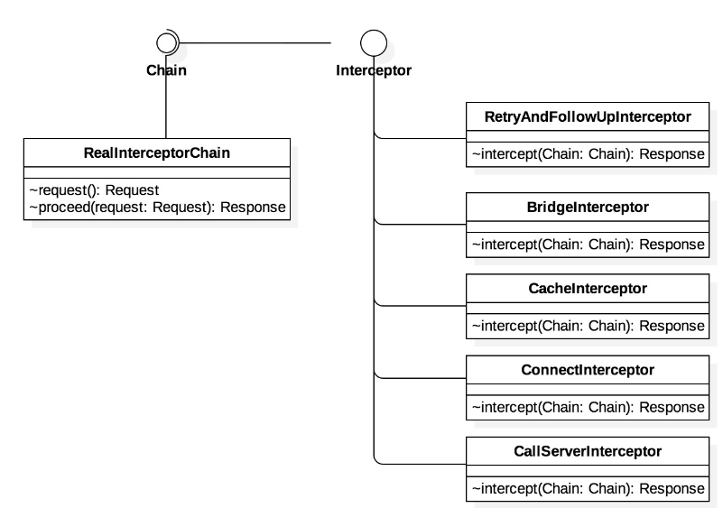
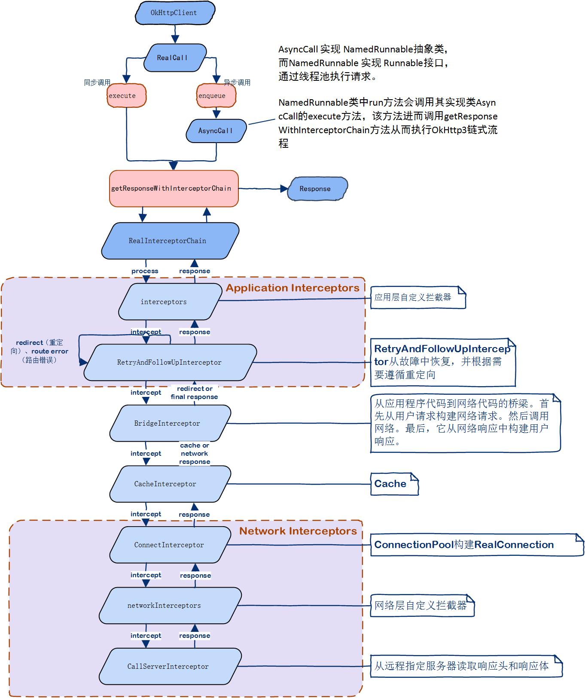
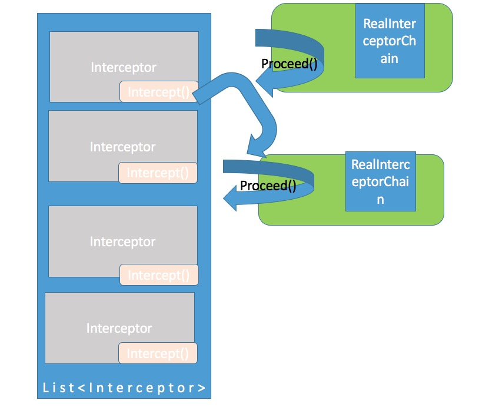
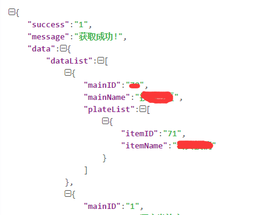
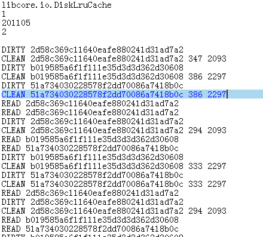

# 目录

- 第一章、简介
        - 简介
        - 引入依赖
- 第二章、方法注解
    - 注解分类
        - 第一类：HTTP请求方法
        - 第二类：标记类
        - 第三类：参数类
    - Get请求
        - @Query
        - @QueryMap
        - Query集合
        - @Path
    - Post请求
        - @Field
        - @FieldMap
        - @Body
    - 其他请求方式
- 第三章、高级功能
    - 文件上传
        - 简单实现
        - 封装
            - 实现上传请求
            - 定义上传接口
            - MultipartBody.Part/MultipartBody封装
            - 文本类型的MultipartBody.Part封装
    - 自定义Header
        - 静态方法
            - 通过Interceptor定义静态请求头
        - 动态方法
    - 网络请求日志
        - 引入依赖
        - 添加拦截器
    - Converter
        - Gson与Converter
        - 自定义Converter
    - CallAdapter
        - RxJava与CallAdapter
        - 自定义CallAdapter
    - GZIP
        - 压缩请求体
        - 解压响应体
    - 为某个请求设置完整的URL
    - 设置超时和重连
    - 取消请求
    - 简单封装
- 第四章、深入理解Okhttp3
    - 深入理解Okhttp3请求流程
        - 责任链模式
        - OkHttp3链式流程
            - 请求流程
                - 构造OkHttpClient
                - 发起请求
                    - 构造请求头
                    - 构造请求体
                    - 构造Request
                - Call
                    - 调用链
                        - 总结
                        - 扩展
                    - 同步执行
                    - 异步执行
            - RetryAndFollowUpInterceptor
            - BridgeInterceptor
            - CacheInterceptor
            - ConnectInterceptor
            - CallServerInterceptor
            - 自定义Interceptor
    - 深入理解Okhttp3缓存
        - Okhttp3缓存
            - 设置OkHttpClient
            - 设置缓存策略
        - 缓存实践(针对Android)
            - 设置OkHttpClient
            - 设置缓存接口
            - 设置Interceptor
            - 设置NetworkInterceptor
        - 查看缓存文件
        - Cache API
- 第五章、其它说明
    - Retrofit.Builder
    - Url组合规则
    - Retrofit提供的Converter
    - Retrofit提供的CallAdapter

# 第一章、简介
## 简介
Retrofit是Square公司开发的一款针对Android网络请求的框架，Retrofit2底层基于OkHttp实现的， OkHttp现在已经得到Google官方认可，大量的app都采用OkHttp做网络请求。

首先先来看一个完整Get请求是如何实现：

**1.创建业务请求接口，具体代码如下：**
```java
public interface BlueService {
   @GET("book/search")
   Call<BookSearchResponse> getSearchBooks(@Query("q") String name, 
        @Query("tag") String tag, @Query("start") int start, 
        @Query("count") int count);
}
```
这里需要稍作说明，@GET注解就表示get请求，@Query表示请求参数，将会以key=value的方式拼接在url后面

注意，这里是`interface`不是`class`，所以我们是无法直接调用该方法，我们需要用Retrofit创建一个`BlogService`的代理对象。

**2.需要创建一个Retrofit的示例，并完成相应的配置**
```java
Retrofit retrofit = new Retrofit.Builder()
   .baseUrl("https://api.douban.com/v2/")
   .addConverterFactory(GsonConverterFactory.create())
   .build();

BlueService service = retrofit.create(BlueService.class);
```
这里的baseUrl就是网络请求URL相对固定的地址，一般包括请求协议（如Http）、域名或IP地址、端口号等，当然还会有很多其他的配置，下文会详细介绍。还有addConverterFactory方法表示需要用什么转换器来解析返回值，GsonConverterFactory.create()表示调用Gson库来解析json返回值，具体的下文还会做详细介绍。

注： Retrofit2 的baseUrl 必须以`/`（斜线） 结束，不然会抛出一个IllegalArgumentException,
所以如果你看到别的教程没有以 `/` 结束，那么多半是直接从Retrofit 1.X 照搬过来的。

**3.调用请求方法，并得到Call实例**
```java
Call<BookSearchResponse> call = mBlueService.getSearchBooks("小王子", "", 0, 3);
```
`Call`其实在Retrofit中就是行使网络请求并处理返回值的类。

调用的时候会把需要拼接的参数传递进去，此处最后得到的url完整地址为 https://api.douban.com/v2/book/search?q=%E5%B0%8F%E7%8E%8B%E5%AD%90&tag=&start=0&count=3

**4.使用Call实例完成同步或异步请求**
- 同步请求
```java
BookSearchResponse response = call.execute().body();
```
- 异步请求
```java
call.enqueue(new Callback<BookSearchResponse>() {
@Override
public void onResponse(Call<BookSearchResponse> call, Response<BookSearchResponse> response) {
asyncText.setText("异步请求结果: " + response.body().books.get(0).altTitle);
}
@Override
public void onFailure(Call<BookSearchResponse> call, Throwable t) {

}
});
```

---

## 引入依赖
Maven
```xml
<dependency>
    <groupId>com.squareup.retrofit2</groupId>
    <artifactId>retrofit</artifactId>
    <version>2.2.0</version>
</dependency>
<dependency>
    <groupId>com.squareup.retrofit2</groupId>
    <artifactId>converter-gson</artifactId>
    <version>2.2.0</version>
</dependency>
<dependency>
    <groupId>com.squareup.retrofit2</groupId>
    <artifactId>adapter-rxjava</artifactId>
    <version>2.2.0</version>
</dependency>
```
引入完Jar包接下来就可以使用Retrofit来进行网络请求了。接下来会对不同的请求方式做进一步的说明。

---

# 第二章、方法注解

## 注解分类
### 第一类：HTTP请求方法



以上表格中的除HTTP以外都对应了HTTP标准中的请求方法，而HTTP注解则可以代替以上方法中的任意一个注解,有3个属性：method、path,hasBody,
下面是用HTTP注解实现的例子。
```java
public interface BlogService {
    /**
     * method 表示请求的方法，区分大小写
     * path表示路径
     * hasBody表示是否有请求体
     */
    @HTTP(method = "GET", path = "blog/{id}", hasBody = false)
    Call<ResponseBody> getBlog(@Path("id") int id);
}
```
### 第二类：标记类


### 第三类：参数类


>Query、Field和Part这三者都支持数组和实现了Iterable接口的类型，如List，Set等，方便向后台传递数组。

>PartMap注解支持一个Map作为参数，支持 {@link RequestBody } 类型，
如果有其它的类型，会被{@link retrofit2.Converter}转换为{@link RequestBody } 类型，
如后面会介绍的使用{@link com.google.gson.Gson} 的 {@link retrofit2.converter.gson.GsonRequestBodyConverter}
所以{@link MultipartBody.Part} 就不适用了,所以文件只能用@Part MultipartBody.Part

## Get请求
### @Query
```java
public class TokenInterceptor implements Interceptor {
    @Override
    public Response intercept(Chain chain) throws IOException {
        Request request = chain.request();
        HttpUrl httpUrl = request.url().newBuilder()
                .addQueryParameter("token", "tokenValue")
                .build();
        request = request.newBuilder().url(httpUrl).build();
        return chain.proceed(request);
    }
}
```
addQueryParameter就是添加请求参数的具体代码，这种方式比较适用于所有的请求都需要添加的参数，一般现在的网络请求都会添加token作为用户标识，那么这种方式就比较适合。

创建完成自定义的Interceptor后，还需要在Retrofit创建client处完成添加
```java
addInterceptor(new TokenInterceptor())
```
### @QueryMap
如果Query参数比较多，那么可以通过@QueryMap方式将所有的参数集成在一个Map统一传递，还以上文中的get请求方法为例
```java
public interface BlueService {
    @GET("book/search")
    Call<BookSearchResponse> getSearchBooks(@QueryMap Map<String, String> options);
}
```
调用的时候将所有的参数集合在统一的map中即可
```java
Map<String, String> options = new HashMap<>();
map.put("q", "小王子");
map.put("tag", null);
map.put("start", "0");
map.put("count", "3");
Call<BookSearchResponse> call = mBlueService.getSearchBooks(options);
```
### Query集合
假如你需要添加相同Key值，但是value却有多个的情况，一种方式是添加多个@Query参数，还有一种简便的方式是将所有的value放置在列表中，然后在同一个@Query下完成添加，实例代码如下：
```java
public interface BlueService {
    @GET("book/search")
    Call<BookSearchResponse> getSearchBooks(@Query("q") List<String> name);
}
```
最后得到的url地址为
```text
https://api.douban.com/v2/book/search?q=leadership&q=beyond%20feelings
```
如果请求参数为非必填，也就是说即使不传该参数，服务端也可以正常解析，那么如何实现呢？ 其实也很简单，请求方法定义处还是需要完整的Query注解，某次请求如果不需要传该参数的话，只需填充null即可。

针对文章开头提到的get的请求，加入按以下方式调用
```java
Call<BookSearchResponse> call = mBlueService.getSearchBooks("小王子", null, 0, 3);
```
那么得到的url地址为
```text
https://api.douban.com/v2/book/search?q=%E5%B0%8F%E7%8E%8B%E5%AD%90&start=0&count=3
```
### @Path
如果请求的相对地址也是需要调用方传递，那么可以使用@Path注解，示例代码如下：
```java
@GET("book/{id}")
Call<BookResponse> getBook(@Path("id") String id);
```
业务方想要在地址后面拼接书籍id，那么通过Path注解可以在具体的调用场景中动态传递，具体的调用方式如下：
```text
Call<BookResponse> call = mBlueService.getBook("1003078");
```
此时的url地址为
```text
https://api.douban.com/v2/book/1003078
```
>@Path可以用于任何请求方式，包括Post，Put，Delete等等

## Post请求
### @Field
```java
@FormUrlEncoded
@POST("book/reviews")
Call<String> addReviews(@Field("book") String bookId, @Field("title") String title,
@Field("content") String content, @Field("rating") String rating);
```
这里有几点需要说明的:
1. `@FormUrlEncoded`将会自动将请求的类型调整为`application/x-www-form-urlencoded`，
    假如content传递的参数为Good Luck，那么最后得到的请求体就是
    ```text
    content=Good+Luck
    ```
    >FormUrlEncoded不能用于Get请求
    
2. @Field注解将每一个请求参数都存放至请求体中，还可以添加encoded参数，该参数为boolean型，具体的用法为
    ```text
    @Field(value = "book", encoded = true) String book
    ```
    encoded参数为true的话，key-value-pair将会被编码，即将中文和特殊字符进行编码转换
    
### @FieldMap
上述Post请求有4个请求参数，假如说有更多的请求参数，那么通过一个一个的参数传递就显得很麻烦而且容易出错，这个时候就可以用FieldMap
```java
@FormUrlEncoded
@POST("book/reviews")
Call<String> addReviews(@FieldMap Map<String, String> fields);
```
### @Body
如果Post请求参数有多个，那么统一封装到类中应该会更好，这样维护起来会非常方便
```java
@POST("book/reviews")
Call<String> addReviews(@Body Reviews reviews);

```
```java
public class Reviews {
    public String book;
    public String title;
    public String content;
    public String rating;
}
```
## 其他请求方式
除了Get和Post请求，Http请求还包括Put,Delete等等，用法和Post相似，所以就不再单独介绍了。

---

# 第三章、高级功能
## 文件上传
### 简单实现
上传因为需要用到Multipart，所以需要单独拿出来介绍，先看一个具体上传的例子。

首先还是需要新建一个interface用于定义上传方法：
```java
public interface FileUploadService {
    // 上传单个文件
    @Multipart
    @POST("upload")
    Call<ResponseBody> uploadFile(
            @Part("description") RequestBody description,
            @Part MultipartBody.Part file);

    // 上传多个文件
    @Multipart
    @POST("upload")
    Call<ResponseBody> uploadMultipleFiles(
            @Part("description") RequestBody description,
            @Part MultipartBody.Part file1,
            @Part MultipartBody.Part file2);
}
```
```java
public static final String MULTIPART_FORM_DATA = "multipart/form-data";
public static final String APPLICATION_OTCET_STREAM = "application/octet-stream";

@NonNull
private RequestBody createPartFromString(String desc) {
    return RequestBody.create(MediaType.parse(MULTIPART_FORM_DATA), desc);
}
@NonNull
private MultipartBody.Part prepareFilePart(String partName, Uri fileUri) {
    File file = FileUtils.getFile(this, fileUri);
    
    // 为file建立RequestBody实例
    RequestBody requestFile = RequestBody.create(MediaType.parse(APPLICATION_OTCET_STREAM), file);

    // MultipartBody.Part借助文件名完成最终的上传
    return MultipartBody.Part.createFormData(partName, file.getName(), requestFile);
}
```
好了，接下来就是最终的上传文件代码了
```java
Uri file1Uri = ... // 从文件选择器或者摄像头中获取 
Uri file2Uri = ... 

// 创建上传的service实例
FileUploadService service =  
        ServiceGenerator.createService(FileUploadService.class);

// 创建文件的Part (photo, video, ...)
MultipartBody.Part body1 = prepareFilePart("video", file1Uri);
MultipartBody.Part body2 = prepareFilePart("thumbnail", file2Uri);

// 添加其他的part
RequestBody description = createPartFromString("hello, this is description speaking");

// 最后执行异步请求操作
Call<ResponseBody> call = service.uploadMultipleFiles(description, body1, body2);

call.enqueue(new Callback<ResponseBody>() {  

    @Override
    public void onResponse(Call<ResponseBody> call,
            Response<ResponseBody> response) {
        Log.v("Upload", "success");
    }

    @Override
    public void onFailure(Call<ResponseBody> call, Throwable t) {
        Log.e("Upload error:", t.getMessage());
    }
});
```
### 封装
到目前为止，文件上传实现了，但是有个问题，怎么才能将文件上传抽象出公共得方法呢?

Http上传协议为MultiPart。下面是通过抓包获取的一次多文件+文本的上传消息

```text
1  POST http://localhost:8080/upload HTTP/1.1
2  Content-Type: multipart/form-data; boundary=bec890b3-d76c-4986-803d-dc4b57ba2421
3  Content-Length: 3046505
4  Host: localhost:8080
5  Connection: Keep-Alive
6  Accept-Encoding: gzip
7  User-Agent: okhttp/3.2.0
8
9  --bec890b3-d76c-4986-803d-dc4b57ba2421
10 Content-Disposition: form-data; name="title"
11 Content-Type: text/plain; charset=utf-8
12 Content-Length: 15
13
14 多文件上传
15 --bec890b3-d76c-4986-803d-dc4b57ba2421
16 Content-Disposition: form-data; name="token"
17 Content-Type: text/plain; charset=utf-8
18 Content-Length: 32
19
20 登陆Token值
21 --776becce-5bd0-41d3-aa73-d3cd3ca4209d
22 Content-Disposition: form-data; name="imgUrls"; filename="0.jpg"
23 Content-Type: image/*
24 Content-Length: 168637
25
26 (文件字节，一堆乱码)@ h r   q   UY e<* ?  7C  Z 6...
27 --776becce-5bd0-41d3-aa73-d3cd3ca4209d
28 Content-Disposition: form-data; name="imgUrls"; filename="1.jpg"
29 Content-Type: image/*
30 Content-Length: 164004
31
32 (文件字节，一堆乱码)@ h r   q   UY e<* ?  7C  Z 6...
33 --776becce-5bd0-41d3-aa73-d3cd3ca4209d
34 Content-Disposition: form-data; name="imgUrls"; filename="2.jpg"
35 Content-Type: image/*
36 Content-Length: 167307
37
38 (文件字节，一堆乱码)@ h r   q   UY e<* ?  7C  Z 6...
39 --776becce-5bd0-41d3-aa73-d3cd3ca4209d--
```
**解释：**
- line1：请求行
- line2-line7：请求头
- line2：定义请求类型及分隔符
- line9-line39：消息正文
- line9：分隔符，用于分割正文的各条数据
- line39：结尾分隔符
- line10：name定义服务端获取本条数据的key
- line17：Content-Type定义本条数据类型为文本，charset定义编码为utf-8
- line22：name定义Key，filename定义上传的文件名
- line23：Content-Type定义本条数据类型为图片文件

以上代码为一次多文件+文本的表单请求，Retrofit2基本将能封装的内容都封装了，我们需要做的就是通过`MultiPartBody.Part`或者`MultiPartBody`将文本及文件数据封装好并传到接口中。

#### 实现上传请求
上面说到Retrofit2封装请求消息是不完全正确的，因为Retrofit2使用动态代理将具体的请求分发给具体的http client去执行，一般使用Okhttp。

#### 定义上传接口
```java
/**
* 1. 必须使用{@code @POST}注解，指定为post请求<br>
* 2. 使用{@code @Multipart}注解方法，必须使用{@code @Part}/{@code @PartMap}注解其参数<br>
* 本接口中将文本数据和文件数据分为了两个参数，是为了方便将封装<br>
* {@link MultipartBody.Part}的代码抽取到工具类中<br>
* 也可以合并成一个{@code @Part}参数
* @param params 用于封装文本数据
* @param parts 用于封装文件数据
* @return BaseResp为服务器返回的基本Json数据的Model类
*/
@Multipart
@POST("/upload")
Observable<BaseResp> upload(@PartMap Map<String, RequestBody> params,
                                       @Part List<MultipartBody.Part> parts);
/**
* 1. 必须使用{@code @POST}注解为post请求<br>
* 2. 使用{@code @Body}注解参数，则不能使用{@code @Multipart}注解方法了<br>
* 直接将所有的{@link MultipartBody.Part}合并到一个{@link MultipartBody}中
*/
@POST("/upload")
Observable<BaseResp> upload(@Body MultipartBody body);
```
#### MultipartBody.Part/MultipartBody封装
```java
/**
* 将文件路径数组封装为{@link List<MultipartBody.Part>}
* @param key 对应请求正文中name的值。目前服务器给出的接口中，所有图片文件使用<br>
* 同一个name值，实际情况中有可能需要多个
* @param filePaths 文件路径数组
* @param type 文件类型
*/
public static List<MultipartBody.Part> files2Parts(String key, 
                        String[] filePaths, MediaType type) {
    List<MultipartBody.Part> parts = new ArrayList<>(filePaths.length);
    
   for (String filePath : filePaths) {
       File file = new File(filePath);
       // 根据类型及File对象创建RequestBody（okhttp的类）
       RequestBody requestBody = RequestBody.create(type, file);
       // 将RequestBody封装成MultipartBody.Part类型（同样是okhttp的）
       MultipartBody.Part part = MultipartBody.Part.
                      createFormData(key, file.getName(), requestBody);
       // 添加进集合
       parts.add(part);
   }
   return parts;
}
/**
* 其实也是将File封装成RequestBody，然后再封装成Part，<br>
* 不同的是使用MultipartBody.Builder来构建MultipartBody
*/
public static MultipartBody files2MultipartBody(String key,
                                                 String[] filePaths,
                                                 MediaType type) {
    MultipartBody.Builder builder = new MultipartBody.Builder();
    for (String filePath : filePaths) {
        File file = new File(filePath);
        RequestBody requestBody = RequestBody.create(type, file);
        builder.addFormDataPart(key, file.getName(), requestBody);
    }
    //因为MultipartBody可以指定很多类型，如：multipart/mixed、multipart/digest、multipart/form-data，
    //所以这里需要明确指定类型为FORM：MediaType FORM = MediaType.parse("multipart/form-data");
    builder.setType(MultipartBody.FORM);
    return builder.build();
```

>源码参考：okhttp3.MultipartBody.java

```java
public final class MultipartBody extends RequestBody {
    public static final MediaType MIXED = MediaType.parse("multipart/mixed");
    public static final MediaType ALTERNATIVE = MediaType.parse("multipart/alternative");
    public static final MediaType DIGEST = MediaType.parse("multipart/digest");
    public static final MediaType PARALLEL = MediaType.parse("multipart/parallel");
    public static final MediaType FORM = MediaType.parse("multipart/form-data");
    
    ...
```

#### 文本类型的MultipartBody.Part封装
下面两个静态方法都是在上面两个静态方法返回的结果上操作得。
```java
/**
* 直接添加文本类型的Part到的MultipartBody的Part集合中
*           
* @param parts Part集合
* @param key 参数名（name属性）
* @param value 文本内容
* @param position 插入的位置
*/
public static void addTextPart(List<MultipartBody.Part> parts,
                              String key, String value, int position) {
    RequestBody requestBody = RequestBody.create(MediaType.parse("text/plain"), value);
    MultipartBody.Part part = MultipartBody.Part.createFormData(key, null, requestBody);
    parts.add(position, part);
}

/**
* 添加文本类型的Part到的MultipartBody.Builder中
*             
* @param builder 用于构建MultipartBody的Builder
* @param key 参数名（name属性）
* @param value 文本内容
*/
public static MultipartBody.Builder addTextPart(MultipartBody.Builder builder,
                                                String key, String value) {
    RequestBody requestBody = RequestBody.create(MediaType.parse("text/plain"), value);
    /*
    MultipartBody.Builder的addFormDataPart()有一个直接添加key value的重载，
    但坑的是这个方法:builder.addFormDataPart(key, value);
    不会设置编码类型，会出乱码，所以可以使用3个参数的，将中间的filename置为null就可以了
    还有一个坑就是，后台取数据的时候有可能是有顺序的，比如必须先取文本后取文件，
    否则就取不到（真弱啊...），所以还要注意add的顺序
     */
    builder.addFormDataPart(key, null, requestBody);
    return builder;
}
```

>源码参考：okhttp3.MultipartBody.java

```java
public final class MultipartBody extends RequestBody {
    public static final MediaType MIXED = MediaType.parse("multipart/mixed");
    public static final MediaType ALTERNATIVE = MediaType.parse("multipart/alternative");
    public static final MediaType DIGEST = MediaType.parse("multipart/digest");
    public static final MediaType PARALLEL = MediaType.parse("multipart/parallel");
    public static final MediaType FORM = MediaType.parse("multipart/form-data");
    
    ...
    
    public static final class Builder {
        ...
        public MultipartBody.Builder addFormDataPart(String name, String value) {
            return this.addPart(MultipartBody.Part.createFormData(name, value));
        }
        ...
    }
    
    public static final class Part {
        ...
        
        public static MultipartBody.Part createFormData(String name, String value) {
            return createFormData(name, (String)null, RequestBody.create((MediaType)null, value));
        }
        ...
    }
```
## 自定义Header
Retrofit提供了两个方式定义Http请求头参数：静态方法和动态方法， 静态方法不能随不同的请求进行变化，头部信息在初始化的时候就固定了。 而动态方法则必须为每个请求都要单独设置。

### 静态方法
```java
public interface BlueService {
@Headers("Cache-Control: max-age=640000")
  @GET("book/search")
  Call<BookSearchResponse> getSearchBooks(@Query("q") String name, 
        @Query("tag") String tag, @Query("start") int start, 
        @Query("count") int count);
}
```
当然你想添加多个header参数也是可以的，写法也很简单
```java
public interface BlueService {
@Headers({
      "Accept: application/vnd.yourapi.v1.full+json",
      "User-Agent: Your-App-Name"
  })
  @GET("book/search")
  Call<BookSearchResponse> getSearchBooks(@Query("q") String name, 
        @Query("tag") String tag, @Query("start") int start, 
        @Query("count") int count);
}
```
#### 通过Interceptor定义静态请求头
```java
public class RequestInterceptor implements Interceptor {
  @Override
  public Response intercept(Chain chain) throws IOException {
      Request original = chain.request();
      Request request = original.newBuilder()
          .header("User-Agent", "Your-App-Name")
          .header("Accept", "application/vnd.yourapi.v1.full+json")
          .method(original.method(), original.body())
          .build();
      return chain.proceed(request);
  }
}
```

>源码参考：okhttp3.Request.java

- request.newBuilder()：
```java
public Request.Builder newBuilder() {
    return new Request.Builder(this);
}
```
```java
Builder(Request request) {
    this.url = request.url;
    this.method = request.method;
    this.body = request.body;
    this.tag = request.tag;
    this.headers = request.headers.newBuilder();
}
```
- request.headers.newBuilder：
```java
public Headers.Builder newBuilder() {
    Headers.Builder result = new Headers.Builder();
    Collections.addAll(result.namesAndValues, this.namesAndValues);
    return result;
}
```
由此可见，newBuilder()方法根据原有的Request对象创建新的Request对象

Request提供了两个方法添加header参数，一个是header(key, value)，另一个是.addHeader(key, value)， 两者的区别是，header()如果有重名的将会覆盖，而addHeader()允许相同key值的header存在

然后在OkHttp创建Client实例时，添加RequestInterceptor即可
```java
new OkHttpClient.Builder()
  .addInterceptor(new RequestInterceptor())
  .connectTimeout(DEFAULT_TIMEOUT, TimeUnit.SECONDS)
  .build();
```

### 动态方法
```java
public interface BlueService {
  @GET("book/search")
  Call<BookSearchResponse> getSearchBooks(
  @Header("Content-Range") String contentRange, 
  @Query("q") String name, @Query("tag") String tag, 
  @Query("start") int start, @Query("count") int count);
}
```

## 网络请求日志
调试网络请求的时候经常需要关注一下请求参数和返回值，以便判断和定位问题出在哪里，Retrofit官方提供了一个很方便查看日志的Interceptor，你可以控制你需要的打印信息类型，使用方法也很简单。

### 引入依赖
Maven:
```xml
<dependency>
    <groupId>com.squareup.okhttp3</groupId>
    <artifactId>logging-interceptor</artifactId>
    <version>3.6.0</version>
</dependency>
```
### 添加拦截器
同上文提到的TokenInterceptor和RequestInterceptor一样，添加到OkHttpClient创建处即可，完整的示例代码如下：
```java
private static OkHttpClient getNewClient(){
    HttpLoggingInterceptor logging = new HttpLoggingInterceptor();
    logging.setLevel(HttpLoggingInterceptor.Level.BODY);
    return new OkHttpClient.Builder()
           .addInterceptor(new TokenInterceptor())
           .addInterceptor(logging)
           .connectTimeout(DEFAULT_TIMEOUT, TimeUnit.SECONDS)
           .build();
}
```
HttpLoggingInterceptor提供了4种控制打印信息类型的等级，分别是NONE，BASIC，HEADERS，BODY，接下来分别来说一下相应的打印信息类型。

- NONE 没有任何日志信息
- Basic 打印请求类型，URL，请求体大小，返回值状态以及返回值的大小
    ```text
    D/HttpLoggingInterceptor$Logger: --> POST /upload HTTP/1.1 (277-byte body)  
    D/HttpLoggingInterceptor$Logger: <-- HTTP/1.1 200 OK (543ms, -1-byte
    ```
- Headers 打印返回请求和返回值的头部信息，请求类型，URL以及返回值状态码
    ```text
    <-- 200 OK https://api.douban.com/v2/book/search?q=%E5%B0%8F%E7%8E%8B%E5%AD%90&start=0&count=3&token=tokenValue (3787ms)
    D/OkHttp: Date: Sat, 06 Aug 2016 14:26:03 GMT
    D/OkHttp: Content-Type: application/json; charset=utf-8
    D/OkHttp: Transfer-Encoding: chunked
    D/OkHttp: Connection: keep-alive
    D/OkHttp: Keep-Alive: timeout=30
    D/OkHttp: Vary: Accept-Encoding
    D/OkHttp: Expires: Sun, 1 Jan 2006 01:00:00 GMT
    D/OkHttp: Pragma: no-cache
    D/OkHttp: Cache-Control: must-revalidate, no-cache, private
    D/OkHttp: Set-Cookie: bid=D6UtQR5N9I4; Expires=Sun, 06-Aug-17 14:26:03 GMT; Domain=.douban.com; Path=/
    D/OkHttp: X-DOUBAN-NEWBID: D6UtQR5N9I4
    D/OkHttp: X-DAE-Node: dis17
    D/OkHttp: X-DAE-App: book
    D/OkHttp: Server: dae
    D/OkHttp: <-- END HTTP
    ```
- Body 打印请求和返回值的头部和body信息
    ```text
    <-- 200 OK https://api.douban.com/v2/book/search?q=%E5%B0%8F%E7%8E%8B%E5%AD%90&tag=&start=0&count=3&token=tokenValue (3583ms)
    D/OkHttp: Connection: keep-alive
    D/OkHttp: Date: Sat, 06 Aug 2016 14:29:11 GMT
    D/OkHttp: Keep-Alive: timeout=30
    D/OkHttp: Content-Type: application/json; charset=utf-8
    D/OkHttp: Vary: Accept-Encoding
    D/OkHttp: Expires: Sun, 1 Jan 2006 01:00:00 GMT
    D/OkHttp: Transfer-Encoding: chunked
    D/OkHttp: Pragma: no-cache
    D/OkHttp: Connection: keep-alive
    D/OkHttp: Cache-Control: must-revalidate, no-cache, private
    D/OkHttp: Keep-Alive: timeout=30
    D/OkHttp: Set-Cookie: bid=ESnahto1_Os; Expires=Sun, 06-Aug-17 14:29:11 GMT; Domain=.douban.com; Path=/
    D/OkHttp: Vary: Accept-Encoding
    D/OkHttp: X-DOUBAN-NEWBID: ESnahto1_Os
    D/OkHttp: Expires: Sun, 1 Jan 2006 01:00:00 GMT
    D/OkHttp: X-DAE-Node: dis5
    D/OkHttp: Pragma: no-cache
    D/OkHttp: X-DAE-App: book
    D/OkHttp: Cache-Control: must-revalidate, no-cache, private
    D/OkHttp: Server: dae
    D/OkHttp: Set-Cookie: bid=5qefVyUZ3KU; Expires=Sun, 06-Aug-17 14:29:11 GMT; Domain=.douban.com; Path=/
    D/OkHttp: X-DOUBAN-NEWBID: 5qefVyUZ3KU
    D/OkHttp: X-DAE-Node: dis17
    D/OkHttp: X-DAE-App: book
    D/OkHttp: Server: dae
    D/OkHttp: {"count":3,"start":0,"total":778,"books":[{"rating":{"max":10,"numRaters":202900,"average":"9.0","min":0},"subtitle":"","author":["[法] 圣埃克苏佩里"],"pubdate":"2003-8","tags":[{"count":49322,"name":"小王子","title":"小王子"},{"count":41381,"name":"童话","title":"童话"},{"count":19773,"name":"圣埃克苏佩里","title":"圣埃克苏佩里"}
    D/OkHttp: <-- END HTTP (13758-byte body)
    ```
## Converter
### Gson与Converter
在默认情况下Retrofit只支持将HTTP的响应体转换换为`ResponseBody`,
这也是为什么我在前面的例子接口的返回值都是 `Call<ResponseBody>`，
但如果响应体只是支持转换为`ResponseBody`的话何必要引用泛型呢，
返回值直接用一个`Call`就行了嘛，既然支持泛型，那说明泛型参数可以是其它类型的，
而`Converter`就是Retrofit为我们提供用于将`ResponseBody`转换为我们想要的类型，
有了`Converter`之后我们就可以写把我们的第一个例子的接口写成这个样子了：
```
public interface BlogService {
  @GET("blog/{id}")
  Call<Result<Blog>> getBlog(@Path("id") int id);
}
```
当然只改变泛型的类型是不行的，我们在创建Retrofit时需要明确告知用于将`ResponseBody`转换我们泛型中的类型时需要使用的`Converter`

引入Gson支持:

Maven:
```
<dependency>
    <groupId>com.squareup.retrofit2</groupId>
    <artifactId>converter-gson</artifactId>
    <version>2.2.0</version>
</dependency>
```
通过GsonConverterFactory为Retrofit添加Gson支持：
```
Gson gson = new GsonBuilder()
      //配置你的Gson
      .setDateFormat("yyyy-MM-dd hh:mm:ss")
      .create();

Retrofit retrofit = new Retrofit.Builder()
      .baseUrl("http://localhost:4567/")
      //可以接收自定义的Gson，当然也可以不传
      .addConverterFactory(GsonConverterFactory.create(gson))
      .build();
```

这样Retrofit就会使用Gson将`ResponseBody`转换我们想要的类型。

这是时候我们终于可以演示如使创建一个Blog了！

```
@POST("blog")
Call<Result<Blog>> createBlog(@Body Blog blog);
```
被`@Body`注解的的Blog将会被Gson转换成RequestBody发送到服务器。
```
BlogService service = retrofit.create(BlogService.class);
Blog blog = new Blog();
blog.content = "新建的Blog";
blog.title = "测试";
blog.author = "fnpac";
Call<Result<Blog>> call = service.createBlog(blog);
call.enqueue(new Callback<Result<Blog>>() {
    @Override
    public void onResponse(Call<Result<Blog>> call, Response<Result<Blog>> response) {
        // 已经转换为想要的类型了
        Result<Blog> result = response.body();
        System.out.println(result);
    }

    @Override
    public void onFailure(Call<Result<Blog>> call, Throwable t) {
        t.printStackTrace();
    }
});
```
结果：
```
Result{code=200, msg='OK', data=Blog{id=20, date='2016-04-21 05:29:58', author='fnpac', title='测试', content='新建的Blog'}, count=0, page=0}
```
Result的方法： 
```
package com.github.ikidou.entity;

public class Result<T> {
    public int code;
    public String msg;
    public T data;
    public long count;
    public long page;

    @Override
    public String toString() {
        return "Result{" +
                "code=" + code +
                ", msg='" + msg + '\'' +
                ", data=" + data +
                ", count=" + count +
                ", page=" + page +
                '}';
    }
}
```

### 自定义Converter
本节的内容是教大家实现一简易的Converter，这里以返回格式为`Call<String>`为例。
在此之前先了解一下Converter接口及其作用：

```
public interface Converter<F, T> {
  // 实现从 F(rom) 到 T(o)的转换
  T convert(F value) throws IOException;

  // 用于向Retrofit提供相应Converter的工厂
  abstract class Factory {
    // 这里创建从ResponseBody到其它类型的Converter，如果不能处理返回null
    // 主要用于对响应体的处理
    public Converter<ResponseBody, ?> responseBodyConverter(Type type, Annotation[] annotations,
    Retrofit retrofit) {
      return null;
    }

    // 在这里创建 从自定类型到RequestBody的Converter,不能处理就返回null，
    // 主要用于对Part、PartMap、Body注解的处理
    public Converter<?, RequestBody> requestBodyConverter(Type type,
    Annotation[] parameterAnnotations, Annotation[] methodAnnotations, Retrofit retrofit) {
      return null;
    }

    // 这里用于对Field、FieldMap、Header、Path、Query、QueryMap注解的处理
    // Retrfofit对于上面的几个注解默认使用的是调用toString方法
    public Converter<?, String> stringConverter(Type type, Annotation[] annotations,
    Retrofit retrofit) {
      return null;
    }

  }
}
```
我们要想从`Call<ResponseBody>` 转换为 `Call<String>` 那么对应的F和T则分别对应`ResponseBody`和`String`，我们定义一个`StringConverter`并实现`Converter`接口。
```
public static class StringConverter implements Converter<ResponseBody, String> {

  public static final StringConverter INSTANCE = new StringConverter();

  @Override
  public String convert(ResponseBody value) throws IOException {
    return value.string();
  }
}
```
我们需要一个`Fractory`来向Retrofit注册`StringConverter`
```
public static class StringConverterFactory extends Converter.Factory {

  public static final StringConverterFactory INSTANCE = new StringConverterFactory();

  public static StringConverterFactory create() {
    return INSTANCE;
  }

  // 我们只管实现从ResponseBody 到 String 的转换，所以其它方法可不覆盖
  @Override
  public Converter<ResponseBody, ?> responseBodyConverter(Type type, Annotation[] annotations, Retrofit retrofit) {
    if (type == String.class) {
      return StringConverter.INSTANCE;
    }
    //其它类型我们不处理，返回null就行
    return null;
  }
}
```
使用`Retrofit.Builder.addConverterFactory`向Retrofit注册我们`StringConverterFactory`：
```
Retrofit retrofit = new Retrofit.Builder()
      .baseUrl("http://localhost:4567/")
      // 如是有Gson这类的Converter 一定要放在其前面
      .addConverterFactory(StringConverterFactory.create())
      .addConverterFactory(GsonConverterFactory.create())
      .build();
```
>注：`addConverterFactory`是有先后顺序的，如果有多个`ConverterFactory`都支持同一种类型，那么就是只有第一个才会被使用，
而`GsonConverterFactory`是不判断是否支持的，所以如果这里交换了顺序，则会有一个异常抛出，原因是类型不匹配。

只要返回值类型的泛型参数是String类型，就会由我们的`StringConverter`处理,不管是`Call<String>`还是`Observable<String>`

## CallAdapter
### RxJava与CallAdapter
说到Retrofit就不得说到另一个火到不行的库`RxJava`，网上已经不少文章讲如何与Retrofit结合，但这里还是会有一个RxJava的例子，
不过这里主要目的是介绍使用`CallAdapter`所带来的效果。

第3节介绍的`Converter`是对于`Call<T>`中`T`的转换，而`CallAdapter`则可以对`Call`转换，这样的话`Call<T>`中的`Call`也是可以被替换的，
而返回值的类型就决定你后续的处理程序逻辑，同样`Retrofit`提供了多个`CallAdapter`，这里以`RxJava`的为例，用`Observable`代替`Call`：

引入RxJava支持:

Maven:
```
<dependency>
    <groupId>com.squareup.retrofit2</groupId>
    <artifactId>adapter-rxjava</artifactId>
    <version>2.2.0</version>
</dependency>
```
通过RxJavaCallAdapterFactory为Retrofit添加RxJava支持：
```
Retrofit retrofit = new Retrofit.Builder()
      .baseUrl("http://localhost:4567/")
      .addConverterFactory(GsonConverterFactory.create())
      .addCallAdapterFactory(RxJavaCallAdapterFactory.create())
      .build();
```

>源码参考：GsonConverterFactory.create()

```
public static GsonConverterFactory create() {
        return create(new Gson());
    }

    public static GsonConverterFactory create(Gson gson) {
        return new GsonConverterFactory(gson);
    }
```
接口设计：
```
public interface BlogService {
  @POST("/blog")
  Observable<Result<List<Blog>>> getBlogs();
}
```
使用：
```
BlogService service = retrofit.create(BlogService.class);
service.getBlogs(1)
  .observeOn(Schedulers.io())
  .subscribe(new Subscriber<Result<List<Blog>>>() {
      @Override
      public void onCompleted() {
        System.out.println("onCompleted");
      }

      @Override
      public void onError(Throwable e) {
        System.err.println("onError");
      }

      @Override
      public void onNext(Result<List<Blog>> blogsResult) {
        System.out.println(blogsResult);
      }
  });
```
结果：
```
Result{code=200, msg='OK', data=[Blog{id=1, date='2016-04-15 03:17:50', author='怪盗kidou', title='Retrofit2 测试1', content='这里是 Retrofit2 Demo 测试服务器1'},.....], count=20, page=1}
```

>像上面的这种情况最后我们无法获取到返回的Header和响应码的，如果我们需要这两者，提供两种方案：
>1. 用`Observable<Response<T>>`代替`Observable<T>` ,这里的`Response`指`retrofit2.Response`
>2. 用`Observable<Result<T>>` 代替`Observable<T>`，这里的`Result`是指`retrofit2.adapter.rxjava.Result`,这个Result中包含了Response的实例

### 自定义CallAdapter
本节将介绍如何自定一个`CallAdapter`，并验证是否所有的String都会使用我们第5节中自定义的Converter。

先看一下CallAdapter接口定义及各方法的作用：
```
public interface CallAdapter<T> {

  // 真正数据的类型 如Call<R> 中的 R
  // 这个 R 会作为Converter.Factory.responseBodyConverter 的第一个参数
  // 可以参照上面的自定义Converter
  Type responseType();

  <R> T adapt(Call<R> call);

  // 用于向Retrofit提供CallAdapter的工厂类
  abstract class Factory {
    // 在这个方法中判断是否是我们支持的类型，returnType 即Call<R>和Observable<R>
    // RxJavaCallAdapterFactory 就是判断returnType是不是Observable<?> 类型
    // 不支持时返回null
    public abstract CallAdapter<?> get(Type returnType, Annotation[] annotations,
    Retrofit retrofit);

    // 用于获取泛型的参数 如 Call<R> 中 R，CustomCall<R>中的R
    protected static Type getParameterUpperBound(int index, ParameterizedType type) {
      return Utils.getParameterUpperBound(index, type);
    }

    // 用于获取泛型的原始类型 如 Call<R> 中的 Call，CustomCall<R>中的CustomCall
    // 上面的get方法需要使用该方法。
    protected static Class<?> getRawType(Type type) {
      return Utils.getRawType(type);
    }
  }
}
```
了解了`CallAdapter`的结构和其作用之后，我们就可以开始自定义我们的`CallAdapter`了，本节以`CustomCall<String>`为例。

在此我们需要定义一个`CustomCall`，不过这里的`CustomCall`作为演示只是对`Call`的一个包装，并没有实际的用途。
```
public static class CustomCall<R> {

  public final Call<R> call;

  public CustomCall(Call<R> call) {
    this.call = call;
  }

  public R get() throws IOException {
    return call.execute().body();
  }
}
```
有了`CustomCall`，我们还需要一个`CustomCallAdapter`来实现 `Call<T>` 到 `CustomCall<T>`的转换，这里需要注意的是最后的泛型，是我们要返回的类型。
```
public static class CustomCallAdapter implements CallAdapter<CustomCall<?>> {

  private final Type responseType;

  // 下面的 responseType 方法需要数据的类型
  CustomCallAdapter(Type responseType) {
    this.responseType = responseType;
  }

  @Override
  public Type responseType() {
    return responseType;
  }

  @Override
  public <R> CustomCall<R> adapt(Call<R> call) {
    // 由 CustomCall 决定如何使用
    return new CustomCall<>(call);
  }
}
```
提供一个`CustomCallAdapterFactory`用于向Retrofit提供`CustomCallAdapter`：
```
public static class CustomCallAdapterFactory extends CallAdapter.Factory {
  public static final CustomCallAdapterFactory INSTANCE = new CustomCallAdapterFactory();

  @Override
  public CallAdapter<?> get(Type returnType, Annotation[] annotations, Retrofit retrofit) {
    // 获取原始类型
    Class<?> rawType = getRawType(returnType);
    // 返回值必须是CustomCall并且带有泛型
    if (rawType == CustomCall.class && returnType instanceof ParameterizedType) {
      Type responseType = getParameterUpperBound(0, (ParameterizedType) returnType);
      return new CustomCallAdapter(responseType);
    }
    return null;
  }
}
```
使用`addCallAdapterFactory`向Retrofit注册`CustomCallAdapterFactory`
```
Retrofit retrofit = new Retrofit.Builder()
      .baseUrl("http://localhost:4567/")
      .addConverterFactory(Example09.StringConverterFactory.create())
      .addConverterFactory(GsonConverterFactory.create())
      .addCallAdapterFactory(CustomCallAdapterFactory.INSTANCE)
      .build();
```
注：`addCallAdapterFactory`与`addConverterFactory`同理，也有先后顺序。
## GZIP
### 压缩请求体
```java
/**
* 该拦截器压缩HTTP请求体。许多Web服务器无法处理这个！ 
*/
final class GzipRequestInterceptor implements Interceptor {
    @Override 
    public Response intercept(Chain chain) throws IOException {
        Request originalRequest = chain.request();
        
        // 如果请求体为空，或者已经指定请求体的编码，则不处理
        if (originalRequest.body() == null || originalRequest.header("Content-Encoding") != null) {
            return chain.proceed(originalRequest);
        }
        
        Request compressedRequest = originalRequest.newBuilder()
            .header("Content-Encoding", "gzip")
            .method(originalRequest.method(), gzip(originalRequest.body()))
            .build();
        return chain.proceed(compressedRequest);    
    }
    
    private RequestBody gzip(final RequestBody body) {
        return new RequestBody() {
            @Override
            public MediaType contentType() {
                return body.contentType();
            }
            @Override 
            public long contentLength() {
                return -1; // 我们预先不知道压缩长度!
            }
            @Override 
            public void writeTo(BufferedSink sink) throws IOException {
                BufferedSink gzipSink = Okio.buffer(new GzipSink(sink));
                body.writeTo(gzipSink);
                gzipSink.close();
            }
        };
    }
}
```
### 解压响应体
//TODO

## 为某个请求设置完整的URL
假如说你的某一个请求不是以base_url开头该怎么办呢？别着急，办法很简单，看下面这个例子你就懂了
```java
public interface BlueService {  
    @GET
    public Call<ResponseBody> profilePicture(@Url String url);
}
```
```java
Retrofit retrofit = Retrofit.Builder()  
    .baseUrl("https://your.api.url/");
    .build();

BlueService service = retrofit.create(BlueService.class);  
service.profilePicture("https://s3.amazon.com/profile-picture/path");
```
直接用@Url注解的方式传递完整的url地址即可。

## 设置超时和重连
希望超时时能重连
```java
//设置超时
 builder.connectTimeout(15, TimeUnit.SECONDS);
 builder.readTimeout(20, TimeUnit.SECONDS);
 builder.writeTimeout(20, TimeUnit.SECONDS);
 //错误重连
 builder.retryOnConnectionFailure(true);
```
最后将这些配置设置给retrofit：
```java
OkHttpClient okHttpClient = builder.build();
Retrofit retrofit = new Retrofit.Builder()
        .baseUrl(ApiStores.API_SERVER_URL)
        //设置 Json 转换器
        .addConverterFactory(GsonConverterFactory.create())
        //RxJava 适配器
        .addCallAdapterFactory(RxJavaCallAdapterFactory.create())
        .client(okHttpClient)
        .build();
```

## 取消请求
Call提供了cancel方法可以取消请求，前提是该请求还没有执行
```java
String fileUrl = "http://futurestud.io/test.mp4";
Call<ResponseBody> call =  
    downloadService.downloadFileWithDynamicUrlSync(fileUrl);
call.enqueue(new Callback<ResponseBody>() {  
    @Override
    public void onResponse(Call<ResponseBody> call, Response<ResponseBody> response) {
        Log.d(TAG, "request success");
    }

    @Override
    public void onFailure(Call<ResponseBody> call, Throwable t) {
        if (call.isCanceled()) {
            Log.e(TAG, "request was cancelled");
        } else {
            Log.e(TAG, "other larger issue, i.e. no network connection?");
        }
    }
});
```
触发某个动作，例如用户点击了取消请求的按钮
```java
call.cancel();
```
## 简单封装
```java
public class AppClient {  
    private static Retrofit retrofit = null;  
    public static Retrofit retrofit() {  
        if (retrofit == null) {  
             OkHttpClient.Builder builder = new OkHttpClient.Builder();  
            /**  
             *设置缓存，代码略
             */  
                        
            /**  
             *  公共参数，代码略
             */  
             
            /**  
             * 设置头，代码略
             */             
             
             /**  
             * Log信息拦截器，代码略
             */  
              
             /**  
             * 设置cookie，代码略
             */  
              
             /**  
             * 设置超时和重连，代码略
             */  
            //以上设置结束，才能build(),不然设置白搭
            OkHttpClient okHttpClient = builder.build();  
            retrofit = new Retrofit.Builder()  
                    .baseUrl(ApiStores.API_SERVER_URL)                    
                    .client(okHttpClient)  
                    .build();  
        }  
        return retrofit;  
    }  
}  
```

# 第四章、深入理解Okhttp3
## 深入理解Okhttp3请求流程
这里针对Okhttp3.6.X说明。

**Interceptors**是OkHttp3整个框架的核心，包含了请求监控、请求重写、调用重试等机制。它主要使用责任链模式，解决请求与请求处理之间的耦合。



### 责任链模式
将请求对象放入链中，按照链中顺序让多个对象处理请求。请求者不用知道具体是由谁处理。解决请求与请求处理之间的耦合，提高灵活性。
责任链负责对请求参数的解析，所有的扩展都是针对链中节点进行扩展。

**OkHttp3的Interceptors的责任链**



### OkHttp3链式流程

#### 请求流程
首先我们先看一看它的请求流程，在Okhttp3中请求是基于拦截器原理。

>源码参考：okhttp3.RealCall.java

```java
Response getResponseWithInterceptorChain() throws IOException {
    List<Interceptor> interceptors = new ArrayList();
    interceptors.addAll(this.client.interceptors());
    interceptors.add(this.retryAndFollowUpInterceptor);
    interceptors.add(new BridgeInterceptor(this.client.cookieJar()));
    interceptors.add(new CacheInterceptor(this.client.internalCache()));
    interceptors.add(new ConnectInterceptor(this.client));
    if(!this.forWebSocket) {
        interceptors.addAll(this.client.networkInterceptors());
    }

    interceptors.add(new CallServerInterceptor(this.forWebSocket));
    Chain chain = new RealInterceptorChain(interceptors, (StreamAllocation)null, (HttpCodec)null, (Connection)null, 0, this.originalRequest);
    return chain.proceed(this.originalRequest);
}
```
研究Okhttp3的源码，从此处开始，一个一个拦截器，读懂即可。不得不说这种方式真的很棒，清晰明了。



通过上图，想必对Okhttp3的实现方式，已经有了基本的认识下面我们就一步一具体分析。

##### 构造OkHttpClient

OkHttpClient采用了建造者设计模式来实例化。本身有多个字段用于全局对象，比去Cache、Dns等

- 静态代码块构造全局缓存
    ```java
    //TODO 构造全局缓存
    static {
        Internal.instance = new Internal() {
          ...
          @Override public void setCache(OkHttpClient.Builder builder, InternalCache internalCache) {
            // 写入缓存，指的是响应数据缓存
            builder.setInternalCache(internalCache);
          }
          ...
          @Override public RealConnection get(
              ConnectionPool pool, Address address, StreamAllocation streamAllocation) {
            // 从缓存中获取有效的连接，仅支持Http/2，本质就是从内存的ConnectionPool中的Deque读取
            return pool.get(address, streamAllocation);
          }
          ...
          @Override public void put(ConnectionPool pool, RealConnection connection) {
            // 将连接缓存到连接池中
            pool.put(connection);
          }
          @Override public RouteDatabase routeDatabase(ConnectionPool connectionPool) {
            // 线路的缓存，多host多ip的情况
            return connectionPool.routeDatabase;
          }
          ...
          // 此处有很多种数据缓存处理，不了解并不影响代码分析，如有兴趣可自行研究
        };
      }
    ```
- Dispatcher， 分发请求，内部是有一个ThreadPoolExecutor
- Proxy， 代理连接，分三种类型直接（DIRECT）、HTTP、SOCKS。
- ProxySelector，线路选择器，对应Okhttp的一大特点，自行线路选择，找到合适的连接
- Cache， 真正的缓存实现
- SSLSocketFactory， Https的支持
- ConnectionPool， 连接池
- Dns，dns解析（Java实现）
- 其他，如超时时间等

##### 发起请求
我们都知道一个请求有多部分组成，同样Okhttp3创建一个请求也要多部分。

- 构造请求头
- 构造请求体
- 构造Request

通过以上三步我们就可以完成一次请求。

###### 构造请求头
Header并非每个请求都需要，要看与服务端是如何定义的，通常一个请求会默认一些头，比如Content-Type，Accept-Encoding，Connection等对应http协议

Header本质上就是一个Map，只是在封装了一层而已，但是Okhttp3的实现不是这样，而是一个**String数组**，key + value的形式，即一个头占用数组的两位：


每一个色块对应一个header，代码如下：

>源码参考：okhttp3.Headers.java

```java
public final class Headers {
  private final String[] namesAndValues;

  Headers(Builder builder) {
    this.namesAndValues = builder.namesAndValues.toArray(new String[builder.namesAndValues.size()]);
  }

  private Headers(String[] namesAndValues) {
    this.namesAndValues = namesAndValues;
  }
  
  ...
  
  public static final class Builder {
      final List<String> namesAndValues = new ArrayList<>(20);
      Builder addLenient(String name, String value) {
        namesAndValues.add(name);
        namesAndValues.add(value.trim());
        return this;
      }
      ...
  }
}
```
###### 构造请求体
请求体有多种形式，对应的父类是RequestBody，有文件形式、Json等，MediaType决定了是何种形式，通常我们用的是FromBody和MultipartBody

**1、FromBody**

>源码参考：okhttp3.FromBody.java

```java
package okhttp3;

public final class FormBody extends RequestBody {
  private static final MediaType CONTENT_TYPE =
      MediaType.parse("application/x-www-form-urlencoded");

  private final List<String> encodedNames;// 参数名称
  private final List<String> encodedValues;// 参数值

  FormBody(List<String> encodedNames, List<String> encodedValues) {
    this.encodedNames = Util.immutableList(encodedNames);
    this.encodedValues = Util.immutableList(encodedValues);
  }
  ...
  public static final class Builder {
    private final List<String> names = new ArrayList<>();
    private final List<String> values = new ArrayList<>();

    public Builder add(String name, String value) {
      names.add(HttpUrl.canonicalize(name, FORM_ENCODE_SET, false, false, true, true));
      values.add(HttpUrl.canonicalize(value, FORM_ENCODE_SET, false, false, true, true));
      return this;
    }

    public Builder addEncoded(String name, String value) {
      names.add(HttpUrl.canonicalize(name, FORM_ENCODE_SET, true, false, true, true));
      values.add(HttpUrl.canonicalize(value, FORM_ENCODE_SET, true, false, true, true));
      return this;
    }

    public FormBody build() {
      return new FormBody(names, values);
    }
  }
}
```
**2、MultipartBody**
MultipartBody原理基本一致，区别在于他可以发送表单的同时也可以发送文件数据，再次不在赘述。

###### 构造Request
有了上面两个步骤，接下了就自然而然产生一个Request，顾名思义它就是对请求的封装，包括请求方式，请求头，请求体，请求路径等,源代码码也是比较简单，一看即明白。

>源码参考：okhttp3.Request.java

```java
public final class Request {
  final HttpUrl url;
  final String method;
  final Headers headers;
  final RequestBody body;
  final Object tag;
  
  ...
```

#### Call
##### 调用链
Call是一个接口，实现类只有一个RealCall，上面我们提到的流程就是在RealCall中。

>源码参考：okhttp3.Call.java

```java
public interface Call extends Cloneable {
  Request request(); // 请求封装的数据
  Response execute() throws IOException; // 同步执行
  void enqueue(Callback responseCallback); // 异步执行
  void cancel(); // 取消请求
  boolean isExecuted();
  boolean isCanceled();
  Call clone();
  interface Factory {
    Call newCall(Request request);
  }
}
```

>源码参考：okhttp3.RealCall.java

```java
package okhttp3;

import java.io.IOException;
import java.util.ArrayList;
import java.util.List;
import okhttp3.Interceptor.Chain;
import okhttp3.internal.NamedRunnable;
import okhttp3.internal.cache.CacheInterceptor;
import okhttp3.internal.connection.ConnectInterceptor;
import okhttp3.internal.connection.StreamAllocation;
import okhttp3.internal.http.BridgeInterceptor;
import okhttp3.internal.http.CallServerInterceptor;
import okhttp3.internal.http.HttpCodec;
import okhttp3.internal.http.RealInterceptorChain;
import okhttp3.internal.http.RetryAndFollowUpInterceptor;
import okhttp3.internal.platform.Platform;

final class RealCall implements Call {
    final OkHttpClient client;//OkHttpClient
    final RetryAndFollowUpInterceptor retryAndFollowUpInterceptor;// 重试拦截器
    final Request originalRequest;//发起此Call的原始请求
    final boolean forWebSocket;
    private boolean executed;

    RealCall(OkHttpClient client, Request originalRequest, boolean forWebSocket) {
        this.client = client;
        this.originalRequest = originalRequest;
        this.forWebSocket = forWebSocket;
        this.retryAndFollowUpInterceptor = new RetryAndFollowUpInterceptor(client, forWebSocket);
    }

    /**
    * 返回发起此Call的原始请求
    */
    public Request request() {
        return this.originalRequest;
    }
    /**
    * 立即调用请求，并阻塞，直到响应可以被处理或出现错误。
    *   
    *   为了避免资源泄漏，调用者(callers)应该关闭{@link Response}，这反过来将关闭底层的{@link ResponseBody}。
    *   
    *   <pre>@{code 
    *       //确保响应（和底层响应体）关闭 
    *       try (Response response = client.newCall(request).execute()) {
    *           ...
    *   }}</pre>
    *   
    *   调用者可以使用响应的{@link Response#body}方法读取响应主体。
    *   
    *   为了避免资源泄露，调用者必须{@linkplain ResponseBody 关闭响应体}或响应。
    *   
    *   请注意，传输层成功（接收HTTP响应码，响应头和正文）并不一定表示应用层成功：响应可能仍然表示不乐观的HTTP响应代码，如404或500。
    */
    // 同步执行的实现
    public Response execute() throws IOException {
        // 一个call只能执行一次
        synchronized (this) {//同步代码块，当前Call对象作为锁对象
            //如果已经执行，抛出异常，否则设置执行状态为已执行
            if (executed) throw new IllegalStateException("Already Executed");
            executed = true;
        }
        captureCallStackTrace();
        try {
            client.dispatcher().executed(this);
            // 获取结果，即执行多个链接器的调用链
            Response result = getResponseWithInterceptorChain();
            if (result == null) throw new IOException("Canceled");
            return result;
        } finally {
            client.dispatcher().finished(this);
        }
    }

    private void captureCallStackTrace() {
        Object callStackTrace = Platform.get().getStackTraceForCloseable("response.body().close()");
        this.retryAndFollowUpInterceptor.setCallStackTrace(callStackTrace);
    }

    //  异步执行
    public void enqueue(Callback responseCallback) {
        synchronized(this) {
            if(this.executed) {
                throw new IllegalStateException("Already Executed");
            }

            this.executed = true;
        }

        this.captureCallStackTrace();
        // AsyncCall是一个Runnable的实现类，同时一个是RealCall的内部类
        this.client.dispatcher().enqueue(new RealCall.AsyncCall(responseCallback));
    }

    public void cancel() {
        this.retryAndFollowUpInterceptor.cancel();
    }

    public synchronized boolean isExecuted() {
        return this.executed;
    }

    public boolean isCanceled() {
        return this.retryAndFollowUpInterceptor.isCanceled();
    }

    public RealCall clone() {
        return new RealCall(this.client, this.originalRequest, this.forWebSocket);
    }

    StreamAllocation streamAllocation() {
        return this.retryAndFollowUpInterceptor.streamAllocation();
    }

    String toLoggableString() {
        return (this.isCanceled()?"canceled ":"") + (this.forWebSocket?"web socket":"call") + " to " + this.redactedUrl();
    }

    String redactedUrl() {
        return this.originalRequest.url().redact();
    }

    Response getResponseWithInterceptorChain() throws IOException {
        // Build a full stack of interceptors.
        // 拦截器栈
        List<Interceptor> interceptors = new ArrayList<>();
        // 前文说过的 自定义拦截器
        interceptors.addAll(client.interceptors());
        // 重试拦截器，网络错误、请求失败、重定向等
        interceptors.add(retryAndFollowUpInterceptor);
        // 桥接拦截器，主要是重构请求头即Header
        interceptors.add(new BridgeInterceptor(client.cookieJar()));
        // 缓存拦截器
        interceptors.add(new CacheInterceptor(client.internalCache()));
        // 连接拦截器，连接服务器，https包装
        interceptors.add(new ConnectInterceptor(client));
        // 网络拦截器，websockt不支持，同样是自定义拦截器
        if (!forWebSocket) {
          interceptors.addAll(client.networkInterceptors());
        }
        // 服务拦截器，主要是发送（write、input）、读取（read、output）数据
        interceptors.add(new CallServerInterceptor(forWebSocket));
        // 开启调用链
        Interceptor.Chain chain = new RealInterceptorChain(
            interceptors, null, null, null, 0, originalRequest);
        return chain.proceed(originalRequest);
    }

    // 异步执行的线程封装
    final class AsyncCall extends NamedRunnable {
        private final Callback responseCallback;

        AsyncCall(Callback responseCallback) {
            super("OkHttp %s", new Object[]{RealCall.this.redactedUrl()});
            this.responseCallback = responseCallback;
        }

        String host() {
            return RealCall.this.originalRequest.url().host();
        }

        Request request() {
            return RealCall.this.originalRequest;
        }

        RealCall get() {
            return RealCall.this;
        }

        protected void execute() {
            boolean signalledCallback = false;

            try {
                // 执行调用链
                Response response = RealCall.this.getResponseWithInterceptorChain();
                if(RealCall.this.retryAndFollowUpInterceptor.isCanceled()) {
                    signalledCallback = true;
                    this.responseCallback.onFailure(RealCall.this, new IOException("Canceled"));
                } else {
                    signalledCallback = true;
                    this.responseCallback.onResponse(RealCall.this, response);
                }
            } catch (IOException var6) {
                if(signalledCallback) {
                    Platform.get().log(4, "Callback failure for " + RealCall.this.toLoggableString(), var6);
                } else {
                    this.responseCallback.onFailure(RealCall.this, var6);
                }
            } finally {
                RealCall.this.client.dispatcher().finished(this);
            }

        }
    }
}
```
看来上面的代码，是不是被人家的想法折服。更精妙的还在后面呢，不要急。到此，一个请求已经完成，发送和接收，（不关心内部实现的话）。接下来我们再来看看，拦截器是如何工作的。

拦截器工作原理：
```text
拦截器，就像水管一样，把一节一节的水管（拦截器）串起来，形成一个回路，从而能够把数据发送到服务器，又能接受返回的数据，而每一节水管（拦截器）都有自己的作用，分别处理不同东西，比如净化水、过滤杂质等。
Interceptor是一个接口，主要是对请求和响应的处理，而实现拦截器调用链的是其内部接口Chain。
```
Interceptor.Chain的实现类只有一个RealInterceptorChain，也是处理调用过程的实现，其内部有个List装载了所有拦截器，

大家想必也猜到了，对，就是迭代，当然也不是简简单单的迭代了事。让我们看看源码实现。

```java
Response getResponseWithInterceptorChain() throws IOException {
    ...
    // 开启调用链
    Interceptor.Chain chain = new RealInterceptorChain(
        interceptors, null, null, null, 0, originalRequest);
    return chain.proceed(originalRequest);
}
```
拦截器调用链的最开始只传入参数`List<Interceptor> interceptors`、`Request request`、`index`，并且index传入0。

>源码参考：okhttp3.internal.http.RealInterceptorChain.java

```java
package okhttp3.internal.http;

import java.io.IOException;
import java.util.List;
import okhttp3.Connection;
import okhttp3.HttpUrl;
import okhttp3.Interceptor;
import okhttp3.Request;
import okhttp3.Response;
import okhttp3.internal.connection.StreamAllocation;

/**
 * 一个具体的拦截链，承载整个拦截链：所有应用拦截器，OkHttp核心，所有网络拦截器，最后是网络调用者。
 */
// RealCall.getResponseWithInterceptorChain()中创建了一个实例
public final class RealInterceptorChain implements Interceptor.Chain {
  // RealCall.getResponseWithInterceptorChain()中创建实例时通过构造器赋值
  private final List<Interceptor> interceptors;//所有拦截器
  private final Request request;
  
  // 下面属性会在执行拦截器的过程中一步一步赋值
  private final StreamAllocation streamAllocation;
  private final HttpCodec httpCodec;
  private final Connection connection;
  
  private final int index;
  private int calls;

  public RealInterceptorChain(List<Interceptor> interceptors, StreamAllocation streamAllocation,
      HttpCodec httpCodec, Connection connection, int index, Request request) {
    this.interceptors = interceptors;
    this.connection = connection;
    this.streamAllocation = streamAllocation;
    this.httpCodec = httpCodec;
    this.index = index;
    this.request = request;
  }

  @Override public Connection connection() {
    return connection;
  }

  public StreamAllocation streamAllocation() {
    return streamAllocation;
  }

  public HttpCodec httpStream() {
    return httpCodec;
  }

  @Override public Request request() {
    return request;
  }

  // 实现了父类proceed方法
  @Override public Response proceed(Request request) throws IOException {
    return proceed(request, streamAllocation, httpCodec, connection);
  }

  // 处理调用
  public Response proceed(Request request, StreamAllocation streamAllocation, HttpCodec httpCodec,
      Connection connection) throws IOException {
    // 当前要执行的拦截器的索引，[0, interceptors.size())
    if (index >= interceptors.size()) throw new AssertionError();
    // 标记已调用
    calls++;

    /**
    * 注：后面我们会了解到，ConnectInterceptor拦截器:
    * 创建网络读写流必要的HttpCodec，用于请求编码和网络响应解码处理。
    * 复用或建立Socket连接RealConnection，用于网络数据传输。
    * 网络数据流具体处理细节交给CallServerInterceptor节点。
    * 
    * 如果this.httpCodec不为空，则当前要执行的拦截器为CallServerInterceptor。
    */
    // If we already have a stream, confirm that the incoming request will use it.
    // 即保证传入的请求与当前持有的Connection的主机和端口号相同。
    if (this.httpCodec != null && !sameConnection(request.url())) {
      throw new IllegalStateException("network interceptor " + interceptors.get(index - 1)
          + " must retain the same host and port");
    }

    // If we already have a stream, confirm that this is the only call to chain.proceed().
    // 即保证调用只会执行一次。必须且只能调用一次Chain.proceed()方法，保证链式调用唯一。
    if (this.httpCodec != null && calls > 1) {
      throw new IllegalStateException("network interceptor " + interceptors.get(index - 1)
          + " must call proceed() exactly once");
    }

    // Call the next interceptor in the chain.
    // 创建新的RealInterceptorChain实例，这里一个拦截器对应一个RealInterceptorChain实例。
    RealInterceptorChain next = new RealInterceptorChain(
        interceptors, streamAllocation, httpCodec, connection, index + 1, request);
    // 取出下一个拦截器
    Interceptor interceptor = interceptors.get(index);
    // 执行拦截器方法，拦截器中又会调用proceed()方法
    Response response = interceptor.intercept(next);

    // Confirm that the next interceptor made its required call to chain.proceed().
    if (httpCodec != null && index + 1 < interceptors.size() && next.calls != 1) {
      throw new IllegalStateException("network interceptor " + interceptor
          + " must call proceed() exactly once");
    }

    // Confirm that the intercepted response isn't null.
    if (response == null) {
      throw new NullPointerException("interceptor " + interceptor + " returned null");
    }

    return response;
  }

  private boolean sameConnection(HttpUrl url) {
    return url.host().equals(connection.route().address().url().host())
        && url.port() == connection.route().address().url().port();
  }
}
```
怎么才能够做到迭代执行呢，主要是下面几行代码：
```java
RealInterceptorChain next = new RealInterceptorChain(
        interceptors, streamAllocation, httpCodec, connection, index + 1, request);
    Interceptor interceptor = interceptors.get(index);
    Response response = interceptor.intercept(next);
```
这里我们知道了，一个拦截器实例对应一个RealInterceptorChain实例。

在`Response response = interceptor.intercept(next);`里又执行了下面的逻辑（我们以BridgeInterceptor拦截器举例）：

>源码参考：okhttp3.internal.http.BridgeInterceptor.java

```java
package okhttp3.internal.http;

import java.io.IOException;
import java.util.List;
import okhttp3.Cookie;
import okhttp3.CookieJar;
import okhttp3.Headers;
import okhttp3.Interceptor;
import okhttp3.MediaType;
import okhttp3.Request;
import okhttp3.RequestBody;
import okhttp3.Response;
import okhttp3.internal.Version;
import okio.GzipSource;
import okio.Okio;

import static okhttp3.internal.Util.hostHeader;

public final class BridgeInterceptor implements Interceptor {
  private final CookieJar cookieJar;

  public BridgeInterceptor(CookieJar cookieJar) {
    this.cookieJar = cookieJar;
  }

  @Override public Response intercept(Chain chain) throws IOException {
    ...
    // 构造Request，并继续执行chain.proceed()方法。
    Response networkResponse = chain.proceed(requestBuilder.build());

    HttpHeaders.receiveHeaders(cookieJar, userRequest.url(), networkResponse.headers());

    Response.Builder responseBuilder = networkResponse.newBuilder()
        .request(userRequest);
    ...

    return responseBuilder.build();
  }
  ...
}
```

###### 总结
看了上面的代码是不是还不明白，到底怎么实现的，实际上就是迭代+递归。

每一个RealInterceptorChain会对应一个Interceptor，然后Interceptor在产生下一个RealInterceptorChain，直到List迭代完成。

Okhttp3的调用流程基本原理就是这样，重要的是思想，整个流程一气呵成，完全解耦。



###### 扩展
最后我们再谈一下调用的结束流程。

**1、取消请求**
通过以下方式创建Call对象：

>源码参考：okhttp3.OkHttpClient.java

```java
package okhttp3;

public class OkHttpClient implements Cloneable, Call.Factory, WebSocket.Factory {
  ...
  static {
    Internal.instance = new Internal() {
      ...
      @Override public Call newWebSocketCall(OkHttpClient client, Request originalRequest) {
        return new RealCall(client, originalRequest, true);
      }
    };
  }
  
  ...
  
  /**
   * Prepares the {@code request} to be executed at some point in the future.
   */
  @Override public Call newCall(Request request) {
    return new RealCall(this, request, false /* for web socket */);
  }
}
```

>源码参考：okhttp3.RealCall.java

```java
final class RealCall implements Call {
    RealCall(OkHttpClient client, Request originalRequest, boolean forWebSocket) {
        this.client = client;
        this.originalRequest = originalRequest;
        this.forWebSocket = forWebSocket;
        this.retryAndFollowUpInterceptor = new RetryAndFollowUpInterceptor(client, forWebSocket);
    }
    
    ...
    
    @Override public void cancel() {
        retryAndFollowUpInterceptor.cancel();
    }
}
```

>源码参考：okhttp3.internal.http.RetryAndFollowUpInterceptor.java

```java
package okhttp3.internal.http;
public final class RetryAndFollowUpInterceptor implements Interceptor {
    ...
    /**
    * 如果套接字(socket)当前保持连接，则立即关闭连接。
    * 使用它来中断来自任何线程的"in-flight"的请求。
    * 调用者有责任关闭请求体和响应体流; 否则资源可能会泄漏。
    * 该方法是可以同时调用的，但提供有限的保证。 
    * 如果已经建立了传输层连接（例如HTTP/2流），则会终止。
    * 如果正在建立套接字连接，则会终止。
    */
    public void cancel() {
        canceled = true;
        StreamAllocation streamAllocation = this.streamAllocation;
        if (streamAllocation != null) streamAllocation.cancel();
      }
    ...
}
```

>源码参考：okhttp3.internal.connection.StreamAllocation.java

```java
public final class StreamAllocation {//TODO StreamAllocation
    ...
    public void cancel() {
        HttpCodec codecToCancel;
        RealConnection connectionToCancel;
        synchronized (connectionPool) {
            canceled = true;
            codecToCancel = codec;
            connectionToCancel = connection;
        }
    if (codecToCancel != null) {
        codecToCancel.cancel();
    } else if (connectionToCancel != null) {
        connectionToCancel.cancel();
    }
    }
    ...
}
```
Call对象创建会默认创建拦截器RetryAndFollowUpInterceptor。

调用取消，实际上是将拦截器RetryAndFollowUpInterceptor的**canceled**状态置为**true**，并关闭连接。

**2、结束请求**
通过上面的学习我们知道，无论是同步还是异步，调用结束后都会执行以下代码：
```java
finally {
    client.dispatcher().finished(this);
}
```

>源码参考：okhttp3.Dispatcher.java

```java
public final class Dispatcher {
    ...
    /**
    * 由{@code AsyncCall#run}调用，用来表示完成
    * @param call 异步调用Call
    */
    void finished(AsyncCall call) {
        finished(runningAsyncCalls, call, true);
    }
    
    /**
    * 由{@code Call#execute}调用，用来表示完成
    * @param call 同步调用Call
    */
    void finished(RealCall call) {
        finished(runningSyncCalls, call, false);
    }
    
    /**
    * @param calls 同步队列/异步队列
    * @param call 当前调用
    * @param promoteCalls 标记是否是异步调用
    */
    private <T> void finished(Deque<T> calls, T call, boolean promoteCalls) {
        int runningCallsCount;//正在运行的同步调用和异步调用的总数
        Runnable idleCallback;//空闲线程
        synchronized (this) {//同步代码块，当前Dispatcher对象作为锁对象
            //将当前调用从队列移除，如果队列中不存在，抛出异常
            if (!calls.remove(call)) throw new AssertionError("Call wasn't in-flight!");
            //如果是异步调用，则执行promoteCalls()方法逻辑，处理Ready异步队列中的调用
            if (promoteCalls) promoteCalls();
            runningCallsCount = runningCallsCount();//正在运行的同步调用和异步调用的总数
            idleCallback = this.idleCallback;
        }
        // 当前正在运行的调用为0时，运行一个idleCallback线程。
        if (runningCallsCount == 0 && idleCallback != null) {
            idleCallback.run();
        }
    }
    
    ...
    /**
    * 异步调用执行逻辑
    * 
    * 下面异步调用我们提及到enqueue()方法:<br>
    *       如果正在运行的调用数小于maxRequests，并且正在运行的请求同一个主机的调用数小于maxRequestsPerHost，则放入Running异步队列，并放入线程池执行。<br>
    *       否则只是放入Ready异步队列（readyAsyncCalls）等待执行。<br>
    * 对于放入Ready异步队列的调用什么时机放入Running异步队列，并放入线程池运行呢？看下面的逻辑。
    */
    private void promoteCalls() {
        // 如果Running异步队列已经运行最大容量，则不做任何处理，直接返回。
        if (runningAsyncCalls.size() >= maxRequests) return; // Already running max capacity.
        // 如果Ready异步队列为空，则没有待运行的调用，直接返回。
        if (readyAsyncCalls.isEmpty()) return; // No ready calls to promote.
        
        // Ready异步队列有调用，则将其放入Running异步队列，并放入线程池执行
        for (Iterator<AsyncCall> i = readyAsyncCalls.iterator(); i.hasNext(); ) {
            AsyncCall call = i.next();
            // 这里还有一个限制，就是正在运行的请求中，正在运行的请求同一个主机的调用数小于maxRequestsPerHost
            if (runningCallsForHost(call) < maxRequestsPerHost) {
                i.remove();
                runningAsyncCalls.add(call);
                executorService().execute(call);
            }
            // 如果Running异步队列已经运行最大容量，则不再添加Ready异步队列中的调用
            if (runningAsyncCalls.size() >= maxRequests) return; // Reached max capacity.
        }
    }
    
    /**
    * 返回与{@code call}共享一个主机的正在运行的调用数
    */
    private int runningCallsForHost(AsyncCall call) {
        int result = 0;
        for (AsyncCall c : runningAsyncCalls) {
            if (c.host().equals(call.host())) result++;
        }
        return result;
    }
}
```

##### 同步执行
Next，我们单独分析下**execute**方法：
```java
public Response execute() throws IOException {
    synchronized (this) {
        if (executed) throw new IllegalStateException("Already Executed");
        executed = true;
    }
    captureCallStackTrace();
    try {
        client.dispatcher().executed(this);
        Response result = getResponseWithInterceptorChain();
        if (result == null) throw new IOException("Canceled");
        return result;
    } finally {
        client.dispatcher().finished(this);
    }
}
```
**首先，`client.dispatcher().executed(this);`方法的源代码如下：**
```java
public class OkHttpClient implements Cloneable, Call.Factory, WebSocket.Factory {
    ...
    // 获取Dispatcher
    public Dispatcher dispatcher() {
        return dispatcher;
    }
    ...
}
```
```java
/**
* 执行异步请求时的策略。
* 
* 每个调度程序使用{@link ExecutorService}在内部运行调用。 如果您提供自己的执行程序，它应该能够并发运行{@linkplain #getMaxRequests 配置的maximum}数量的调用。
*/
public final class Dispatcher {
    
    /**
    * 运行同步调用，包括尚未完成的取消调用。
    */
    private final Deque<RealCall> runningSyncCalls = new ArrayDeque<>();
    
    ...
    
    /**
    * 由{@code Call#execute}调用，标记为"in-flight"
    */
    synchronized void executed(RealCall call) {
        runningSyncCalls.add(call);
    }
}
```
这里我们对ArrayDeque做一个简单的介绍：

ArrayDeque是{@link Deque}接口的可调整大小的数组实现。ArrayDeque没有容量限制; 它们根据需要增长以支持使用。

它们不是线程安全的; 在没有额外同步的情况下，它们不支持多线程的并发访问。 

不支持Null元素。

当用作堆栈时，此类比{@link Stack}更快，并且当用作队列时比{@link LinkedList}更快。

**接着，执行`Response result = getResponseWithInterceptorChain()`;**

`getResponseWithInterceptorChain`方法源码如下：
```java
// 开始执行整个请求
Response getResponseWithInterceptorChain() throws IOException {
    List<Interceptor> interceptors = new ArrayList();
    interceptors.addAll(this.client.interceptors());
    interceptors.add(this.retryAndFollowUpInterceptor);
    interceptors.add(new BridgeInterceptor(this.client.cookieJar()));
    interceptors.add(new CacheInterceptor(this.client.internalCache()));
    interceptors.add(new ConnectInterceptor(this.client));
    if(!this.forWebSocket) {
        interceptors.addAll(this.client.networkInterceptors());
    }

    interceptors.add(new CallServerInterceptor(this.forWebSocket));
    Chain chain = new RealInterceptorChain(interceptors, (StreamAllocation)null, (HttpCodec)null, (Connection)null, 0, this.originalRequest);
    return chain.proceed(this.originalRequest);
}
```

##### 异步执行
Next，我们单独分析下**enqueue**方法：
```java
public void enqueue(Callback responseCallback) {
    synchronized (this) {
      if (executed) throw new IllegalStateException("Already Executed");
      executed = true;
    }
    captureCallStackTrace();
    client.dispatcher().enqueue(new AsyncCall(responseCallback));
}
```
**首先，`client.dispatcher().enqueue(new AsyncCall(responseCallback));`方法的源代码如下：**
```java
public class OkHttpClient implements Cloneable, Call.Factory, WebSocket.Factory {
    ...
    // 获取Dispatcher
    public Dispatcher dispatcher() {
        return dispatcher;
    }
    ...
}
```
```java
public final class Dispatcher {
    private int maxRequests = 64;
    
    // 运行异步调用，包括尚未完成的取消调用。
    private final Deque<AsyncCall> runningAsyncCalls = new ArrayDeque<>();
    
    // 按照他们将要运行的顺序进行准备就绪的异步调用。
    private final Deque<AsyncCall> readyAsyncCalls = new ArrayDeque<>();
    ...
    
    synchronized void enqueue(AsyncCall call) {
        // 如果正在运行的调用数(Running异步队列的大小)小于maxRequests，并且正在运行的请求同一个主机的调用数小于maxRequestsPerHost，则放入Running异步队列，并放入线程池执行。
        // 否则只是放入Ready异步队列（readyAsyncCalls）等待执行。
        // 线程池运行调用线程，进而调用getResponseWithInterceptorChain()方法执行调用链。
        if (runningAsyncCalls.size() < maxRequests && runningCallsForHost(call) < maxRequestsPerHost) {
          runningAsyncCalls.add(call);
          executorService().execute(call);
        } else {
          readyAsyncCalls.add(call);
        }
    }
    
    /**
    * 返回与{@code call}共享一个主机的正在运行的调用数
    */
    private int runningCallsForHost(AsyncCall call) {
        int result = 0;
        for (AsyncCall c : runningAsyncCalls) {
          if (c.host().equals(call.host())) result++;
        }
        return result;
    }
}
```

>源码参考：okhttp3.internal.NamedRunnable.java

```java
public abstract class NamedRunnable implements Runnable {
    protected final String name;
    
    public NamedRunnable(String format, Object... args) {
        this.name = Util.format(format, args);
    }
    
    @Override public final void run() {
        String oldName = Thread.currentThread().getName();
        Thread.currentThread().setName(name);
        try {
            execute();
        } finally {
            Thread.currentThread().setName(oldName);
        }
    }
    
    protected abstract void execute();
    }
```

>源码参考：okhttp3.RealCall.AsyncCall.java

```java
final class RealCall implements Call {
    ...
    final class AsyncCall extends NamedRunnable {
        ...
        protected void execute() {
              boolean signalledCallback = false;
              try {
                Response response = getResponseWithInterceptorChain();
                if (retryAndFollowUpInterceptor.isCanceled()) {
                  signalledCallback = true;
                  responseCallback.onFailure(RealCall.this, new IOException("Canceled"));
                } else {
                  signalledCallback = true;
                  responseCallback.onResponse(RealCall.this, response);
                }
              } catch (IOException e) {
                if (signalledCallback) {
                  // Do not signal the callback twice!
                  Platform.get().log(INFO, "Callback failure for " + toLoggableString(), e);
                } else {
                  responseCallback.onFailure(RealCall.this, e);
                }
              } finally {
                client.dispatcher().finished(this);
              }
            }
    }
}
```
由上面代码分析可知，AsyncCall 实现 NamedRunnable抽象类，而NamedRunnable 实现 Runnable接口，通过线程池执行请求。
NamedRunnable类中run()方法会调用其实现类AsyncCall的execute()方法，该方法进而调用getResponseWithInterceptorChain()方法从而执行OkHttp3链式流程。

`getResponseWithInterceptorChain`方法源码如下：
```java
// 开始执行整个请求
Response getResponseWithInterceptorChain() throws IOException {
    List<Interceptor> interceptors = new ArrayList();
    interceptors.addAll(this.client.interceptors());
    interceptors.add(this.retryAndFollowUpInterceptor);
    interceptors.add(new BridgeInterceptor(this.client.cookieJar()));
    interceptors.add(new CacheInterceptor(this.client.internalCache()));
    interceptors.add(new ConnectInterceptor(this.client));
    if(!this.forWebSocket) {
        interceptors.addAll(this.client.networkInterceptors());
    }

    interceptors.add(new CallServerInterceptor(this.forWebSocket));
    Chain chain = new RealInterceptorChain(interceptors, (StreamAllocation)null, (HttpCodec)null, (Connection)null, 0, this.originalRequest);
    return chain.proceed(this.originalRequest);
}
```

#### RetryAndFollowUpInterceptor

`RetryAndFollowUpInterceptor`用于尝试恢复失败和重定向的请求，最多支持跟踪20次重定向。

创建streamAllocation维护请求的Connections、Streams、Calls，类似中介者模式，之后交给BridgeInterceptor节点处理请求。

```java
@Override 
public Response intercept(Chain chain) throws IOException {
    ...
    // 创建用于协调Connections、Streams、Call三者关系的streamAllocation
    streamAllocation = new StreamAllocation(
        client.connectionPool(), createAddress(request.url()), callStackTrace);
    // 重定向次数
    int followUpCount = 0;
    Response priorResponse = null;
    while (true) {
      // 无限循环
      ...
      Response response = null;
      boolean releaseConnection = true;
      try {
        response = ((RealInterceptorChain) chain).proceed(request, streamAllocation, null, null);
        releaseConnection = false;
      } catch (RouteException e) {
        // 连接路由失败，请求未发送
        ...
        releaseConnection = false;
        continue;
      } catch (IOException e) {
        // 与服务端通信失败，请求已发送
        ...
        releaseConnection = false;
        continue;
      } finally {
        // 释放资源
        if (releaseConnection) {
          ...
        }
      }
      // 记录上一次的响应，一般出现在重定向情况时。
      ...
      // 判断是否是重定向的响应
      Request followUp = followUpRequest(response);
      ...
      if (followUp == null) {
        ...
        // 正常响应直接返回
        return response;
      }
      ...
      // 检查是否能够继续重定向操作
      ...
      request = followUp;
      priorResponse = response;
    }
  }
```
 
`RetryAndFollowUpInterceptor`处理下层链中节点返回的响应和抛出的异常。 依据返回的响应或抛出的异常，进行检查和恢复操作

- 关闭已建立的Socket连接
- OkHttpClient是否关闭重连，默认开启重连
- 请求是否已发送并且请求体不可重读，不可重连
- 出现的致命的异常：请求协议异常、证书验证异常等
- 是否有下一跳可尝试的路由。

```java
private boolean recover(IOException e, boolean requestSendStarted, Request userRequest) {
    // 关闭Socket
    streamAllocation.streamFailed(e);
    // 如果Application层禁止重连，则直接失败
    if (!client.retryOnConnectionFailure()) return false;
    // 是否可以再次发送请求
    if (requestSendStarted && userRequest.body() instanceof UnrepeatableRequestBody) return false;
    // 致命异常则不可恢复
    if (!isRecoverable(e, requestSendStarted)) return false;
    // 没有可以再次尝试的路由
    if (!streamAllocation.hasMoreRoutes()) return false;
    return true;
  }
```
#### BridgeInterceptor
`BridgeInterceptor`是应用层与网络层节点的桥接，补全应用层请求的头部信息，调用之后网络与缓存数据处理，最后将响应返回给上层。

```java
@Override 
public Response intercept(Chain chain) throws IOException {
    // 重写请求头部，填充必要的头部信息
    ...
    // 添加 "Accept-Encoding: gzip" header ，可以压缩请求数据
    ...
     requestBuilder.header("Accept-Encoding", "gzip");
    ...

    // 配置Cookie和代理信息
    ...
    requestBuilder.header("Cookie", cookieHeader(cookies));
    ...
    requestBuilder.header("User-Agent", Version.userAgent());
    ...
    // 把新构建的请求向下传递处理
    Response networkResponse = chain.proceed(requestBuilder.build());
    // 处理下层节点返回的响应，响应可能是缓存或者网络数据
    HttpHeaders.receiveHeaders(cookieJar, userRequest.url(), networkResponse.headers());

    Response.Builder responseBuilder = networkResponse.newBuilder()
        .request(userRequest);
    // 响应数据解压
    ...
    return responseBuilder.build();
  }
```
#### CacheInterceptor
- 读取本地缓存，根据请求缓存策略构建网络请求和缓存响应。
- 按照请求缓存策略，返回缓存或传递给ConnectInterceptor执行下一步数据操作。
- 处理返回的网络响应数据的缓存操作。

```java
@Override 
public Response intercept(Chain chain) throws IOException {
    // 读取本地磁盘缓存
    Response cacheCandidate = cache != null
        ? cache.get(chain.request())
        : null;
    ...
    
    // 缓存策略
    CacheStrategy strategy = new CacheStrategy.Factory(now, chain.request(), cacheCandidate).get();
    Request networkRequest = strategy.networkRequest;
    Response cacheResponse = strategy.cacheResponse;
    
    // 如果缓存未命中，则舍弃缓存
    ...
    
    // 禁止网络请求且不存在缓存，返回504，请求失败
    if (networkRequest == null && cacheResponse == null) {
      ...
      return ...;
    }
    
    // 禁止网络请求，缓存存在，返回响应到上一级
    if (networkRequest == null) {
      // return Cache
      ...
    }
    
    Response networkResponse = null;
    try {
      networkResponse = chain.proceed(networkRequest);
    } finally {
      // 处理网络缓存失败时，释放缓存流
    }

    // 本地存在缓存则检查响应状态码是否为304
    if (cacheResponse != null) {
      if (networkResponse.code() == HTTP_NOT_MODIFIED) {
        // update cache
        ...
        return response;
      } else {
        // close cacheResponse 
      }
    }
   
    // 构建新响应
    Response response = networkResponse.newBuilder()
        .cacheResponse(stripBody(cacheResponse))
        .networkResponse(stripBody(networkResponse))
        .build();

    if (HttpHeaders.hasBody(response)) {
      // 响应缓存
      CacheRequest cacheRequest = maybeCache(response, networkResponse.request(), cache);
      response = cacheWritingResponse(cacheRequest, response);
    }

    return response;
}
```

#### ConnectInterceptor
- 创建网络读写流必要的HttpCodec，用于请求编码和网络响应解码处理。
- 复用或建立Socket连接RealConnection，用于网络数据传输。
- 网络数据流具体处理细节交给CallServerInterceptor节点。

```java
@Override
public Response intercept(Chain chain) throws IOException {
    ... 
    StreamAllocation streamAllocation = realChain.streamAllocation();
    ...
    // 复用或创建新的RealConnection，并创建新的HttpCodec处理网络读写流。
    HttpCodec httpCodec = streamAllocation.newStream(client, doExtensiveHealthChecks);
    RealConnection connection = streamAllocation.connection();
    // 交给CallServerInterceptor处理网络流。
    return realChain.proceed(request, streamAllocation, httpCodec, connection);
}
```

#### CallServerInterceptor
创建服务端的网络调用，向服务端发送请求并获取响应。

```java
@Override 
public Response intercept(Chain chain) throws IOException {
    
    // 获取需要写请求和读响应的HttpCodec
    ... 
    // 向服务端发送头部请求
    ...
    Response.Builder responseBuilder = null;
    // 如果含有支持的方法请求体，则需要向服务端发送请求体
    if (HttpMethod.permitsRequestBody(request.method()) && request.body() != null) {
      // 发送请求体
      ...
    }
    // 结束请求
    httpCodec.finishRequest();
    
    // 如果头部响应未读取，则读取头部响应
    if (responseBuilder == null) {
      responseBuilder = httpCodec.readResponseHeaders(false);
    }

    // 构建响应体
    ... 
    return response;
}
```
#### 自定义Interceptor
OkHttp3除了默认5种Interceptor实现，还可以添加Application层与Network层的interceptor。

```java
/**
 * 返回一个可修改的拦截器列表，它们观察每个调用的全部范围：从链接建立之前（如果有的话），直到选择了响应源（远程服务器，缓存或两者）为止。
 */
public List<Interceptor> interceptors() {
  return interceptors;
}

public Builder addInterceptor(Interceptor interceptor) {
  interceptors.add(interceptor);
  return this;
}

/**
 * 返回观察单个网络请求和响应的可修改的拦截器列表。这些拦截器必须仅调用一次{@link Interceptor.Chain#proceed}：对于网络拦截器，发生短路或重复网络请求是一个错误。
 */
public List<Interceptor> networkInterceptors() {
  return networkInterceptors;
}

public Builder addNetworkInterceptor(Interceptor interceptor) {
  networkInterceptors.add(interceptor);
  return this;
}
```

1. Application Interceptors
    
    Application Interceptors对每个请求只调用一次，处理BridgeInterceptor返回的响应。
    可以不调用Chain.proceed()或多次调用Chain.proceed()。
    
2. 网络层Interceptors

    Network Interceptors在ConnectInterceptor与CallServerInterceptor之间调用。
    涉及到网络相关操作都会经过Network Interceptors，因此可以在缓存响应数据之前对响应数据进行预处理。
    与Application Interceptors不同的是不支持短路处理，必须且只能调用一次Chain.proceed()方法，保证链式调用唯一。

## 深入理解Okhttp3缓存
这里针对**Okhttp3.6.X**说明。
### Okhttp3缓存
#### 设置OkHttpClient
```java
private static final OkHttpClient client;
private static final long cacheSize = 1024 * 1024 * 20;//缓存文件大小限制20M  
private static final String filePathRoot = ;
private static String cachedirectory = filePathRoot + "/caches";//设置缓存文件路径  
private static Cache cache = new Cache(new File(cachedirectory), cacheSize);
static {
    OkHttpClient.Builder builder = new OkHttpClient.Builder();
    builder.connectTimeout(8, TimeUnit.SECONDS);  //设置连接超时时间  
    builder.writeTimeout(8, TimeUnit.SECONDS);//设置写入超时时间  
    builder.readTimeout(8, TimeUnit.SECONDS);//设置读取数据超时时间  
    builder.retryOnConnectionFailure(false);//设置不进行连接失败重试  
    builder.cache(cache);//设置缓存  
    client = builder.build();  
}
```
>需要注意的是：Okhttp只会对**GET**请求进行缓存，**POST**请求是不会进行缓存

#### 设置缓存策略
一般来说的是，我们**GET**请求有时有不一样的需求，有时需要进行缓存，有时需要直接从网络获取，有时只获取缓存数据，
这些处理，okhttp都有帮我们做了，我们做的只需要设置就是了。

下面是整理的各种需求的设置与使用方法。

异步请求方法doRequest：
```java
private static void doRequest(final Call call0) {  
        try {  
            call0.enqueue(new Callback() {  
                @Override  
                public void onFailure(Call arg0, IOException arg1) {  
                    //请求失败  
                }  
                @Override  
                public void onResponse(Call arg0, Response response) throws IOException {  
                    //请求返回数据  
                }  
            });  
        } catch (Exception e) {  
        }  
    }  
```

**1.Get请求，缓存命中返回缓存响应，否则请求网络**
```java
/**
* Get请求，并缓存请求数据。
* 返回的是“缓存数据”，注意，如果超出了maxAge，“缓存数据会被清除”，会请求网络
* @param url
* @param cache_maxAge_inseconds 缓存最大生存时间，单位为秒
* @return 当前call
*/
public static Call doGetAndCache(String url, int cache_maxAge_inseconds) {
    Request request = new Request.Builder()
                .cacheControl(new CacheControl.Builder().maxAge(cache_maxAge_inseconds, TimeUnit.SECONDS).build())
                .url(url).build();
    
        Call call = client.newCall(request);
        doRequest(call);
        return call;
}
```
**2.Get请求，获取返回网络请求数据**
```java
/**
* Get请求 ,获取返回网络请求数据
* 
* @param url
* @param responseListener
*/
public static Call doGetOnlyNet(String url) {
    Request request = new Request.Builder()
                .cacheControl(new CacheControl.Builder().maxAge(0, TimeUnit.SECONDS).build())
                .url(url).build();
    
        Call call = client.newCall(request);
        doRequest(call);
        return call;
}
```

**3.Get请求, 没有超过过时时间StaleTime的话，返回缓存数据，否则重新去获取网络数据** 
```java
/**
* Get请求, 没有超过“过时时间”StaleTime的话，返回缓存数据，否则重新去获取网络数据
* StaleTime限制了默认数据fresh时间
* 
* @param url
* @param staletime 过时时间，秒为单位
*/
public static Call doGetInStaleTime(String url, int staletime) {
    Request request = new Request.Builder()
            .cacheControl(new CacheControl.Builder().maxStale(staletime, TimeUnit.SECONDS).build()).url(url).build();

    Call call = client.newCall(request);
    doRequest( call);
    return call;
}
```
**4.Get请求, 只使用缓存**
```java
/**
* Get请求, 只使用缓存，
* 注意，如果是超出了staletime或者超出了maxAge的话会返回504，否则就返回缓存数据
* 
* @param url
*/
public static Call doGetOnlyCache(String url) {
    Request request = new Request.Builder()
            .cacheControl(new CacheControl.Builder().onlyIfCached().build()).url(url).build();

    Call call = client.newCall(request);
    doRequest(call);
    return call;
```
此外还可以使用`CacheControl.FORCE_CACHE`

>源码参考：CacheControl.FORCE_CACHE

```java
static {
    FORCE_CACHE = (new CacheControl.Builder()).onlyIfCached().maxStale(2147483647, TimeUnit.SECONDS).build();//2147483647，它等于2^31-1，是32位操作系统中最大的符号型整型常量
}
```

下面测试一下，设置缓存maxAge为10秒，我们将请求返回的数据打印出来：


上面图片的第一行是点击获取的服务器的数据，获取后断开网络然后继续点击，可以看到后面三行还能获取到数据，说明这是缓存的数据，
最后三行，差不多就是十秒的时间，可以看到，获取数据失败了，这时已经去服务器获取数据了，缓存被清空，由于断开网络所以请求失败。

### 缓存实践(针对Android)
Okhttp有两种自定义拦截器: **Interceptor**, **NetworkInterceptor**。

如果要使用缓存必须两个一起使用, 才能起到作用。

下面一步一步来实现 okhttp3 的缓存:
#### 设置OkHttpClient
```java
File cacheDir = StorageUtils.getCacheDirectory(AppUtil.getContext());
Cache cache = new Cache(cacheDir, 20 * 1024 * 1024);

OkHttpClient client = new OkHttpClient
       .Builder()
       .addInterceptor(new CacheInterceptor())
       .addNetworkInterceptor(new NetworkCacheInterceptor())
       .cache(cache)
       .build();
```
#### 设置缓存接口
```java
@GET("api/v1/designers/")
@Headers("Cache-Control: public, max-age=60")
Observable<JSONObject> getDesigners(@Query("page") int page, @Query("page_size") int pageSize);
```
max-age 的单位是秒, 表示缓存时长
#### 设置Interceptor
```java
static class CacheInterceptor implements Interceptor {
    @Override
    public Response intercept(Chain chain) throws IOException {
        Request request = chain.request();
        
        // 一些公共参数 在这里处理...
        
        if (!NetWorkHelper.isNetworkAvailable(AppUtil.getContext())) {
            // 没有网络走缓存
            request = request.newBuilder()
                .cacheControl(CacheControl.FORCE_CACHE)
                .build();
        }
        return chain.proceed(request);
    }
}
```
#### 设置NetworkInterceptor
```java
static class NetworkCacheInterceptor implements Interceptor {
    @Override
    public Response intercept(Chain chain) throws IOException {
        Request request = chain.request();
        Response originalResponse = chain.proceed(request);
        
        String serverCache = originalResponse.header("Cache-Control");
        if (TextUtils.isEmpty(serverCache)) {
            String cacheControl = request.cacheControl().toString();
                Response res = originalResponse.newBuilder()
                        .addHeader("Cache-Control", cacheControl)
                        .removeHeader("Pragma")
                        .build();
                return res;
        } else {
            // 如果服务端设置相应的缓存策略，那么遵从服务端的不做修改
            return originalResponse;
        }
    }
}
```
在**NetworkInterceptor**中我做了判断, 如果**服务端**返回的数据中设置缓存的相关参数则直接使用服务端设置的, 如果没有则使用我们自己在 `retrofit` 接口上写的。

以上就能实现, 没网的时候读取缓存，有网的时候根据我们自定义的时间来读取缓存。

### 查看缓存文件
下面我们讲一下缓存的文件，发现缓存文件全是以url的md5加密字段为文件名，每一个response分两个文件保存，以.0和.1结尾的文件区分。进去看里面的内容如下：.0的文件里面是header：

2d58c369c11640eafe880241d31ad7a2.0

2d58c369c11640eafe880241d31ad7a2.1

.0的文件里面是header


而.1文件里面是返回的具体内容，即json数据。 



由此可见，这里的缓存机制也是一开始先把json缓存进文件，没有网络的时候再读取json进行解析。

但是还有一个journal.文件，这个里面是什么呢。



可以看到里面保存的是每一条reponse记录状态。包括读取，删除，写入等动作。

### Cache API
这里看下类CacheControl、Cache的相关注解说明。

>源码参考：okhttp3.CacheControl.java

```java
package okhttp3;
/**
* 具有来自服务器或客户端的缓存指令的Cache-Control Header。
* 这些指令设定了可以存储哪些响应哪些请求可以由那些存储的响应来满足的策略。
*  
* <p>请参见<a href="http://www.w3.org/Protocols/rfc2616/rfc2616-sec14.html#sec14.9">RFC 2616, 14.9</a>。
*/
public final class CacheControl {
    
    /**
    * 需要网络验证响应的缓存控制请求指令。请注意，这些请求可以通过 {@code conditional GET requests} 由缓存来辅助。
    * 
    * 关于 {@code conditional GET requests} 的描述参见【源码参考：okhttp3.Cache.java】部分。
    */
    public static final CacheControl FORCE_NETWORK = new Builder().noCache().build();
    
    /**
    * 缓存控制请求指令仅使用缓存，即使缓存响应过时。
    * 如果缓存中响应不可用或需要服务器验证，则调用将失败，返回504状态码。
    */
    public static final CacheControl FORCE_CACHE = new Builder()
          .onlyIfCached()
          .maxStale(Integer.MAX_VALUE, TimeUnit.SECONDS)
          .build();
    
    ...
    
    /**
    * 在响应中，此字段的名称"无缓存"是误导性的。
    * 它不阻止我们缓存响应数据; 这只意味着我们必须在返回响应之前验证源服务器的响应。
    * 我们可以使用 {@code a conditional GET} 来执行此操作。
    * <p>在请求中，这意味着不要使用缓存来满足请求。
    * @return 
    */
    public boolean noCache() {
        return noCache;
    }
    
    /**
    * 该字段的名称"only-if-cached"是误导性的。它实际上意味着"不要使用网络"。<br>
    * 它由客户端设置，只有当缓存完全满足时才想要发出请求。<br>
    * 如果设置了此头，则不允许需要验证的缓存响应(ie. conditional gets)。<br>
    * @return 
    */
    public boolean onlyIfCached() {
        return onlyIfCached;
    }
    
    ...
    
    /**
    * 返回{@code headers}的缓存指令。如果它们存在，这支持Cache-Control和Pragma headers。
    * 
    * 这里我们知道了，上面实现缓存的时候为什么我们需要移除Pragma响应头。
    */
    public static CacheControl parse(Headers headers) {
      
    }
    
    ...
    
    public static final class Builder {
        
        /**
        * 设置一个缓存响应的最大年龄。如果缓存响应的年龄超过{@code maxAge}，则不会使用缓存响应，将发出一个网络请求。
        * @param maxAge 一个非负整数。这是使用{@link TimeUnit#SECONDS}精度存储和传输的; 更精确的精度将会丢失。
        */
        public Builder maxAge(int maxAge, TimeUnit timeUnit) {
              if (maxAge < 0) throw new IllegalArgumentException("maxAge < 0: " + maxAge);
              long maxAgeSecondsLong = timeUnit.toSeconds(maxAge);
              this.maxAgeSeconds = maxAgeSecondsLong > Integer.MAX_VALUE
                  ? Integer.MAX_VALUE
                  : (int) maxAgeSecondsLong;
              return this;
        }
        
        /**
        * 接受已经超过了他们的 {@code freshness lifetime} 达{@code maxStale}的缓存响应。如果未指定，则不会使用 {@code stale cache responses} 。
        * @param maxStale 一个非负整数。这是使用{@link TimeUnit#SECONDS}精度存储和传输的; 更精确的精度将会丢失。
        */
        public Builder maxStale(int maxStale, TimeUnit timeUnit) {
              if (maxStale < 0) throw new IllegalArgumentException("maxStale < 0: " + maxStale);
              long maxStaleSecondsLong = timeUnit.toSeconds(maxStale);
              this.maxStaleSeconds = maxStaleSecondsLong > Integer.MAX_VALUE
                  ? Integer.MAX_VALUE
                  : (int) maxStaleSecondsLong;
              return this;
        }
        
        /**
        * 设置响应将继续保持最新的秒数。
        * 如果在{@code minFresh}过后响应将过时，缓存的响应将不会被使用，并且将进行网络请求。
        * @param minFresh 一个非负整数。这是使用{@link TimeUnit#SECONDS}精度存储和传输的; 更精确的精度将会丢失。
        */
        public Builder minFresh(int minFresh, TimeUnit timeUnit) {
              if (minFresh < 0) throw new IllegalArgumentException("minFresh < 0: " + minFresh);
              long minFreshSecondsLong = timeUnit.toSeconds(minFresh);
              this.minFreshSeconds = minFreshSecondsLong > Integer.MAX_VALUE
                  ? Integer.MAX_VALUE
                  : (int) minFreshSecondsLong;
              return this;
        }
    }
}
```

>源码参考：okhttp3.Cache.java

```java
package okhttp3;

/**
* 缓存HTTP和HTTPS响应到文件系统中，以便它们可以重用，从而节省时间和带宽。
* 
* <h3>缓存优化</h3>
* 
* <p>为了衡量缓存的有效性，这个类跟踪三个统计信息：
* <ul>
*       <li> <strong>{@linkplain #requestCount() Request Count:}</strong>创建该缓存以来的HTTP请求数。
*       <li> <strong>{@linkplain #networkCount() Network Count:}</strong>需要使用网络的请求数。
*       <li> <strong>{@linkplain #hitCount() Hit Count:}</strong>缓存提供响应的请求数。
* </ul>
* 有时，请求将导致 {@code a conditional cache hit}。
* 如果缓存包含 {@code a stale copy of the response} ，客户端将发出 {@code a conditional GET} 。
* 服务器将发送更新的响应（如果已更改）或简短的的'not modified'响应(如果客户端的副本仍然有效)。
* 这样的响应会增加网络计数和命中次数。
*  
* <p>提高缓存命中率的最佳方法是配置Web服务器以返回可缓存的响应。
* 尽管此客户端遵从所有<a href="http://tools.ietf.org/html/rfc7234">HTTP/1.1 (RFC 7234)</a>缓存头，但它不缓存部分响应。
*  
* <h3>强制网络响应</h3>
* <p>在某些情况下，例如用户点击"刷新"按钮后，可能需要跳过缓存，并直接从服务器获取数据。
* 要强制完全刷新，请添加{@code no-cache} 指令：
* <pre>{@code
*     Request request = new Request.Builder()
*         .cacheControl(new CacheControl.Builder().noCache().build())
*         .url("http://publicobject.com/helloworld.txt")
*         .build();
* }</pre>
* 
* 如果仅需要强制一个缓存的响应由服务器验证，则使用更有效的{@code max-age=0}指令：
* <pre>{@code
*     Request request = new Request.Builder()
*         .cacheControl(new CacheControl.Builder()
*             .maxAge(0, TimeUnit.SECONDS)
*             .build())
*         .url("http://publicobject.com/helloworld.txt")
*         .build();
* }</pre>
* 
* <h3>强制缓存响应</h3>
* <p>有时你会想显示可以立即显示的资源。
* 这是可以使用的，这样你的应用程序可以在等待最新的数据下载的时候显示一些东西， 
* 重定向请求到本地缓存资源，请添加{@code only-if-cached}指令：
* <pre>   {@code
*     Request request = new Request.Builder()
*         .cacheControl(new CacheControl.Builder()
*             .onlyIfCached()
*             .build())
*         .url("http://publicobject.com/helloworld.txt")
*         .build();
*     Response forceCacheResponse = client.newCall(request).execute();
*     if (forceCacheResponse.code() != 504) {
*       // 资源缓存命中，显示它
*     } else {
*       // 资源缓存未命中，即缓存不存在该资源
*     }
* }</pre>
* 
* 这一技术在 {@code a stale response} 比没有响应更好的情况下运行得更好。
* 要允许 {@code stale cached responses} ，请使用{@code max-stale}指令，指定其最长过期时间，单位为秒：
* 
* <pre>   {@code
*   Request request = new Request.Builder()
*       .cacheControl(new CacheControl.Builder()
*           .maxStale(365, TimeUnit.DAYS)
*           .build())
*       .url("http://publicobject.com/helloworld.txt")
*       .build();
* }</pre>
*  
* <p> {@link CacheControl}类可以配置请求缓存指令并解析响应缓存指令。 
* 它甚至提供了方便的常量{@link CacheControl#FORCE_NETWORK}和{@link CacheControl#FORCE_CACHE}，用于解决上述用例。
*/
public final class Cache implements Closeable, Flushable {
    ...
    
    CacheRequest put(Response response) {
        String requestMethod = response.request().method();
    
        if (HttpMethod.invalidatesCache(response.request().method())) {
          try {
            remove(response.request());
          } catch (IOException ignored) {
            // The cache cannot be written.
          }
          return null;
        }
        if (!requestMethod.equals("GET")) {
          // 不缓存非GET响应。 我们在技术上允许缓存HEAD请求和一些POST请求，但是这样做的复杂性很高，而且效益也很低。
          // 这里我们可以看出，只缓存Get响应的数据
          return null;
        }
    
        if (HttpHeaders.hasVaryAll(response)) {
          return null;
        }
    
        Entry entry = new Entry(response);
        DiskLruCache.Editor editor = null;
        try {
          editor = cache.edit(key(response.request().url()));
          if (editor == null) {
            return null;
          }
          entry.writeTo(editor);
          return new CacheRequestImpl(editor);
        } catch (IOException e) {
          abortQuietly(editor);
          return null;
        }
      }
      
      ...
}
```

# 第五章、其它说明
## Retrofit.Builder
前面用到了 `Retrofit.Builder` 中的`baseUrl`、`addCallAdapterFactory`、`addConverterFactory`、`build`方法， 
还有`callbackExecutor`、`callFactory`、`client`、`validateEagerly`这四个方法没有用到，这里简单的介绍一下。

|方法     |用途     |
|-------------|-------------|
|callbackExecutor(Executor)|指定`Call.enqueue`时使用的`Executor`，所以该设置只对返回值为`Call`的方法有效|
|callFactory(Factory)|设置一个自定义的`okhttp3.Call.Factory`，那什么是`Factory`呢?`OkHttpClient`就实现了`okhttp3.Call.Factory`接口，下面的`client(OkHttpClient)`最终也是调用了该方法，也就是说两者不能共用|
|client(OkHttpClient)|设置自定义的`OkHttpClient`,以前的Retrofit版本中不同的`Retrofit`对象共用同`OkHttpClient`,在2.0各对象各自持有不同的`OkHttpClient`实例，所以当你需要共用`OkHttpClient`或需要自定义时则可以使用该方法.
|validateEagerly(boolean)|是否在调用"create(Class)"时检测接口定义是否正确，而不是在调用方法才检测，适合在开发、测试时使用|

>源码参考：

```java
public class OkHttpClient implements Cloneable, Factory, okhttp3.WebSocket.Factory {
    ...
}
```
```java
public Retrofit.Builder client(OkHttpClient client) {
    return this.callFactory((Factory)Utils.checkNotNull(client, "client == null"));
}
```

## Url组合规则
|BaseUrl                                 |和URL有关的注解中提供的值          |最后结果|
|----------------------------------------|-----------------------------------|--------|
|http://localhost:4567/path/to/other/    |/post                           |http://localhost:4567/post|
|http://localhost:4567/path/to/other/    |post                         	|http://localhost:4567/path/to/other/post|
|http://localhost:4567/path/to/other/    |https://github.com/fnpac       |https://github.com/fnpac|

从上面不能难看出以下规则：

如果你在注解中提供的url是完整的url，则url将作为请求的url。
如果你在注解中提供的url是不完整的url，且不以 / 开头，则请求的url为baseUrl+注解中提供的值
如果你在注解中提供的url是不完整的url，且以 / 开头，则请求的url为baseUrl的域名部分+注解中提供的值

## Retrofit提供的Converter
|Converter   |Gradle依赖|
|------------|----------|
|Gson        |com.squareup.retrofit2:converter-gson:2.0.2|
|Jackson     |com.squareup.retrofit2:converter-jackson:2.0.2|
|Moshi       |com.squareup.retrofit2:converter-moshi:2.0.2|
|Protobuf    |com.squareup.retrofit2:converter-protobuf:2.0.2|
|Wire        |com.squareup.retrofit2:converter-wire:2.0.2|
|Simple XML  |com.squareup.retrofit2:converter-simplexml:2.0.2|
|Scalars     |com.squareup.retrofit2:converter-scalars:2.0.2|

## Retrofit提供的CallAdapter
|CallAdapter     |Gradle依赖|
|----------------|----------|
|guava           |com.squareup.retrofit2:adapter-guava:2.0.2|
|Java8           |com.squareup.retrofit2:adapter-java8:2.0.2|
|rxjava          |com.squareup.retrofit2:adapter-rxjava:2.0.2|
