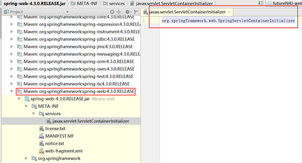

JavaConfig方式只适合支持Serlvet3.0+的容器

我们使用JavaConfig方式，既然是JavaConfig方式那就必然会有Configuration类了。

延续xml版配置，我们的配置将WebApplicationContext（DispatcherServlet）和ApplicationContext（ContextLoaderListener）分开。


>WebApplicationInitializer.java

FnApplicationInitializer继承自AbstractAnnotationConfigDispatcherServletInitializer

这个类中有两个基本的需要被实现的方法，
其实现的接口`AbstractDispatcherServletInitializer`有一个需要实现的方法。

```java
// 返回一个Class<?>[]。
// 该方法用于ApplicationContext的初始化，对应web.xml中配置ContextLoaderListener的初始化参数：contextConfigLocation。只是这类是配置@Configruation的类，而不再是xml文件路径。
protected abstract Class<?>[] getRootConfigClasses();

// 配置DispatcherServlet的@Configruation类
protected abstract Class<?>[] getServletConfigClasses();

// 类似于web.xml中的<mapping-url>,配置拦截url
protected abstract String[] getServletMappings();
```

为什么使用种方式就可以替代web.xml？？（前提是Web服务器支持Servlet3.0+）

>在Servlet3.0+下，我们服务器启动后，Web容器（Tomcat等）就会在classpatch下查找接口 javax.servlet.ServletContainerInitializer的实现类来完成Web应用的初始化。

但是我们的Initializer并未间接实现这个接口呦！！！

Spring实现了这个接口，接口实现类为：SpringServletContainerInitializer

我们可以在Spring的包下找到该类的定义：



但是在此实现类`SpringServletContainerInitializer`中会反过来查找实现了Spring定义的接口`org.springframework.web.WebApplicationInitializer`。
当然了，我们的Initializer启动类也就是间接实现了这个接口所以才能正常启动我们的webApp

```java
import org.springframework.web.servlet.support.AbstractAnnotationConfigDispatcherServletInitializer;

/**
 * 在Servlet3.0+下，我们服务器启动后，Web容器（Tomcat等）会自动查找实现了{@link javax.servlet.ServletContainerInitializer}接口的类来完成初始化（应该类似于替代web.xml）
 * 然而我们的这个类与ServletContainerInitializer没有半毛钱关系
 * 但是Spring的{@link SpringServletContainerInitializer}实现了这个接口
 * 在SpringServletContainerInitializer中会查找实现类了{@link WebApplicationInitializer}接口的类并将配置任务交给他们完成
 * 当然我们的FnApplicationInitializer也就是间接实现了这个接口
 * 
 * 而且在继承这个抽象类时，必须实现如下的三个方法
 *  
 */
public class FnApplicationInitializer extends AbstractAnnotationConfigDispatcherServletInitializer {
    /**
        * 类似于web.xml中配置ContextLoaderListener的contextConfigLocation
        * 只是这个返回的是一个JavaConfig的Class数组
        */
        @Override
        protected Class<?>[] getRootConfigClasses() {
            // TODO Auto-generated method stub
            return new Class<?>[]{RootApplicationJavaConfig.class};
        }
    
        /**
         * 类似于web.xml中配置DispatcherServlet的contextConfigLocation
         * 只是这个返回的是一个JavaConfig的Class数组
         */
        @Override
        protected Class<?>[] getServletConfigClasses() {
            return new Class<?>[]{WebApplicationJavaConfig.class};
        }
    
        /**
         * 等同于<mapping-url/>;
         */
        @Override
        protected String[] getServletMappings() {
            return new String[]{"/"};
        }
}
```

### WebApplicationJavaConfig.java

我们的`DispatcherServlet`配置类

> `@EnableWebMvc` 这个注解类似于XML配置时的`<mvc:annotation-driven>`
>
>只是类似，因为这个注解默认不会配置ViewResolver，也就是DispatcherServlet会使用默认的配置（具体配置在DispatcherServlet的同包下的DispatcherServlet.properties中查看）
> 
>不启动注解扫描
>
>默认情况下不使用默认的DefaultServletHttpRequestHandler。就是说所有的请求都是由DispatcherServlet去处理，但是往往静态资源我们不希望也交给DispatcherServlet处理的。
>
>所以我们还要在这个配置类中做一些事情：
>
>使用InternalResourceViewResolver作为视图解析器
>
>启用注解所描
>
>启用DefaultServletHttpRequestHandler处理静态资源请求

```java
import org.springframework.context.annotation.Bean;
import org.springframework.context.annotation.ComponentScan;
import org.springframework.context.annotation.Configuration;
import org.springframework.web.servlet.ViewResolver;
import org.springframework.web.servlet.config.annotation.DefaultServletHandlerConfigurer;
import org.springframework.web.servlet.config.annotation.EnableWebMvc;
import org.springframework.web.servlet.config.annotation.WebMvcConfigurerAdapter;
import org.springframework.web.servlet.view.InternalResourceViewResolver;

/**
* 作为JavaConfig类，必须有@Configuration注解<br/>
* 注解@EnableWebMvc启用SpringMVC，类似于xml中配置<mvc:annotation-driven/><br/>
* 注意不同点在于<br/>
* 1.该注解不会配置ViewResolver。这样SpringMVC会使用默认配置；
* 2.不起用注解扫描；
* 3.默认情况下不使用默认的Servlet处理访问静态资源（一般我们不会这么做）；
*/
@Configuration
@EnableWebMvc
@ComponentScan(basePackages={"com.github.ittalks"})
public class WebApplicationJavaConfig extends WebMvcConfigurerAdapter {
    @Bean
    public ViewResolver internalResourceViewResolver(){
        InternalResourceViewResolver resolver = new InternalResourceViewResolver();
        resolver.setPrefix("/WEB-INF/views/");
        resolver.setSuffix(".jsp");
        return resolver;
    }
    
    /**配置静态资源处理**/
    @Override
    public void configureDefaultServletHandling(DefaultServletHandlerConfigurer configurer) {
        configurer.enable();
    }

}
```

### RootApplicationJavaConfig .java
这里相当于xml配置ContextLoaderListener的java配置类

这里只需要注意，我们启动注解扫描的时候，过滤掉EnableWebMvc.class

```java
import org.springframework.context.annotation.ComponentScan;
import org.springframework.context.annotation.ComponentScan.Filter;
import org.springframework.context.annotation.Configuration;
import org.springframework.context.annotation.FilterType;
import org.springframework.web.servlet.config.annotation.EnableWebMvc;

@Configuration
@ComponentScan(basePackages={"com.github.ittalks"},
    excludeFilters={@Filter(type=FilterType.ANNOTATION,value={EnableWebMvc.class})})
public class RootApplicationJavaConfig {

}
```

对于其他Controller、Service、Repository的开发并无影响，也就不再粘贴代码，只是将web.xml的配置替换为JavaConfig方式。

当然这也只是快速搭建的Demo。