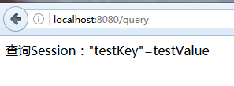
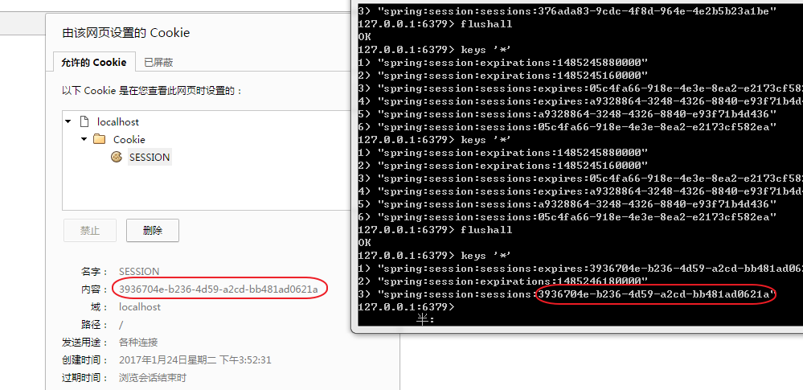

## 目的
使用Redis存储管理HttpSession；

## 添加pom.xml
该工程基于Spring Boot，同时我们将使用Spring IO Platform来维护依赖版本号；

引入的依赖有spring-session、spring-boot-starter-web、spring-boot-starter-redis，pom文件如下：
```xml
<?xml version="1.0" encoding="UTF-8"?>
<project xmlns="http://maven.apache.org/POM/4.0.0" xmlns:xsi="http://www.w3.org/2001/XMLSchema-instance"
    xsi:schemaLocation="http://maven.apache.org/POM/4.0.0 http://maven.apache.org/xsd/maven-4.0.0.xsd">
    <modelVersion>4.0.0</modelVersion>

    <groupId>com.example</groupId>
    <artifactId>helloworld</artifactId>
    <version>0.0.1-SNAPSHOT</version>

    <dependencyManagement>
        <dependencies>
            <dependency>
                <groupId>io.spring.platform</groupId>
                <artifactId>platform-bom</artifactId>
                <version>Athens-SR2</version>
                <type>pom</type>
                <scope>import</scope>
            </dependency>

            <dependency>
                <!-- Import dependency management from Spring Boot -->
                <groupId>org.springframework.boot</groupId>
                <artifactId>spring-boot-dependencies</artifactId>
                <version>1.4.3.RELEASE</version>
                <type>pom</type>
                <scope>import</scope>
            </dependency>
        </dependencies>
    </dependencyManagement>

    <!-- Additional lines to be added here... -->
    <dependencies>
        <dependency>
            <groupId>org.springframework.session</groupId>
            <artifactId>spring-session</artifactId>
        </dependency>
        <dependency>
            <groupId>org.springframework.boot</groupId>
            <artifactId>spring-boot-starter-web</artifactId>
        </dependency>
        <dependency>
            <groupId>org.springframework.boot</groupId>
            <artifactId>spring-boot-starter-redis</artifactId>
        </dependency>
    </dependencies>

    <build>
        <plugins>
            <plugin>
                <groupId>org.springframework.boot</groupId>
                <artifactId>spring-boot-maven-plugin</artifactId>
                <version>1.4.3.RELEASE</version>
                <executions>
                    <execution>
                        <goals>
                            <goal>repackage</goal>
                        </goals>
                    </execution>
                </executions>
            </plugin>
        </plugins>
    </build>

</project>
```

## 配置Spring Session
配置比较简单，主要是添加@EnableRedisHttpSession注解即可，该注解会创建一个名字叫springSessionRepositoryFilter的Spring Bean，其实就是一个Filter，这个Filter负责用Spring Session来替换原先的默认HttpSession实现，在这个例子中，Spring Session是用Redis来实现的。

```java
import org.springframework.session.data.redis.config.annotation.web.http.EnableRedisHttpSession;

@EnableRedisHttpSession
public class HttpSessionConfig {
    
}
```

接下来，则需要在application.properties中配置redis服务器的位置了，在这里，我们就用本机：

```text
spring.redis.host=localhost  
spring.redis.port=6379 
```

## 操作HttpSession
这里我们将实现两个操作，一个是往Session中写入数据，另一个是查询数据，如下所示：
```java
@RestController
public class Example {

    @RequestMapping("/set")
    String set(HttpServletRequest req) {
        req.getSession().setAttribute("testKey", "testValue");
        return "设置session:testKey=testValue";
    }

    @RequestMapping("/query")
    String query(HttpServletRequest req) {
        Object value = req.getSession().getAttribute("testKey");
        return "查询Session：\"testKey\"=" + value;
    }

}
```
## 编写main方法
编写main方法，使用@SpringBootApplication注解标注，如果查看该注解源码的话，会发现相当于添加了@SpringBootConfiguration @EnableAutoConfiguration @ComponentScan等注解

```java
import org.springframework.boot.SpringApplication;
import org.springframework.boot.autoconfigure.SpringBootApplication;

@SpringBootApplication
public class APP {
       public static void main(String[] args) throws Exception {
            SpringApplication.run(APP.class, args);
        }
}
```
## 运行程序，测试验证
1、本地启动redis服务；


2、打开redis客户端，输入flushall清空缓存；


3、浏览器输入http://localhost:8080/set，设置Session


redis客户端输入keys *命令, 可以发现redis中确实有数据插入：


4、浏览器输入http://localhost:8080/query，查询Session



5、清空redis缓存，浏览器输入http://localhost:8080/query，再次查询Session

发现HttpSession中已经无数据。


最后，如果查看浏览器的cookie的话，会发现有一个name为"SESSION"的cookie，其值为redis中spring session key的一部分。



另外，还可以在redis客户端输入HGETALL来查看spring session具体的值，如下：


结论：以上测试结果全部符合预期，HttpSession的实现成功被Spring Session替换，操作HttpSession等同于操作redis中的数据。
