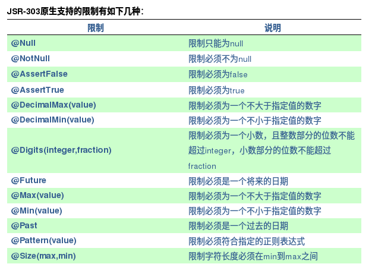

对于任何一个应用而言在客户端做的数据有效性验证都不是安全有效的，这时候就要求我们在开发的时候在服务端也对数据的有效性进行验证。

SpringMVC自身对数据在服务端的校验有一个比较好的支持，它能将我们提交到服务端的数据按照我们事先的约定进行数据有效性验证，对于不合格的数据信息SpringMVC会把它保存在错误对象中，
这些错误信息我们也可以通过SpringMVC提供的标签在前端JSP页面上进行展示。

### 使用Validator接口进行验证
在SpringMVC中提供了一个Validator接口，我们可以通过该接口来定义我们自己对实体对象的验证。接下来看一个示例。

假设我们现在有一个需要进行验证的实体类User，其代码如下所示：
```
public class User {

    private String username;

    private String password;

    public String getUsername() {
       return username;
    }

    public void setUsername(String username) {
       this.username = username;
    }

    public String getPassword() {
       return password;
    }

    public void setPassword(String password) {
       this.password = password;
    }

    public String toString() {
       return username + ", " + password;
    }

}
```
那么当我们需要使用SpringMVC提供的Validator接口来对该实体类进行校验的时候该如何做呢？
这个时候我们应该提供一个Validator的实现类，并实现Validator接口的supports方法和validate方法。
Supports方法用于判断当前的Validator实现类是否支持校验当前需要校验的实体类，
只有当supports方法的返回结果为true的时候，该Validator接口实现类的validate方法才会被调用来对当前需要校验的实体类进行校验。

这里假设我们需要验证User类的username和password都不能为空，先给出其代码，稍后再进行解释。这里我们定义一个UserValidator，其代码如下：

```
import org.springframework.validation.Errors;
import org.springframework.validation.ValidationUtils;
import org.springframework.validation.Validator;

public class UserValidator implements Validator {

    public boolean supports(Class<?> clazz) {
       // TODO Auto-generated method stub
       return User.class.equals(clazz);
    }

    public void validate(Object obj, Errors errors) {
       // TODO Auto-generated method stub
       ValidationUtils.rejectIfEmpty(errors, "username", null, "Username is empty.");
       User user = (User) obj;
       if (null == user.getPassword() || "".equals(user.getPassword()))
           errors.rejectValue("password", null, "Password is empty.");
    }

}
```

在上述代码中我们在supports方法中定义了该UserValidator只支持对User对象进行校验。
在validate方法中我们校验了User对象的username和password不为empty的情况，这里的empty包括null和空字符串两种情况。
ValidationUtils类是Spring中提供的一个工具类。Errors就是Spring用来存放错误信息的对象。

我们已经定义了一个对User类进行校验的UserValidator了，但是这个时候UserValidator还不能对User对象进行校验，
因为我们还没有告诉Spring应该使用UserValidator来校验User对象。
在SpringMVC中我们可以使用DataBinder来设定当前Controller需要使用的Validator。先来看下面一段代码：

```
import javax.validation.Valid;
import org.springframework.stereotype.Controller;
import org.springframework.validation.BindingResult;
import org.springframework.validation.DataBinder;
import org.springframework.web.bind.annotation.InitBinder;
import org.springframework.web.bind.annotation.RequestMapping;

@Controller
public class UserController {

    @InitBinder
    public void initBinder(DataBinder binder) {
       binder.setValidator(new UserValidator());
    }

    @RequestMapping("login")
    public String login(@Valid User user, BindingResult result) {
       if (result.hasErrors())
           return "redirect:user/login";
       return "redirect:/";
    }

}
```

在上面这段代码中我们可以看到我们定义了一个UserController，该Controller有一个处理login操作的处理器方法login，
它需要接收客户端发送的一个User对象，我们就是要利用前面的UserValidator对该User对象进行校验。
首先我们可以看到我们login方法接收的参数user是用@Valid进行标注的，这里的@Valid是定义在JSR-303标准中的。
这里我们**必须使用@Valid标注我们需要校验的参数**user，否则Spring不会对它进行校验。
另外我们的**处理器方法必须给定包含Errors的参数**，这可以是Errors本身，也可以是它的子类BindingResult，
使用了Errors参数就是告诉Spring关于表单对象数据校验的错误将由我们自己来处理，**否则Spring会直接抛出异常**，
**而且这个参数是必须紧挨着@Valid参数的，即必须紧挨着需要校验的参数，这就意味着我们有多少个@Valid参数就需要有多少个对应的Errors参数，它们是一一对应的**。

前面有提到我们可以通过DataBinder来指定需要使用的Validator，我们可以看到在上面代码中我们通过`@InitBinder`标记的方法initBinder设置了当前Controller需要使用的Validator是UserValidator。
这样当我们请求处理器方法login时就会使用DataBinder设定的UserValidator来校验当前的表单对象User，首先会通过UserValidator的supports方法判断其是否支持User对象的校验，
若支持则调用UserValidator的validate方法，并把相关的校验信息存放到当前的Errors对象中。接着我们就可以在我们的处理器方法中根据是否有校验异常信息来做不同的操作。

在上面代码中我们定义了在有异常信息的时候就跳转到登陆页面。这样我们就可以在登陆页面上通过errors标签来展示这些错误信息了。

我们知道在Controller类中通过@InitBinder标记的方法只有在请求当前Controller的时候才会被执行，所以其中定义的Validator也只能在当前Controller中使用，
如果我们希望一个Validator对所有的Controller都起作用的话，我们可以通过WebBindingInitializer的initBinder方法来设定了。
另外，在SpringMVC的配置文件中通过`<mvc:annotation-driven/>`的`validator`属性也可以**指定全局的Validator**。代码如下所示：

```
<?xml version="1.0" encoding="UTF-8"?>
<beans xmlns="http://www.springframework.org/schema/beans"
    xmlns:xsi="http://www.w3.org/2001/XMLSchema-instance" xmlns:context="http://www.springframework.org/schema/context"
    xmlns:mvc="http://www.springframework.org/schema/mvc"
    xsi:schemaLocation="http://www.springframework.org/schema/beans
     http://www.springframework.org/schema/beans/spring-beans-3.0.xsd
     http://www.springframework.org/schema/context
     http://www.springframework.org/schema/context/spring-context-3.0.xsd
     http://www.springframework.org/schema/mvc
     http://www.springframework.org/schema/mvc/spring-mvc-3.0.xsd">

    <mvc:annotation-driven validator="userValidator"/>

    <bean id="userValidator" class="com.xxx.xxx.UserValidator"/>

    ...
</beans>
```

###  使用JSR-303 Validation进行验证
JSR-303是一个数据验证的规范，这里我不会讲这个规范是怎么回事，只会讲一下JSR-303在SpringMVC中的应用。
JSR-303只是一个规范，而Spring也没有对这一规范进行实现，那么当我们在SpringMVC中需要使用到JSR-303的时候就需要我们提供一个对JSR-303规范的实现，
Hibernate Validator是实现了这一规范的，这里我将以它作为JSR-303的实现来讲解SpringMVC对JSR-303的支持。

JSR-303的校验是基于注解的，它内部已经定义好了一系列的限制注解，我们只需要把这些注解标记在需要验证的实体类的属性上或是其对应的get方法上。来看以下一个需要验证的实体类User的代码：

```
import javax.validation.constraints.Min;
import javax.validation.constraints.NotNull;
import org.hibernate.validator.constraints.NotBlank;

public class User {

    private String username;

    private String password;

    private int age;

    @NotBlank(message="用户名不能为空")
    public String getUsername() {
       return username;
    }

    public void setUsername(String username) {
       this.username = username;
    }

    @NotNull(message="密码不能为null")
    public String getPassword() {
       return password;
    }

    public void setPassword(String password) {
       this.password = password;
    }

    @Min(value=10, message="年龄的最小值为10")
    public int getAge() {
       return age;
    }

    public void setAge(int age) {
       this.age = age;
    }

}
```

我们可以看到我们在username、password和age对应的get方法上都加上了一个注解，这些注解就是JSR-303里面定义的限制，其中@NotBlank是Hibernate Validator的扩展。
不难发现，使用JSR-303来进行校验比使用Spring提供的Validator接口要简单的多。我们知道注解只是起到一个标记性的作用，它是不会直接影响到代码的运行的，它需要被某些类识别到才能起到限制作用。

使用SpringMVC的时候我们只需要把JSR-303的实现者对应的jar包放到classpath中，然后在SpringMVC的配置文件中引入MVC Namespace，并加上`<mvn:annotation-driven/>`就可以非常方便的使用JSR-303来进行实体对象的验证。

加上了`<mvn:annotation-driven/>`之后Spring会自动检测classpath下的JSR-303提供者并自动启用对JSR-303的支持，把对应的校验错误信息放到Spring的Errors对象中。这时候SpringMVC的配置文件如下所示：

```
<?xml version="1.0" encoding="UTF-8"?>
<beans xmlns="http://www.springframework.org/schema/beans"
    xmlns:xsi="http://www.w3.org/2001/XMLSchema-instance" xmlns:context="http://www.springframework.org/schema/context"
    xmlns:mvc="http://www.springframework.org/schema/mvc"
    xsi:schemaLocation="http://www.springframework.org/schema/beans
     http://www.springframework.org/schema/beans/spring-beans-3.0.xsd
     http://www.springframework.org/schema/context
     http://www.springframework.org/schema/context/spring-context-3.0.xsd
     http://www.springframework.org/schema/mvc
     http://www.springframework.org/schema/mvc/spring-mvc-3.0.xsd">

    <mvc:annotation-driven/>
</beans>
```

接着我们来定义一个使用User对象作为参数接收者的Controller，其代码如下所示：

```
import javax.validation.Valid;
import org.springframework.stereotype.Controller;
import org.springframework.validation.BindingResult;
import org.springframework.web.bind.annotation.RequestMapping;

@Controller
public class UserController {

    @RequestMapping("login")
    public String login(@Valid User user, BindingResult result) {
       if (result.hasErrors())
           return "user/login";
       return "redirect:/";
    }

}
```

这样当我们不带任何参数请求login的时候就不能通过实体对象User的属性数据有效性限制，然后会把对应的错误信息放置在当前的Errors对象中。

JSR-303原生支持的限制有如下几种：



除了JSR-303原生支持的限制类型之外我们还可以定义自己的限制类型。定义自己的限制类型首先我们得定义一个该种限制类型的注解，而且该注解需要使用@Constraint标注。现在假设我们需要定义一个表示金额的限制类型，那么我们可以这样定义：

```
import java.lang.annotation.ElementType;
import java.lang.annotation.Retention;
import java.lang.annotation.RetentionPolicy;
import java.lang.annotation.Target;

import javax.validation.Constraint;
import javax.validation.Payload;

import com.xxx.xxx.constraint.impl.MoneyValidator;

@Target({ElementType.FIELD, ElementType.METHOD})
@Retention(RetentionPolicy.RUNTIME)
@Constraint(validatedBy=MoneyValidator.class)
public @interface Money {

    String message() default"不是金额形式";

    Class<?>[] groups() default {};

    Class<? extends Payload>[] payload() default {};

}
```

我们可以看到在上面代码中我们定义了一个Money注解，而且该注解上标注了@Constraint注解，使用@Constraint注解标注表明我们定义了一个用于限制的注解。
@Constraint注解的validatedBy属性用于指定我们定义的当前限制类型需要被哪个ConstraintValidator进行校验。
在上面代码中我们指定了Money限制类型的校验类是MoneyValidator。

另外需要注意的是我们在定义自己的限制类型的注解时有三个属性是必须定义的，如上面代码所示的message、groups和payload属性。

在定义了限制类型Money之后，接下来就是定义我们的限制类型校验类MoneyValidator了。
限制类型校验类必须实现接口javax.validation.ConstraintValidator，并实现它的initialize和isValid方法。我们先来看一下MoneyValidator的代码示例：

```
import java.util.regex.Pattern;

import javax.validation.ConstraintValidator;
import javax.validation.ConstraintValidatorContext;

import com.xxx.xxx.constraint.Money;

public class MoneyValidator implements ConstraintValidator<Money, Double> {

    private String moneyReg = "^\\d+(\\.\\d{1,2})?$";//表示金额的正则表达式
    private Pattern moneyPattern = Pattern.compile(moneyReg);

    public void initialize(Money money) {
       // TODO Auto-generated method stub

    }

    public boolean isValid(Double value, ConstraintValidatorContext arg1) {
       // TODO Auto-generated method stub
       if (value == null)
           return true;
       return moneyPattern.matcher(value.toString()).matches();
    }

}
```

从上面代码中我们可以看到ConstraintValidator是使用了泛型的。它一共需要指定两种类型，第一个类型是对应的initialize方法的参数类型，第二个类型是对应的isValid方法的第一个参数类型。
从上面的两个方法我们可以看出isValid方法是用于进行校验的，

有时候我们在校验的过程中是需要取当前的限制类型的属性来进行校验的，比如我们在对@Min限制类型进行校验的时候我们是需要通过其value属性获取到当前校验类型定义的最小值的，我们可以看到isValid方法无法获取到当前的限制类型Money。
这个时候initialize方法的作用就出来了。我们知道initialize方法是可以获取到当前的限制类型的，所以当我们在校验某种限制类型时需要获取当前限制类型的某种属性的时候，我们可以给当前的ConstraintValidator定义对应的属性，然后在initialize方法中给该属性赋值，接下来我们就可以在isValid方法中使用其对应的属性了。

针对于这种情况我们来看一个代码示例，现在假设我要定义自己的@Min限制类型和对应的MinValidator校验器，那么我可以如下定义：

**Min限制类型**
```
@Target({ElementType.FIELD, ElementType.METHOD})
@Retention(RetentionPolicy.RUNTIME)
@Constraint(validatedBy=MinValidator.class)
public @interface Min {

    int value() default 0;

    String message();

    Class<?>[] groups() default {};

    Class<? extends Payload>[] payload() default {};
}
```

**MinValidator校验器**
```
public class MinValidator implements ConstraintValidator<Min, Integer> {

    private int minValue;

    public void initialize(Min min) {
       // TODO Auto-generated method stub
       //把Min限制类型的属性value赋值给当前ConstraintValidator的成员变量minValue
       minValue = min.value();
    }

    public boolean isValid(Integer value, ConstraintValidatorContext arg1) {
       // TODO Auto-generated method stub
       //在这里我们就可以通过当前ConstraintValidator的成员变量minValue访问到当前限制类型Min的value属性了
       return value >= minValue;
    }

}
```

继续来说一下ConstraintValidator泛型的第二个类型，我们已经知道它的第二个类型是对应的isValid的方法的第一个参数，
从我给的参数名称value来看也可以知道isValid方法的第一个参数正是对应的当前需要校验的数据的值，而它的类型也正是对应的我们需要校验的数据的数据类型。
这两者的数据类型必须保持一致，否则Spring会提示找不到对应数据类型的ConstraintValidator。

建立了自己的限制类型及其对应的ConstraintValidator后，其用法跟标准的JSR-303限制类型是一样的。以下就是使用了上述自己定义的JSR-303限制类型——Money限制和Min限制的一个实体类：

```
public class User {

    private int age;

    private Double salary;

    @Min(value=8, message="年龄不能小于8岁")
    public int getAge() {
       return age;
    }

    public void setAge(int age) {
       this.age = age;
    }

    @Money(message="标准的金额形式为xxx.xx")
    public Double getSalary() {
       return salary;
    }

    public void setSalary(Double salary) {
       this.salary = salary;
    }

}
```

另外再讲一点Spring对自定义JSR-303限制类型支持的新特性，那就是Spring支持往ConstraintValidator里面注入bean对象。
现在假设我们在MoneyValidator里面需要用到Spring ApplicationContext容器中的一个UserController bean对象，
那么我们可以给ConstraintValidator定义一个UserController属性，并给定其set方法，在set方法上加注解@Resource或@Autowired通过set方式来注入当前的ApplicationContext中拥有的UserController bean对象。

关于@Resource和@AutoWired的区别可以参考这篇博客。所以我们可以这样来定义我们的MoneyValidator：

```
public class MoneyValidator implements ConstraintValidator<Money, Double> {

    private String moneyReg = "^\\d+(\\.\\d{1,2})?$";//表示金额的正则表达式
    private Pattern moneyPattern = Pattern.compile(moneyReg);
    private UserController controller;

    public void initialize(Money money) {
       // TODO Auto-generated method stub

    }

    public boolean isValid(Double value, ConstraintValidatorContext arg1) {
       // TODO Auto-generated method stub
       System.out.println("UserController: .............." + controller);
       if (value == null)
           returntrue;
       return moneyPattern.matcher(value.toString()).matches();
    }

    public UserController getController() {
       return controller;
    }

    @Resource
    public void setController(UserController controller) {
       this.controller = controller;
    }

}
```