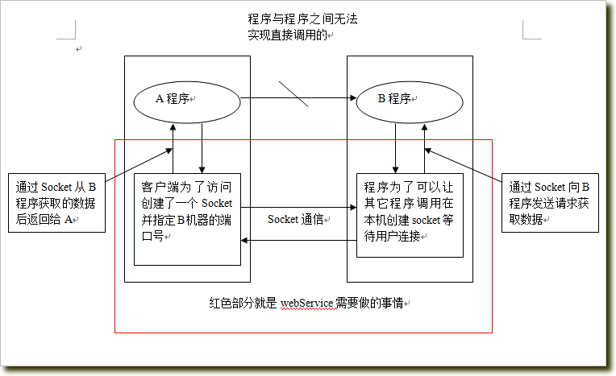
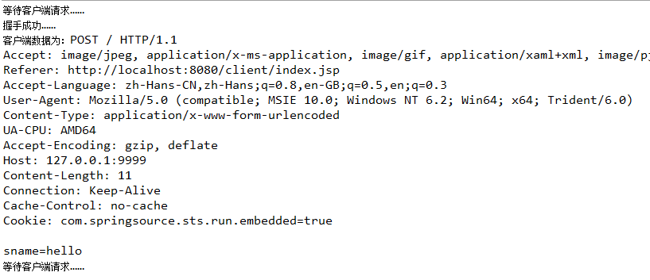
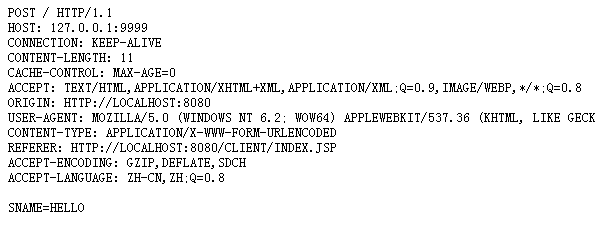
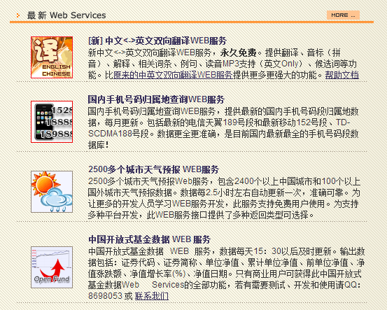
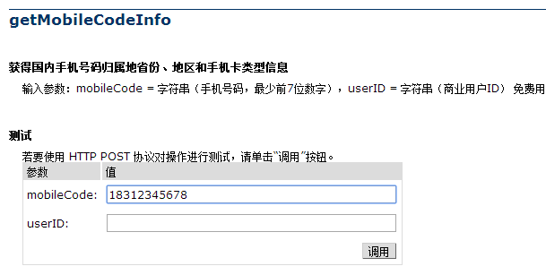
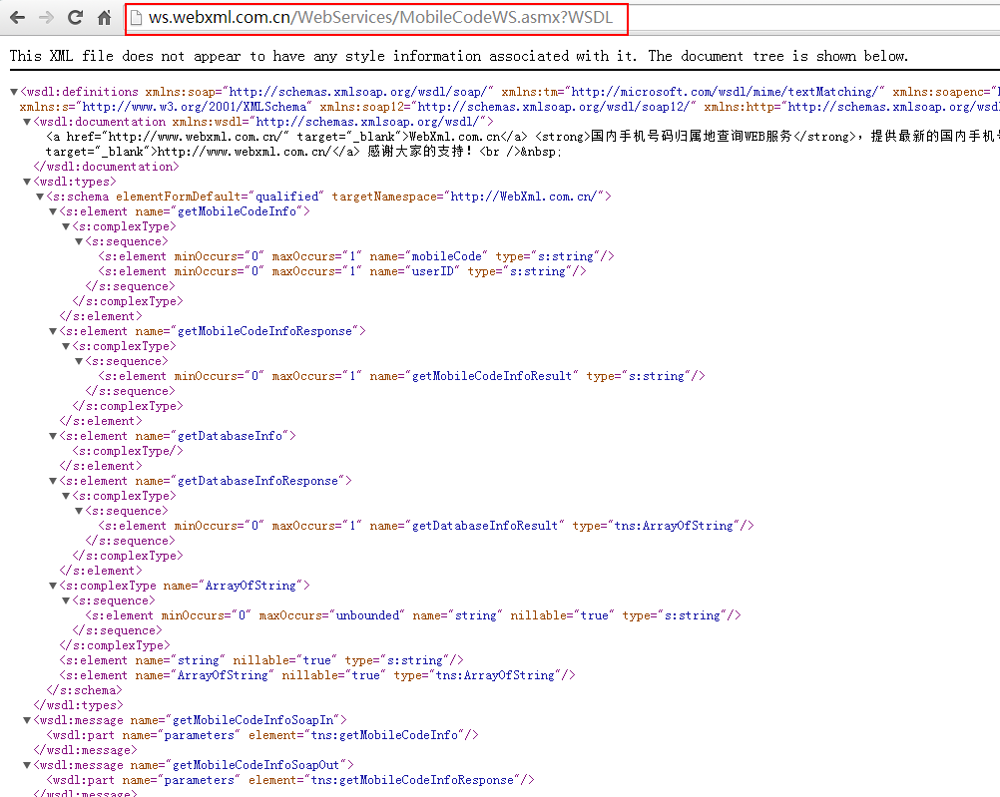
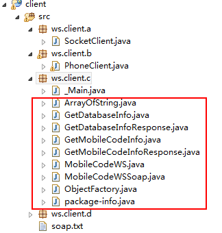
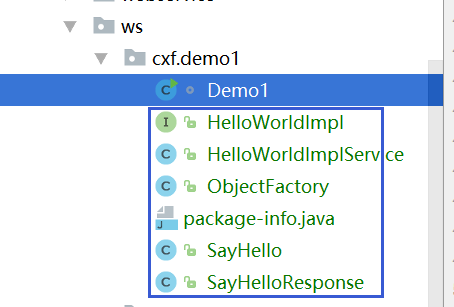
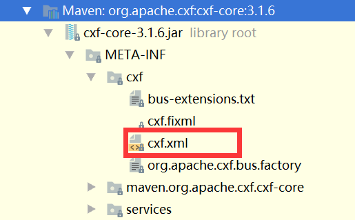
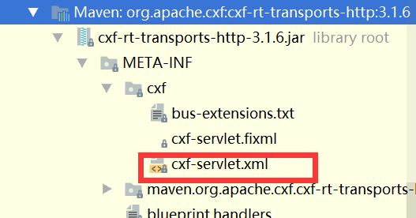

# _`目录`_

- _`Chpt 一、带你走进webservice的世界`_
    - 1.什么是webservice
    - 2.重温socket
    - 3.调用已发布的WebService
    
- _`Chpt 二、自定义WebService服务及其调用`_
    - 1.自定义webservice
    - 2.调用自定义的webservice

- _`Chpt 三、wsdl配置详解以及使用注解修改wsdl配置`_
    - 1.wsdl配置详解
    - 2.使用注解修改wsdl配置

- _`Chpt 四、CXF处理JavaBean等复合类型以及Map等复杂类型的数据`_
    - 1.CXF处理Java Bean等复合类型的数据
    - 2.CXF处理Map等复杂类型的数据
    
- _`Chpt 五、CXF拦截器的设置以及自定义CXF拦截器`_
    - 1.CXF内置的拦截器设置
    - 2.自定义CXF拦截器

- _`Chpt 六、WebService - CXF整合Spring`_
    - 1.整合server
    - 2.整合client

- _`Chpt 七、CXF实现一个Restful风格`_
    - 1.创建Webservice对外接口
    - 2.实现Webservice接口
    - 3.配置Spring xml，让Webservice提供服务
    - 4.接下来我们编写一个基于WebClient简单客户端
    
- _`Chpt 八、CXF利用内置jetty发布ws`_
    - 1.maven导入Jar包
    - 2.编写ws接口，及其实现类
    - 3.编写一个JaxWsServer类来发布WS
    
- _`Chpt 九、CXF设置WebService客户端超时时长`_
    - 1.客户端
    - 2.服务器
    
- _`Chpt 十、CXF配置HTTP代理访问Internet`_
    - 1.在java的Http请求中使用代理
    - 2.使用`JaxWsProxyFactoryBean`创建client
    - 3.通过`http-conf:condui`配置

# _`Chpt 一、带你走进webservice的世界`_

## 1. 什么是webservice

准确的来说，webservice不是一种技术，而是一种规范。是一种跨平台，跨语言的规范，用于不同平台，不同语言开发的应用之间的交互。

举个例子，比如在Windows Server服务器上有个C#.Net开发的应用A，在Linux上有个Java语言开发的应用B，
现在B应用要调用A应用，或者是互相调用，用于查看对方的业务数据，就需要webservice的规范。

再举个例子，天气预报接口。无数的应用需要获取天气预报信息，这些应用可能是各种平台，各种技术实现，
而气象局的项目，估计也就一两种，要对外提供天气预报信息，这个时候，如何解决呢？
webservice就是出于以上类似需求而定义出来的规范。

我们一般就是在具体平台开发webservice接口，以及调用webservice接口，每种开发语言都有自己的webservice实现框架。
比如Java 就有 Apache Axis1、Apache Axis2、Codehaus XFire、Apache CXF、Apache Wink、Jboss RESTEasyd等等。
其中Apache CXF用的比较多，它也可以和Spring整合。

## 2. 重温socket
在分析如何调用webservice前，先来回忆一下传统的socket是如何通信的，这样更容易理解ws。

### 2.1 基于socket创建web服务
为什么要使用socket呢？看一下下面的原理图： 



从图中可以看出，程序A和程序B之间是无法实现直接调用的，那么现在A需要访问B的话，A即创建一个socket并指定B机器的端口号，
在此之前B已经在本机创建好了socket等待用户来连接，A和B连接成功后，即可向B发送请求获取数据了。
这很好理解，为了回忆一下socket的创建和使用，下面先写一个简单的socket通信的demo，服务端可以将小写字母转大写。

### 2.2 经典的socket服务

客户端：

```java
/**
 * @Description Socket Client，用来发送请求给服务端
 */
public class SocketClient {

    public static void main(String[] args) throws Exception {
        Scanner input = new Scanner(System.in);
        // 1、创建一个基于TCP协议的socket服务,在建立对象时,指定要连接服务器的ip和端口号
        Socket sc = new Socket("127.0.0.1", 9999);
        // 2、通过建立的Socket对象获取Socket中的输出流,调用getOutStream方法
        OutputStream out = sc.getOutputStream();

        System.out.println("请输入要转化的字母：");
        String initData = input.next();//获取控制台的输入

        // 3、写入到Socket输出流中
        out.write(initData.getBytes());
        System.out.println("等待服务器端返回数据");

        // 4、通过建立的Socket对象获取Socket中的输入流,输入流会接受来自服务器端数据
        InputStream in = sc.getInputStream();
        byte[] b = new byte[1024];

        // 5、获取输入字节流的数据,注意此方法是堵塞的,如果没有获取数据会一直等待
        int len = in.read(b);
        System.out.println("返回的结果为：" + new String(b, 0, len));

        // 关闭Socket
        out.close();
        in.close();
        sc.close();
        input.close();
    }
}
```

服务端：

```java
/**
 * @Description Socket Server，用来接收客户端请求，实现转大写功能
 *
 */
public class SocketServer {

    public static void main(String[] args) throws Exception {

        // 1、建立服务器端的TCP socket服务,必须监听一个端口
        ServerSocket ss = new ServerSocket(9999);
        while(true) {
            System.out.println("等待客户端请求……");

            // 2、通过服务器端的socket对象的accept方法获取连接上的客户端对象，没有则堵塞,等待
            Socket socket = ss.accept();
            System.out.println("握手成功……");

            // 3、通过输入流获取数据
            InputStream input = socket.getInputStream();
            byte[] b = new byte[1024];
            int len = input.read(b);
            String data = new String(b, 0, len);
            System.out.println("客户端数据为：" + data);

            // 4、通过服务器端Socket输出流,写数据,会传送到客户端Socket输入流中
            OutputStream out = socket.getOutputStream();
            out.write(data.toUpperCase().getBytes());

            // 5: 关闭socket
            out.close();
            input.close();
            socket.close();

        }
    }
}
```

这个Demo很简单，先开启服务端的程序，在那等待，然后开启客户端程序，如果在控制台输入`hello`过去，就会从服务端返回一个`HELLO`回来，这说明socket通信是成功的。

### 2.3 web程序访问socket service

上面经典的demo是在本地写的两个java程序，我们现在的很多项目都是web项目，也就是通过浏览器来交互的，
我们来看下通过浏览器的方式如何来访问socket Service服务。

服务端还是使用上面的那个java程序，客户端我改成浏览器请求，新写一个jsp如下：

```html
<%@ page language="java" import="java.util.*" pageEncoding="UTF-8"%>

<!DOCTYPE HTML PUBLIC "-//W3C//DTD HTML 4.01 Transitional//EN">
<html>
  <head>   
  </head> 
  <body>
    <form action="http://127.0.0.1:9999" method="post">
        <input type="text" name="sname">
        <input type="submit" value="提交">
    </form>
  </body>
</html>
```

注意看`action`的请求地址，包括端口要和服务端的一样，这样当我们提交的时候就可以访问上面的服务端程序了。

看一下服务端的运行结果： 



可以看到，web程序确实和服务端握手成功了，而且数据也是可以传过去的，`sname=hello`，包括一些Http信息都可以传过去，但是我们再来看看服务端返回给浏览器的数据是啥： 



我用的是chrome浏览器，其他浏览器可能还没有数据，这都有可能。

但是从数据中来看，它只是单纯的把所有信息全部转成了大写……而且它也没有Http的返回格式，也就是说，我所需要的就是个大写的HELLO即可，所以这是有问题的。

所以可以总结一下：不同的协议其实也是支持Socket通信的。

web程序可以调用socket请求，但是由于协议不同，因此在处理的时候要过滤http的协议格式，返回的时候还需要添加http返回的格式，否则就会出现问题，可想而知，如果还要处理协议格式，是很麻烦的。

所以到这里，基本上就理解了为什么传统的socket无法满足需求了，其实除了上面的弊端外，还有其他的弊端，比如如果参数一多，就不好维护等等，这里就不多举例了。

## 3. 调用已发布的WebService

关于webservice本身，我就不做过多的描述了，在最上面也有简单介绍，既然传统的socket通信无法满足，那么下面开始来调用已发布的ws，真正走进ws的世界。

有一个站点：<http://www.webxml.com.cn>，是上海的一家公司做的，上面提供了很多ws服务，其中有一个查询号码归属地的功能，我们用它来做测试。

先来在它们的站点中测试一下，然后再在本地写程序来调用这个ws服务获取查询结果。

看一下站点上的查询：



进入手机号码归属地查询web服务后， 


选择getMobileCodeInfo，即可进入查询页面了， 



调用后就会出现`<string xmlns="http://WebXml.com.cn/">18312345678：广东 深圳 广东移动全球通卡</string>`的结果。

这就是调用ws的结果，接下来我们在程序中来调用这个ws。

### 3.1 get请求方式
在Java程序中如果要发送http请求，需要使用HttpClient工具。

HttpClient 是 Apache Jakarta Common 下的子项目，可以用来提供高效的、最新的、功能丰富的支持 HTTP 协议的客户端编程工具包，并且它支持 HTTP 协议最新的版本和建议。

为什么要使用HttpClient工具呢？因为原生态的Socket基于传输层，现在我们要访问的WebService是基于HTTP的属于应用层，所以我们的Socket通信要借助HttpClient发HTTP请求，这样格式才能匹配。

```java
/**
 * @Description get方式请求
 */
public void get(String number) throws Exception {
    // HttpClient：在java代码中模拟Http请求
    // 创建HttpClient对象
    HttpClient client = new HttpClient();
    // 填写数据，发送get请求
    GetMethod get = new GetMethod("http://ws.webxml.com.cn/WebServices/MobileCodeWS.asmx"
            + "/getMobileCodeInfo?mobileCode=" + number + "&userID=");
    // 指定传输的格式
    get.setRequestHeader("Content-Type", "text/xml; charset=utf-8");
    // 发送请求
    int code = client.executeMethod(get);
    System.out.println("Http:状态码为：" + code);

    String result = get.getResponseBodyAsString();
    System.out.println("返回的结果为：" + result);
}
```

从程序中可以看出，请求的主机是ws.webxml.com.cn，这些url在ws提供方的网站上都有，我们只需要写对即可请求ws了，在main方法中调用一下该方法即可在控制台获取结果。

### 3.2 post请求方式
请求的过程都一样，只是url和传输格式不同而已，修改一下相应的地方即可，

```java
/**
 * @Description post方式请求
 */
public void post(String number) throws Exception {
    // HttpClient：在java代码中模拟Http请求
    // 创建HttpClient对象
    HttpClient client = new HttpClient();
    // 填写数据，发送post请求
    PostMethod post = new PostMethod("http://ws.webxml.com.cn/WebServices/MobileCodeWS.asmx/getMobileCodeInfo");

    // 指定传输的格式
    post.setRequestHeader("Content-Type", "application/x-www-form-urlencoded");     
    // 传输参数
    post.setParameter("mobileCode", number);
    post.setParameter("userID", "");

    // 发送请求
    int code = client.executeMethod(post);
    System.out.println("Http:状态码为：" + code);

    String result = post.getResponseBodyAsString();
    System.out.println("返回的结果为：" + result);
}
```

### 3.3 SOAP方式请求

这也是在用的多的方式，它有两个版本soap1.1和soap1.2，jdk1.7及以上才可以使用soap1.2。

```java
/**
 * @Description soap post方式请求，但是传输的数据为xml格式，有利于数据的维护
 */
public void soap(String number) throws Exception {
    // HttpClient：在java代码中模拟Http请求
    // 创建HttpClient对象
    HttpClient client = new HttpClient();
    // 填写数据，发送post请求
    PostMethod post = new PostMethod("http://ws.webxml.com.cn/WebServices/MobileCodeWS.asmx");

    // 指定传输的格式
    post.setRequestHeader("Content-Type", "application/soap+xml;charset=utf-8");
    // 传输xml，加载soap.txt
    post.setRequestBody(new FileInputStream("soap.txt"));  
    // 发送请求
    int code = client.executeMethod(post);
    System.out.println("Http:状态码为：" + code);

    String result = post.getResponseBodyAsString();
    // 如果采用的是soap，则返回的数据也是基于xml的soap格式
    System.out.println("返回的结果为：" + result);
}
```

由于soap方式需要向服务端发送xml，所以我们可以实现写好一个txt文档，里面是xml的数据，这个模板ws提供方会提供，我们需要写好即可：

```xml
<?xml version="1.0" encoding="utf-8"?>
<soap12:Envelope xmlns:xsi="http://www.w3.org/2001/XMLSchema-instance" xmlns:xsd="http://www.w3.org/2001/XMLSchema" xmlns:soap12="http://www.w3.org/2003/05/soap-envelope">
  <soap12:Body>
    <getMobileCodeInfo xmlns="http://WebXml.com.cn/">
      <mobileCode>18312345678</mobileCode>
      <userID></userID>
    </getMobileCodeInfo>
  </soap12:Body>
</soap12:Envelope>
```

上面这些方式推荐使用soap的方式，不过本质上还是http方式调用，只是调用的时候可以传输xml数据而已。
而且HttpClient是Java的调用http协议的解决方案，但是不能保证其它语言也拥有类似的工具。
所以ws推荐的方案是使用`wsimport`命令。这也是下面分析的重点。

### 3.4 使用wsimport
每个ws都会有一个WSDL，WSDL即WebService Description Language – Web服务描述语言。

它是通过XML形式说明服务在什么地方 － 地址。通过XML形式说明服务提供什么样的方法 – 如何调用。

我们可以通过这个WSDL来获取和这个ws有关的信息，包括class和java代码。

关于这个WSDL后面我再具体分析，这一节先来看一下如何使用。

`wsimport`是一个命令，jdk1.6及以上才可以使用，ws针对不同的语言都会有个`wsimport`命令，我们可以在自己安装的jdk的bin目录下找到这个wsimport.exe，正因为有了这个，所以我们可以在命令行中使用wsimport命令。

怎么使用呢？

每个ws都会有一个WSDL，就拿上面的归属地查询服务来说，上面第二张图上面有个服务说明，点开就可以看到WSDL，当然也可以直接访问浏览器上的url来访问这个WSDL，即xml文档。如下： 



只需要复制一下那个url即可，然后打开命令提示符窗口，随便进入一个目录下（该目录要保存等会生成的和ws相关的文件，自己事先建一个即可），运行 

```
wsimport http://ws.webxml.com.cn/WebServices/MobileCodeWS.asmx?WSDL
```

就会生成相应的java bean，当然了，是.class文件，但是我们不想要class文件，我们想要java文件，所以可以使用如下命令： 

```
wsimport -s . http://ws.webxml.com.cn/WebServices/MobileCodeWS.asmx?WSDL
```

这样不仅生成了class文件，还生成了java文件，如果我们想要在固定的包下生成这些文件，等会方便直接拷贝到项目里，可以使用下面的命令： 

```
wsimport -s . -p ws.client.c http://ws.webxml.com.cn/WebServices/MobileCodeWS.asmx?WSDL
```

这样就会在目录`ws/client/c/`下生成所需要的class和java代码，然后我们删掉class文件，直接拷贝ws目录到工程中即可，如下(_Main是我自己写的，用来调用使用的)： 



这样就有了号码归属地查询这个ws服务相关的API了，这是通过官方的WSDL来生成的，然后我们如何在自己的项目中使用呢？

我新写一个_Main.java文件，直接使用这些API即可，如下：

```
public class _Main {
    public static void main(String[] args) {

        // 获取一个ws服务
        MobileCodeWS ws = new MobileCodeWS();
        // 获取具体的服务类型：get post soap1.1 soap1.2
        MobileCodeWSSoap wsSoap = ws.getMobileCodeWSSoap();
        String address = wsSoap.getMobileCodeInfo("18312345678", null);
        System.out.println("手机归属地信息为：" + address);
    }
}
```

这样就很方便了，现在已经完全没有了上面那种连接啊，设置地址啊等等，直接封装好了，我直接调用这些API即可调用远程的webservice。

这也是官方推荐的一种方法，当然我们也可以将生成的class文件打包成jar放到工程中。

运行一下这个main方法后，也直接返回归属地，没有那些标签的东西了，这才是开发中所需要的东西。

到这里基本已经会调用webservice了，最后再简单总结一下，ws中这个WSDL很重要，这里面用xml描述了该ws的信息，所以我们可以通过解析WSDL来获取该ws相关的API，然后在自己的项目中调用这些API即可调用该ws。 

# _`Chpt 二、自定义WebService服务及其调用`_

其实在实际中，我们自定义ws的可能性比较小，一般都是去调用已有的ws较多，除非项目需要发布一个ws。但是为了更好的理解ws，
这一篇博文主要来总结一下如何自定义ws，然后如何去调用自定义的ws，内容比较基础，完全针对小白。

## 1. 自定义webservice
### 1.1 原生态jdk定义

使用jdk自定义一个ws只需要做两件事：

一、使用注解`@WebService`；

二、调用`Endpoint`类的静态方法`publish`创建一个服务端点即可；

如下：

```java
package com.github.ittalks.commons.example.ws.jax.demo1;

import javax.jws.WebService;
import javax.xml.ws.Endpoint;

/**
 * Created by 刘春龙 on 2017/10/30.
 * <p>
 * 默认静态方法是不能发不成ws服务的
 * <p>
 * 如果指定{@link #hello(String)} 为static，则报如下错误：<br/>
 * com.sun.xml.internal.ws.model.RuntimeModelerException: 由类com.github.ittalks.fn.common.ws.jx.Demo1定义的 Web 服务不包含任何有效的 WebMethods
 *
 * @Description 自定义ws，jdk1.7版本及以上才支持soap1.2
 */
@WebService
public class _Main {

    //提供一个方法，供下面测试用的
    public String hello(String name) {
        return name + " hello！";
    }

    public static void main(String[] args) {
        // 一个端口可以发布多个ws服务，所以后面还有 /+服务名
        String address = "http://127.0.0.1:6666/ws";
        String address2 = "http://127.0.0.1:6666/ws2";
        // 创建一个服务端点
        Endpoint.publish(address, new _Main());
        Endpoint.publish(address2, new _Main());
        System.out.println("访问WSDL的地址为：" + address + "?WSDL");
        System.out.println("访问WSDL的地址为：" + address2 + "?WSDL");
    }
}

```

这个`127.0.0.1`是我的ip地址，6666是自己设定的端口号，后面为啥还要跟个名称ws呢？
因为一个端口可以发布多个ws服务，所以可以自己起个名儿，我这里创建了两个ws服务地址，分别命名为ws和ws2。
然后通过调用`Endpoint`类的静态方法`publish`创建服务端点，传进去刚刚定义好的ws服务地址和自定义ws的类即可。
后面两个输出地址是用来根据WSDL生成Java代码方便用的。

这样的话，一个ws就定义好了，运行一下，控制台会输出两个地址，分别在浏览器中输入这两个地址就会显示两个相同的xml文档，我们待会儿根据这个WSDL来生成java代码。

### 1.2 使用CXF自定义ws

CXF是ws的一个框架，使用很方便，想要更多的了解CXF可以去百度或者谷歌一下。

为了更加规范点，我将需要发布为ws的类单独写出来，并抽取接口，如下：

```java
public interface HelloWorld {

    String sayHello(String str);
}

@WebService
public static class HelloWorldImpl implements HelloWorld {

    public String sayHello(String str) {
        return "hello，" + str;
    }
}
```

这里建立的是maven工程，pom.xml需要导入相关的jar包，我导入的是目前最新版的3.2.0。如下：

```xml
<!-- cxf-webservice start -->
<!-- CXF -->
<dependency>
    <groupId>org.apache.cxf</groupId>
    <artifactId>cxf-core</artifactId>
    <version>${cxf.version}</version>
</dependency>
<dependency>
    <groupId>org.apache.cxf</groupId>
    <artifactId>cxf-rt-frontend-jaxws</artifactId>
    <version>${cxf.version}</version>
</dependency>
<dependency>
    <groupId>org.apache.cxf</groupId>
    <artifactId>cxf-rt-transports-http</artifactId>
    <version>${cxf.version}</version>
</dependency>
<dependency>
    <groupId>org.apache.cxf</groupId>
    <artifactId>cxf-rt-transports-http-jetty</artifactId>
    <version>${cxf.version}</version>
</dependency>
<dependency>
    <groupId>org.apache.cxf</groupId>
    <artifactId>cxf-rt-frontend-jaxrs</artifactId>
    <version>${cxf.version}</version>
</dependency>
<dependency>
    <groupId>org.apache.cxf</groupId>
    <artifactId>cxf-rt-rs-client</artifactId>
    <version>${cxf.version}</version>
</dependency>
<dependency>
    <groupId>org.apache.cxf</groupId>
    <artifactId>cxf-rt-rs-extension-providers</artifactId>
    <version>${cxf.version}</version>
</dependency>
<!-- 添加wadl描述 -->
<dependency>
    <groupId>org.apache.cxf</groupId>
    <artifactId>cxf-rt-rs-service-description</artifactId>
    <version>${cxf.version}</version>
</dependency>
<!-- cxf-webservice end -->
```

接下来就是创建ws了，如下：

```java
package com.github.ittalks.commons.example.ws.cxf.demo1.client;

import org.apache.cxf.jaxws.JaxWsServerFactoryBean;

import java.util.logging.Logger;

/**
 * Created by 刘春龙 on 2017/10/30.
 */
public class _Main {

    private static final Logger logger = Logger.getLogger(_Main.class.getName());

    public static void main(String[] args) {
        logger.info("web service start");

        HelloWorld helloWorld = new HelloWorldImpl();
        String address = "http://127.0.0.1:9999/ws";

        JaxWsServerFactoryBean factoryBean = new JaxWsServerFactoryBean();
        // 设置地址
        factoryBean.setAddress(address);
        /**
         * 指定实现该服务的类。
         *
         * @param serviceClass 服务实现类
         */
        // 方式一
        factoryBean.setServiceClass(HelloWorldImpl.class);
        /**
         * 设置实现服务的bean。
         * 如果设置了，则会为所提供的bean创建BeanInvoker
         *
         * @param serviceBean 一个实例化的实现对象
         */
        // 方式二
//        factoryBean.setServiceBean(helloWorld);

        factoryBean.create(); // 创建webservice接口
        logger.info("web service started");
        logger.info("请求地址为为：" + address + "?WSDL");
    }
}
```

这样就使用CXF创建好了ws了，下面就是调用这个ws服务了，下面的调用我用的是上面原生态jdk生成的ws服务，其实都一样的。

## 2. 调用自定义的webservice
### 2.1 使用普通java程序调用

刚刚已经生成了对应的WSDL了，在调用自定义的ws前，我们需要先通过解析这个WSDL，然后生成一些Java代码，可以看成是我们自定义ws的API。打开命令行，输入 
```
wsimport -encoding utf-8 -keep -s . -p com.github.ittalks.commons.example.ws.cxf.demo1.server http://127.0.0.1:9999/ws?WSDL
```

就能生成一个目录，以及目录中的一些class文件和java文件，删掉class文件，然后拷贝ws目录，直接贴到工程另一个工程中，如下： 



里面框框圈的都是自定义ws相关的API，然后自己写一个_Main类来调用自定义ws，如下：

```java
package com.github.ittalks.commons.example.ws.cxf.demo1.server;

/**
 * Created by 刘春龙 on 2017/10/30.
 */
public class _Main {

    public static void main(String[] args) {
        // 获取ws服务名称（获取一个ws服务）
        HelloWorldImplService service = new HelloWorldImplService();

        //获取服务的类型，有get post soap1.1 soap1.2 jdk1.7及以上才支持soap1.2
        HelloWorldImpl port = service.getHelloWorldImplPort();

        //调用服务提供的方法
        System.out.println(port.sayHello("hello"));
    }
}
```

根据上面的代码，即传入一个hello去调用自定义ws中的sayHello方法，所以控制台会打印出"hello，hello"。这样自定义ws以及调用就完成了。

### 2.2 使用Ajax调用
使用Ajax调用的话，流程也很简单，从前台发送Ajax请求，然后调用ws服务，再将结果返回给前台。
但是Ajax不支持跨域调用，也就是说我们发布的ws服务，如http://192.168.1.105:6666/ws是不行的，
Ajax要想正常调用必须通过wsimport命令转化的java bean，换句话说，我们需要在中间加上一个servlet（或者struts，springmvc），在servlet中调用ws服务，把数据返回到前台。

写个demo如下： 

**servlet：**

```java
public class _MyServlet extends HttpServlet {


    public void doGet(HttpServletRequest request, HttpServletResponse response)
            throws ServletException, IOException {

        response.setCharacterEncoding("UTF-8");
        request.setCharacterEncoding("UTF-8");
        String name = request.getParameter("name");
        
        // 获取ws服务名称（获取一个ws服务）
        HelloWorldImplService service = new HelloWorldImplService();
        //获取服务的类型，有get post soap1.1 soap1.2 jdk1.7及以上才支持soap1.2
        HelloWorldImpl port = service.getHelloWorldImplPort();
        //调用服务提供的方法
        String result = port.sayHello("hello");

        // 返回结果
        response.getWriter().write(result);
    }

    public void doPost(HttpServletRequest request, HttpServletResponse response)
            throws ServletException, IOException {

        doGet(request, response);
    }

}
```

这个servlet映射的url为/MyServlet。 

**jsp：**

```jsp
<%@ page language="java" import="java.util.*" pageEncoding="UTF-8"%>

<!DOCTYPE HTML PUBLIC "-//W3C//DTD HTML 4.01 Transitional//EN">
<html>
  <head>  
  <script type="text/javascript" src="jquery-1.3.js"></script> 
  </head> 
  <script type="text/javascript">
    $(function() {
        $("#btn").click(function() {
            $.post("MyServlet", {name:$("#txt").val()}, function(msg) {
                alert(msg);
            }, "text");
        });
    })
  </script>


  <body>
    <input type="text" id="txt" />
    <input type="button" id="btn" value="ajax调用ws服务演示">
  </body>
</html>
```

jsp中通过发送Ajax请求，将输入的值带给servlet，然后在servlet中获取该值，调用ws获取结果返回给前台显示，完成Ajax调用。

# _`Chpt 三、wsdl配置详解以及使用注解修改wsdl配置`_

前面分析了一下关于ws的基本知识，我们知道，wsdl是ws中很重要的文档，我们可以通过解析该wsdl文档获取ws的相关信息，
其实，如果不了解该文档结构的话，问题也不大，只要会解析即可进行开发。
但是如果想要生成一个符合自己项目的，或者比较人性化的一个wsdl的话，或者从可读性角度来说，就需要在编写ws代码时进行一些相应的配置了，比如说ws名称，参数等等，那么就需要对wsdl文档有一定的了解。

这篇文章主要从两个角度来展开：一是解释一下wsdl中的相关配置，二是如何在ws程序中通过注解指定这些配置。

## 1. wsdl配置详解
要生成wsdl，首先得有一个ws，我们还是使用前面文章中提到的那个简单的ws，如下：

```java
package com.github.ittalks.commons.example.ws.jax.demo1;

import javax.jws.WebService;
import javax.xml.ws.Endpoint;

/**
 * Created by 刘春龙 on 2017/10/30.
 * <p>
 * 默认静态方法是不能发不成ws服务的
 * <p>
 * 如果指定{@link #hello(String)} 为static，则报如下错误：<br/>
 * com.sun.xml.internal.ws.model.RuntimeModelerException: 由类com.github.ittalks.fn.common.ws.jx.Demo1定义的 Web 服务不包含任何有效的 WebMethods
 *
 * @Description 自定义ws，jdk1.7版本及以上才支持soap1.2
 */
@WebService
public class _Main {

    //提供一个方法，供下面测试用的
    public String hello(String name) {
        return name + " hello！";
    }

    public static void main(String[] args) {
        // 一个端口可以发布多个ws服务，所以后面还有 /+服务名
        String address = "http://127.0.0.1:6666/ws";
        // 创建一个服务端点
        Endpoint.publish(address, new _Main());
        System.out.println("访问WSDL的地址为：" + address + "?WSDL");
    }
}
```

运行一下，即可开启ws服务，请求**http://127.0.0.1:6666/ws?WSDL**即可看到wsdl页面，接下来分析一下该wsdl文件中与上面程序中的对应关系： 

```xml
<?xml version="1.0" encoding="UTF-8"?>
<wsdl:definitions targetNamespace="http://demo1.jax.ws.example.commons.ittalks.github.com/" name="_MainService" xmlns:ns1="http://schemas.xmlsoap.org/soap/http" xmlns:soap="http://schemas.xmlsoap.org/wsdl/soap/" xmlns:tns="http://demo1.jax.ws.example.commons.ittalks.github.com/" xmlns:wsdl="http://schemas.xmlsoap.org/wsdl/" xmlns:xsd="http://www.w3.org/2001/XMLSchema">
    <wsdl:types>
        <xs:schema targetNamespace="http://demo1.jax.ws.example.commons.ittalks.github.com/" xmlns:tns="http://demo1.jax.ws.example.commons.ittalks.github.com/" version="1.0" elementFormDefault="unqualified" xmlns:xs="http://www.w3.org/2001/XMLSchema">
            <xs:element name="hello" type="tns:hello"/>
            <xs:element name="helloResponse" type="tns:helloResponse"/>
            <xs:complexType name="hello">
                <xs:sequence>
                    <xs:element name="arg0" type="xs:string" minOccurs="0"/>
                </xs:sequence>
            </xs:complexType>
            <xs:complexType name="helloResponse">
                <xs:sequence>
                    <xs:element name="return" type="xs:string" minOccurs="0"/>
                </xs:sequence>
            </xs:complexType>
        </xs:schema>
    </wsdl:types>
    <wsdl:message name="hello">
        <wsdl:part name="parameters" element="tns:hello"> </wsdl:part>
    </wsdl:message>
    <wsdl:message name="helloResponse">
        <wsdl:part name="parameters" element="tns:helloResponse"> </wsdl:part>
    </wsdl:message>
    <wsdl:portType name="_Main">
        <wsdl:operation name="hello">
            <wsdl:input name="hello" message="tns:hello"> </wsdl:input>
            <wsdl:output name="helloResponse" message="tns:helloResponse"> </wsdl:output>
        </wsdl:operation>
    </wsdl:portType>
    <wsdl:binding name="_MainServiceSoapBinding" type="tns:_Main">
        <soap:binding transport="http://schemas.xmlsoap.org/soap/http" style="document"/>
        <wsdl:operation name="hello">
            <soap:operation style="document" soapAction=""/>
            <wsdl:input name="hello">
                <soap:body use="literal"/>
            </wsdl:input>
            <wsdl:output name="helloResponse">
                <soap:body use="literal"/>
            </wsdl:output>
        </wsdl:operation>
    </wsdl:binding>
    <wsdl:service name="_MainService">
        <wsdl:port name="_MainPort" binding="tns:_MainServiceSoapBinding">
            <soap:address location="http://127.0.0.1:6666/ws"/>
        </wsdl:port>
    </wsdl:service>
</wsdl:definitions>
```

我们可以看到：

```xml
<wsdl:service name="Demo1Service">
    <wsdl:port name="Demo1Port" binding="tns:Demo1ServiceSoapBinding">
        <soap:address location="http://127.0.0.1:6666/ws"/>
    </wsdl:port>
</wsdl:service>
```

生成的ws服务名称是在原来的类后面有加了个Service而已，服务类型名是在原来的类后面加了个Port，还包括参数默认为arg0，返回值为return 等等。
这些都能从wsdl文件中看的出来，通过这个wsdl生成的Java代码中的类名自然也就是默认的了，如果我们想要修改这些默认的配置，则需要在编写ws的时候通过注解来设置一下。

## 2. 使用注解修改wsdl配置

我们修改一下上面的ws，使用注解来配置我们自己需要的名称，如下

```java
package com.github.ittalks.commons.example.ws.jax.demo2;

import javax.jws.WebMethod;
import javax.jws.WebParam;
import javax.jws.WebResult;
import javax.jws.WebService;
import javax.xml.ws.Endpoint;

/**
 * Created by 刘春龙 on 2017/10/30.
 * <p>
 * 发布ws服务只需要@WebService注解即可, 如果想要更好的可维护性,则可以通过注解来实现
 *
 * @Description 自定义ws服务, jdk1.6版本仅仅支持 soap1.1格式,jdk1.7及以上版本支持 soap1.2格式
 */
@WebService // 默认静态的方式是不能发布ws服务的
        (
                name = "MyWebService",// 服务实现的名称
                serviceName = "MyWebServiceService",// 服务的名称，默认在发布的服务实现的名称后面添加Service
                portName = "MyWebServicePort",// 服务类型的名称，默认在发布的服务实现的名称后面添加Port
                targetNamespace = "ws.app.client"// 发布ws服务的命名空间，此空间默认为当前服务包路径的"倒写"，此名称也是 wsimport 命令生成java类时默认的包路径 -p
        )
public class _Main {

    @WebMethod(exclude = true)  // 默认public方法可以发布为ws服务, 如果要排除则配置  exclude=true
    public String hello(String name) {
        return name + " hello！";
    }

    // 可以指定wsdl中的方法名，参数名和返回值
    @WebMethod(operationName = "sayHello")
    public
    @WebResult(name = "result")
    String hello2(@WebParam(name = "name") String name, @WebParam(name = "age") int age) {
        return name + ",你好!年龄为:" + age;
    }

    public static void main(String[] args) {
        String address = "http://127.0.0.1:6666/ws";
        Endpoint.publish(address, new _Main());
        System.out.println("访问WSDL的地址为：" + address + "?WSDL");
    }
}
```

通过上面这些注解，我将ws服务相关的信息给重新配置了，运行一下，来对比注解看一下生成的wsdl： 

```xml
<?xml version="1.0" encoding="UTF-8"?>
<wsdl:definitions targetNamespace="ws.app.client" name="MyWebServiceService" xmlns:ns1="http://schemas.xmlsoap.org/soap/http" xmlns:soap="http://schemas.xmlsoap.org/wsdl/soap/" xmlns:tns="ws.app.client" xmlns:wsdl="http://schemas.xmlsoap.org/wsdl/" xmlns:xsd="http://www.w3.org/2001/XMLSchema">
    <wsdl:types>
        <xs:schema targetNamespace="ws.app.client" xmlns:tns="ws.app.client" version="1.0" elementFormDefault="unqualified" xmlns:xs="http://www.w3.org/2001/XMLSchema">
            <xs:element name="sayHello" type="tns:sayHello"/>
            <xs:element name="sayHelloResponse" type="tns:sayHelloResponse"/>
            <xs:complexType name="sayHello">
                <xs:sequence>
                    <xs:element name="name" type="xs:string" minOccurs="0"/>
                    <xs:element name="age" type="xs:int"/>
                </xs:sequence>
            </xs:complexType>
            <xs:complexType name="sayHelloResponse">
                <xs:sequence>
                    <xs:element name="result" type="xs:string" minOccurs="0"/>
                </xs:sequence>
            </xs:complexType>
        </xs:schema>
    </wsdl:types>
    <wsdl:message name="sayHelloResponse">
        <wsdl:part name="parameters" element="tns:sayHelloResponse"> </wsdl:part>
    </wsdl:message>
    <wsdl:message name="sayHello">
        <wsdl:part name="parameters" element="tns:sayHello"> </wsdl:part>
    </wsdl:message>
    <wsdl:portType name="MyWebService">
        <wsdl:operation name="sayHello">
            <wsdl:input name="sayHello" message="tns:sayHello"> </wsdl:input>
            <wsdl:output name="sayHelloResponse" message="tns:sayHelloResponse"> </wsdl:output>
        </wsdl:operation>
    </wsdl:portType>
    <wsdl:binding name="MyWebServiceServiceSoapBinding" type="tns:MyWebService">
        <soap:binding transport="http://schemas.xmlsoap.org/soap/http" style="document"/>
        <wsdl:operation name="sayHello">
            <soap:operation style="document" soapAction=""/>
            <wsdl:input name="sayHello">
                <soap:body use="literal"/>
            </wsdl:input>
            <wsdl:output name="sayHelloResponse">
                <soap:body use="literal"/>
            </wsdl:output>
        </wsdl:operation>
    </wsdl:binding>
    <wsdl:service name="MyWebServiceService">
        <wsdl:port name="MyWebServicePort" binding="tns:MyWebServiceServiceSoapBinding">
            <soap:address location="http://127.0.0.1:6666/ws"/>
        </wsdl:port>
    </wsdl:service>
</wsdl:definitions>
```

可以看出，生成的wsdl中的配置完全按照我们自己指定的来，这样通过解析该wsdl文件得到的java代码中的类以及方法也是按照自定义的来，这就能满足实际中具体的要求了。

# _`Chpt 四、CXF处理JavaBean等复合类型以及Map等复杂类型的数据`_

在实际中除了传入一些基本的参数以外，还需要传入一些类似于Java Bean等复合类型，或者Map等复杂类型的数据。

这一篇博文主要来写两个demo，模拟一下CXF处理这类数据的过程。

## 1. CXF处理Java Bean等复合类型的数据
客户端提交一个数据过去，要检查权限，比如是管理员的话，就拥有多个权限，普通用户可能就一个权限之类的。
这样的话需要一个用户的bean和权限的bean，然后数据库的数据我用List来模拟一下，demo如下：

```
public class User {

    private Integer id;
    private String name;
    private String password;
    //……
}

public class Role {

    private Integer id;
    private String roleName; //角色名称
    //……
}
```

ws的程序如下：

```java
public interface MyWebService {
    List<Role> getRoleByUser(User user);
}

@WebService
public class MyWebServiceImpl implements MyWebService {

    @Override
    public List<Role> getRoleByUser(User user) {
        List<Role> roleList = new ArrayList<Role>();
        if (user != null) {
            if (user.getName().equals("admin") && user.getPassword().equals("123")) {
                roleList.add(new Role(1, "技术总监"));
                roleList.add(new Role(2, "架构师"));
            } else if (user.getName().equals("eson15") && user.getPassword().equals("123")) {
                roleList.add(new Role(3, "java菜鸟"));
            }
            return roleList;
        }
        return null;
    }
}
```

主要来看`getRoleByUser`这个方法，当然了，也可以使用注解去配置一下要生成的wsdl，这里就不配置了，使用默认的即可，
方法中自定义了一个List用来存储角色信息的，模拟的是先判断用户的身份，然后根据不同的身份赋予不同的角色。

生成wsdl后，通过解析，然后调用该ws的代码如下：

```java
public class _Main {

    public static void main(String[] args) {
        MyWebServiceService service = new MyWebServiceService();
        MyWebService port = service.getMyWebServicePort();

        User user = new User();
        user.setName("admin");
        user.setPassword("123");
        List<Role> roleList = port.getRoleByUser(user);

        for(Role role : roleList) {
            System.out.println(role.getId() + "," + role.getRoleName());
        }
    }

}
```

这里为了模拟，直接new一个admin用户，然后调用ws的getRoleByUser方法获取该用户的角色，打印到控制台，结果肯定是两个角色，如果是eson15，那就是一个Java菜鸟的角色了。

## 2. CXF处理Map等复杂类型的数据
CXF是无法直接操作Map类型的数据的，需要进行一些处理才行。我们先写一个获取所有角色信息的方法，先看一下会出啥问题。

```java
public interface MyWebService {

    Map<String, List<Role>> getRoles();
}

@WebService
public class MyWebServiceImpl implements MyWebService {

    //这个注解等会有用，先注释掉
        //@XmlJavaTypeAdapter(MapAdapter.class)
    public Map<String, List<Role>> getRoles() {
        Map<String, List<Role>> map = new HashMap<>();

        List<Role> roleList = new ArrayList<Role>();
        roleList.add(new Role(1, "技术总监"));
        roleList.add(new Role(2, "架构师"));
        map.put("admin", roleList);

        List<Role> roleList2 = new ArrayList<Role>();
        roleList2.add(new Role(1, "java菜鸟"));
        map.put("eson15", roleList2);

        return map;
    }

}
```

这里还是使用静态数据模拟一下，Map中存储了两个用户，admin用户有两个角色，eson15用户就一个角色，当这个ws发布后，客户端可以调用getRoles方法获取这些角色，但是我们会发现，这个ws是无法发布的，控制台会报错。
因为CXF要处理Map类型的数据，还需要一些转换工作。

如何转换呢？`@XmlJavaTypeAdapter(MapAdapter.class)`就派上用场了，把上面的这个注解的注释给去掉，
也就是说我们自定义一个适配器叫`MapAdapter`，来适配这个`Map`，接下来写这个`MapAdapter`：

```java
public class MapAdapter extends XmlAdapter<MyRole[], Map<String, List<Role>>> {

    /**
     * 适配转换 MyRole[]  ->  Map<String, List<Role>>
     * @param v
     * @return
     * @throws Exception
     */
    @Override
    public Map<String, List<Role>> unmarshal(MyRole[] v) throws Exception {
        Map<String, List<Role>> map = new HashMap<>();
        for(int i = 0; i < v.length; i++) {
            MyRole role = v[i];
            map.put(role.getKey(), role.getValue());
        }
        return map;
    }

    /**
     * 适配转换 Map<String, List<Role>>  ->  MyRole[]
     * @param v
     * @return
     * @throws Exception
     */
    @Override
    public MyRole[] marshal(Map<String, List<Role>> v) throws Exception {
        MyRole[] roles = new MyRole[v.size()];
        
        int i = 0;
        for(String key : v.keySet()) {
            List<Role> rolesList = v.get(key);
            roles[i] = new MyRole();
            roles[i].setKey(key);
            roles[i].setValue(rolesList);
            i++;
        }
        return roles;
    }
}
```

`MapAdapter`需要继承`XmlAdapter`，这个`XmlAdapter`的泛型里两个参数指的是从什么转到什么？
即那两个对象之间在转换，这里需要转Map对象，一般我们会用一个数组对象来和Map对象进行转换，所以我们自定义一个MyRole[]数组：

```
public class MyRole {

    private String key;
    private List<Role> value;
    //……
}
```

数组中保存了MyRole对象，而这个对象中的两个属性要符合Map的结构，所以我们就好转了。

紧接着上面的分析，MapAdapter需要实现两个方法，这两个方法刚好是两个方向的转换，方法内部的代码很好理解，
因为上面这个数组中的属性就是key和value的形式，所以这两个方法就是该数组和Map中的数据进行相互的转换而已。
这样就可以操作Map类型的数据了。接下来就可以发布该ws服务了。

然后解析完wsdl后，在客户端就可以获取所有的角色信息了。

```java
public class _Main {

    public static void main(String[] args) {
        MyWebServiceImplService service = new MyWebServiceImplService();
        MyWebServiceImpl port = service.getMyWebServiceImplPort();

        // 省去不相关代码

        List<MyRole> roles = port.getRoles().getItem();
        for(MyRole myRole : roles) {
            System.out.print("key:" + myRole.getKey() + ",");
            System.out.print("role:");
            for(Role role : myRole.getValue()) {
                System.out.print(role.getRoleName() + " ");
            }
            System.out.println();
        }
    }
}
```

看下输出的结果：

```
key:eson15,role:java菜鸟
key:admin,role:技术总监 架构师 
```

所以CXF处理像Map等复杂类型的数据的时候，还需要先进行一些转换的处理，才能正常发布ws服务，不过也不算太麻烦。

# _`Chpt 五、CXF拦截器的设置以及自定义CXF拦截器`_

CXF的拦截器和以前学过的servlet的拦截器类似的，都是在开始或结束切入一段代码，执行一些逻辑之类的。
我们可以在调用ws服务前设置拦截器，也可以在调用ws服务后设置拦截器，当然了，拦截器也可以添加多个，CXF中有自己内置的拦截器，先来写个简单CXF自带的拦截器实例熟悉一下在CXF中如何添加，然后再来自定义CXF拦截器。

## 1. CXF内置的拦截器设置

```java
package com.github.ittalks.commons.example.ws.cxf.demo2.client;

import org.apache.cxf.interceptor.LoggingInInterceptor;
import org.apache.cxf.interceptor.LoggingOutInterceptor;
import org.apache.cxf.jaxws.JaxWsServerFactoryBean;

import java.util.logging.Logger;

/**
 * Created by 刘春龙 on 2017/10/30.
 */
public class _Main {

    private static final Logger logger = Logger.getLogger(_Main.class.getName());

    public static void main(String[] args) {
        logger.info("web service start");

        HelloWorld helloWorld = new HelloWorldImpl();
        String address = "http://127.0.0.1:9999/ws";

        JaxWsServerFactoryBean factoryBean = new JaxWsServerFactoryBean();
        // 设置地址
        factoryBean.setAddress(address);
        /**
         * 指定实现该服务的类。
         *
         * @param serviceClass 服务实现类
         */
        // 方式一
        factoryBean.setServiceClass(HelloWorldImpl.class);
        /**
         * 设置实现服务的bean。
         * 如果设置了，则会为所提供的bean创建BeanInvoker
         *
         * @param serviceBean 一个实例化的实现对象
         */
        // 方式二
//        factoryBean.setServiceBean(helloWorld);

        // 设置拦截器
        factoryBean.getInInterceptors().add(new LoggingInInterceptor());// 添加in日志拦截器，可以看到soap消息
        factoryBean.getOutInterceptors().add(new LoggingOutInterceptor());// 添加out日志拦截器，可以看到soap消息
        
        factoryBean.create(); // 创建webservice接口
        logger.info("web service started");
        logger.info("请求地址为为：" + address + "?WSDL");
    }
}
```

启动之后，客户端访问一下，看服务端控制台的输出： 

```text
10:20:40.176 [qtp106297322-18] INFO org.apache.cxf.services.HelloWorldImplService.HelloWorldImplPort.HelloWorldImpl - Inbound Message
----------------------------
ID: 2
Address: http://127.0.0.1:9999/ws
Encoding: UTF-8
Http-Method: POST
Content-Type: text/xml; charset=UTF-8
Headers: {Accept=[*/*], Cache-Control=[no-cache], connection=[keep-alive], Content-Length=[231], content-type=[text/xml; charset=UTF-8], Host=[127.0.0.1:9999], Pragma=[no-cache], SOAPAction=[""], User-Agent=[Apache-CXF/3.2.0]}
Payload: <soap:Envelope xmlns:soap="http://schemas.xmlsoap.org/soap/envelope/"><soap:Body><ns2:sayHello xmlns:ns2="http://client.demo2.cxf.ws.example.commons.ittalks.github.com/"><arg0>hello</arg0></ns2:sayHello></soap:Body></soap:Envelope>
--------------------------------------

10:20:40.373 [qtp106297322-18] INFO org.apache.cxf.services.HelloWorldImplService.HelloWorldImplPort.HelloWorldImpl - Outbound Message
---------------------------
ID: 2
Response-Code: 200
Encoding: UTF-8
Content-Type: text/xml
Headers: {}
Payload: <soap:Envelope xmlns:soap="http://schemas.xmlsoap.org/soap/envelope/"><soap:Body><ns2:sayHelloResponse xmlns:ns2="http://client.demo2.cxf.ws.example.commons.ittalks.github.com/"><return>hello，hello</return></ns2:sayHelloResponse></soap:Body></soap:Envelope>
--------------------------------------
```

可以看到，请求的时候会被拦截器拦截，请求结束也会被拦截，从打印的日志消息可以看出，发送的是soap消息，这是在服务端添加的拦截器。

那客户端如何添加拦截器呢？由于client端无法直接获取拦截器组，所以我们需要首先获取一个client的代理，然后通过这个代理来获取拦截器组，如下： 

```java
package com.github.ittalks.commons.example.ws.cxf.demo2.server;

import org.apache.cxf.endpoint.Client;
import org.apache.cxf.frontend.ClientProxy;
import org.apache.cxf.interceptor.LoggingInInterceptor;
import org.apache.cxf.interceptor.LoggingOutInterceptor;

/**
 * Created by 刘春龙 on 2017/10/30.
 */
public class _Main {

    public static void main(String[] args) {
        // 获取ws服务名称（获取一个ws服务）
        HelloWorldImplService service = new HelloWorldImplService();

        //获取服务的类型，有get post soap1.1 soap1.2 jdk1.7及以上才支持soap1.2
        HelloWorldImpl port = service.getHelloWorldImplPort();

        Client client = ClientProxy.getClient(port);
        // 设置拦截器
        client.getInInterceptors().add(new LoggingInInterceptor());// 添加in日志拦截器，可以看到soap消息
        client.getOutInterceptors().add(new LoggingOutInterceptor());// 添加out日志拦截器，可以看到soap消息
        
        //调用服务提供的方法
        System.out.println(port.sayHello("hello"));
    }
}
```

可以看出，客户端如果设置拦截器的话，也会打印出日志消息，而且客户端和服务端的拦截器执行顺序刚好相反。这就是CXF内置的拦截器，下面我们来自定义CXF的拦截器。

## 2. 自定义CXF拦截器
自定义拦截器的话，我们来弄个需求，使用拦截器进行权限的认证。
自定义拦截器需要继承`AbstractPhaseInterceptor<SoapMessage>`，其中SoapMessage是用来封装soap消息的，我们具体来看下如何自定义CXF拦截器，
首先看服务端，在上面的代码的定义的两个内置拦截器下面添加一个自定义拦截器即可：

```java
factoryBean.getInInterceptors().add(new MyInterceptor());
```

然后重点是这个`MyInterceptor`，如下：

```
package com.github.ittalks.commons.example.ws.cxf.demo3.server;

import org.apache.cxf.binding.soap.SoapMessage;
import org.apache.cxf.headers.Header;
import org.apache.cxf.interceptor.Fault;
import org.apache.cxf.phase.AbstractPhaseInterceptor;
import org.apache.cxf.phase.Phase;
import org.w3c.dom.Element;
import org.w3c.dom.NodeList;

import javax.xml.namespace.QName;
import java.util.List;

/**
 * Created by 刘春龙 on 2017/10/31.
 * <p>
 * 自定义拦截器
 */
public class MyInterceptor extends AbstractPhaseInterceptor<SoapMessage> {

    public MyInterceptor() {
        super(Phase.PRE_INVOKE); // 在调用方法之前调用自定义拦截器

    }

    @Override
    public void handleMessage(SoapMessage message) throws Fault {
        List<Header> headers = message.getHeaders(); // 根据soap消息获取头部
        if (headers == null || headers.size() == 0) {
            throw new Fault(new IllegalArgumentException("没有Header,拦截器实施拦截"));
        }

        QName qName = new QName("AuthHeader");
        Header header = message.getHeader(qName);
        Element elm = (Element) header.getObject();// 将该头部转成一个Element对象

        NodeList userList = elm.getElementsByTagName("username"); // 根据标签获取值
        NodeList pwdList = elm.getElementsByTagName("password");

        // 进行身份认证
        if (userList.getLength() != 1) {// 只有一个用户
            throw new Fault(new IllegalArgumentException("用户名格式不对"));
        }
        if (pwdList.getLength() != 1) {// 只有一个密码
            throw new Fault(new IllegalArgumentException("密码格式不对"));
        }

        String username = userList.item(0).getTextContent(); // 因为就一个,所以获取第一个即可
        String password = pwdList.item(0).getTextContent();

        if (!username.equals("admin") || !password.equals("123")) {
            throw new Fault(new IllegalArgumentException("用户名或者密码错误"));
        }
    }
}
```

上面的代码逻辑很简单，等会儿客户端会传过来一个soap消息，我们会将用户名和密码封装到头部中传过来，
那么在这边，通过解析soap消息中头部的数据，来进行身份认证。

所以接下来完成客户端那边的拦截器。

客户端这边要自定义一个out拦截器了，因为这边是发送数据，同上，首先在原来客户端定义的两个内置CXF拦截器上面添加一个自定义拦截器，如下：

```java
client.getOutInterceptors().add(new AddHeaderInterceptor("admin", "123"));//添加自定义拦截器
```

在自定义拦截器中，将用户名和密码传进去，重点来看一下这个自定义拦截器，如下：

```java
package com.github.ittalks.commons.example.ws.cxf.demo3.client;

import org.apache.cxf.binding.soap.SoapMessage;
import org.apache.cxf.headers.Header;
import org.apache.cxf.helpers.DOMUtils;
import org.apache.cxf.interceptor.Fault;
import org.apache.cxf.phase.AbstractPhaseInterceptor;
import org.apache.cxf.phase.Phase;
import org.w3c.dom.Document;
import org.w3c.dom.Element;

import javax.xml.namespace.QName;
import java.util.List;

/**
 * Created by 刘春龙 on 2017/10/31.
 */
public class AddHeaderInterceptor extends AbstractPhaseInterceptor<SoapMessage> {

    private String username;
    private String password;

    public AddHeaderInterceptor(String username, String password) {
        super(Phase.PREPARE_SEND); // 准备发送soap消息的时候调用拦截器
        this.username = username;
        this.password = password;
    }

    @Override
    public void handleMessage(SoapMessage message) throws Fault {
        List<Header> headers = message.getHeaders();
        Document doc = DOMUtils.createDocument();

        // 定义三个对象
        Element elm = doc.createElement("AuthHeader");
        Element userElm = doc.createElement("username");
        Element pwdElm = doc.createElement("password");

        // 给用户名和密码对象赋值
        userElm.setTextContent(username);
        pwdElm.setTextContent(password);

        // 将用户名和密码的对象添加到elm中
        elm.appendChild(userElm);
        elm.appendChild(pwdElm);

        headers.add(new Header(new QName("head"), elm));// 往soap消息头部中添加这个elm元素
    }
}
```
从上面的代码中可以看出，首先通过构造函数将用户名和密码传进去，然后获取将要发送的soap消息的头部，
紧接着构造出几个元素，将用户名和密码封装到元素中去，并放到soap消息的头部，这样等会soap消息就会携带这个用户名和密码的消息了，
这样就能在上面的服务端取出，进行身份认证了，这样就前后连通了起来。

测试结果我就不贴了，可以查看控制台打印的结果，重点看一下soap消息，里面封装好了一个DOM对象，封装了用户名和密码。

上面运行之后，服务端接收到的数据如下：
```
09:48:50.286 [qtp1651754404-19 - /ws] INFO org.apache.cxf.services.MyWebServiceImplService.MyWebServiceImplPort.MyWebServiceImpl - Inbound Message
----------------------------
ID: 2
Address: http://127.0.0.1:9999/ws
Encoding: UTF-8
Http-Method: POST
Content-Type: text/xml; charset=UTF-8
Headers: {Accept=[*/*], Cache-Control=[no-cache], connection=[keep-alive], Content-Length=[275], content-type=[text/xml; charset=UTF-8], Host=[127.0.0.1:8888], Pragma=[no-cache], SOAPAction=[""], User-Agent=[Apache CXF 3.1.6]}
Payload: 
<soap:Envelope xmlns:soap="http://schemas.xmlsoap.org/soap/envelope/">
    <soap:Header>
        <AuthHeader>
            <username>admin</username>
            <password>123</password>
        </AuthHeader>
    </soap:Header>
    <soap:Body>
        <ns2:getRoles xmlns:ns2="http://server.ws.commons.github.com/"/>
    </soap:Body>
</soap:Envelope>
--------------------------------------
```
>补充：

由此可知，如果同时指定：

```
Element elm = doc.createElement("AuthHeader");

...//省略部分代码

headerList.add(new Header(new QName("head"), elm));
```
请求头会使用`<AuthHeader></AuthHeader>`作为xml元素。

因此，服务端需要使用如下方式获取该请求头。
```
QName qName = new QName("AuthHeader");
Header header = soapMessage.getHeader(qName);
```

# _`Chpt 六、WebService - CXF整合Spring`_

>spring4.2.x以上需要使用apache cxf3.x以上的版本

首先，cxf和spring整合需要准备如下Jar包：

```xml
<!-- cxf-webservice start -->
<!-- CXF -->
<!-- 加入cxf-webservice依赖包 -->
<dependency>
    <groupId>org.apache.cxf</groupId>
    <artifactId>cxf-rt-frontend-jaxws</artifactId>
    <version>${cxf.version}</version>
</dependency>
<!-- 该包会被自动依赖引入 -->
<!--
<dependency>
    <groupId>org.apache.cxf</groupId>
    <artifactId>cxf-core</artifactId>
    <version>${cxf.version}</version>
</dependency>
-->
<dependency>
    <groupId>org.apache.cxf</groupId>
    <artifactId>cxf-rt-transports-http</artifactId>
    <version>${cxf.version}</version>
</dependency>
<!-- cxf内置的服务器jetty用户测试和调试 -->
<dependency>
    <groupId>org.apache.cxf</groupId>
    <artifactId>cxf-rt-transports-http-jetty</artifactId>
    <version>${cxf.version}</version>
</dependency>
<!-- 加入cxf-restful依赖包 -->
<dependency>
    <groupId>org.apache.cxf</groupId>
    <artifactId>cxf-rt-frontend-jaxrs</artifactId>
    <version>${cxf.version}</version>
</dependency>
<dependency>
    <groupId>org.apache.cxf</groupId>
    <artifactId>cxf-rt-rs-client</artifactId>
    <version>${cxf.version}</version>
</dependency>

<dependency>
    <groupId>org.apache.cxf</groupId>
    <artifactId>cxf-rt-rs-extension-providers</artifactId>
    <version>${cxf.version}</version>
</dependency>

<!-- 添加wadl描述 -->
<!--
CXF JAX-RS支持（Web应用程序描述语言|http://www.w3.org/Submission/wadl] (WADL)。
用户可以使用WADL文档生成初始代码，并根据需要自动生成WADL。
-->
<dependency>
    <groupId>org.apache.cxf</groupId>
    <artifactId>cxf-rt-rs-service-description</artifactId>
    <version>${cxf.version}</version>
</dependency>
<!-- cxf-webservice end -->
```

这里我是用Spring的Jar包是Spring官方提供的，并没有使用CXF中的Spring的Jar包。

添加这么多文件后，首先在web.xml中添加如下配置： 

```
<!-- spring context listener -->  
<listener>  
    <listener-class>org.springframework.web.util.IntrospectorCleanupListener</listener-class>  
</listener>  
<listener>  
    <listener-class>org.springframework.web.context.ContextLoaderListener</listener-class>  
</listener>

<servlet>
    <servlet-name>CXFService</servlet-name>
    <servlet-class>org.apache.cxf.transport.servlet.CXFServlet</servlet-class>
</servlet>

<servlet-mapping>
    <servlet-name>CXFService</servlet-name>
    <url-pattern>/ws/*</url-pattern>
</servlet-mapping>
```

特别的：

```
<servlet>
    <servlet-name>CXFService</servlet-name>
    <servlet-class>org.apache.cxf.transport.servlet.CXFServlet</servlet-class>
</servlet>

<servlet-mapping>
    <servlet-name>CXFService</servlet-name>
    <url-pattern>/ws/*</url-pattern>
</servlet-mapping>
```

这里把`/ws/*`作为对外暴露的路径，和`web service address`要结合起来。

比如说`http://ip:port/appname/ws/helloworld`，就会指向`web service address`为`helloworld`的服务。 

>关于`IntrospectorCleanupListener`：
>1. 此监听器主要用于解决java.beans.Introspector导致的内存泄漏的问题
>2. 此监听器应该配置在web.xml中与Spring相关监听器中的第一个位置(也要在ContextLoaderListener的前面)
>3. JDK中的java.beans.Introspector类的用途是发现Java类是否符合JavaBean规范如果有的框架或程序用到了Introspector类,那么就会启用一个系统级别的缓存,此缓存会 存放一些曾加载并分析过的JavaBean的引用。当Web服务器关闭时,由于此缓存中存放着这些JavaBean的引用,所以垃圾回收器无法回收Web容器中的JavaBean对象,最后导致 内存变大。而org.springframework.web.util.IntrospectorCleanupListener就是专门用来处理Introspector内存泄漏问题的辅助类。IntrospectorCleanupListener会在 Web服务器停止时清理Introspector缓存,使那些Javabean能被垃圾回收器正确回收。Spring自身不会出现这种问题，因为Spring在加载并分析完一个类之后会马上刷新 JavaBeans Introspector缓存,这就保证Spring中不会出现这种内存泄漏的问题。但有些程序和框架在使用了JavaBeans Introspector之后,没有进行清理工作(如Quartz,Struts),最后导致内存泄漏

## 1. 整合server

在src目录中，新建一个`ws-cxf-server.xml`文件，文件内容如下： 

```xml
<?xml version="1.0" encoding="UTF-8"?>
<beans xmlns="http://www.springframework.org/schema/beans"
    xmlns:context="http://www.springframework.org/schema/context"
    xmlns:jaxws="http://cxf.apache.org/jaxws"
    xmlns:xsi="http://www.w3.org/2001/XMLSchema-instance"
    xsi:schemaLocation="http://www.springframework.org/schema/beans
    http://www.springframework.org/schema/beans/spring-beans-3.0.xsd
    http://www.springframework.org/schema/context
    http://www.springframework.org/schema/context/spring-context-3.0.xsd
    http://cxf.apache.org/jaxws 
    http://cxf.apache.org/schemas/jaxws.xsd">
```

添加完这个文件后，还需要在这个文件中导入这么几个配置文件。

内容如下： 

```xml
<!--
    cxf3.x版本以后，导入如下文件会报错：cxf3.x版本，该文件不存在。
    <import resource="classpath:META-INF/cxf/cxf-extension-soap.xml"/>
 -->
<import resource="classpath:META-INF/cxf/cxf.xml"/>
<!-- cxf-servlet.xml 为空配置文件，可以不导入 -->
<import resource="classpath:META-INF/cxf/cxf-servlet.xml"/>
```

cxf3.x版本以后，导入如下文件会报错：

```
<import resource="classpath:META-INF/cxf/cxf-extension-soap.xml"/>
```

错误如下：

```
nested exception is java.io.FileNotFoundException: class path resource [META-INF/cxf/cxf-extension-soap.xml] cannot be opened because it does not exist
```

`cxf.xml`与`cxf-servlet.xml`文件位置：





下面开始写服务器端代码，首先定制服务器端的接口，代码如下： 

```java
package com.github.ittalks.commons.example.ws.cxf.integration.server;

import com.github.ittalks.commons.example.ws.cxf.integration.model.User;

/**
 * Created by 刘春龙 on 2017/10/31.
 */
public interface IComplexUserService {

    User getUserByName(String name);
    void setUser(User user);
}
```

下面编写WebService的实现类，服务器端实现代码如下： 

```java
package com.github.ittalks.commons.example.ws.cxf.integration.server;

import com.github.ittalks.commons.example.ws.cxf.integration.model.User;

import javax.jws.WebParam;
import javax.jws.WebService;
import javax.jws.soap.SOAPBinding;
import java.util.UUID;

/**
 * Created by 刘春龙 on 2017/10/31.
 */
@WebService
@SOAPBinding(style = SOAPBinding.Style.RPC)
public class ComplexUserService implements IComplexUserService {
    
    @Override
    public User getUserByName(@WebParam(name = "name") String name) {
        User user = new User();
        user.setId(UUID.randomUUID().toString());
        user.setName(name);
        user.setAddress("china");
        user.setEmail(name + "@gmail.com");
        return user;
    }

    @Override
    public void setUser(User user) {
        System.out.println("############Server setUser###########");
        System.out.println("setUser:" + user);
    }
}
```

注意的是和Spring集成，这里一定要完成接口实现，如果没有接口的话会有错误的。

下面要在`ws-cxf-server.xml`文件中添加如下配置： 

```xml
<bean id="loggingInInterceptor" class="org.apache.cxf.interceptor.LoggingInInterceptor"/>
<bean id="loggingOutInterceptor" class="org.apache.cxf.interceptor.LoggingOutInterceptor"/>


<!--
    <bean id="userServiceBean" class="com.github.ittalks.commons.example.ws.cxf.integration.server.ComplexUserService"/>
-->
<jaxws:server id="userService" serviceClass="com.github.ittalks.commons.example.ws.cxf.integration.server.ComplexUserService" address="/users">
    <!--
        <jaxws:serviceBean>
            <ref bean="userServiceBean"/>
        </jaxws:serviceBean>
    -->
    <jaxws:inInterceptors>
        <ref bean="loggingInInterceptor"/>
    </jaxws:inInterceptors>
    <jaxws:outInterceptors>
        <ref bean="loggingOutInterceptor"/>
    </jaxws:outInterceptors>
</jaxws:server>
```

下面启动tomcat服务器后，在Web Browser中请求：

```text
http://localhost:9090/futureN4J/ws/users?wsdl
```

如果你能看到wsdl的xml文件的内容，就说明你成功了，注意的是上面地址的`users`就是上面xml配置中的address的名称，是一一对应的。

下面编写客户端请求的代码，代码如下： 

```java
package com.github.ittalks.commons.example.ws.cxf.integration.client;

import org.apache.cxf.endpoint.Client;
import org.apache.cxf.frontend.ClientProxy;
import org.apache.cxf.interceptor.LoggingOutInterceptor;

/**
 * Created by 刘春龙 on 2017/10/31.
 */
public class _Main {

    public static void main(String[] args) {
        /**
         * 方式一、
         */
//        JaxWsProxyFactoryBean factory = new JaxWsProxyFactoryBean();
//        factory.setServiceClass(ComplexUserService.class);
//        factory.setAddress("http://localhost:9090/futureN4J/ws/users");
//        IComplexUserService service = (IComplexUserService) factory.create();

//        System.out.println("#############Client getUserByName##############");
//        User user = service.getUserByName("fnpac");
//        System.out.println("获取用户信息：" + user);
//
//        user.setAddress("China");
//        service.setUser(user);

        /**
         * 方式二、
         */
        ComplexUserServiceService service = new ComplexUserServiceService();
        ComplexUserService port = service.getComplexUserServicePort();
        Client client = ClientProxy.getClient(port);
        // 设置拦截器
        client.getOutInterceptors().add(new LoggingOutInterceptor());

        System.out.println("#############Client getUserByName##############");
        User user = port.getUserByName("fnpac");
        System.out.println("获取用户信息：" + user);

        user.setAddress("China");
        port.setUser(user);
    }
}
```

这个server端是通过Spring整合配置的，下面我们将Client端也通过Spring配置完成整合。

## 2. 整合client

首先增加`ws-cxf-client.xml`配置文件，文件内容如下： 

```xml
<?xml version="1.0" encoding="UTF-8"?>
<beans xmlns="http://www.springframework.org/schema/beans"
       xmlns:context="http://www.springframework.org/schema/context"
       xmlns:jaxws="http://cxf.apache.org/jaxws"
       xmlns:xsi="http://www.w3.org/2001/XMLSchema-instance"
       xsi:schemaLocation="http://www.springframework.org/schema/beans
    http://www.springframework.org/schema/beans/spring-beans-3.0.xsd
    http://www.springframework.org/schema/context
    http://www.springframework.org/schema/context/spring-context-3.0.xsd
    http://cxf.apache.org/jaxws
    http://cxf.apache.org/schemas/jaxws.xsd">

    <!--
        cxf3.x版本以后，导入如下文件会报错：cxf3.x版本，该文件不存在。
        <import resource="classpath:META-INF/cxf/cxf-extension-soap.xml"/>
     -->
    <import resource="classpath:META-INF/cxf/cxf.xml"/>
    <!-- cxf-servlet.xml 为空配置文件，可以不导入 -->
    <import resource="classpath:META-INF/cxf/cxf-servlet.xml"/>

    <bean id="loggingInInterceptor" class="org.apache.cxf.interceptor.LoggingInInterceptor"/>
    <bean id="loggingOutInterceptor" class="org.apache.cxf.interceptor.LoggingOutInterceptor"/>


    <jaxws:client id="userWsClient" serviceClass="com.github.ittalks.commons.example.ws.cxf.integration.server.ComplexUserService"
                  address="http://localhost:9090/futureN4J/ws/users"/>
</beans>
```

这样我们就可以通过spring获取ID为`userWsClient`的ComplexUserService Bean使用了。

>除了在Spring中配置jaxws:client外，我们还可以把`JaxWsProxyFactoryBean`用Spring类配置。

# _`Chpt 七、CXF实现一个Restful风格`_

现在实现一个Restful风格的CXF。

## 1. 创建Webservice对外接口

```java
package com.github.ittalks.commons.example.ws.cxf.restful.server;

import javax.servlet.http.HttpServletRequest;
import javax.servlet.http.HttpServletResponse;
import javax.ws.rs.*;
import javax.ws.rs.core.Context;
import javax.ws.rs.core.MediaType;

/**
 * Created by 刘春龙 on 2017/10/31.
 */
@Path("/logisticsApi")
public interface ILogisticsApi {

    @GET
    @Path("/doGet/{first}/{last}")
    @Produces(MediaType.APPLICATION_XML)
    String doGet(@PathParam(value = "first") String firstName, @PathParam(value = "last") String lastName);

    @POST
    @Path("/itemConfirm")
    @Produces(MediaType.APPLICATION_XML)
    String itemConfirm(String xmlParam,
                       @Context HttpServletRequest servletRequest,
                       @Context HttpServletResponse servletResponse);
}
```
## 2. 实现Webservice接口

```java
package com.github.ittalks.commons.example.ws.cxf.restful.server;

import org.slf4j.Logger;
import org.slf4j.LoggerFactory;

import javax.servlet.http.HttpServletRequest;
import javax.servlet.http.HttpServletResponse;

/**
 * Created by 刘春龙 on 2017/10/31.
 */
public class LogisticsApiImpl implements ILogisticsApi {

    private Logger log = LoggerFactory.getLogger(getClass());

    @Override
    public String doGet(String firstName, String lastName) {
        // TODO Auto-generated method stub
        log.debug("doGet : " + firstName + ", lastName : " + lastName);
        // to to something ...
        return "doGet response";
    }

    @Override
    public String itemConfirm(String xmlParam, HttpServletRequest servletRequest, HttpServletResponse servletResponse) {
        // TODO Auto-generated method stub
        // to do something ...
        return "itemConfirm response";
    }
}
```

## 3. 配置Spring xml，让Webservice提供服务

```xml
<?xml version="1.0" encoding="UTF-8"?>
<beans xmlns="http://www.springframework.org/schema/beans"
       xmlns:context="http://www.springframework.org/schema/context"
       xmlns:jaxws="http://cxf.apache.org/jaxws"
       xmlns:jaxrs="http://cxf.apache.org/jaxrs"
       xmlns:xsi="http://www.w3.org/2001/XMLSchema-instance"
       xsi:schemaLocation="http://www.springframework.org/schema/beans
    http://www.springframework.org/schema/beans/spring-beans-3.0.xsd
    http://www.springframework.org/schema/context
    http://www.springframework.org/schema/context/spring-context-3.0.xsd
    http://cxf.apache.org/jaxws
    http://cxf.apache.org/schemas/jaxws.xsd
    http://cxf.apache.org/jaxrs
    http://cxf.apache.org/schemas/jaxrs.xsd">

    <!--
        cxf3.x版本以后，导入如下文件会报错：cxf3.x版本，该文件不存在。
        <import resource="classpath:META-INF/cxf/cxf-extension-soap.xml"/>
     -->
    <import resource="classpath:META-INF/cxf/cxf.xml"/>
    <!-- cxf-servlet.xml 为空配置文件，可以不导入 -->
    <import resource="classpath:META-INF/cxf/cxf-servlet.xml"/>

    <bean id="loggingInInterceptor" class="org.apache.cxf.interceptor.LoggingInInterceptor"/>
    <bean id="loggingOutInterceptor" class="org.apache.cxf.interceptor.LoggingOutInterceptor"/>

    <!-- ==========================  restful demo ======================== -->
    <bean id="encodingLoggingInInterceptor" class="com.github.ittalks.commons.example.ws.cxf.restful.server.EncodingLoggingInInterceptor"/>
    <bean id="logisticsApi" class="com.github.ittalks.commons.example.ws.cxf.restful.server.LogisticsApiImpl"/>

    <jaxrs:server id="restWsServer" address="/rest">
        <jaxrs:serviceBeans>
            <ref bean="logisticsApi" />
        </jaxrs:serviceBeans>

        <jaxrs:inInterceptors>
            <ref bean="encodingLoggingInInterceptor"/>
        </jaxrs:inInterceptors>
        <jaxrs:outInterceptors>
            <ref bean="loggingOutInterceptor"/>
        </jaxrs:outInterceptors>

        <jaxrs:extensionMappings>
            <!--
                <entry key="json" value="application/json" />
            -->
            <entry key="xml" value="application/xml" />
        </jaxrs:extensionMappings>

        <jaxrs:languageMappings>
            <entry key="en" value="en-gb"/>
        </jaxrs:languageMappings>
    </jaxrs:server>
</beans>
```

其中`EncodingLoggingInInterceptor`类主要是为了解决传输内容在`LoggingInInterceptor`类内构建并输出时的乱码问题

```java
package com.github.ittalks.commons.example.ws.cxf.restful.server;

import org.apache.commons.lang3.StringUtils;
import org.apache.cxf.interceptor.Fault;
import org.apache.cxf.interceptor.LoggingInInterceptor;
import org.apache.cxf.message.Message;
import org.slf4j.Logger;
import org.slf4j.LoggerFactory;

/**
 * Created by 刘春龙 on 2017/10/31.
 */
public class EncodingLoggingInInterceptor extends LoggingInInterceptor {

    private Logger log = LoggerFactory.getLogger(getClass());

    public EncodingLoggingInInterceptor() {
        // TODO Auto-generated constructor stub  
        super();
    }

    /**
     * @see org.apache.cxf.interceptor.LoggingInInterceptor#handleMessage(org.apache.cxf.message.Message)
     */
    @Override
    public void handleMessage(Message message) throws Fault {

        // TODO Auto-generated method stub
        String encoding = System.getProperty("file.encoding");
        encoding = StringUtils.isEmpty(encoding) ? "UTF-8" : encoding;
        log.debug("encoding : " + encoding);

        message.put(Message.ENCODING, encoding);
        super.handleMessage(message);
    }
}
```

至此，Webservice服务器端代码已经编写完成，那么访问该Webservice接口的地址为：http://localhost:9090/futureN4J/ws/

## 4. 接下来我们编写一个基于WebClient简单客户端

```java
package com.github.ittalks.commons.example.ws.cxf.restful.client;

import org.apache.cxf.jaxrs.client.WebClient;

import javax.ws.rs.core.MediaType;

/**
 * Created by 刘春龙 on 2017/10/31.
 */
public class _Main {

    private static String baseAddress = "http://localhost:9090/futureN4J/ws/rest/logisticsApi";

    public static void main(String[] args) {
        WebClient client = WebClient.create(baseAddress)
                .header("charset", "UTF-8")
                .encoding("UTF-8")
                .acceptEncoding("UTF-8");

        Object xml = "<?xml version=\"1.0\" encoding=\"UTF-8\"?>"
                + "<itemName>诺基亚</itemName>";
        String responseMessage = client.path("itemConfirm")
                .accept(MediaType.APPLICATION_XML)
                .post(xml, String.class);
        System.out.println("responseMessage : " + responseMessage);

        client = WebClient.create(baseAddress)
                .header("charset", "UTF-8")
                .encoding("UTF-8")
                .acceptEncoding("UTF-8");
        responseMessage = client.path("doGet/{first}/{last}", "fnpac", "凡派,")
                .accept(MediaType.APPLICATION_XML)
                .get(String.class);
        System.out.println("responseMessage : " + responseMessage);
    }
}

```

到这里我们就完成了基于Apache cxf JaxRs的服务端和客户端的Demo编写。

# _`Chpt 八、CXF利用内置jetty发布ws`_

## 1. maven导入Jar包

这里要导入一个cxf的Jar包和cxf中内置jetty服务器的包

```
<dependency>
    <groupId>org.apache.cxf</groupId>
    <artifactId>cxf-rt-frontend-jaxws</artifactId>
    <version>3.2.0</version>
</dependency>
<dependency>
    <groupId>org.apache.cxf</groupId>
    <artifactId>cxf-rt-transports-http-jetty</artifactId>
    <version>3.2.0</version>
</dependency>
```

## 2. 编写ws接口，及其实现类

```java
package com.github.ittalks.commons.example.ws.cxf.jetty.server;

import javax.jws.WebService;

/**
 * Created by liuchunlong on 2017/10/31.
 */

/**
 * 如果不加该注解，会报错：
 * javax.xml.ws.WebServiceException: Service endpoint interface does not have a @WebService annotation.
 */
@WebService
public interface HelloService {

    String say(String name);
}
```

```java
package com.github.ittalks.commons.example.ws.cxf.jetty.server;

import javax.jws.WebService;

/**
 * Created by liuchunlong on 2017/10/31.
 */
@WebService(
        serviceName = "helloService",
        portName = "helloServicePort",
        endpointInterface ="com.github.ittalks.commons.example.ws.cxf.jetty.server.HelloService"
)
public class HelloServiceImpl {

    public String say(String name){

        return "hello, " + name;
    }
}
```

## 3. 编写一个JaxWsServer类来发布WS

```java
package com.github.ittalks.commons.example.ws.cxf.jetty.server;

import org.apache.cxf.jaxws.JaxWsServerFactoryBean;

/**
 * Created by liuchunlong on 2017/10/31.
 */
public class _Main {

    public static void main(String[] args) {
        JaxWsServerFactoryBean factory=new JaxWsServerFactoryBean();
        factory.setAddress("http://localhost:9999/ws");
        factory.setServiceBean(new HelloServiceImpl());
        factory.create();
    }
}
```

访问<http://localhost:9999/ws?wsdl>就可以得到wsdl，
这种方式使用的是CXF内置的服务器jetty非常容易测试和调试，大大提高了开发效率，
但是不适合生产环境，所以我们需要会和spring,tomcat结合。

# _`Chpt 九、CXF设置WebService客户端超时时长`_

在使用WebService时，我们通常都会在客户端中设置请求超时的限制，以避免长时间的去连接不可用的服务器。

在CXF的环境下，客户端可通过两个属性配置超时限制：

- ConnectionTimeout - WebService以TCP连接为基础,这个属性可以理解为TCP握手时的时间设置,超过设置的时间就认为是连接超时.以毫秒为单位,默认是30000毫秒,即30秒。
- ReceiveTimeout - 这个属性是发送WebService的请求后等待响应的时间,超过设置的时长就认为是响应超时.以毫秒为单位,默认是60000毫秒,即60秒.

## 1. 客户端

这里可通过两种方式对**_客户端_**进行配置：

### 1.1 在spring的配置文件中进行设置

```
<?xml version = "1.0" encoding = "UTF-8" ?>
<beans xmlns="http://www.springframework.org/schema/beans"
       xmlns:xsi="http://www.w3.org/2001/XMLSchema-instance"
       xmlns:jee="http://www.springframework.org/schema/jee"
       xmlns:p="http://www.springframework.org/schema/p"
       xmlns:jaxws="http://cxf.apache.org/jaxws"
       xmlns:http-conf="http://cxf.apache.org/transports/http/configuration"
       xsi:schemaLocation="http://www.springframework.org/schema/beans    
                 http://www.springframework.org/schema/beans/spring-beans-2.0.xsd     
                 http://www.springframework.org/schema/jee    
                 http://www.springframework.org/schema/jee/spring-jee-2.0.xsd     
                 http://cxf.apache.org/jaxws http://cxf.apache.org/schemas/jaxws.xsd     
                 http://cxf.apache.org/transports/http/configuration    
                 http://cxf.apache.org/schemas/configuration/http-conf.xsd">
    <http-conf:conduit name="{WSDL Namespace}portName.http-conduit">
        <http-conf:client ConnectionTimeout="10000" ReceiveTimeout="20000"/>
    </http-conf:conduit>
</beans>   
```

这里需要注意的有几个地方: 

1. 需要指定`http-conf`名称空间：`xmlns:http-conf=http://cxf.apache.org/transports/http/configuration`
2. 指定schema位置: `http://cxf.apache.org/transports/http/configuration http://cxf.apache.org/schemas/configuration/http-conf.xsd`
3. `http-conf:conduit`中的`name`属性,指定设置生效的服务。
    `name`属性由`service namespace`、WSDL中的`port name`和".http-conduit"组成，
    如`{http://apache.org/hello_world}HelloWorld.http- conduit`。
    如果将name属性设置为`*.http-conduit`，则会对所有服务生效。
    
### 1.2 通过Java代码进行设置

```java
Client client = ClientProxy.getClient(port);

HTTPConduit http = (HTTPConduit) client.getConduit();

HTTPClientPolicy httpClientPolicy =  new  HTTPClientPolicy();
httpClientPolicy.setConnectionTimeout( 36000 );   
httpClientPolicy.setAllowChunking( false );   
httpClientPolicy.setReceiveTimeout( 32000 );   
http.setClient(httpClientPolicy);  
```

## 2. 服务器

另：也可以对**_服务器_**端进行设置：

```xml
<!-- 在服务器端设置响应超时限制，现在使用的是默认值30秒 -->
<http-conf:destination name="*.http-conduit">
    <http-conf:server ReceiveTimeout="30000" />
</http-conf:destination> 
```

# _`Chpt 十、CXF配置HTTP代理访问Internet`_

一个典型的例子，`CXF WebService`项目部署到正式环境后，服务器不能访问外网，只能通过代理访问外网。

找了很多资料，刚开始想法是不用Spring的配置文件，直接用java编程访问webservice。

### 1. 在java的Http请求中使用代理

方法如下：

```java
String encodedLogin = new BASE64Encoder().encode((proxyUser + ":" + proxyPass).getBytes());
Proxy proxy = new Proxy(Proxy.Type.HTTP, new InetSocketAddress(proxyHost, proxyPort));
URL u = new URL(url);
HttpsURLConnection.setFollowRedirects(true);
HttpsURLConnection conn = (HttpsURLConnection) u.openConnection(proxy);
conn.setRequestProperty("Proxy-Authorization", "Basic " + encodedLogin);
```

### 2. 使用`JaxWsProxyFactoryBean`创建client

```java
// 设置系统变量
System.setProperty("http.proxySet", "true");
System.setProperty("http.proxyHost", proxyHost);
System.setProperty("http.proxyPort", "" + proxyPort);
// 针对https也开启代理
System.setProperty("https.proxyHost", proxyHost);
System.setProperty("https.proxyPort", "" + proxyPort);
// 设置默认校验器
BasicAuthenticator auth = new BasicAuthenticator(proxyUser, proxyPass);
Authenticator.setDefault(auth);

JaxWsProxyFactoryBean f = new JaxWsProxyFactoryBean();
f.setAddress(wsAddress);
f.setServiceClass(ServiceImpl.class);
ServiceImpl client = (ServiceImpl) f.create();
```

```java
public class BasicAuthenticator extends Authenticator {

    private String userName;
    private String password;

    public BasicAuthenticator(String userName, String password) {
        this.userName = userName;
        this.password = password;
    }

    /**
     * Called when password authorization is needed.  Subclasses should
     * override the default implementation, which returns null.
     *
     * @return The PasswordAuthentication collected from the
     * user, or null if none is provided.
     */
    @Override
    protected PasswordAuthentication getPasswordAuthentication() {
        return new PasswordAuthentication(userName, password.toCharArray());
    }
}
```


### 3. 通过`http-conf:condui`配置

```xml
<?xml version="1.0" encoding="UTF-8"?>
<beans xmlns="http://www.springframework.org/schema/beans" 
        xmlns:xsi="http://www.w3.org/2001/XMLSchema-instance" 
        xmlns:cxf="http://cxf.apache.org/core" 
        xmlns:sec="http://cxf.apache.org/configuration/security" 
        xmlns:http-conf="http://cxf.apache.org/transports/http/configuration" 
        xsi:schemaLocation=" 
                http://www.springframework.org/schema/beans
                http://www.springframework.org/schema/beans/spring-beans-2.0.xsd
                http://cxf.apache.org/core http://cxf.apache.org/schemas/core.xsd
                http://cxf.apache.org/configuration/security
                http://cxf.apache.org/schemas/configuration/security.xsd
                http://cxf.apache.org/transports/http/configuration
                http://cxf.apache.org/schemas/configuration/http-conf.xsd">
                
        <http-conf:conduit name="*.http-conduit"> 
            <http-conf:proxyAuthorization>
                    <!-- 用户名 -->
                    <sec:UserName>***</sec:UserName>
                    <!-- 密码 -->
                    <sec:Password>***</sec:Password>
             </http-conf:proxyAuthorization>
             <!--
                 ProxyServer IP
                 ProxyServerPort PORT
                 ProxyServerType: HTTP or SOCKS
              -->
             <http-conf:client
                 ProxyServer="192.168.1.4" 
                 ProxyServerPort="808"
                 ProxyServerType="HTTP"
                 Connection="Keep-Alive" 
                 AllowChunking="false"
                 ConnectionTimeout="50000" 
                 ReceiveTimeout="120000"
                 /> 
        </http-conf:conduit> 
</beans>
```

`<http-conf:conduit name="*.http-conduit">` 这里的name为`*.http-conduit`时，将会对所有的client类启用这个代理。

格式如下：`<http-conf:conduit name="{WSDL Namespace}portName.http-conduit">`

`{}`里面的内容是webservice的wsdl的targetNamespace属性。

`{}`之后.之前的内容是port name属性。
