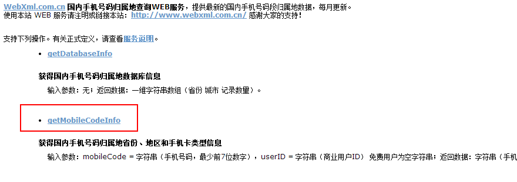

# 目录

- _`Chpt 一、带你走进webservice的世界`_
    - 1.什么是webservice
    - 2.重温socket
    - 3.调用已发布的WebService
    
- _`Chpt 二、自定义WebService服务及其调用`_
    - 1.自定义webservice
    - 2.调用自定义的webservice

- _`Chpt 三、wsdl配置详解以及使用注解修改wsdl配置`_
    - 1.wsdl配置详解
    - 2.使用注解修改wsdl配置

- _`Chpt 四、CXF处理JavaBean等复合类型以及Map等复杂类型的数据`_
    - 1.CXF处理Java Bean等复合类型的数据
    - 2.CXF处理Map等复杂类型的数据
    
- _`Chpt 五、CXF拦截器的设置以及自定义CXF拦截器`_
    - 1.CXF内置的拦截器设置
    - 


# _`Chpt 一、带你走进webservice的世界`_

## 1. 什么是webservice

准确的来说，webservice不是一种技术，而是一种规范。是一种跨平台，跨语言的规范，用于不同平台，不同语言开发的应用之间的交互。

举个例子，比如在Windows Server服务器上有个C#.Net开发的应用A，在Linux上有个Java语言开发的应用B，
现在B应用要调用A应用，或者是互相调用，用于查看对方的业务数据，就需要webservice的规范。

再举个例子，天气预报接口。无数的应用需要获取天气预报信息，这些应用可能是各种平台，各种技术实现，
而气象局的项目，估计也就一两种，要对外提供天气预报信息，这个时候，如何解决呢？
webservice就是出于以上类似需求而定义出来的规范。

我们一般就是在具体平台开发webservice接口，以及调用webservice接口，每种开发语言都有自己的webservice实现框架。
比如Java 就有 Apache Axis1、Apache Axis2、Codehaus XFire、Apache CXF、Apache Wink、Jboss RESTEasyd等等。
其中Apache CXF用的比较多，它也可以和Spring整合。

## 2. 重温socket
在分析如何调用webservice前，先来回忆一下传统的socket是如何通信的，这样更容易理解ws。

### 2.1 基于socket创建web服务
为什么要使用socket呢？看一下下面的原理图： 


从图中可以看出，程序A和程序B之间是无法实现直接调用的，那么现在A需要访问B的话，A即创建一个socket并指定B机器的端口号，
在此之前B已经在本机创建好了socket等待用户来连接，A和B连接成功后，即可向B发送请求获取数据了。
这很好理解，为了回忆一下socket的创建和使用，下面先写一个简单的socket通信的demo，服务端可以将小写字母转大写。

### 2.2 经典的socket服务

客户端：

```java
/**
 * @Description Socket Client，用来发送请求给服务端
 */
public class SocketClient {

    public static void main(String[] args) throws Exception {
        Scanner input = new Scanner(System.in);
        // 1、创建一个基于TCP协议的socket服务,在建立对象时,指定要连接服务器的ip和端口号
        Socket sc = new Socket("127.0.0.1", 9999);
        // 2、通过建立的Socket对象获取Socket中的输出流,调用getOutStream方法
        OutputStream out = sc.getOutputStream();

        System.out.println("请输入要转化的字母：");
        String initData = input.next();//获取控制台的输入

        // 3、写入到Socket输出流中
        out.write(initData.getBytes());
        System.out.println("等待服务器端返回数据");

        // 4、通过建立的Socket对象获取Socket中的输入流,输入流会接受来自服务器端数据
        InputStream in = sc.getInputStream();
        byte[] b = new byte[1024];

        // 5、获取输入字节流的数据,注意此方法是堵塞的,如果没有获取数据会一直等待
        int len = in.read(b);
        System.out.println("返回的结果为：" + new String(b, 0, len));

        // 关闭Socket
        out.close();
        in.close();
        sc.close();
        input.close();
    }
}
```

服务端：

```java
/**
 * @Description Socket Server，用来接收客户端请求，实现转大写功能
 *
 */
public class SocketServer {

    public static void main(String[] args) throws Exception {

        // 1、建立服务器端的TCP socket服务,必须监听一个端口
        ServerSocket ss = new ServerSocket(9999);
        while(true) {
            System.out.println("等待客户端请求……");

            // 2、通过服务器端的socket对象的accept方法获取连接上的客户端对象，没有则堵塞,等待
            Socket socket = ss.accept();
            System.out.println("握手成功……");

            // 3、通过输入流获取数据
            InputStream input = socket.getInputStream();
            byte[] b = new byte[1024];
            int len = input.read(b);
            String data = new String(b, 0, len);
            System.out.println("客户端数据为：" + data);

            // 4、通过服务器端Socket输出流,写数据,会传送到客户端Socket输入流中
            OutputStream out = socket.getOutputStream();
            out.write(data.toUpperCase().getBytes());

            // 5: 关闭socket
            out.close();
            input.close();
            socket.close();

        }
    }
}
```

这个Demo很简单，先开启服务端的程序，在那等待，然后开启客户端程序，如果在控制台输入`hello`过去，就会从服务端返回一个`HELLO`回来，这说明socket通信是成功的。

### 2.3 web程序访问socket service

上面经典的demo是在本地写的两个java程序，我们现在的很多项目都是web项目，也就是通过浏览器来交互的，
我们来看下通过浏览器的方式如何来访问socket Service服务。

服务端还是使用上面的那个java程序，客户端我改成浏览器请求，新写一个jsp如下：

```html
<%@ page language="java" import="java.util.*" pageEncoding="UTF-8"%>

<!DOCTYPE HTML PUBLIC "-//W3C//DTD HTML 4.01 Transitional//EN">
<html>
  <head>   
  </head> 
  <body>
    <form action="http://127.0.0.1:9999" method="post">
        <input type="text" name="sname">
        <input type="submit" value="提交">
    </form>
  </body>
</html>
```

注意看`action`的请求地址，包括端口要和服务端的一样，这样当我们提交的时候就可以访问上面的服务端程序了。

看一下服务端的运行结果： 


可以看到，web程序确实和服务端握手成功了，而且数据也是可以传过去的，`sname=hello`，包括一些Http信息都可以传过去，但是我们再来看看服务端返回给浏览器的数据是啥： 


我用的是chrome浏览器，其他浏览器可能还没有数据，这都有可能。

但是从数据中来看，它只是单纯的把所有信息全部转成了大写……而且它也没有Http的返回格式，也就是说，我所需要的就是个大写的HELLO即可，所以这是有问题的。

所以可以总结一下：不同的协议其实也是支持Socket通信的。

web程序可以调用socket请求，但是由于协议不同，因此在处理的时候要过滤http的协议格式，返回的时候还需要添加http返回的格式，否则就会出现问题，可想而知，如果还要处理协议格式，是很麻烦的。

所以到这里，基本上就理解了为什么传统的socket无法满足需求了，其实除了上面的弊端外，还有其他的弊端，比如如果参数一多，就不好维护等等，这里就不多举例了。

## 3. 调用已发布的WebService

关于webservice本身，我就不做过多的描述了，在最上面也有简单介绍，既然传统的socket通信无法满足，那么下面开始来调用已发布的ws，真正走进ws的世界。

有一个站点：<http://www.webxml.com.cn>，是上海的一家公司做的，上面提供了很多ws服务，其中有一个查询号码归属地的功能，我们用它来做测试。

先来在它们的站点中测试一下，然后再在本地写程序来调用这个ws服务获取查询结果。

看一下站点上的查询：


进入手机号码归属地查询web服务后， 



选择getMobileCodeInfo，即可进入查询页面了， 


调用后就会出现`<string xmlns="http://WebXml.com.cn/">18312345678：广东 深圳 广东移动全球通卡</string>`的结果。

这就是调用ws的结果，接下来我们在程序中来调用这个ws。

### 3.1 get请求方式
在Java程序中如果要发送http请求，需要使用HttpClient工具。

HttpClient 是 Apache Jakarta Common 下的子项目，可以用来提供高效的、最新的、功能丰富的支持 HTTP 协议的客户端编程工具包，并且它支持 HTTP 协议最新的版本和建议。

为什么要使用HttpClient工具呢？因为原生态的Socket基于传输层，现在我们要访问的WebService是基于HTTP的属于应用层，所以我们的Socket通信要借助HttpClient发HTTP请求，这样格式才能匹配。

```java
/**
 * @Description get方式请求
 */
public void get(String number) throws Exception {
    // HttpClient：在java代码中模拟Http请求
    // 创建HttpClient对象
    HttpClient client = new HttpClient();
    // 填写数据，发送get请求
    GetMethod get = new GetMethod("http://ws.webxml.com.cn/WebServices/MobileCodeWS.asmx"
            + "/getMobileCodeInfo?mobileCode=" + number + "&userID=");
    // 指定传输的格式
    get.setRequestHeader("Content-Type", "text/xml; charset=utf-8");
    // 发送请求
    int code = client.executeMethod(get);
    System.out.println("Http:状态码为：" + code);

    String result = get.getResponseBodyAsString();
    System.out.println("返回的结果为：" + result);
}
```

从程序中可以看出，请求的主机是ws.webxml.com.cn，这些url在ws提供方的网站上都有，我们只需要写对即可请求ws了，在main方法中调用一下该方法即可在控制台获取结果。

### 3.2 post请求方式
请求的过程都一样，只是url和传输格式不同而已，修改一下相应的地方即可，

```java
/**
 * @Description post方式请求
 */
public void post(String number) throws Exception {
    // HttpClient：在java代码中模拟Http请求
    // 创建HttpClient对象
    HttpClient client = new HttpClient();
    // 填写数据，发送post请求
    PostMethod post = new PostMethod("http://ws.webxml.com.cn/WebServices/MobileCodeWS.asmx/getMobileCodeInfo");

    // 指定传输的格式
    post.setRequestHeader("Content-Type", "application/x-www-form-urlencoded");     
    // 传输参数
    post.setParameter("mobileCode", number);
    post.setParameter("userID", "");

    // 发送请求
    int code = client.executeMethod(post);
    System.out.println("Http:状态码为：" + code);

    String result = post.getResponseBodyAsString();
    System.out.println("返回的结果为：" + result);
}
```

### 3.3 SOAP方式请求

这也是在用的多的方式，它有两个版本soap1.1和soap1.2，jdk1.7及以上才可以使用soap1.2。

```java
/**
 * @Description soap post方式请求，但是传输的数据为xml格式，有利于数据的维护
 */
public void soap(String number) throws Exception {
    // HttpClient：在java代码中模拟Http请求
    // 创建HttpClient对象
    HttpClient client = new HttpClient();
    // 填写数据，发送post请求
    PostMethod post = new PostMethod("http://ws.webxml.com.cn/WebServices/MobileCodeWS.asmx");

    // 指定传输的格式
    post.setRequestHeader("Content-Type", "application/soap+xml;charset=utf-8");
    // 传输xml，加载soap.txt
    post.setRequestBody(new FileInputStream("soap.txt"));  
    // 发送请求
    int code = client.executeMethod(post);
    System.out.println("Http:状态码为：" + code);

    String result = post.getResponseBodyAsString();
    // 如果采用的是soap，则返回的数据也是基于xml的soap格式
    System.out.println("返回的结果为：" + result);
}
```

由于soap方式需要向服务端发送xml，所以我们可以实现写好一个txt文档，里面是xml的数据，这个模板ws提供方会提供，我们需要写好即可：

```xml
<?xml version="1.0" encoding="utf-8"?>
<soap12:Envelope xmlns:xsi="http://www.w3.org/2001/XMLSchema-instance" xmlns:xsd="http://www.w3.org/2001/XMLSchema" xmlns:soap12="http://www.w3.org/2003/05/soap-envelope">
  <soap12:Body>
    <getMobileCodeInfo xmlns="http://WebXml.com.cn/">
      <mobileCode>18312345678</mobileCode>
      <userID></userID>
    </getMobileCodeInfo>
  </soap12:Body>
</soap12:Envelope>
```

上面这些方式推荐使用soap的方式，不过本质上还是http方式调用，只是调用的时候可以传输xml数据而已。
而且HttpClient是Java的调用http协议的解决方案，但是不能保证其它语言也拥有类似的工具。
所以ws推荐的方案是使用`wsimport`命令。这也是下面分析的重点。

### 3.4 使用wsimport
每个ws都会有一个WSDL，WSDL即WebService Description Language – Web服务描述语言。

它是通过XML形式说明服务在什么地方 － 地址。通过XML形式说明服务提供什么样的方法 – 如何调用。

我们可以通过这个WSDL来获取和这个ws有关的信息，包括class和java代码。

关于这个WSDL后面我再具体分析，这一节先来看一下如何使用。

`wsimport`是一个命令，jdk1.6及以上才可以使用，ws针对不同的语言都会有个`wsimport`命令，我们可以在自己安装的jdk的bin目录下找到这个wsimport.exe，正因为有了这个，所以我们可以在命令行中使用wsimport命令。

怎么使用呢？

每个ws都会有一个WSDL，就拿上面的归属地查询服务来说，上面第二张图上面有个服务说明，点开就可以看到WSDL，当然也可以直接访问浏览器上的url来访问这个WSDL，即xml文档。如下： 


只需要复制一下那个url即可，然后打开命令提示符窗口，随便进入一个目录下（该目录要保存等会生成的和ws相关的文件，自己事先建一个即可），运行 

```
wsimport http://ws.webxml.com.cn/WebServices/MobileCodeWS.asmx?WSDL
```

就会生成相应的java bean，当然了，是.class文件，但是我们不想要class文件，我们想要java文件，所以可以使用如下命令： 

```
wsimport -s . http://ws.webxml.com.cn/WebServices/MobileCodeWS.asmx?WSDL
```

这样不仅生成了class文件，还生成了java文件，如果我们想要在固定的包下生成这些文件，等会方便直接拷贝到项目里，可以使用下面的命令： 

```
wsimport -s . -p ws.client.c http://ws.webxml.com.cn/WebServices/MobileCodeWS.asmx?WSDL
```

这样就会在目录`ws/client/c/`下生成所需要的class和java代码，然后我们删掉class文件，直接拷贝ws目录到工程中即可，如下(_Main是我自己写的，用来调用使用的)： 


这样就有了号码归属地查询这个ws服务相关的API了，这是通过官方的WSDL来生成的，然后我们如何在自己的项目中使用呢？

我新写一个_Main.java文件，直接使用这些API即可，如下：

```
public class _Main {
    public static void main(String[] args) {

        // 获取一个ws服务
        MobileCodeWS ws = new MobileCodeWS();
        // 获取具体的服务类型：get post soap1.1 soap1.2
        MobileCodeWSSoap wsSoap = ws.getMobileCodeWSSoap();
        String address = wsSoap.getMobileCodeInfo("18312345678", null);
        System.out.println("手机归属地信息为：" + address);
    }
}
```

这样就很方便了，现在已经完全没有了上面那种连接啊，设置地址啊等等，直接封装好了，我直接调用这些API即可调用远程的webservice。

这也是官方推荐的一种方法，当然我们也可以将生成的class文件打包成jar放到工程中。

运行一下这个main方法后，也直接返回归属地，没有那些标签的东西了，这才是开发中所需要的东西。

到这里基本已经会调用webservice了，最后再简单总结一下，ws中这个WSDL很重要，这里面用xml描述了该ws的信息，所以我们可以通过解析WSDL来获取该ws相关的API，然后在自己的项目中调用这些API即可调用该ws。 

# _`Chpt 二、自定义WebService服务及其调用`_

其实在实际中，我们自定义ws的可能性比较小，一般都是去调用已有的ws较多，除非项目需要发布一个ws。但是为了更好的理解ws，
这一篇博文主要来总结一下如何自定义ws，然后如何去调用自定义的ws，内容比较基础，完全针对小白。

## 1. 自定义webservice
### 1.1 原生态jdk定义

使用jdk自定义一个ws只需要做两件事：

一、使用注解`@WebService`；

二、调用`Endpoint`类的静态方法`publish`创建一个服务端点即可；

如下：

```java
package com.github.ittalks.commons.example.ws.jax.demo1;

import javax.jws.WebService;
import javax.xml.ws.Endpoint;

/**
 * Created by 刘春龙 on 2017/10/30.
 * <p>
 * 默认静态方法是不能发不成ws服务的
 * <p>
 * 如果指定{@link #hello(String)} 为static，则报如下错误：<br/>
 * com.sun.xml.internal.ws.model.RuntimeModelerException: 由类com.github.ittalks.fn.common.ws.jx.Demo1定义的 Web 服务不包含任何有效的 WebMethods
 *
 * @Description 自定义ws，jdk1.7版本及以上才支持soap1.2
 */
@WebService
public class _Main {

    //提供一个方法，供下面测试用的
    public String hello(String name) {
        return name + " hello！";
    }

    public static void main(String[] args) {
        // 一个端口可以发布多个ws服务，所以后面还有 /+服务名
        String address = "http://127.0.0.1:6666/ws";
        String address2 = "http://127.0.0.1:6666/ws2";
        // 创建一个服务端点
        Endpoint.publish(address, new _Main());
        Endpoint.publish(address2, new _Main());
        System.out.println("访问WSDL的地址为：" + address + "?WSDL");
        System.out.println("访问WSDL的地址为：" + address2 + "?WSDL");
    }
}

```

这个`127.0.0.1`是我的ip地址，6666是自己设定的端口号，后面为啥还要跟个名称ws呢？
因为一个端口可以发布多个ws服务，所以可以自己起个名儿，我这里创建了两个ws服务地址，分别命名为ws和ws2。
然后通过调用`Endpoint`类的静态方法`publish`创建服务端点，传进去刚刚定义好的ws服务地址和自定义ws的类即可。
后面两个输出地址是用来根据WSDL生成Java代码方便用的。

这样的话，一个ws就定义好了，运行一下，控制台会输出两个地址，分别在浏览器中输入这两个地址就会显示两个相同的xml文档，我们待会儿根据这个WSDL来生成java代码。

### 1.2 使用CXF自定义ws

CXF是ws的一个框架，使用很方便，想要更多的了解CXF可以去百度或者谷歌一下。

为了更加规范点，我将需要发布为ws的类单独写出来，并抽取接口，如下：

```java
public interface HelloWorld {

    String sayHello(String str);
}

@WebService
public static class HelloWorldImpl implements HelloWorld {

    public String sayHello(String str) {
        return "hello，" + str;
    }
}
```

这里建立的是maven工程，pom.xml需要导入相关的jar包，我导入的是目前最新版的3.2.0。如下：

```xml
<!-- cxf-webservice start -->
<!-- CXF -->
<dependency>
    <groupId>org.apache.cxf</groupId>
    <artifactId>cxf-core</artifactId>
    <version>${cxf.version}</version>
</dependency>
<dependency>
    <groupId>org.apache.cxf</groupId>
    <artifactId>cxf-rt-frontend-jaxws</artifactId>
    <version>${cxf.version}</version>
</dependency>
<dependency>
    <groupId>org.apache.cxf</groupId>
    <artifactId>cxf-rt-transports-http</artifactId>
    <version>${cxf.version}</version>
</dependency>
<dependency>
    <groupId>org.apache.cxf</groupId>
    <artifactId>cxf-rt-transports-http-jetty</artifactId>
    <version>${cxf.version}</version>
</dependency>
<dependency>
    <groupId>org.apache.cxf</groupId>
    <artifactId>cxf-rt-frontend-jaxrs</artifactId>
    <version>${cxf.version}</version>
</dependency>
<dependency>
    <groupId>org.apache.cxf</groupId>
    <artifactId>cxf-rt-rs-client</artifactId>
    <version>${cxf.version}</version>
</dependency>
<dependency>
    <groupId>org.apache.cxf</groupId>
    <artifactId>cxf-rt-rs-extension-providers</artifactId>
    <version>${cxf.version}</version>
</dependency>
<!-- 添加wadl描述 -->
<dependency>
    <groupId>org.apache.cxf</groupId>
    <artifactId>cxf-rt-rs-service-description</artifactId>
    <version>${cxf.version}</version>
</dependency>
<!-- cxf-webservice end -->
```

接下来就是创建ws了，如下：

```java
package com.github.ittalks.commons.example.ws.cxf.demo1.client;

import org.apache.cxf.jaxws.JaxWsServerFactoryBean;

import java.util.logging.Logger;

/**
 * Created by 刘春龙 on 2017/10/30.
 */
public class _Main {

    private static final Logger logger = Logger.getLogger(_Main.class.getName());

    public static void main(String[] args) {
        logger.info("web service start");

        HelloWorld helloWorld = new HelloWorldImpl();
        String address = "http://127.0.0.1:9999/ws";

        JaxWsServerFactoryBean factoryBean = new JaxWsServerFactoryBean();
        // 设置地址
        factoryBean.setAddress(address);
        /**
         * 指定实现该服务的类。
         *
         * @param serviceClass 服务实现类
         */
        // 方式一
        factoryBean.setServiceClass(HelloWorldImpl.class);
        /**
         * 设置实现服务的bean。
         * 如果设置了，则会为所提供的bean创建BeanInvoker
         *
         * @param serviceBean 一个实例化的实现对象
         */
        // 方式二
//        factoryBean.setServiceBean(helloWorld);

        factoryBean.create(); // 创建webservice接口
        logger.info("web service started");
        logger.info("请求地址为为：" + address + "?WSDL");
    }
}
```

这样就使用CXF创建好了ws了，下面就是调用这个ws服务了，下面的调用我用的是上面原生态jdk生成的ws服务，其实都一样的。

## 2. 调用自定义的webservice
### 2.1 使用普通java程序调用

刚刚已经生成了对应的WSDL了，在调用自定义的ws前，我们需要先通过解析这个WSDL，然后生成一些Java代码，可以看成是我们自定义ws的API。打开命令行，输入 
```
wsimport -encoding utf-8 -keep -s . -p com.github.ittalks.commons.example.ws.cxf.demo1.server http://127.0.0.1:9999/ws?WSDL
```

就能生成一个目录，以及目录中的一些class文件和java文件，删掉class文件，然后拷贝ws目录，直接贴到工程另一个工程中，如下： 


里面框框圈的都是自定义ws相关的API，然后自己写一个_Main类来调用自定义ws，如下：

```java
package com.github.ittalks.commons.example.ws.cxf.demo1.server;

/**
 * Created by 刘春龙 on 2017/10/30.
 */
public class _Main {

    public static void main(String[] args) {
        // 获取ws服务名称（获取一个ws服务）
        HelloWorldImplService service = new HelloWorldImplService();

        //获取服务的类型，有get post soap1.1 soap1.2 jdk1.7及以上才支持soap1.2
        HelloWorldImpl port = service.getHelloWorldImplPort();

        //调用服务提供的方法
        System.out.println(port.sayHello("hello"));
    }
}
```

根据上面的代码，即传入一个hello去调用自定义ws中的sayHello方法，所以控制台会打印出"hello，hello"。这样自定义ws以及调用就完成了。

### 2.2 使用Ajax调用
使用Ajax调用的话，流程也很简单，从前台发送Ajax请求，然后调用ws服务，再将结果返回给前台。
但是Ajax不支持跨域调用，也就是说我们发布的ws服务，如http://192.168.1.105:6666/ws是不行的，
Ajax要想正常调用必须通过wsimport命令转化的java bean，换句话说，我们需要在中间加上一个servlet（或者struts，springmvc），在servlet中调用ws服务，把数据返回到前台。

写个demo如下： 

**servlet：**

```java
public class _MyServlet extends HttpServlet {


    public void doGet(HttpServletRequest request, HttpServletResponse response)
            throws ServletException, IOException {

        response.setCharacterEncoding("UTF-8");
        request.setCharacterEncoding("UTF-8");
        String name = request.getParameter("name");
        
        // 获取ws服务名称（获取一个ws服务）
        HelloWorldImplService service = new HelloWorldImplService();
        //获取服务的类型，有get post soap1.1 soap1.2 jdk1.7及以上才支持soap1.2
        HelloWorldImpl port = service.getHelloWorldImplPort();
        //调用服务提供的方法
        String result = port.sayHello("hello");

        // 返回结果
        response.getWriter().write(result);
    }

    public void doPost(HttpServletRequest request, HttpServletResponse response)
            throws ServletException, IOException {

        doGet(request, response);
    }

}
```

这个servlet映射的url为/MyServlet。 

**jsp：**

```jsp
<%@ page language="java" import="java.util.*" pageEncoding="UTF-8"%>

<!DOCTYPE HTML PUBLIC "-//W3C//DTD HTML 4.01 Transitional//EN">
<html>
  <head>  
  <script type="text/javascript" src="jquery-1.3.js"></script> 
  </head> 
  <script type="text/javascript">
    $(function() {
        $("#btn").click(function() {
            $.post("MyServlet", {name:$("#txt").val()}, function(msg) {
                alert(msg);
            }, "text");
        });
    })
  </script>


  <body>
    <input type="text" id="txt" />
    <input type="button" id="btn" value="ajax调用ws服务演示">
  </body>
</html>
```

jsp中通过发送Ajax请求，将输入的值带给servlet，然后在servlet中获取该值，调用ws获取结果返回给前台显示，完成Ajax调用。

# _`Chpt 三、wsdl配置详解以及使用注解修改wsdl配置`_

前面分析了一下关于ws的基本知识，我们知道，wsdl是ws中很重要的文档，我们可以通过解析该wsdl文档获取ws的相关信息，
其实，如果不了解该文档结构的话，问题也不大，只要会解析即可进行开发。
但是如果想要生成一个符合自己项目的，或者比较人性化的一个wsdl的话，或者从可读性角度来说，就需要在编写ws代码时进行一些相应的配置了，比如说ws名称，参数等等，那么就需要对wsdl文档有一定的了解。

这篇文章主要从两个角度来展开：一是解释一下wsdl中的相关配置，二是如何在ws程序中通过注解指定这些配置。

## 1. wsdl配置详解
要生成wsdl，首先得有一个ws，我们还是使用前面文章中提到的那个简单的ws，如下：

```java
package com.github.ittalks.commons.example.ws.jax.demo1;

import javax.jws.WebService;
import javax.xml.ws.Endpoint;

/**
 * Created by 刘春龙 on 2017/10/30.
 * <p>
 * 默认静态方法是不能发不成ws服务的
 * <p>
 * 如果指定{@link #hello(String)} 为static，则报如下错误：<br/>
 * com.sun.xml.internal.ws.model.RuntimeModelerException: 由类com.github.ittalks.fn.common.ws.jx.Demo1定义的 Web 服务不包含任何有效的 WebMethods
 *
 * @Description 自定义ws，jdk1.7版本及以上才支持soap1.2
 */
@WebService
public class _Main {

    //提供一个方法，供下面测试用的
    public String hello(String name) {
        return name + " hello！";
    }

    public static void main(String[] args) {
        // 一个端口可以发布多个ws服务，所以后面还有 /+服务名
        String address = "http://127.0.0.1:6666/ws";
        // 创建一个服务端点
        Endpoint.publish(address, new _Main());
        System.out.println("访问WSDL的地址为：" + address + "?WSDL");
    }
}
```

运行一下，即可开启ws服务，请求**http://127.0.0.1:6666/ws?WSDL**即可看到wsdl页面，接下来分析一下该wsdl文件中与上面程序中的对应关系： 

```xml
<?xml version="1.0" encoding="UTF-8"?>
<wsdl:definitions targetNamespace="http://demo1.jax.ws.example.commons.ittalks.github.com/" name="_MainService" xmlns:ns1="http://schemas.xmlsoap.org/soap/http" xmlns:soap="http://schemas.xmlsoap.org/wsdl/soap/" xmlns:tns="http://demo1.jax.ws.example.commons.ittalks.github.com/" xmlns:wsdl="http://schemas.xmlsoap.org/wsdl/" xmlns:xsd="http://www.w3.org/2001/XMLSchema">
    <wsdl:types>
        <xs:schema targetNamespace="http://demo1.jax.ws.example.commons.ittalks.github.com/" xmlns:tns="http://demo1.jax.ws.example.commons.ittalks.github.com/" version="1.0" elementFormDefault="unqualified" xmlns:xs="http://www.w3.org/2001/XMLSchema">
            <xs:element name="hello" type="tns:hello"/>
            <xs:element name="helloResponse" type="tns:helloResponse"/>
            <xs:complexType name="hello">
                <xs:sequence>
                    <xs:element name="arg0" type="xs:string" minOccurs="0"/>
                </xs:sequence>
            </xs:complexType>
            <xs:complexType name="helloResponse">
                <xs:sequence>
                    <xs:element name="return" type="xs:string" minOccurs="0"/>
                </xs:sequence>
            </xs:complexType>
        </xs:schema>
    </wsdl:types>
    <wsdl:message name="hello">
        <wsdl:part name="parameters" element="tns:hello"> </wsdl:part>
    </wsdl:message>
    <wsdl:message name="helloResponse">
        <wsdl:part name="parameters" element="tns:helloResponse"> </wsdl:part>
    </wsdl:message>
    <wsdl:portType name="_Main">
        <wsdl:operation name="hello">
            <wsdl:input name="hello" message="tns:hello"> </wsdl:input>
            <wsdl:output name="helloResponse" message="tns:helloResponse"> </wsdl:output>
        </wsdl:operation>
    </wsdl:portType>
    <wsdl:binding name="_MainServiceSoapBinding" type="tns:_Main">
        <soap:binding transport="http://schemas.xmlsoap.org/soap/http" style="document"/>
        <wsdl:operation name="hello">
            <soap:operation style="document" soapAction=""/>
            <wsdl:input name="hello">
                <soap:body use="literal"/>
            </wsdl:input>
            <wsdl:output name="helloResponse">
                <soap:body use="literal"/>
            </wsdl:output>
        </wsdl:operation>
    </wsdl:binding>
    <wsdl:service name="_MainService">
        <wsdl:port name="_MainPort" binding="tns:_MainServiceSoapBinding">
            <soap:address location="http://127.0.0.1:6666/ws"/>
        </wsdl:port>
    </wsdl:service>
</wsdl:definitions>
```

我们可以看到：

```xml
<wsdl:service name="Demo1Service">
    <wsdl:port name="Demo1Port" binding="tns:Demo1ServiceSoapBinding">
        <soap:address location="http://127.0.0.1:6666/ws"/>
    </wsdl:port>
</wsdl:service>
```

生成的ws服务名称是在原来的类后面有加了个Service而已，服务类型名是在原来的类后面加了个Port，还包括参数默认为arg0，返回值为return 等等。
这些都能从wsdl文件中看的出来，通过这个wsdl生成的Java代码中的类名自然也就是默认的了，如果我们想要修改这些默认的配置，则需要在编写ws的时候通过注解来设置一下。

## 2. 使用注解修改wsdl配置

我们修改一下上面的ws，使用注解来配置我们自己需要的名称，如下

```java
package com.github.ittalks.commons.example.ws.jax.demo2;

import javax.jws.WebMethod;
import javax.jws.WebParam;
import javax.jws.WebResult;
import javax.jws.WebService;
import javax.xml.ws.Endpoint;

/**
 * Created by 刘春龙 on 2017/10/30.
 * <p>
 * 发布ws服务只需要@WebService注解即可, 如果想要更好的可维护性,则可以通过注解来实现
 *
 * @Description 自定义ws服务, jdk1.6版本仅仅支持 soap1.1格式,jdk1.7及以上版本支持 soap1.2格式
 */
@WebService // 默认静态的方式是不能发布ws服务的
        (
                name = "MyWebService",// 服务实现的名称
                serviceName = "MyWebServiceService",// 服务的名称，默认在发布的服务实现的名称后面添加Service
                portName = "MyWebServicePort",// 服务类型的名称，默认在发布的服务实现的名称后面添加Port
                targetNamespace = "ws.app.client"// 发布ws服务的命名空间，此空间默认为当前服务包路径的"倒写"，此名称也是 wsimport 命令生成java类时默认的包路径 -p
        )
public class _Main {

    @WebMethod(exclude = true)  // 默认public方法可以发布为ws服务, 如果要排除则配置  exclude=true
    public String hello(String name) {
        return name + " hello！";
    }

    // 可以指定wsdl中的方法名，参数名和返回值
    @WebMethod(operationName = "sayHello")
    public
    @WebResult(name = "result")
    String hello2(@WebParam(name = "name") String name, @WebParam(name = "age") int age) {
        return name + ",你好!年龄为:" + age;
    }

    public static void main(String[] args) {
        String address = "http://127.0.0.1:6666/ws";
        Endpoint.publish(address, new _Main());
        System.out.println("访问WSDL的地址为：" + address + "?WSDL");
    }
}
```

通过上面这些注解，我将ws服务相关的信息给重新配置了，运行一下，来对比注解看一下生成的wsdl： 

```xml
<?xml version="1.0" encoding="UTF-8"?>
<wsdl:definitions targetNamespace="ws.app.client" name="MyWebServiceService" xmlns:ns1="http://schemas.xmlsoap.org/soap/http" xmlns:soap="http://schemas.xmlsoap.org/wsdl/soap/" xmlns:tns="ws.app.client" xmlns:wsdl="http://schemas.xmlsoap.org/wsdl/" xmlns:xsd="http://www.w3.org/2001/XMLSchema">
    <wsdl:types>
        <xs:schema targetNamespace="ws.app.client" xmlns:tns="ws.app.client" version="1.0" elementFormDefault="unqualified" xmlns:xs="http://www.w3.org/2001/XMLSchema">
            <xs:element name="sayHello" type="tns:sayHello"/>
            <xs:element name="sayHelloResponse" type="tns:sayHelloResponse"/>
            <xs:complexType name="sayHello">
                <xs:sequence>
                    <xs:element name="name" type="xs:string" minOccurs="0"/>
                    <xs:element name="age" type="xs:int"/>
                </xs:sequence>
            </xs:complexType>
            <xs:complexType name="sayHelloResponse">
                <xs:sequence>
                    <xs:element name="result" type="xs:string" minOccurs="0"/>
                </xs:sequence>
            </xs:complexType>
        </xs:schema>
    </wsdl:types>
    <wsdl:message name="sayHelloResponse">
        <wsdl:part name="parameters" element="tns:sayHelloResponse"> </wsdl:part>
    </wsdl:message>
    <wsdl:message name="sayHello">
        <wsdl:part name="parameters" element="tns:sayHello"> </wsdl:part>
    </wsdl:message>
    <wsdl:portType name="MyWebService">
        <wsdl:operation name="sayHello">
            <wsdl:input name="sayHello" message="tns:sayHello"> </wsdl:input>
            <wsdl:output name="sayHelloResponse" message="tns:sayHelloResponse"> </wsdl:output>
        </wsdl:operation>
    </wsdl:portType>
    <wsdl:binding name="MyWebServiceServiceSoapBinding" type="tns:MyWebService">
        <soap:binding transport="http://schemas.xmlsoap.org/soap/http" style="document"/>
        <wsdl:operation name="sayHello">
            <soap:operation style="document" soapAction=""/>
            <wsdl:input name="sayHello">
                <soap:body use="literal"/>
            </wsdl:input>
            <wsdl:output name="sayHelloResponse">
                <soap:body use="literal"/>
            </wsdl:output>
        </wsdl:operation>
    </wsdl:binding>
    <wsdl:service name="MyWebServiceService">
        <wsdl:port name="MyWebServicePort" binding="tns:MyWebServiceServiceSoapBinding">
            <soap:address location="http://127.0.0.1:6666/ws"/>
        </wsdl:port>
    </wsdl:service>
</wsdl:definitions>
```

可以看出，生成的wsdl中的配置完全按照我们自己指定的来，这样通过解析该wsdl文件得到的java代码中的类以及方法也是按照自定义的来，这就能满足实际中具体的要求了。

# _`Chpt 四、CXF处理JavaBean等复合类型以及Map等复杂类型的数据`_

在实际中除了传入一些基本的参数以外，还需要传入一些类似于Java Bean等复合类型，或者Map等复杂类型的数据。

这一篇博文主要来写两个demo，模拟一下CXF处理这类数据的过程。

## 1. CXF处理Java Bean等复合类型的数据
客户端提交一个数据过去，要检查权限，比如是管理员的话，就拥有多个权限，普通用户可能就一个权限之类的。
这样的话需要一个用户的bean和权限的bean，然后数据库的数据我用List来模拟一下，demo如下：

```
public class User {

    private Integer id;
    private String name;
    private String password;
    //……
}

public class Role {

    private Integer id;
    private String roleName; //角色名称
    //……
}
```

ws的程序如下：

```java
public interface MyWebService {
    List<Role> getRoleByUser(User user);
}

@WebService
public class MyWebServiceImpl implements MyWebService {

    @Override
    public List<Role> getRoleByUser(User user) {
        List<Role> roleList = new ArrayList<Role>();
        if (user != null) {
            if (user.getName().equals("admin") && user.getPassword().equals("123")) {
                roleList.add(new Role(1, "技术总监"));
                roleList.add(new Role(2, "架构师"));
            } else if (user.getName().equals("eson15") && user.getPassword().equals("123")) {
                roleList.add(new Role(3, "java菜鸟"));
            }
            return roleList;
        }
        return null;
    }
}
```

主要来看`getRoleByUser`这个方法，当然了，也可以使用注解去配置一下要生成的wsdl，这里就不配置了，使用默认的即可，
方法中自定义了一个List用来存储角色信息的，模拟的是先判断用户的身份，然后根据不同的身份赋予不同的角色。

生成wsdl后，通过解析，然后调用该ws的代码如下：

```java
public class _Main {

    public static void main(String[] args) {
        MyWebServiceService service = new MyWebServiceService();
        MyWebService port = service.getMyWebServicePort();

        User user = new User();
        user.setName("admin");
        user.setPassword("123");
        List<Role> roleList = port.getRoleByUser(user);

        for(Role role : roleList) {
            System.out.println(role.getId() + "," + role.getRoleName());
        }
    }

}
```

这里为了模拟，直接new一个admin用户，然后调用ws的getRoleByUser方法获取该用户的角色，打印到控制台，结果肯定是两个角色，如果是eson15，那就是一个Java菜鸟的角色了。

## 2. CXF处理Map等复杂类型的数据
CXF是无法直接操作Map类型的数据的，需要进行一些处理才行。我们先写一个获取所有角色信息的方法，先看一下会出啥问题。

```java
public interface MyWebService {

    Map<String, List<Role>> getRoles();
}

@WebService
public class MyWebServiceImpl implements MyWebService {

    //这个注解等会有用，先注释掉
        //@XmlJavaTypeAdapter(MapAdapter.class)
    public Map<String, List<Role>> getRoles() {
        Map<String, List<Role>> map = new HashMap<>();

        List<Role> roleList = new ArrayList<Role>();
        roleList.add(new Role(1, "技术总监"));
        roleList.add(new Role(2, "架构师"));
        map.put("admin", roleList);

        List<Role> roleList2 = new ArrayList<Role>();
        roleList2.add(new Role(1, "java菜鸟"));
        map.put("eson15", roleList2);

        return map;
    }

}
```

这里还是使用静态数据模拟一下，Map中存储了两个用户，admin用户有两个角色，eson15用户就一个角色，当这个ws发布后，客户端可以调用getRoles方法获取这些角色，但是我们会发现，这个ws是无法发布的，控制台会报错。
因为CXF要处理Map类型的数据，还需要一些转换工作。

如何转换呢？`@XmlJavaTypeAdapter(MapAdapter.class)`就派上用场了，把上面的这个注解的注释给去掉，
也就是说我们自定义一个适配器叫`MapAdapter`，来适配这个`Map`，接下来写这个`MapAdapter`：

```java
public class MapAdapter extends XmlAdapter<MyRole[], Map<String, List<Role>>> {

    /**
     * 适配转换 MyRole[]  ->  Map<String, List<Role>>
     * @param v
     * @return
     * @throws Exception
     */
    @Override
    public Map<String, List<Role>> unmarshal(MyRole[] v) throws Exception {
        Map<String, List<Role>> map = new HashMap<>();
        for(int i = 0; i < v.length; i++) {
            MyRole role = v[i];
            map.put(role.getKey(), role.getValue());
        }
        return map;
    }

    /**
     * 适配转换 Map<String, List<Role>>  ->  MyRole[]
     * @param v
     * @return
     * @throws Exception
     */
    @Override
    public MyRole[] marshal(Map<String, List<Role>> v) throws Exception {
        MyRole[] roles = new MyRole[v.size()];
        
        int i = 0;
        for(String key : v.keySet()) {
            List<Role> rolesList = v.get(key);
            roles[i] = new MyRole();
            roles[i].setKey(key);
            roles[i].setValue(rolesList);
            i++;
        }
        return roles;
    }
}
```

`MapAdapter`需要继承`XmlAdapter`，这个`XmlAdapter`的泛型里两个参数指的是从什么转到什么？
即那两个对象之间在转换，这里需要转Map对象，一般我们会用一个数组对象来和Map对象进行转换，所以我们自定义一个MyRole[]数组：

```
public class MyRole {

    private String key;
    private List<Role> value;
    //……
}
```

数组中保存了MyRole对象，而这个对象中的两个属性要符合Map的结构，所以我们就好转了。

紧接着上面的分析，MapAdapter需要实现两个方法，这两个方法刚好是两个方向的转换，方法内部的代码很好理解，
因为上面这个数组中的属性就是key和value的形式，所以这两个方法就是该数组和Map中的数据进行相互的转换而已。
这样就可以操作Map类型的数据了。接下来就可以发布该ws服务了。

然后解析完wsdl后，在客户端就可以获取所有的角色信息了。

```java
public class _Main {

    public static void main(String[] args) {
        MyWebServiceImplService service = new MyWebServiceImplService();
        MyWebServiceImpl port = service.getMyWebServiceImplPort();

        // 省去不相关代码

        List<MyRole> roles = port.getRoles().getItem();
        for(MyRole myRole : roles) {
            System.out.print("key:" + myRole.getKey() + ",");
            System.out.print("role:");
            for(Role role : myRole.getValue()) {
                System.out.print(role.getRoleName() + " ");
            }
            System.out.println();
        }
    }
}
```

看下输出的结果：

```
key:eson15,role:java菜鸟
key:admin,role:技术总监 架构师 
```

所以CXF处理像Map等复杂类型的数据的时候，还需要先进行一些转换的处理，才能正常发布ws服务，不过也不算太麻烦。

# _`Chpt 五、CXF拦截器的设置以及自定义CXF拦截器`_

