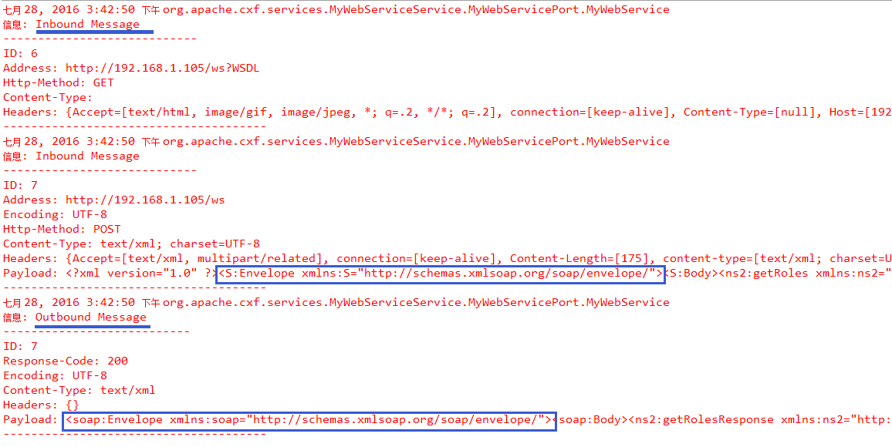
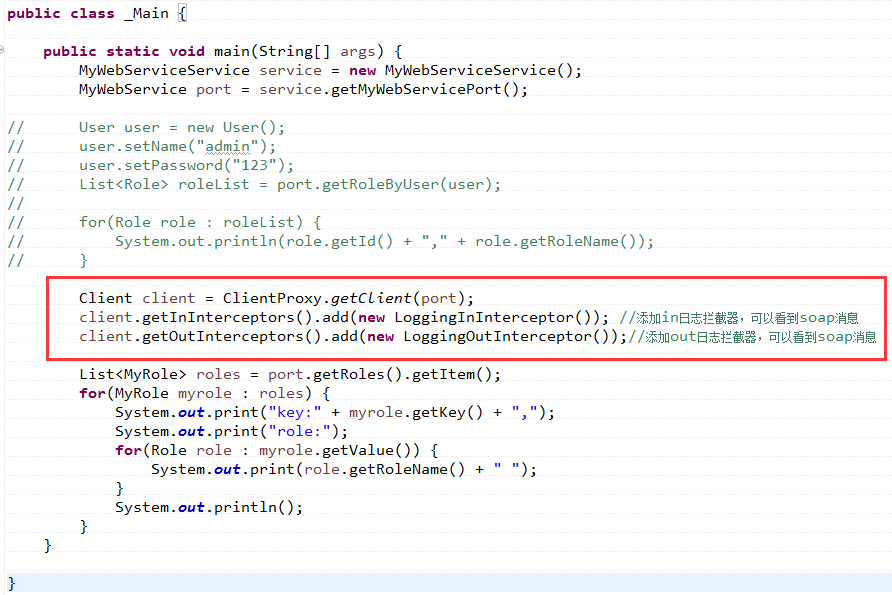
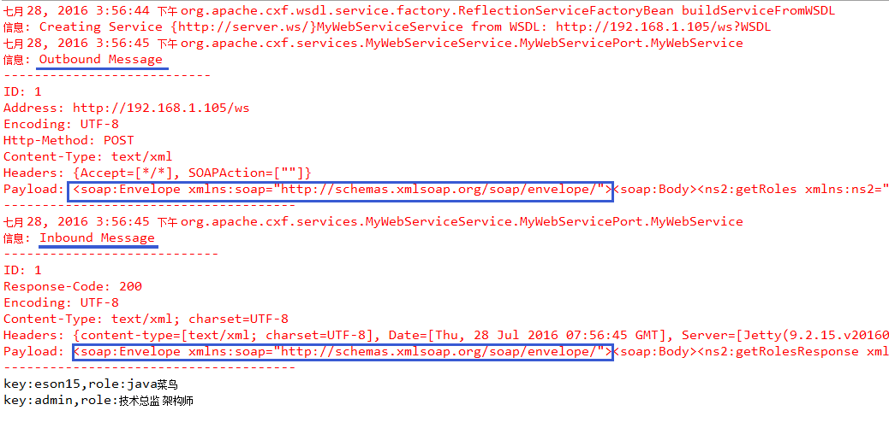

CXF的拦截器和以前学过的servlet的拦截器类似的，都是在开始或结束切入一段代码，执行一些逻辑之类的。
我们可以在调用ws服务前设置拦截器，也可以在调用ws服务后设置拦截器，当然了，拦截器也可以添加多个，CXF中有自己内置的拦截器，先来写个简单CXF自带的拦截器实例熟悉一下在CXF中如何添加，然后再来自定义CXF拦截器。

## 1. CXF内置的拦截器设置

在`example.ws.cxf.demo1`的基础上添加以下拦截器，如下： 

```java
package com.github.ittalks.commons.example.ws.cxf.demo2.client;

import org.apache.cxf.interceptor.LoggingInInterceptor;
import org.apache.cxf.interceptor.LoggingOutInterceptor;
import org.apache.cxf.jaxws.JaxWsServerFactoryBean;

import java.util.logging.Logger;

/**
 * Created by 刘春龙 on 2017/10/30.
 */
public class _Main {

    private static final Logger logger = Logger.getLogger(_Main.class.getName());

    public static void main(String[] args) {
        logger.info("web service start");

        HelloWorld helloWorld = new HelloWorldImpl();
        String address = "http://127.0.0.1:9999/ws";

        JaxWsServerFactoryBean factoryBean = new JaxWsServerFactoryBean();
        // 设置地址
        factoryBean.setAddress(address);
        /**
         * 指定实现该服务的类。
         *
         * @param serviceClass 服务实现类
         */
        // 方式一
        factoryBean.setServiceClass(HelloWorldImpl.class);
        /**
         * 设置实现服务的bean。
         * 如果设置了，则会为所提供的bean创建BeanInvoker
         *
         * @param serviceBean 一个实例化的实现对象
         */
        // 方式二
//        factoryBean.setServiceBean(helloWorld);

        // 设置拦截器
        factoryBean.getInInterceptors().add(new LoggingInInterceptor());// 添加in日志拦截器，可以看到soap消息
        factoryBean.getOutInterceptors().add(new LoggingOutInterceptor());// 添加out日志拦截器，可以看到soap消息
        
        factoryBean.create(); // 创建webservice接口
        logger.info("web service started");
        logger.info("请求地址为为：" + address + "?WSDL");
    }
}
```

启动之后，客户端访问一下，看服务端控制台的输出： 



可以看到，请求的时候会被拦截器拦截，请求结束也会被拦截，从打印的日志消息可以看出，发送的是soap消息，返回的数据由于截屏的范围我就不截取了，这是在服务端添加的拦截器。

那客户端如何添加拦截器呢？由于client端无法直接获取拦截器组，所以我们需要首先获取一个client的代理，然后通过这个代理来获取拦截器组，如下： 



客户端访问一下，看下客户端控制台的输出结果（为了清楚点，我就不缩小了）： 



可以看出，客户端如果设置拦截器的话，也会打印出日志消息，而且客户端和服务端的拦截器执行顺序刚好相反。这就是CXF内置的拦截器，下面我们来自定义CXF的拦截器。

## 2. 自定义CXF拦截器
自定义拦截器的话，我们来弄个需求，使用拦截器进行权限的认证。自定义拦截器需要继承`AbstractPhaseInterceptor<SoapMessage>`，其中SoapMessage是用来封装soap消息的，我们具体来看下如何自定义CXF拦截器，首先看服务端，在上面的代码的定义的两个内置拦截器下面添加一个自定义拦截器即可：

```
factoryBean.getInInterceptors().add(new MyInterceptor());
```

然后重点是这个MyInterceptor，如下：

```
public class MyInterceptor extends AbstractPhaseInterceptor<SoapMessage>  {

    public MyInterceptor() {
        super(Phase.PRE_INVOKE); //在调用方法之前调用自定义拦截器

    }

    public void handleMessage(SoapMessage message) throws Fault {
        List<Header> headers = message.getHeaders(); //根据soap消息获取头部
        if(headers == null || headers.size() == 0) {
            throw new Fault(new IllegalArgumentException("没有Header,拦截器实施拦截"));
        }
        QName qName = new QName("AuthHeader");
        Header header = soapMessage.getHeader(qName);
        Element elm = (Element) firstHeader.getObject();//将该头部转成一个Element对象
        NodeList userList = elm.getElementsByTagName("username"); //根据标签获取值
        NodeList pwdList = elm.getElementsByTagName("password");

        // 进行身份认证
        if(userList.getLength() != 1) {//只有一个用户
            throw new Fault(new IllegalArgumentException("用户名格式不对"));
        }
        if(pwdList.getLength() != 1) {//只有一个密码
            throw new Fault(new IllegalArgumentException("密码格式不对"));
        }
        String username = userList.item(0).getTextContent(); //因为就一个,所以获取第一个即可
        String  password= pwdList.item(0).getTextContent();

        if(!username.equals("admin") || !password.equals("123")) {
            throw new Fault(new IllegalArgumentException("用户名或者密码错误"));
        }
    }

}
```

上面的代码逻辑很简单，等会儿客户端会传过来一个soap消息，我们会将用户名和密码封装到头部中传过来，那么在这边，通过解析soap消息中头部的数据，来进行身份认证。所以接下来完成客户端那边的拦截器。

客户端这边要自定义一个out拦截器了，因为这边是发送数据，同上，首先在原来客户端定义的两个内置CXF拦截器上面添加一个自定义拦截器，如下：

```
client.getOutInterceptors().add(new AddHeaderInterceptor("admin", "123"));//添加自定义拦截器
```

在自定义拦截器中，将用户名和密码传进去，重点来看一下这个自定义拦截器，如下：

```
public class AddHeaderInterceptor extends AbstractPhaseInterceptor<SoapMessage> {

    private String username;
    private String password;

    public AddHeaderInterceptor(String username, String password) {
        super(Phase.PREPARE_SEND); //准备发送soap消息的时候调用拦截器
        this.username = username;
        this.password = password;
    }

    public void handleMessage(SoapMessage message) throws Fault {
        List<Header> headerList = message.getHeaders();
        Document doc = DOMUtils.createDocument();

        // 定义三个对象
        Element elm = doc.createElement("AuthHeader");
        Element userElm = doc.createElement("username");
        Element pwdElm = doc.createElement("password");

        // 给用户名和密码对象赋值
        userElm.setTextContent(username);
        pwdElm.setTextContent(password);

        // 将用户名和密码的对象添加到elm中
        elm.appendChild(userElm);
        elm.appendChild(pwdElm);

        headerList.add(new Header(new QName("head"), elm));//往soap消息头部中添加这个elm元素
    }

}
```
从上面的代码中可以看出，首先通过构造函数将用户名和密码传进去，然后获取将要发送的soap消息的头部，紧接着认为构造出几个元素，将用户名和密码封装到元素中去，并放到soap消息的头部，这样等会soap消息就会携带这个用户名和密码的消息了，这样就能在上面的服务端取出，进行身份认证了，这样就前后连通了起来。测试结果我就不贴了，可以查看控制台打印的结果，重点看一下soap消息，里面封装好了一个DOM对象，封装了用户名和密码。

上面运行之后，服务端接收到的数据如下：
```
09:48:50.286 [qtp1651754404-19 - /ws] INFO org.apache.cxf.services.MyWebServiceImplService.MyWebServiceImplPort.MyWebServiceImpl - Inbound Message
----------------------------
ID: 2
Address: http://127.0.0.1:8888/ws
Encoding: UTF-8
Http-Method: POST
Content-Type: text/xml; charset=UTF-8
Headers: {Accept=[*/*], Cache-Control=[no-cache], connection=[keep-alive], Content-Length=[275], content-type=[text/xml; charset=UTF-8], Host=[127.0.0.1:8888], Pragma=[no-cache], SOAPAction=[""], User-Agent=[Apache CXF 3.1.6]}
Payload: 
<soap:Envelope xmlns:soap="http://schemas.xmlsoap.org/soap/envelope/">
    <soap:Header>
        <AuthHeader>
            <username>admin</username>
            <password>123</password>
        </AuthHeader>
    </soap:Header>
    <soap:Body>
        <ns2:getRoles xmlns:ns2="http://server.ws.commons.github.com/"/>
    </soap:Body>
</soap:Envelope>
--------------------------------------
```
由此可知，如果同时指定：
```
Element elm = doc.createElement("AuthHeader");

...//省略部分代码

headerList.add(new Header(new QName("head"), elm));
```
请求头会使用`<AuthHeader></AuthHeader>`作为xml元素。

因此，服务端需要使用如下方式获取该请求头。
```
QName qName = new QName("AuthHeader");
Header header = soapMessage.getHeader(qName);
```
