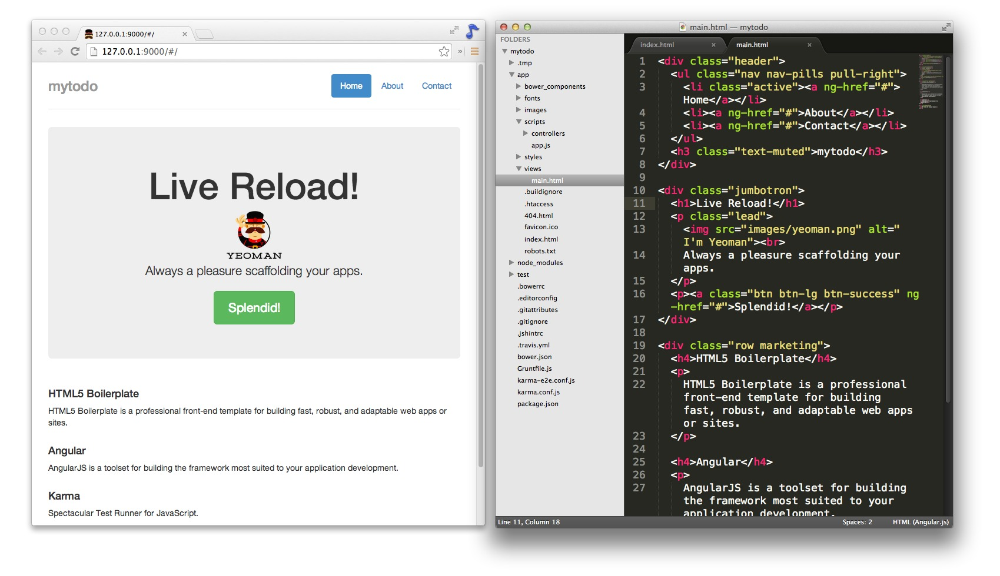

在这期的Code Lab中，你将会使用Yeoman和AngularJS搭建一个功能完整的应用，
示例应用将会简短地介绍一些关于Yeoman、Grunt和Bower的特点。

如果你有一些编程经验的话，这期的CodeL Lab会很适合你。

## 认识YEOMAN
Yeoman的logo是一个戴帽子的男人。Yeoman通过集成了三种工具来提升你的工作效率：


- yo是一个用于构建特定框架的生态系统的代码工具，我们称之为生成器(generator)。在以前的文章里我提过一些繁琐的任务，使用yo就能处理一些那样的任务。
- 多亏了Yeoman团队和grunt-contrib的帮助，在项目的创建、预览以及测试可以使用grunt。
- bower用于依赖管理，使用它以后你再也不用手动地去一个个下载你的前端库了。

只需要一两个命令，Yeoman就能给你的应用提供一个代码模板（或者一个像模块一样的独立的代码片段）、编译Sass以及在当前的目录启动一个简易的服务器。
它还能做单元测试，压缩以及合并你的CSS、JS、HTML还有图片等等功能。
你能使用npm安装生成器，现在可用的生成器数量已经超过了450，这其中很多都是由开源社区主持编写的。
比较受欢迎的有generator-angular、generator-backbone、generator-ember。

## 使用AngularJS构建的Todo应用

AngularJS是一个用于开发动态Web应用的JavaScript框架。
如果要开发一个Web应用，AngularJS能够操作HTML使之动态地发生改变，而不是一个单纯的静态文档，
它提供了像数据绑定和依赖注入(DI)这样的高级特定来简化应用的开发。 
如果想要了解更多关于AngularJS的信息，请看[文档](http://docs.angularjs.org/guide/overview)。 

现在让我们开始着手做下面这个Todo应用吧。


### 项目源码

这个练习的源码你可以在<https://github.com/addyosmani/yeoman-examples/tree/master/angular-localStorage-todos>找到。记住！你需要在目录下执行

```text
$ npm install
$ bower install
```

### 设置

在安装Yeoman之前，你需要确认以下配置：

- Node.js 版本在0.10以上
- npm 版本在1.3.7以上

安装好Node之后，你就可以用命令行来安装Yeoman了。

注意：大部分情况下Yeoman是要通过命令行来操作的，不同的系统执行以下命令的地方不太一样：Mac下请使用终端，Linux下使用shell，Windows下使用Cygwin。

```text
$ npm install --global yo
```

如果你看到了`permission errors`或者`access errors`，你需要在这条命令前面加上`sudo`。

通过

```text
$ yo --version && bower --version && grunt --version
```

命令来检查是不是所有东西都已经安装好了。

在执行完上述命令后，你应该会看到有四个版本号会被打印出来：

```text
Yeoman
Bower
Grunt
Grunt CLI（Grunt的命令行界面）
```

### 适用本教程的Yeoman, Bower和Grunt版本

现在的版本迭代太快了，这个教程的测试还是在Yeoman1.1.2, Bower1.2.8以及grunt-cli v0.1.11和grunt0.4.2下完成的。
如果你在新的版本上做这个教程的时候出现了问题，就开一个issue来讨论，请不要有什么顾虑。


### 安装Yeoman生成器

在传统的Web开发流程中，你可能会花很多时间在配置代码模板、下载依赖还有手动组建项目文件结构上。
而Yeoman就是来简化这个流程的！前面说的那些繁重的工作都会被交给Yeoman来完成。
让我们来试试用Yeoman来创建一个AngularJS项目吧！ 用下面这行命令进入Yeoman的菜单：

```text
$ yo
```


用键盘的上下键来操作菜单，当选项`install a generator`被高亮的时候按下回车键。
接下来我们需要寻找一个合适的生成器。搜索`angular`的话，你会得到很多搜索结果。
这些生成器都是由许多Yeoman开源社区贡献的。
在这个例子里，我们使用的是`generator-angular`。
当选中了`generator-angular`后，按下回车执行安装，它所依赖的Node包就会开始被下载了。


如果你知道要安装的生成器的名字，你可以直接用npm来安装：

```text
$ npm install -g generator-angular
```

下面是一张预览图：


技术更新的如此之快！这个教程是在generator-angular 0.7.1环境下测试的。
如果你在新版本的`generator-angular`做这个教程时候出现了问题，请开一个issue，我们很乐意帮助你。或者你可以直接安装0.7.1这个版本：

```text
$ npm install -g generator-angular@0.7.1
```

### 使用生成器搭建你的应用

你可以在Yeoman的菜单中操作已经安装好的生成器：

```text
$ yo
```


等一下！不要直接就运行生成器了。重新创建一个新的项目目录，生成器会在这个目录下生成出你的项目文件的。

```text
$ mkdir mytodo
$ cd mytodo
```

执行`yo`，选中`Run the Angular generator`，运行生成器。当你比较熟悉Yo的时候，就可以不通过菜单直接运行生成器：

```text 	
$ yo angular
```

一些生成器也会提供一些有共同开发库（common developer libraries）的可选配置来定制你的应用，能够加速初始化你的开发环境。
generator-angular会询问你需不需要使用Sass和/或Bootstrap，使用`n`和`y`进行选择。


然后你需要选择你需要使用的Angular模块。Angular模块是一些带有特定功能的独立的JS文件。
举个例子，ngResource模块（angular-resource.js）提供了RESTful服务。
你可以使用空格键来取消项目。下面来看一看默认值。(当你在试用空格的效果时，确保所有的模块都被标记为绿色)


好的，现在按下回车键。Yeoman将会自动构建你的应用、拉取需要的依赖并在你的工作流中创建一些有帮助的Grunt任务（Grunt Tasks）。

几分钟后，我们就能正式开始啦！ 


### 由Yeoman构建的文件目录结构

打开`mytodo`目录，你会看到下面的文件结构：

```text
app/：Web应用的父级目录
    index.html： Angular应用的基准HTML文件（base html file）
    404.html、favicon.ico和robots.txt：通用的Web文件，Yeoman已经将它创建出来了，你不需要再手动去创建
    bower_components：存放项目相关的JavaScript或Web依赖，由bower安装的
    scripts：我们的JS文件
        app.js：主程序
        controllers：Angular控制器
    styles：我们的CSS文件
    views：Angular模板
Gruntfile.js、package.json 以及node_modules：Grunt需要使用的依赖以及配置
test和karma.conf.js/karma-e2e.conf.js：测试框架以及针对这个项目的单元测试，包括了为控制器写的样板测试（boilerplate tests）
```


### 在浏览器中查看你的应用

要在浏览器中查看应用，就要将grunt server运行起来：

```text
grunt serve
```

运行命令后本地会启动一个基于Node的http服务。通过浏览器访问http://localhost:9000就可以看到你的应用了。


现在可以打开编辑器开始更改应用。每次保存更改后，浏览器将会自动刷新，就是说你是不需要手动再刷新浏览器了。
这个被称作`live reloading`，这提供了一个很好的方式来实时查看应用的状态。
它是通过一系列的Grunt任务来监视你的文件的更改情况，一旦发现文件被改动了，`live reloading`就会自动刷新应用。
在这个例子中，我们编辑了views/main.html，通过`live reload`我们从下面的状态：


马上到了这个状态：



### 现在让我们开始编写我们的AngularJS应用吧

在`app/mytodo`目录中的文件你都可以在浏览器中访问到，所有要更改的文件也都在app目录下。

如果你不确定你的文件建构是否正确，请查看上文的截图。

##### 创建新模板展现Todo列表

先将`views/main.html`中`class`是`row marketing`替换成`container`：

```html
<div class="container"></div>
```

更改Angular控制器模板（即scripts/controller/main.js），将`awesomeThings`改为`todos`：

```javascript
angular.module('mytodoApp')
    .controller('MainCtrl', function ($scope) {
         $scope.todos = ['Item 1', 'Item 2', 'Item 3'];
});
```

然后更改视图（views/main.html）来显示我们的Todo事项：

```html
<div class"container">
    <h2>My todos</h2>
    <p ng-repeat="todo in todos">
        <input type="text" ng-model="todo">
    </p>
</div>
```

在`<p>`标签中的`ng-repeat`属性是一个Angular指令(directive)，当获取到一个集合(collection)中的项时，它将项实例化。

在我们的例子中，你可以想象一下，每个p标签和它的内容都带着这个`ng-repeat`属性。

对于每个在todos数组中的项，Angular都会生成一组新的

```html
<p><input></p>
```

`ng-model`是另一个Angular指令，它主要是和input、select、textarea标签和一些自定义控件一起使用，达到数据双向绑定的效果。
在我们的例子中，它用于显示一系列带有`todo`的值的文本输入域。
在浏览器中查看ng-repeat和ng-model动态变化的效果。

在保存之前，我们的应用看起来应该是下图这个样子的：


