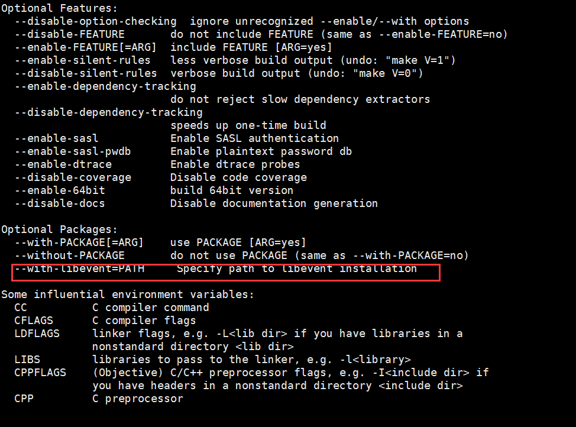
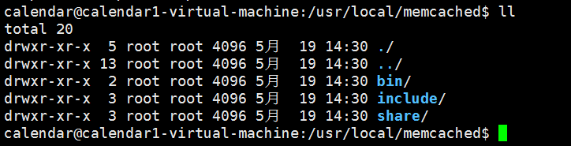
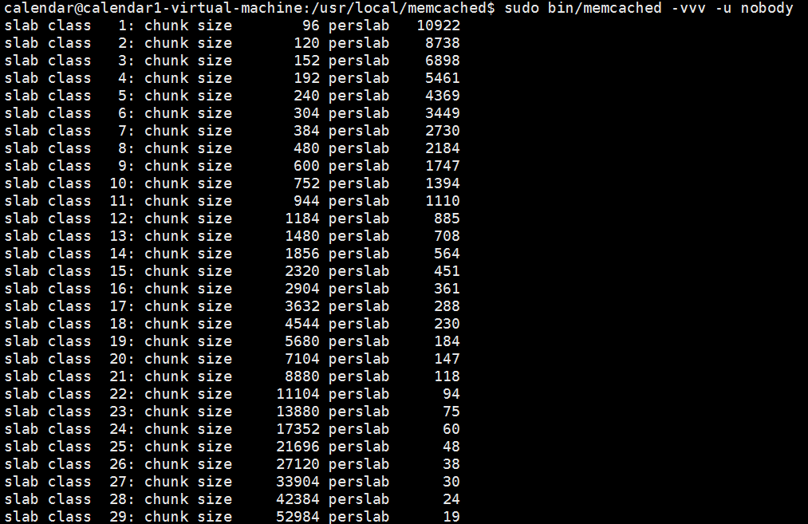

### 前期准备

**环境**：centOS 6.5

**memcached版本**：1.4.36

memcached下载网址：
<http://memcached.org/downloads>

### 安装libevent
因为官方网站说了，memcached依赖于libevent 

```
Debian/Ubuntu: apt-get install libevent-dev Redhat/Centos: yum install libevent-devel

wget http://memcached.org/latest
tar -zxvf memcached-1.x.x.tar.gz
cd memcached-1.x.x
./configure && make && make test && sudo make install
```
##### 使用yum安装
```
yum install libevent-devel
```
##### 源码安装
下载网址：<http://libevent.org/>
```
# 解压
tar -zxvf libevent-2.1.8-stable.tar.gz

# 配置
./configure --prefix=/usr/local/libevent

# 安装
make && make install 
```

### memcached安装
**解压**
```
tar -zxvf memcached-1.4.36.tar.gz
```

**编译**
通过 `./configure -help`可以参考编译参数，可以看出，我们可以通过 `--with-libevent`来指定libevent安装目录。 



编译命令如下：
```
./configure --prefix=/usr/local/memcached  --with-libevent=/usr/local/libevent/
```
**安装**
执行如下命令
```
make && make install
```
安装完成后，可以看到/usr/local目录下多了一个memcached目录，目录结构如下：



### 启动memcached

安装成功后启动一下看安装是否成功

```
/usr/local/bin/memcached -d -m 2048  -u root -l 192.168.1.20 -p 12111 -c 1024 -P /tmp/memcached.pid
```

参数说明：
- -d 启动为守护进程
- -m <num> 分配给Memcached使用的内存数量，单位是MB，默认为64MB
- -u <username> 运行Memcached的用户，仅当作为root运行时
- -l <ip_addr> 监听的服务器IP地址，默认为环境变量INDRR_ANY的值
- -p <num> 设置Memcached监听的端口，最好是1024以上的端口
- -c <num> 设置最大并发连接数，默认为1024
- -P <file> 设置保存Memcached的pid文件，与-d选择同时使用

还有一些参数具体请参考：
```
/usr/local/bin/memcached -h
```
如果不指定`-d`后台运行，则会看到如下输出：



可以看出，已经正常启动了。

### 在win下连接memcached
在win下通过telnet连接，当然前提是linux中，需要提前关闭防火墙。 

