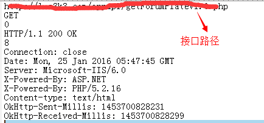

## 简介

retrofit本身并没有缓存。

如果想缓存，它要么必须让retrofit之上的应用层知道你的域和如何缓存事物，或它需要在retrofit之下HTTP client层知道HTTP的语义。

OkHttp是由Square发布的一个HTTP client，它支持高速缓存服务器响应的语义。如果服务器的响应具有Cache-Control头，例如，它将被缓存，以便随后的请求可以从高速缓存中的获得之前的资源。

因此，设备处于断网情况下，retrofit与OKHttp配合可以实现缓存。

**但是大家必须注意一点，okhttp的缓存设计和浏览器的一样，是用来提升用户体验降低服务器负荷的，比如：我们在有网的时候也会先调用缓存，但是有个时间限制，例如1分钟之内，有网和没有网都是先读缓存，这个可以参考下面讲解的第一种类型。**

**如果你想要做成那种离线可以缓存，在线就获取最新数据的功能，可以参考第二种类型**

## 第一种类型（有网和没有网都是先读缓存）

### 1、创建拦截器：
```
Interceptor interceptor = new Interceptor() {
    @Override
    public Response intercept(Chain chain) throws IOException {
        Request request = chain.request();
        LogCat.i("request="+request);
        Response response = chain.proceed(request);
        LogCat.i("response="+response);

        String cacheControl = request.cacheControl().toString();
        if (TextUtils.isEmpty(cacheControl)) {
            cacheControl = "public, max-age=60";
        }
        return response.newBuilder()
                .header("Cache-Control", cacheControl)
                .removeHeader("Pragma")
                .build();
    }
};
```

设置max-age为60s之后，这60s之内不管你有没有网,都读缓存。（这也就说明了为什么不能实现我上面说的功能）；max-stale设置为4周，意思是，网络未连接的情况下设置缓存时间为4周。

### 2、设置client
```
//设置缓存路径
File httpCacheDirectory = new File(FileUtil.getAvailableCacheDir(), "responses");
//设置缓存 10M
Cache cache = new Cache(httpCacheDirectory, 10 * 1024 * 1024);

//创建OkHttpClient，并添加拦截器和缓存代码
OkHttpClient client = new OkHttpClient.Builder()
        .addNetworkInterceptor(interceptor)
        .cache(cache).build();

//创建retrofit，把OkHttpClient对象写入
Retrofit retrofit = new Retrofit.Builder()
        .baseUrl(HttpUtil.URL_BASE)
        .client(client)
        .addConverterFactory(GsonConverterFactory.create())
        .build();

service = retrofit.create(APIService.class);
```
代码可知，我们在cache下新建了个文件夹responses，并设置了10M的缓存，并设置okhttp，（写这篇文章之前，参考了篇博客
http://stackoverflow.com/questions/23429046/can-retrofit-with-okhttp-use-cache-data-when-offline?lq=1，
但是你会发现，当时他们用的时候，okhttp还没到3.0,3.0以后很多接口都不一样了，但是思想还是可以借鉴的），
这样用service调接口的时候，就会进行缓存了。

## 第二种类型（离线可以缓存，在线就获取最新数据）
这种方法和第一种方法的区别是在设置的拦截器上，这里不能使用NetworkInterceptor，而是需要使用Interceptor，（不知道为什么用NetworkInterceptor就不行）

先讲一下步骤：

1. 首先，给OkHttp设置拦截器
2. 然后，在拦截器内做Request拦截操作，在每个请求发出前，判断一下网络状况，如果没问题继续访问，如果有问题，则设置从本地缓存中读取
3. 接下来是设置Response，先判断网络，网络好的时候，移除header后添加cache失效时间为0小时，网络未连接的情况下设置缓存时间为4周

### 1、给OkHttp设置拦截器（用Interceptor）
```
OkHttpClient client = new OkHttpClient.Builder()
        .addInterceptor(interceptor)
        .cache(cache).build();
Retrofit retrofit = new Retrofit.Builder()
        .baseUrl(HttpUtil.URL_BASE)
        .client(client)
        .addConverterFactory(GsonConverterFactory.create())
        .build();
```

### 2、Request拦截操作
```
Request request = chain.request();
if (!StringsUtil.isNetworkReachable(App.app)) {
    request = request.newBuilder()
            .cacheControl(CacheControl.FORCE_CACHE)
            .build();
   LogCat.i("no network");
}
```
### 3、设置Response
```
Response response = chain.proceed(request);

if (StringsUtil.isNetworkReachable(App.app)) {
    int maxAge = 0 * 60; // 有网络时 设置缓存超时时间0个小时
    LogCat.i("has network maxAge="+maxAge);
    response.newBuilder()
            .header("Cache-Control", "public, max-age=" + maxAge)
            .removeHeader("Pragma")// 清除头信息，因为服务器如果不支持，会返回一些干扰信息，不清除下面无法生效
            .build();
} else {
    LogCat.i("network error");
    int maxStale = 60 * 60 * 24 * 28; // 无网络时，设置超时为4周
    LogCat.i("has maxStale="+maxStale);
    response.newBuilder()
            .header("Cache-Control", "public, only-if-cached, max-stale=" + maxStale)
            .removeHeader("Pragma")
            .build();
    LogCat.i("response build maxStale="+maxStale);
}
return response;
```
这样就ok了。

## 查看缓存文件
下面我们讲一下缓存的文件，发现缓存文件全是以url的md5加密字段为文件名，每一个response分两个文件保存，以.0和.1结尾的文件区分。 进去看里面的内容如下： .0的文件里面是header：

运行程序，在Android/data/xxxxxx(包名)/responses下会发现很多缓存文件，这些缓存文件全是以url的md5加密字段为文件名，每一个response分两个文件保存，以.0和.1结尾的文件区分。举个例子：

2d58c369c11640eafe880241d31ad7a2.0

2d58c369c11640eafe880241d31ad7a2.1

.0的文件里面是header



而.1文件里面是返回的具体内容，即json数据。 


由此可见，这里的缓存机制也是一开始先把json缓存进文件，没有网络的时候再读取json进行解析。

但是还有一个journal.文件，这个里面是什么呢。


可以看到里面保存的是每一条reponse记录状态。包括读取，删除，写入等动作。

## 原理
>Cache-control 是由服务器返回的 Response 中添加的头信息，它的目的是告诉客户端是要从本地读取缓存还是直接从服务器摘取消息。它有不同的值，每一个值有不同的作用。

参考文献：
- http://www.jianshu.com/p/9c3b4ea108a7
- http://stackoverflow.com/questions/23429046/can-retrofit-with-okhttp-use-cache-data-when-offline?lq=1
- http://www.jianshu.com/p/3a8d910cce38
- http://souly.cn/%E6%8A%80%E6%9C%AF%E5%8D%9A%E6%96%87/2015/09/08/okhttp%E7%BC%93%E5%AD%98%E6%B5%85%E6%9E%90/