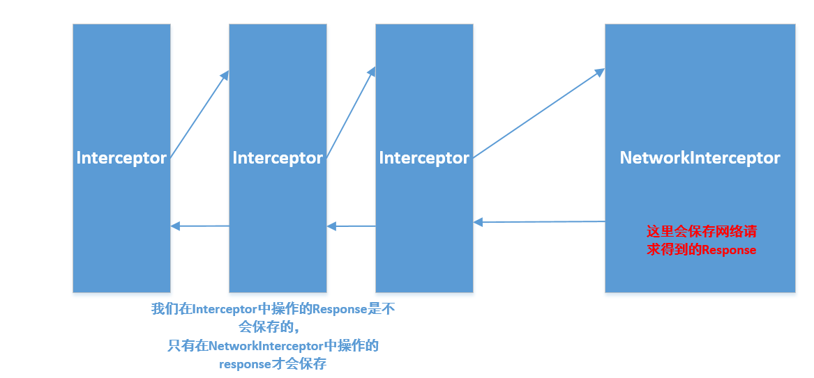

网上看了不少关于 okhttp 缓存的使用办法, 但是大多都是 okhttp2 的, 讲 okhttp3 的不是很多.

查阅了网上的资料后, 还是有两点疑惑, okhttp 有两个拦截器: `Interceptor`, `NetworkInterceptor`

如果要使用缓存必须两个一起使用, 才能起到作用.

下面一步一步来实现 okhttp3 的缓存

**设置缓存大小, 代码如下:**

```
File cacheDir = StorageUtils.getCacheDirectory(AppUtil.getContext());
Cache myCache = new Cache(cacheDir, 10 * 1024 * 1024);

OkHttpClient client = new OkHttpClient
       .Builder()
       .addInterceptor(new BaseInterceptor())
       .addNetworkInterceptor(new NetworkBaseInterceptor())
       .cache(myCache)
       .build();
```

**设置缓存接口 header**

```
@GET("api/v1/designers/")
@Headers("Cache-Control: public, max-age=60")
Observable<JSONObject> getDesigners(@Query("page") int page, @Query("page_size") int pageSize);
```

max-age 的单位是秒, 表示缓存时长

**设置Interceptor**

```
static class BaseInterceptor implements Interceptor {
    @Override
    public Response intercept(Chain chain) throws IOException {
        Request request = chain.request();

        // 一些公共参数 在这里处理...

        if (!NetWorkHelper.isNetworkAvailable(AppUtil.getContext())) {
            request = request.newBuilder()
                    .cacheControl(CacheControl.FORCE_CACHE)
                    .build();
            // 没有网络走缓存
        }

        return chain.proceed(request);
    }
}
```

**设置NetworkInterceptor**

```
static class NetworkBaseInterceptor implements Interceptor {
    @Override
    public Response intercept(Chain chain) throws IOException {
        Request request = chain.request();
        Response originalResponse = chain.proceed(request);

        String serverCache = originalResponse.header("Cache-Control");
        if (TextUtils.isEmpty(serverCache)) {
            String cacheControl = request.cacheControl().toString();
            Response res = originalResponse.newBuilder()
                    .addHeader("Cache-Control", cacheControl)
                    .removeHeader("Pragma")
                    .build();
            return res;
        } else {
            // 如果服务端设置相应的缓存策略，那么遵从服务端的不做修改
            return originalResponse;
        }
    }
}
```

在`NetworkInterceptor`中我做了判断, 如果**服务端**返回的数据中设置缓存的相关参数则直接使用服务端设置的, 如果没有则使用我们自己在 `retrofit` 接口上写的。

以上就能实现, 没网的时候读取缓存，有网的时候根据我们自定义的时间来读取缓存

问题:`Interceptor`和 `NetworkInterceptor` 有什么区别.

可以看下图:



**必须要两种拦截器一起使用才能使用缓存吗?**

如果要实现没网络的情况读取缓存话, 必须要两个一起使用。

如果只是单纯的设置 `max-age` 这样的缓存的话, 可以只使用`networkInterceptor`

