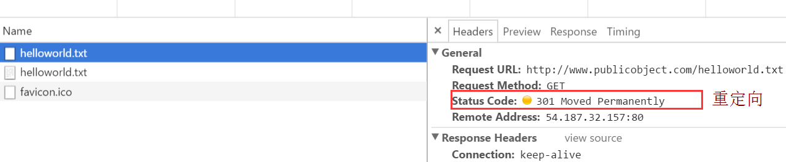

## 拦截器Interceptors
通常情况下拦截器用来添加，移除或者转换请求或者回应的头部信息。 拦截器接口中有intercept(Chain chain)方法，同时返回Response。这里有一个简单的拦截器，它记录了即将到来的请求和输入的响应。

chain.proceed(request)是拦截器的关键部分。这个看似简单的方法是所有的HTTP工作发生的地方，产生满足要求的响应。

拦截器可以链接。假设你有一个压缩的拦截和校验拦截器：你需要决定数据是否被压缩，或者校验或校验然后压缩。okhttp使用列表来跟踪和拦截，拦截器会按顺序调用。


### Application Interceptors
拦截器可以注册为应用程序或网络拦截。我们将使用上面定义的logginginterceptor说明差异。 可以在OkHttpClient.interceptors()返回的list中调用add(),来注册一个application interceptor 。

```
OkHttpClient client = new OkHttpClient();
client.interceptors().add(new LoggingInterceptor());
Request request = new Request.Builder()
    .url("http://www.publicobject.com/helloworld.txt")
    .header("User-Agent", "OkHttp Example")
    .build();
Response response = client.newCall(request).execute();
response.body().close();
```
URL http://www.publicobject.com/helloworld.txt会重定向到https://publicobject.com/helloworld.txt，OkHttp会自动执行这些重定向。
application interceptor执行之后，chain.proceed()返回的response会重定向到下面的response：
```
INFO: Sending request http://www.publicobject.com/helloworld.txt on null
User-Agent: OkHttp Example

INFO: Received response for https://publicobject.com/helloworld.txt in 1179.7ms
Server: nginx/1.4.6 (Ubuntu)
Content-Type: text/plain
Content-Length: 1759
Connection: keep-alive
```
可以看到，url重定向来，因为response.request().url()和request.url()不同，两个不同的日志可以看出这一点。

### Network Interceptors
注册一个网络拦截器是很相似的。添加到networkinterceptors()的list来代替interceptors()的list：
```
OkHttpClient client = new OkHttpClient();
client.networkInterceptors().add(new LoggingInterceptor());
Request request = new Request.Builder()
    .url("http://www.publicobject.com/helloworld.txt")
    .header("User-Agent", "OkHttp Example")
    .build();
Response response = client.newCall(request).execute();
response.body().close();
```
当我们运行这个代码的时候，拦截程序运行了两次。一次为http://www.publicobject.com/helloworld.txt初始请求， 
和另一个重定向到https://publicobject.com/helloworld.txt。



```
INFO: Sending request http://www.publicobject.com/helloworld.txt on Connection{www.publicobject.com:80, proxy=DIRECT hostAddress=54.187.32.157 cipherSuite=none protocol=http/1.1}
User-Agent: OkHttp Example
Host: www.publicobject.com
Connection: Keep-Alive
Accept-Encoding: gzip

INFO: Received response for http://www.publicobject.com/helloworld.txt in 115.6ms
Server: nginx/1.4.6 (Ubuntu)
Content-Type: text/html
Content-Length: 193
Connection: keep-alive
Location: https://publicobject.com/helloworld.txt

INFO: Sending request https://publicobject.com/helloworld.txt on Connection{publicobject.com:443, proxy=DIRECT hostAddress=54.187.32.157 cipherSuite=TLS_ECDHE_RSA_WITH_AES_256_CBC_SHA protocol=http/1.1}
User-Agent: OkHttp Example
Host: publicobject.com
Connection: Keep-Alive
Accept-Encoding: gzip

INFO: Received response for https://publicobject.com/helloworld.txt in 80.9ms
Server: nginx/1.4.6 (Ubuntu)
Content-Type: text/plain
Content-Length: 1759
Connection: keep-alive
```
网络要求还包含更多的数据，如Accept-Encoding: gzip头来支持压缩。
网络拦截的Chain有一个非空Connection可以用来询问IP地址和用于连接到Web服务器的TLS配置。

### application和network interceptors的选择
每一个拦截链都有相对的优点。

- Application interceptors
    
    1. 不必担心中间的responses，例如重定向和重连。 
    2. 总是调用一次，即使是从缓存HTTP响应。 
    3. 观察应用程序的原始意图。不关心OkHttp的注入headers，例如If-None-Match 
    4. 允许短路和不执行Chain.proceed(). 
    5. 允许重连，多次调用proceed()。

- Network Interceptors

    1. 能够操作中间反应，例如重定向和重连。 
    2. 不能被缓存响应，例如短路网络调用。 
    3. 观察数据，正如它将在网络上传输。 
    4. 有权使用携带request的Connection
    
## 重写Requests
拦截器可以添加，删除，或替换请求报头。他们还可以将这些请求的body转换。
例如，你可以使用一个应用程序拦截来增加request body压缩， 如果你连接的服务器支持这种操作的话。

```
/** 
 *   该拦截器压缩HTTP请求体。 许多Web服务器无法处理这个！ 
 */
final class GzipRequestInterceptor implements Interceptor {
  @Override 
  public Response intercept(Chain chain) throws IOException {
    Request originalRequest = chain.request();
    // 如果请求体为空，或者已经指定请求体的编码，则不处理
    if (originalRequest.body() == null || originalRequest.header("Content-Encoding") != null) {
      return chain.proceed(originalRequest);
    }
    Request compressedRequest = originalRequest.newBuilder()
        .header("Content-Encoding", "gzip")
        .method(originalRequest.method(), gzip(originalRequest.body()))
        .build();
    return chain.proceed(compressedRequest);
  }
  private RequestBody gzip(final RequestBody body) {
    return new RequestBody() {
      @Override 
      public MediaType contentType() {
        return body.contentType();
      }
      @Override 
      public long contentLength() {
        return -1; // 我们预先不知道压缩长度!
      }
      @Override 
      public void writeTo(BufferedSink sink) throws IOException {
        BufferedSink gzipSink = Okio.buffer(new GzipSink(sink));
        body.writeTo(gzipSink);
        gzipSink.close();
      }
    };
  }
}
```
## 重写Responses
如果你是在处理一个棘手的问题，并准备面对处理的后果，重写`response headers`是一个强大的方式来解决问题。
例如，你可以将服务器的错误配置的缓存控制响应头修改以便更好地响应缓存：
```
/** 危险的拦截器重写服务器的缓存控制头。 */
private static final Interceptor REWRITE_CACHE_CONTROL_INTERCEPTOR = new Interceptor() {
  @Override public Response intercept(Chain chain) throws IOException {
    Response originalResponse = chain.proceed(chain.request());
    return originalResponse.newBuilder()
        .header("Cache-Control", "max-age=60")
        .build();
  }
};
```
作为补充一个网络服务器上的相应的修复，通常这种方法效果最好。

- 在某些情况下，如用户单击“刷新”按钮，就可能有必要跳过缓存，并直接从服务器获取数据。要强制刷新，添加无缓存指令：”Cache-Control”： “no-cache”。
- 如果缓存只是用来和服务器做验证，可是设置更有效的”Cache-Control”：”max-age=0”。
- 有时你会想显示可以立即显示的资源。这是可以使用的，这样你的应用程序可以在等待最新的数据下载的时候显示一些东西， 重定向request到本地缓存资源，添加”Cache-Control”：”only-if-cached”。
- 有时候过期的response比没有response更好，设置最长过期时间来允许过期的response响应： int maxStale = 60 * 60 * 24 * 28; // tolerate 4-weeks stale

“Cache-Control”：”max-stale=” + maxStale。

### 可用性
okhttp拦截器需要okhttp 2.2或更高。
不幸的是，拦截器在OkUrlFactory和基于OkUrlFactory的库上不工作，
或者基于okhttp library的，包括 Retrofit ≤1.8和Picasso≤2.4。