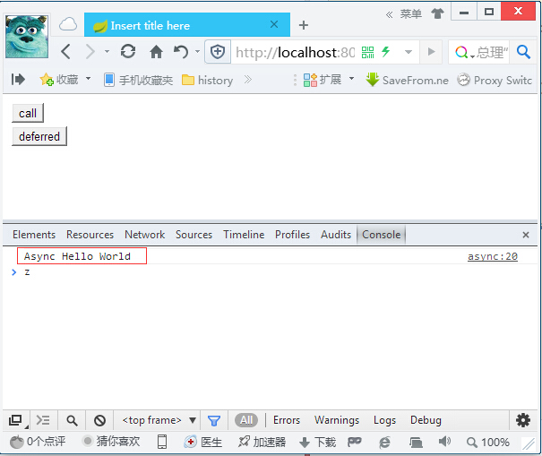
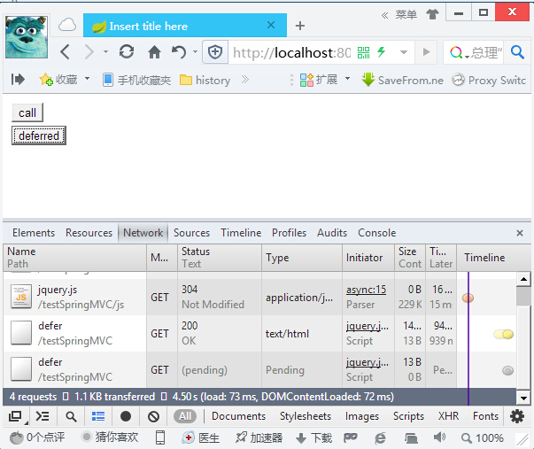
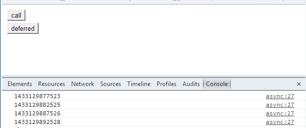

## 一、异步请求处理

1. Servlet 3开始支持异步请求处理
2. Spring MVC 3.2开始支持Servlet3的这项特性
3. `Controller`可以从另外一个线程返回一个`java.util.concurrent.Callable`，而不是一个简单的值
    - 此时Servlet容器线程已经释放,可以处理其他的请求;
    - Spring MVC通过借助TaskExecutor调起另外一个线程(例子中的mvcTaskExecutor)
    
4. `Controller`也可以从另外一个线程返回一个`DeferredResult`
    - 此时,Spring MVC并不知道这个线程的存在
    - 比如一个定时任务
    
## 二、演示
通过SSE实现长连接，但在IE的一些版本是不支持的

本例通过Spring MVC对异步处理的支持来演示长连接的支持，即服务器端推送，支持所有浏览器

### Servlet开启异步支持
```java
package com.wisely;

import javax.servlet.ServletContext;
import javax.servlet.ServletException;
import javax.servlet.ServletRegistration.Dynamic;

import org.springframework.web.WebApplicationInitializer;
import org.springframework.web.context.support.AnnotationConfigWebApplicationContext;
import org.springframework.web.servlet.DispatcherServlet;

public class WebInitializer implements WebApplicationInitializer {

    @Override
    public void onStartup(ServletContext servletContext)
            throws ServletException {
            AnnotationConfigWebApplicationContext ctx = 
                                     new AnnotationConfigWebApplicationContext();  
            ctx.register(DemoMVCConfig.class); 
            ctx.setServletContext(servletContext);    
            Dynamic servlet = 
                   servletContext.addServlet("dispatcher", new DispatcherServlet(ctx));  
            servlet.addMapping("/");  
            servlet.setLoadOnStartup(1);
            servlet.setAsyncSupported(true);//此句开启

    }

}
```
### DeferredResult所需的定时处理
```java
package com.wisely.service;

import org.springframework.scheduling.annotation.Scheduled;
import org.springframework.stereotype.Service;
import org.springframework.web.context.request.async.DeferredResult;

@Service
public class AysncService {
    private DeferredResult<String> deferredResult;

    public DeferredResult<String> getAsyncUpdate() {
        deferredResult = new DeferredResult<String>();
        return deferredResult;
    }

    @Scheduled(fixedDelay = 5000)
    public void refresh() {
        if (deferredResult != null) {
            deferredResult.setResult(new Long(System.currentTimeMillis())
                    .toString());
        }
    }
}
```
我这里采用的是**长轮询方式**，前端发起一个查询请求后，Spring MVC返回一个`DeferredResult`类型，
这个请求将会被挂起，直到在另一个线程中DeferredResult被放入数据才会响应给客户端浏览器，
否则将会向客户端响应超时，然后jQuery会再次发起一个请求，如此循环。

关于**响应超时时间**，可以在创建`DeferredResult`对象时传递构造参数来改变：

- 自定义10秒：
    DeferredResult<Message> dr = new DeferredResult<Message>(10);
- 永不超时：
    DeferredResult<Message> dr = new DeferredResult<Message>(0);

**源码：**
```java
public DeferredResult() {
    this((Long)null, RESULT_NONE);
}

public DeferredResult(Long timeout) {
    this(timeout, RESULT_NONE);
}

public DeferredResult(Long timeout, Object timeoutResult) {
    this.result = RESULT_NONE;
    this.timeoutResult = timeoutResult;
    this.timeout = timeout;
}
```

### 开启Spring MVC支持配置
继承WebMvcConfigurerAdapter的配置类DemoMVCConfig

```java
@Override
public void configureAsyncSupport(AsyncSupportConfigurer configurer) {
   configurer.setDefaultTimeout(30*1000L); //tomcat默认10秒
   configurer.setTaskExecutor(mvcTaskExecutor());//所借助的TaskExecutor
}
@Bean
public ThreadPoolTaskExecutor mvcTaskExecutor(){
    ThreadPoolTaskExecutor executor = new ThreadPoolTaskExecutor();
    executor.setCorePoolSize(10);
    executor.setQueueCapacity(100);
    executor.setMaxPoolSize(25);
    return executor;

}

 @Override
public void addViewControllers(ViewControllerRegistry registry) {
   registry.addViewController("/async").setViewName("/async");
}
```
### 测试控制器
```java
package com.wisely.web;

import java.util.concurrent.Callable;

import org.springframework.beans.factory.annotation.Autowired;
import org.springframework.stereotype.Controller;
import org.springframework.web.bind.annotation.RequestMapping;
import org.springframework.web.bind.annotation.ResponseBody;
import org.springframework.web.context.request.async.DeferredResult;

import com.wisely.service.AysncService;

@Controller
public class AysncController {

    @Autowired
    AysncService aysncService;


    @RequestMapping("/call")
    @ResponseBody
    public Callable<String> asyncCall() {
        //借助mvcTaskExecutor在另外一个线程调用
        //此时Servlet容器线程已经释放,可以处理其他的请求
        return new Callable<String>() {
            @Override
            public String call() throws Exception {
                Thread.sleep(3000);
                return "Async Hello World";
            }
        };
    }

    @RequestMapping("/defer")
    @ResponseBody
    public DeferredResult<String> deferredCall() {
        //调用aysncService的getAsyncUpdate方法
        //deferredResult被计划任务每五秒钟更新一次
        return aysncService.getAsyncUpdate();
    }

}
```
### 测试页面
```html


<%@ taglib uri="http://java.sun.com/jsp/jstl/core" prefix="c" %>
<%@ page language="java" contentType="text/html; charset=UTF-8"
    pageEncoding="UTF-8"%>
<!DOCTYPE html PUBLIC "-//W3C//DTD HTML 4.01 Transitional//EN" "http://www.w3.org/TR/html4/loose.dtd">
<html>
<head>
<meta http-equiv="Content-Type" content="text/html; charset=UTF-8">
<title>Insert title here</title>

</head>
<body>
<input type="button" value="call" onclick="call();"/>
<input type="button" value="deferred" onclick="deferred();"/>


<script type="text/javascript" src="<c:url value="/js/jquery.js" />"></script>
<script type="text/javascript">

function call(){
    $.get('call',function(data){
        console.log(data);
    });
}


function deferred(){
    $.get('defer',function(data){
        console.log(data);
        deferred();//每次请求完成,再发一次请求,避免客户端定时刷新来获取数据
    });
}


</script>
</body>
</html>
```

访问http://localhost:8080/testSpringMVC/async

##### 点击call




##### 点击defer




