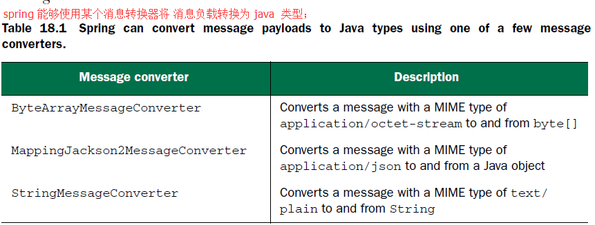

### 启用 STOMP 代理中继
1）intro：在生产环境下，可能会希望使用真正支持 STOMP 的代理来支持 WebSocket 消息，如RabbitMQ 或 ActiveMQ。
这样的代理提供了可扩展性和健壮性更好的消息功能，当然，他们也支持 STOMP 命令；

2）如何使用 STOMP 代理来替换内存代理

代码如下：
```java
@Override  
public void configureMessageBroker(MessageBrokerRegistry registry) {  
    // 启用了 STOMP 代理中继功能，并将其代理目的地前缀设置为 /topic and /queue .  
    registry.enableStompBrokerRelay("/queue", "/topic")  
    .setRelayPort(62623);  
    registry.setApplicationDestinationPrefixes("/app"); // 应用程序目的地.  
}  
```
对以上代码的分析（Analysis）：
- A1）方法第一行启用了 STOMP 代理中继功能：并将其目的地前缀设置为 "/topic" or "/queue" ；spring就能知道所有目的地前缀为 "/topic" or "/queue" 的消息都会发送到 STOMP 代理中；
- A2）方法第二行设置了应用的前缀为 "app"：所有目的地以 "/app" 打头的消息（发送消息url not 连接url）都会路由到带有 @MessageMapping 注解的方法中，而不会发布到代理队列或主题中；

3）下图阐述了代理中继如何应用于 spring 的 STOMP 消息处理之中。

与上图的关键区别在于：这里不再模拟 STOMP 代理的功能，而是由代理中继将消息传送到一个真正的消息代理来进行处理；


- A1）enableStompBrokerRelay() and setApplicationDestinationPrefixes() 方法都可以接收变长参数；
- A2）默认情况下： STOMP 代理中继会假设代理监听 localhost 的 61613 端口，并且 client 的 username 和 password 均为 guest。当然你也可以自行定义；

```java
@Override  
public void configureMessageBroker(MessageBrokerRegistry registry) {  
    registry.enableStompBrokerRelay("/topic", "/queue")  
    .setRelayHost("rabbit.someotherserver")  
    .setRelayPort(62623)  
    .setClientLogin("marcopolo")  
    .setClientPasscode("letmein01");  
    registry.setApplicationDestinationPrefixes("/app", "/foo");  
} // setXXX()方法 是可选的  
```

## 处理来自客户端的 STOMP 消息
1）借助 @MessageMapping 注解能够在控制器中处理 STOMP 消息

```java
package com.spring.spittr.web;  
  
import org.springframework.messaging.handler.annotation.MessageMapping;  
import org.springframework.messaging.handler.annotation.SendTo;  
import org.springframework.stereotype.Controller;  
  
import com.spring.pojo.Greeting;  
import com.spring.pojo.HelloMessage;  
  
@Controller  
public class GreetingController {  
      
    @MessageMapping("/hello")  
    @SendTo("/topic/greetings")  
    public Greeting greeting(HelloMessage message) throws Exception {  
        System.out.println("receiving " + message.getName());  
        System.out.println("connecting successfully.");  
        return new Greeting("Hello, " + message.getName() + "!");  
    }  
}  
```
对以上代码的分析（Analysis）：
- A1）@MessageMapping注解：表示 greeting() 方法能够处理指定目的地上到达的消息；
- A2）这个目的地（消息发送目的地url）就是 "/server/app/hello"，其中 "/app" 是 隐含的 ,"/server" 是 springmvc 项目名称；


2）因为我们现在处理的不是 HTTP，所以无法使用 spring 的 HttpMessageConverter 实现将负载转换为 HelloMessage 对象。

Spring 4.0 提供了几个消息转换器如下：

（Attention， 如果是传输json数据的话，一定要添加 Jackson jar 包到你的springmvc 项目中，不然连接不会成功的）



### 处理订阅（@SubscribeMapping注解）
1）@SubscribeMapping注解的方法：当收到 STOMP 订阅消息的时候，带有 @SubscribeMapping 注解的方法将会触发；其也是通过 AnnotationMethodMessageHandler 来接收消息的；

2）@SubscribeMapping注解的应用场景：实现 请求-回应 模式。在请求-回应模式中，客户端订阅一个目的地，然后预期在这个目的地上获得一个一次性的响应；

2.1）看个荔枝：
```java
@SubscribeMapping({"/marco"})  
public Shout handleSubscription() {  
    Shout outgoing = new Shout();  
    outgoing.setMessage("Polo!");  
    return outgoing;  
}  
```
对以上代码的分析（Analysis）：
- A1）@SubscribeMapping注解的方法来处理对 "/app/macro" 目的地订阅（与 @MessageMapping类似，"/app" 是隐含的 ）；
- A2）请求-回应模式与 HTTP GET 的请求-响应模式差不多： 关键区别在于， HTTP GET 请求是同步的，而订阅的请求-回应模式是异步的，这样客户端能够在回应可用时再去处理，而不必等待；

### 编写 JavaScript 客户端
1）intro：借助 STOMP 库，通过 JavaScript 发送消息
```javascript
<script type="text/javascript">  
    var stompClient = null;  

    function setConnected(connected) {  
        document.getElementById('connect').disabled = connected;  
        document.getElementById('disconnect').disabled = !connected;  
        document.getElementById('conversationDiv').style.visibility = connected ? 'visible' : 'hidden';  
        document.getElementById('response').innerHTML = '';  
    }  

    function connect() {  
        var socket = new SockJS("<c:url value='/hello'/>");  
        stompClient = Stomp.over(socket);  
        stompClient.connect({}, function(frame) {  
            setConnected(true);  
            console.log('Connected: ' + frame);  
            stompClient.subscribe('/topic/greetings', function(greeting){  
                showGreeting(JSON.parse(greeting.body).content);  
            });  
        });  
    }  

    function disconnect() {  
        if (stompClient != null) {  
            stompClient.disconnect();  
        }  
        setConnected(false);  
        console.log("Disconnected");  
    }  

    function sendName() {  
        var name = document.getElementById('name').value;  
        stompClient.send("/app/hello", {}, JSON.stringify({ 'name': name }));  
    }  

    function showGreeting(message) {
        var response = document.getElementById('response');  
        var p = document.createElement('p');  
        p.style.wordWrap = 'break-word';
        p.appendChild(document.createTextNode(message));  
        response.appendChild(p);  
    }  
</script> 
```
对以上代码的分析（Analysis）： 以上代码连接"/hello"端点并发送"name"；

2）stompClient.send("/app/hello", {}, JSON.stringify({'name':name}))： 第一个参数：Json 负载消息发送的目的地； 第二个参数：是一个头信息的Map，它会包含在 STOMP 帧中；第三个参数：负载消息；

>干货 —— stomp client 连接地址和发送地址不一样的，连接地址为 <c:url value='/hello'/> 即 http://localhost:8080/springmvc_project_name/hello, 而发送地址为 '/app/hello'，这里要当心


## 发送消息到客户端
1）intro：spring提供了两种 发送数据到 client 的方法：

- method1）作为处理消息或处理订阅的附带结果；
- method2）使用消息模板；

### 在处理消息后，发送消息（server 对 client 请求的响应消息）
1）intro：如果你想要在接收消息的时候，在响应中发送一条消息，修改方法签名不是void 类型即可， 如下：
```java
@MessageMapping("/hello")  
@SendTo("/topic/greetings") //highlight line.  
public Greeting greeting(HelloMessage message) throws Exception {  
    System.out.println("receiving " + message.getName());  
    System.out.println("connecting successfully.");  
    return new Greeting("Hello, " + message.getName() + "!");  
}  
```
对以上代码的分析（Analysis）：

返回的对象将会进行转换（通过消息转换器） 并放到 STOMP 帧的负载中，
**然后发送给消息代理（消息代理分为 STOMP代理中继 和 内存消息代理）**；

2）默认情况下：帧所发往的目的地会与触发处理器方法的目的地相同。
只不过会添加"/topic"前缀，
所以返回的对象会写入到 STOMP 帧的负载中，并发布到 "/topic/hello" 目的地。
不过，可以通过 @SendTo 注解，重载目的地；

代码同上。

对以上代码的分析（Analysis）：消息将会发布到 /topic/greetings， 所有订阅这个主题的应用都会收到这条消息；

3）@SubscriptionMapping 注解标注的方式也能发送一条消息，作为订阅的回应。

3.1）看个荔枝： 通过为控制器添加如下的方法，当客户端订阅的时候，将会发送一条 Greeting 信息：
```java
@SubscribeMapping("/macro") // defined in Controller. attention for addr '/macro' in server.  
public Greeting handleSubscription() {  
    System.out.println("this is the @SubscribeMapping('/marco')");  
    Greeting greeting = new Greeting("i am a msg from SubscribeMapping('/macro').");  
    return greeting;  
}
```
```javascript
function connect() {  
    var socket = new SockJS("<c:url value='/hello'/>");  
    stompClient = Stomp.over(socket);  
    stompClient.connect({}, function(frame) {  
        setConnected(true);  
        console.log('Connected: ' + frame);  
        stompClient.subscribe('/topic/greetings', function(greeting){  
            showGreeting(JSON.parse(greeting.body).content);  
        });  
        // starting line.  
        stompClient.subscribe('/app/macro',function(greeting){  
            alert(JSON.parse(greeting.body).content);  
            showGreeting(JSON.parse(greeting.body).content);  
        }); // ending line. attention for addr '/app/macro' in client.  
    });  
}   
```
对以上代码的分析（Analysis）： 

- A0）这个 @SubscribeMapping 注解标记的方法，是在订阅的时候调用的，也就是说，基本是只执行一次的方法。
    client 调用定义在 server 的该注解标注的方法，它就会返回结果。**注意，它不过经过代理**。
    
- A1）这里的 @SubscribeMapping 注解表明当客户端订阅 "/app/macro" 主题的时候（"/app"是应用目的地的前缀，注意，这里没有加 springmvc 项目名称前缀）， 
    将会调用 handleSubscription 方法。它所返回的 Greeting 对象将会进行转换并发送回client；
    
- A2）@SubscribeMapping 注解的区别在于： **这里的 Greeting 消息将会直接发送给 client，不用经过消息代理**；
    但，如果为方法添加 @SendTo 注解的话，那么消息将会发送到指定的目的地，这样就会经过代理；
    
>干货 —— @SubscribeMapping注解返回的消息直接发送到 client，不经过代理，而 @SendTo 注解的路径，就会经过代理，然后再发送到目的地


### 在应用的任意地方发送消息
1）intro：spring 的 SimpMessagingTemplate 能够在应用的任何地方发送消息，不必以接收一条消息为前提；

2）看个荔枝： 让首页订阅一个 STOMP 主题，在 Spittle 创建的时候，该主题能够收到 Spittle 更新时的 feed；

2.1）JavaScript 代码：
```javascript
<script>
    var sock = new SockJS('spittr');  
    var stomp = Stomp.over(sock);  
    stomp.connect('guest', 'guest', function(frame) {  
    console.log('Connected');  
    stomp.subscribe("/topic/spittlefeed", handleSpittle); // highlight.  
});

function handleSpittle(incoming) {  
    var spittle = JSON.parse(incoming.body);  
    console.log('Received: ', spittle);  
    var source = $("#spittle-template").html();  
    var template = Handlebars.compile(source);  
    var spittleHtml = template(spittle);  
    $('.spittleList').prepend(spittleHtml);  
}  
</script>  
```
对以上代码的分析（Analysis）：在连接到 STMOP 代理后，我们订阅了 "/topic/spittlefeed" 主题，并指定当消息到达时，由 handleSpittle()函数来处理 Spittle 更新。

2.2） server 端代码：

使用 SimpMessagingTemplate 将所有新创建的 Spittle 以消息的形式发布到 "/topic/spittlefeed" 主题上；
```java
@Service
public class SpittleFeedServiceImpl implements SpittleFeedService {  
    
    private SimpMessageSendingOperations messaging;
    
    @Autowired  
    public SpittleFeedServiceImpl(SimpMessageSendingOperations messaging) { // 注入消息模板.  
        this.messaging = messaging;  
    }  
    public void broadcastSpittle(Spittle spittle) {  
        messaging.convertAndSend("/topic/spittlefeed", spittle); // 发送消息.  
    }  
}  
```
对以上代码的分析（Analysis）： 

- A1）配置 spring 支持 stomp 的一个附带功能是在spring应用上下文中已经包含了 SimpMessagingTemplate；
- A2）在发布消息给 STOMP 主题的时候，所有订阅该主题的客户端都会收到消息。但有的时候，我们希望将消息发送给指定用户；

# 为目标用户发送消息
1）intro：在使用 spring 和 STOMP 消息功能的时候，有三种方式来利用认证用户：

- way1）@MessageMapping and @SubscribeMapping 注解标注的方法能够使用 Principal 来获取认证用户；
- way2）@MessageMapping, @SubscribeMapping, and @MessageException 方法返回的值能够以消息的形式发送给认证用户；
- way3）SimpMessagingTemplate 能够发送消息给特定用户；

## 在控制器中处理用户的消息
1）看个荔枝： 编写一个控制器方法，根据传入的消息创建新的Spittle对象，并发送一个回应，表明对象创建成功；

- 1.1）代码如下：它会处理传入的消息并将其存储为 Spittle：
    ```java
    @MessageMapping("/spittle")  
    @SendToUser("/queue/notifications")  
    public Notification handleSpittle(Principal principal, SpittleForm form) {  
        Spittle spittle = new Spittle(principal.getName(), form.getText(), new Date());  
        spittleRepo.save(spittle);  
        return new Notification("Saved Spittle");  
    }
    ```
- 1.2）该方法最后返回一个新的 Notification，表明对象保存成功；
- 1.3）该方法使用了 @MessageMapping("/spittle") 注解，所以当有发往 "/app/spittle" 目的地的消息到达时，该方法就会触发；
    如果用户已经认证的话，将会根据 STOMP 帧上的头信息得到 Principal 对象；
- 1.4）@SendToUser注解：指定了 Notification 要发送的目的地 "/queue/notifications"；
- 1.5）表面上， "/queue/notifications" 并不会与特定用户相关联，但因为这里使用的是 @SendToUser 注解， 而不是 @SendTo，
    所以 就会发生更多的事情了；

2）看一下针对控制器方法发布的 Notification 对象的目的地，客户端该如何进行订阅。

2.1）看个荔枝：考虑如下的 JavaScript 代码，它订阅了一个 用户特定的 目的地：
```javascript
stomp.subscribe("/user/queue/notifications", handleNotifications);
```
对以上代码的分析（Analysis）：这个目的地使用了 "/user" 作为前缀，
在内部，以"/user" 为前缀的消息将会通过 UserDestinationMessageHandler 进行处理，而不是 AnnotationMethodMessageHandler 或  SimpleBrokerMessageHandler or StompBrokerRelayMessageHandler，

如下图所示：


Attention）UserDestinationMessageHandler 的主要任务： 是将用户消息重新路由到某个用户独有的目的地上。

在处理订阅的时候，它会将目标地址中的 "/user" 前缀去掉，并基于用户的会话添加一个后缀。
如，对 "/user/queue/notifications" 的订阅最后可能路由到名为 "/queue/notifacations-user65a4sdfa" 目的地上；

## 为指定用户发送消息
1）intro：SimpMessagingTemplate 还提供了 convertAndSendToUser() 方法，该方法能够让我们给特定用户发送消息；

2）我们在 web 应用上添加一个特性： 当其他用户提交的 Spittle 提到某个用户时，将会提醒该用户；

2.1）看个荔枝：如果 Spittle 文本中包含 "@tangrong"，那么我们就应该发送一条消息给使用 tangrong 用户名登录的client，代码实例如下：
```java
@Service
public class SpittleFeedServiceImpl implements SpittleFeedService {  
    
    private SimpMessagingTemplate messaging;  
    
    // 实现用户提及功能的正则表达式  
    private Pattern pattern = Pattern.compile("\\@(\\S+)");   
  
    @Autowired  
    public SpittleFeedServiceImpl(SimpMessagingTemplate messaging) {  
        this.messaging = messaging;  
    }
    
    public void broadcastSpittle(Spittle spittle) {
        messaging.convertAndSend("/topic/spittlefeed", spittle);
        
        Matcher matcher = pattern.matcher(spittle.getMessage());
        if (matcher.find()) {  
        String username = matcher.group(1);  
        // 发送提醒给用户.  
        messaging.convertAndSendToUser(username, "/queue/notifications",  
            new Notification("You just got mentioned!"));  
        }  
    }  
}  
```

# 处理消息异常
1）intro：我们也可以在控制器方法上添加 @MessageExceptionHandler 注解，让它来处理 @MessageMapping 方法所抛出的异常；

2）看个荔枝：它会处理消息方法所抛出的异常；
```java
@MessageExceptionHandler  
public void handleExceptions(Throwable t) {  
    logger.error("Error handling message: " + t.getMessage());  
}  
```

3）我们也可以以参数的形式声明它所能处理的异常；
```java
@MessageExceptionHandler(SpittleException.class) // highlight line.  
public void handleExceptions(Throwable t) {  
    logger.error("Error handling message: " + t.getMessage());  
}  
// 或者：  
@MessageExceptionHandler( {SpittleException.class, DatabaseException.class})  // highlight line.  
public void handleExceptions(Throwable t) {  
    logger.error("Error handling message: " + t.getMessage());  
}  
```
4）该方法还可以回应一个错误：
```java
@MessageExceptionHandler(SpittleException.class)  
@SendToUser("/queue/errors")  
public SpittleException handleExceptions(SpittleException e) {  
    logger.error("Error handling message: " + e.getMessage());  
    return e;
}  
// 如果抛出 SpittleException 的话，将会记录这个异常，并将其返回.  
// 而 UserDestinationMessageHandler 会重新路由这个消息到特定用户所对应的唯一路径;
```