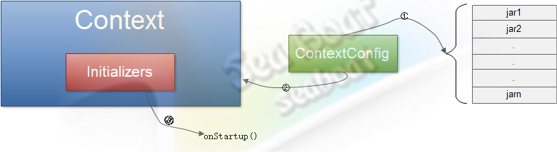
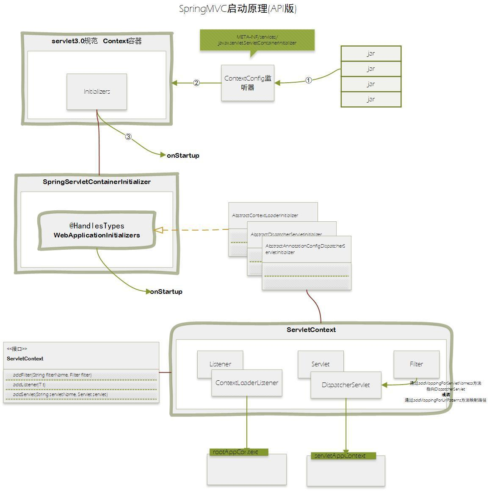

本文从API角度入手，带你了解SpringMVC启动的原理。

## ServletContainerInitializer

在web容器启动时为提供给第三方组件机会做一些初始化的工作，例如注册`servlet`或者`filtes`等，**servlet规范**中通过`ServletContainerInitializer`实现此功能。
每个框架要使用`ServletContainerInitializer`就必须在对应的jar包的`META-INF/services` 目录创建一个名为`javax.servlet.ServletContainerInitializer`的文件，文件内容指定具体的`ServletContainerInitializer`实现类，
那么，当web容器启动时就会运行这个初始化器做一些组件内的初始化工作。

一般伴随着`ServletContainerInitializer`一起使用的还有`HandlesTypes`注解，通过`HandlesTypes`可以将感兴趣的一些类注入到`ServletContainerInitializerde`的`onStartup`方法作为参数传入。

Tomcat容器的`ServletContainerInitializer`机制的实现，主要交由**Context容器**和**ContextConfig监听器**共同实现，
ContextConfig监听器负责在容器启动时读取每个web应用的`WEB-INF/lib`目录下包含的jar包的`META-INF/services/javax.servlet.ServletContainerInitializer`，以及`web根目录`下的`META-INF/services/javax.servlet.ServletContainerInitializer`，
通过反射完成这些`ServletContainerInitializer`的实例化，然后再设置到Context容器中，最后Context容器启动时就会分别调用每个`ServletContainerInitializer`的`onStartup`方法，并将感兴趣的类作为参数传入。



基本的实现机制如图，首先通过**ContextConfig监听器**遍历每个jar包或web根目录的`META-INF/services/javax.servlet.ServletContainerInitializer`文件，根据读到的类路径实例化每个`ServletContainerInitializer`；然后再分别将实例化好的`ServletContainerInitializer`设置进Context容器中；最后Context容器启动时分别调用所有`ServletContainerInitializer`对象的`onStartup`方法。

假如读出来的内容为`com.seaboat.mytomcat.CustomServletContainerInitializer`，则通过反射实例化一个`CustomServletContainerInitializer`对象，这里涉及到一个`@HandlesTypes`注解的处理，被它标明的类需要作为参数值传入到`onStartup`方法。

如下例子：

```java
@HandlesTypes({ HttpServlet.class,Filter.class }) 
public class CustomServletContainerInitializer implements 
    ServletContainerInitializer { 
  public void onStartup(Set<Class<?>> classes, ServletContext servletContext) 
      throws ServletException {
      for(Class c : classes) 
         System.out.println(c.getName());
  } 
}
```

其中`@HandlesTypes`标明的`HttpServlet`和`Filter`两个class被注入到了`onStartup`方法。
所以**这个注解也是需要在ContextConfig监听器中处理**。

前面已经介绍了注解的实现原理，由于有了编译器的协助，我们可以方便地通过`ServletContainerInitializer`的class对象中获取到`HandlesTypes`对象，进而再获取到注解声明的类数组，如


```java
HandlesTypes ht =servletContainerInitializer.getClass().getAnnotation(HandlesTypes.class);
Class<?>[] types = ht.value();
```

即可获取到`HttpServlet`和`Filter`的class对象数组，后面Context容器调用`CustomServletContainerInitializer`对象的`onStartup`方法时作为参数传入。

至此，即完成了servlet规范的`ServletContainerInitializer`初始化器机制。

## SpringServletContainerInitializer

上面提到了`META-INF/services/javax.servlet.ServletContainerInitializer`，在Spring`spring-web-4.3.0.RELEASE.jar` Jar包中可以找到该文件，内容如下：

```text
org.springframework.web.SpringServletContainerInitializer
```

下面，我们就来详细讲解下`SpringServletContainerInitializer`。

---

首先看下API中的描述：

**Servlet 3.0** `ServletContainerInitializer`被设计为使用Spring的`WebApplicationInitializer` SPI来支持Servlet容器的**基于代码**的配置，而不是传统的基于web.xml的配置(也可能两者结合使用)。

### 一、运作机制

假设类路径中存在`spring-web`模块的JAR包，`SpringServletContainerInitializer `将被加载并实例化，并且在容器启动期间由Servlet 3.0容器调用`onStartup`方法。

这是通过JAR Services API `ServiceLoader.load(Class)`方法(检测Spring-Web模块的`META-INF/services/javax.servlet.ServletContainerInitializer`配置文件)实现的。

### 二、与web.xml结合使用

Web应用程序可以选择通过`web.xml`中的`metadata-complete`属性(它控制扫描Servlet注解的行为)
或通过`web.xml`中的`<absolute-ordering>`元素(它控制哪些`web fragments`(i.e. jars)被允许执行扫描`ServletContainerInitializer`)
来限制Servlet容器在启动时扫描的类路径。

当使用这个特性时，可以通过添加"spring_web"到`web.xml`里的`web fragments`列表来启用`SpringServletContainerInitializer`，

 
如下所示：

```xml
<absolute-ordering>
    <name>some_web_fragment</name>
    <name>spring_web</name>
</absolute-ordering>
```

>servlet3.X中的metadata-complete属性
>在Servlet3.X的web.xml中可以设置metadata-complete属性，例如：
>```xml
><web-app xmlns="http://xmlns.jcp.org/xml/ns/javaee"
>      xmlns:xsi="http://www.w3.org/2001/XMLSchema-instance"
>      xsi:schemaLocation="http://xmlns.jcp.org/xml/ns/javaee
>                   http://xmlns.jcp.org/xml/ns/javaee/web-app_3_1.xsd"
>      version="3.1"
>      metadata-complete="true">
></web-app>
>```
>如果设置`metadata-complete="true"`，会在启动时不扫描注解（annotation）。如果不扫描注解的话，用注解进行的配置就无法生效，例如：`@WebServlet`

### 三、与Spring的`WebApplicationInitializer`的关系

Spring的WebApplicationInitializer SPI仅由一个方法组成：`WebApplicationInitializer.onStartup(ServletContext)`。声明与`ServletContainerInitializer.onStartup(Set, ServletContext)`非常相似：简单地说，`SpringServletContainerInitializer`负责将`ServletContext`实例化并委托给用户定义的`WebApplicationInitializer`实现。然后**每个`WebApplicationInitializer`负责完成初始化`ServletContext`的实际工作**。下面的`onStartup`文档中详细介绍了委托的具体过程。

### 四、注意事项

一般来说，这个类应该被视为`WebApplicationInitializer` SPI的支持。利用这个**容器初始化器**也是完全**可选**的：虽然这个初始化器在所有的Servlet 3.0+运行环境下被加载和调用，但用户可以选择是否提供`WebApplicationInitializer`实现。如果未检测到`WebApplicationInitializer`类型，则此`SpringServletContainerInitializer`将不起作用。

请注意，除了这些类型是在`spring-web`模块JAR中提供的，使用这个`SpringServletContainerInitializer`和`WebApplicationInitializer`与Spring MVC没有任何“捆绑”。相反，它们可以被认为是通用的，以便于简化`ServletContext`基于代码的配置。换句话说，任何`servlet`, `listener`, 或者`filter`都可以在`WebApplicationInitializer`中注册，而不仅仅是Spring MVC特定的组件。

`SpringServletContainerInitializer`既不是为扩展而设计的。它应该被认为是一个内部类型，`WebApplicationInitializer`是面向用户的SPI。

---

好啦，现在对`SpringServletContainerInitializer`有了一个比较透彻的了解，下面我们来看一下唯一的`onStartup`方法。

将`ServletContext`委托给类路径中的`WebApplicationInitializer`实现。
因为这个类声明了`@HandlesTypes(WebApplicationInitializer.class)`，所以
Servlet 3.0+容器会自动扫描类路径下Spring的`WebApplicationInitializer`接口的实现，并将所有这些类型的集合提供给这个方法的`webAppInitializerClasses`参数。
如果在类路径下找不到`WebApplicationInitializer`实现，则此方法不会有任何操作。将发出INFO级别的日志消息，通知用户`ServletContainerInitializer`确实已被调用，但没有找到`WebApplicationInitializer`实现。
假设检测到一个或多个`WebApplicationInitializer`类型，它们将被实例化（如果存在`@Order`注释或实现`Ordered`接口，则对其进行排序）。然后，将调用每个实例`WebApplicationInitializer.onStartup(ServletContext)`方法，并委派`ServletContext`，以便每个实例都可以注册和配置Servlet，例如Spring的`DispatcherServlet`，listeners（如Spring的`ContextLoaderListener`），或者其他Servlet API组件（如filters）。

---

下面是`SpringServletContainerInitializer`的源码：

```java
@HandlesTypes(WebApplicationInitializer.class)
public class SpringServletContainerInitializer implements ServletContainerInitializer {
	@Override
	public void onStartup(Set<Class<?>> webAppInitializerClasses, ServletContext servletContext)
			throws ServletException {

		// WebApplicationInitializer实现如果存在`@Order`注释或实现`Ordered`接口，则对其进行排序，故这里使用LinkedList
        List<WebApplicationInitializer> initializers = new LinkedList<WebApplicationInitializer>();

        if (webAppInitializerClasses != null) {
            for (Class<?> waiClass : webAppInitializerClasses) {
                // Be defensive: Some servlet containers provide us with invalid classes,
                // no matter what @HandlesTypes says...
                // 有时候，Servlet容器提供给我们的可能是无效的webAppInitializerClass
                if (!waiClass.isInterface() && !Modifier.isAbstract(waiClass.getModifiers()) &&
                        WebApplicationInitializer.class.isAssignableFrom(waiClass)) {
                    try {
                        initializers.add((WebApplicationInitializer) waiClass.newInstance());
                    }
                    catch (Throwable ex) {
                        throw new ServletException("Failed to instantiate WebApplicationInitializer class", ex);
                    }
                }
            }
        }

        if (initializers.isEmpty()) {
            servletContext.log("No Spring WebApplicationInitializer types detected on classpath");
            return;
        }

        servletContext.log(initializers.size() + " Spring WebApplicationInitializers detected on classpath");
        AnnotationAwareOrderComparator.sort(initializers);
        for (WebApplicationInitializer initializer : initializers) {
            initializer.onStartup(servletContext);
        }
	}
}
```

---

## WebApplicationInitializer

下面我们来看下`WebApplicationInitializer `API文档的相关介绍。

在Servlet 3.0+环境中实现该接口，以便以编程方式配置`ServletContext`，而不是以传统的基于web.xml的方法。`WebApplicationInitializer` SPI的实现将被`SpringServletContainerInitializer`(它本身是由Servlet 3.0容器自动引导的)自动检测到。 

### Example
##### 基于XML的方式

大多数Spring用户构建Web应用程序时需要注册Spring的`DispatcherServlet`。作为参考，通常在`WEB-INF/web.xml`中按如下方式：

```java
 <servlet>
    <servlet-name>dispatcher</servlet-name>
    <servlet-class>
      org.springframework.web.servlet.DispatcherServlet
    </servlet-class>
    <init-param>
      <param-name>contextConfigLocation</param-name>
      <param-value>/WEB-INF/spring/dispatcher-config.xml</param-value>
    </init-param>
    <load-on-startup>1</load-on-startup>
  </servlet>
 
  <servlet-mapping>
    <servlet-name>dispatcher</servlet-name>
    <url-pattern>/</url-pattern>
  </servlet-mapping>
```

##### 基于代码的方式

`DispatcherServlet`注册逻辑与上述等效

```java
public class MyWebAppInitializer implements WebApplicationInitializer {
  
      @Override
      public void onStartup(ServletContext container) {
        XmlWebApplicationContext appContext = new XmlWebApplicationContext();
        appContext.setConfigLocation("/WEB-INF/spring/dispatcher-config.xml");
  
        ServletRegistration.Dynamic dispatcher =
          container.addServlet("dispatcher", new DispatcherServlet(appContext));
        dispatcher.setLoadOnStartup(1);
        dispatcher.addMapping("/");
      }
   }
```

作为上述的替代方法，您还可以继承自`org.springframework.web.servlet.support.AbstractDispatcherServletInitializer`。
正如您所看到的，使用Servlet 3.0的`ServletContext.addServlet`方法，我们注册了一个`DispatcherServlet`的实例。

这种风格简单明了。不用关心处理`init-params`等，只是普通的JavaBean风格的属性和构造函数参数。在将其注入到`DispatcherServlet`之前，您可以根据需要自由创建和使用Spring应用程序上下文。

大多数Spring Web组件已经更新，以支持这种注册方式。你会发现`DispatcherServlet`，`FrameworkServlet`，`ContextLoaderListener`和`DelegatingFilterProxy`现在都支持构造函数参数。Servlet 3.0 ServletContext API允许以编程方式设置`init-params`，`context-params`等。

##### 完全基于代码的配置方法

在上面的例子中，`WEB-INF/web.xml`以`WebApplicationInitializer`形式的代码替换，但`dispatcher-config.xml`配置仍然是基于XML的。`WebApplicationInitializer`非常适合与Spring的基于代码的`@Configuration`类一起使用。以下示例演示了使用Spring的`AnnotationConfigWebApplicationContext`代替`XmlWebApplicationContext`进行重构，以及使用用户定义的`@Configuration`类`AppConfig`和`DispatcherConfig`，而不是Spring XML文件。这个例子也超出了上面的例子来演示根应用上下文的典型配置和`ContextLoaderListener`的注册：

```java
public class MyWebAppInitializer implements WebApplicationInitializer {
  
      @Override
      public void onStartup(ServletContext container) {
        // Create the 'root' Spring application context
        AnnotationConfigWebApplicationContext rootContext =
          new AnnotationConfigWebApplicationContext();
        rootContext.register(AppConfig.class);
  
        // Manage the lifecycle of the root application context
        container.addListener(new ContextLoaderListener(rootContext));
  
        // Create the dispatcher servlet's Spring application context
        AnnotationConfigWebApplicationContext dispatcherContext =
          new AnnotationConfigWebApplicationContext();
        dispatcherContext.register(DispatcherConfig.class);
  
        // Register and map the dispatcher servlet
        ServletRegistration.Dynamic dispatcher =
          container.addServlet("dispatcher", new DispatcherServlet(dispatcherContext));
        dispatcher.setLoadOnStartup(1);
        dispatcher.addMapping("/");
      }
  
   }
```

作为上述的替代方法，您还可以继承自`org.springframework.web.servlet.support.AbstractAnnotationConfigDispatcherServletInitializer`。注意，`WebApplicationInitializer`的实现类会被自动检测到。

##### Ordering WebApplicationInitializer execution

`WebApplicationInitializer`实现类可以有选择地在类上使用Spring的`@Order`注解，也可以实现Spring的`Ordered`接口。如果是这样，初始化程序将在调用之前排序。这为用户提供了确保Servlet容器初始化顺序的机制。使用此功能的情况很少，因为典型的应用程序可能会将所有容器初始化集中在一个`WebApplicationInitializer`中。

##### 注意事项

**web.xml版本**

`WEB-INF/web.xml`和`WebApplicationInitializer`的使用不是互斥的; 例如，`web.xml`可以注册一个`servlet`，而`WebApplicationInitializer`可以注册另一个。 **Initializer**甚至可以通过诸如`ServletContext.getServletRegistration(String)`之类的方法来修改在`web.xml`中执行的注册。但是，如果应用程序中存在`WEB-INF/web.xml`，则其版本属性必须设置为"3.0"或更高，否则Servlet容器将忽略`ServletContainerInitializer`的引导。

---

下面我们来看一组`WebApplicationInitializer`的实现类：

继承关系如下：

```text
AbstractAnnotationConfigDispatcherServletInitializer
        |
        | —— AbstractDispatcherServletInitializer
                   |
                   | —— AbstractContextLoaderInitializer
                             |
                             | ——  WebApplicationInitializer
```

## AbstractAnnotationConfigDispatcherServletInitializer

`org.springframework.web.WebApplicationInitializer`实现类的基类，用于注册配置了**`@Configuration/@Component`注解标记的配置类**的`DispatcherServlet`。

具体的实现类需要实现`getRootConfigClasses()`和`getServletConfigClasses()`以及`getServletMappings()`方法。更多的方法由`AbstractDispatcherServletInitializer`提供。这是使用基于Java配置应用程序的首选方法。


下面是`AbstractAnnotationConfigDispatcherServletInitializer`的源码：

```java
public abstract class AbstractAnnotationConfigDispatcherServletInitializer
		extends AbstractDispatcherServletInitializer {

	/**
	 * 创建要提供给`ContextLoaderListener`的**根应用程序上下文**。
	 * <p>
	 * 返回的上下文委托给`ContextLoaderListener.ContextLoaderListener(WebApplicationContext)`，
	 * 并将作为`DispatcherServlet`应用程序上下文的父上下文来建立。
	 * <p>
	 * 因此，它通常包含中间层服务，数据源等。
	 * <p>
	 * 该方法创建一个`AnnotationConfigWebApplicationContext`，并为其提供由`getRootConfigClasses()`返回的配置类。如果`getRootConfigClasses()`返回Null，则不会创建根应用上下文。
	 */
	@Override
	protected WebApplicationContext createRootApplicationContext() {
		Class<?>[] configClasses = getRootConfigClasses();
		if (!ObjectUtils.isEmpty(configClasses)) {
			AnnotationConfigWebApplicationContext rootAppContext = new AnnotationConfigWebApplicationContext();
			rootAppContext.register(configClasses);
			return rootAppContext;
		}
		else {
			return null;
		}
	}

	/**
	 * 创建一个**Servlet应用上下文**以提供给`DispatcherServlet`。
	 * <p>
	 * 返回的上下文被委托给Spring的`DispatcherServlet.DispatcherServlet(WebApplicationContext)`方法。
	 * <p>
	 * 因此，它通常包含控制器，视图解析器，locale解析器和其他Web相关的bean。
	 * <p>
	 * 该实现创建一个`AnnotationConfigWebApplicationContext`，为其提供由`getServletConfigClasses()`返回的配置类。
	 */
	@Override
	protected WebApplicationContext createServletApplicationContext() {
		AnnotationConfigWebApplicationContext servletAppContext = new AnnotationConfigWebApplicationContext();
		Class<?>[] configClasses = getServletConfigClasses();
		if (!ObjectUtils.isEmpty(configClasses)) {
			servletAppContext.register(configClasses);
		}
		return servletAppContext;
	}

	/**
	 * 指定要提供给根应用上下文的`@Configuration`或`@Component`注解标记的配置类。
	 */
	protected abstract Class<?>[] getRootConfigClasses();

	/**
	 * 指定要提供给Dispatcher Servlet应用上下文的`@Configuration`或`@Component`注解标记的配置类。
	 */
	protected abstract Class<?>[] getServletConfigClasses();

}
```

## AbstractDispatcherServletInitializer

`org.springframework.web.WebApplicationInitializer`实现的基类，在`ServletContext`中注册`DispatcherServlet`。

具体的实现类需要实现`createServletApplicationContext()`和`getServletMappings()`方法，两者都由`registerDispatcherServlet(ServletContext)`调用。

进一步的自定义可以通过重写`customizeRegistration(ServletRegistration.Dynamic)`方法来实现。

由于此类继承了`AbstractContextLoaderInitializer`抽象类，具体实现类也需要实现**`createRootApplicationContext()`**来设置父级根应用上下文。如果不需要根应用上下文，`createRootApplicationContext()`返回null即可。

下面看下源码：

```java

public abstract class AbstractDispatcherServletInitializer extends AbstractContextLoaderInitializer {

    /**
     * The default servlet name. Can be customized by overriding {@link #getServletName}.
     */
    public static final String DEFAULT_SERVLET_NAME = "dispatcher";


    @Override
    public void onStartup(ServletContext servletContext) throws ServletException {
        super.onStartup(servletContext);
        registerDispatcherServlet(servletContext);
    }

    /**
     * 针对给定的Servlet上下文注册一个`DispatcherServlet`。
     * <p>
     * 该方法将创建一个名称为由`getServletName()`指定的`DispatcherServlet`，
     * 并使用从`createServletApplicationContext()`返回的Servlet应用上下文对其进行初始化，
     * 并将其映射到从`getServletMappings()`返回的`pattern`。
     * <p>
     * 进一步的自定义可以通过重写`customizeRegistration(ServletRegistration.Dynamic)`或`createDispatcherServlet(WebApplicationContext)`来实现。
     *
     * @param servletContext 注册servlet的上下文
     */
    protected void registerDispatcherServlet(ServletContext servletContext) {
        // DispatcherServlet被注册的名称
        String servletName = getServletName();
        Assert.hasLength(servletName, "getServletName() must not return empty or null");

        // 创建Servlet应用上下文，参见AbstractAnnotationConfigDispatcherServletInitializer的实现
        WebApplicationContext servletAppContext = createServletApplicationContext();
        Assert.notNull(servletAppContext,
                "createServletApplicationContext() did not return an application " +
                        "context for servlet [" + servletName + "]");

        // 将Servlet应用上下文以委托给DispatcherServlet
        FrameworkServlet dispatcherServlet = createDispatcherServlet(servletAppContext);
        dispatcherServlet.setContextInitializers(getServletApplicationContextInitializers());

        ServletRegistration.Dynamic registration = servletContext.addServlet(servletName, dispatcherServlet);
        Assert.notNull(registration,
                "Failed to register servlet with name '" + servletName + "'." +
                        "Check if there is another servlet registered under the same name.");

        registration.setLoadOnStartup(1);
        registration.addMapping(getServletMappings());
        registration.setAsyncSupported(isAsyncSupported());

        Filter[] filters = getServletFilters();
        if (!ObjectUtils.isEmpty(filters)) {
            for (Filter filter : filters) {
                registerServletFilter(servletContext, filter);
            }
        }

        customizeRegistration(registration);
    }

    /**
     * 返回`DispatcherServlet`被注册的名称。 默认值为DEFAULT_SERVLET_NAME。
     *
     * @see #registerDispatcherServlet(ServletContext)
     */
    protected String getServletName() {
        return DEFAULT_SERVLET_NAME;
    }

    /**
     * 创建一个Servlet应用上下文以提供给`DispatcherServlet`。
     * 返回的上下文被委托给Spring的`DispatcherServlet.DispatcherServlet(WebApplicationContext)`。
     * <p>
     * 因此，它通常包含控制器，视图解析器，locale解析器和其他Web相关的bean。
     *
     * @see #registerDispatcherServlet(ServletContext)
     */
    protected abstract WebApplicationContext createServletApplicationContext();

    /**
     * 使用指定的`WebApplicationContext`Servlet应用上下文创建`DispatcherServlet`（或由`FrameworkServlet`派生的其他类型的`dispatcher`）。
     * <p>
     * 注意：从4.2.3开始允许返回任意`FrameworkServlet`的子类。
     * 以前，它必须要返回一个`DispatcherServlet`或其子类。
     */
    protected FrameworkServlet createDispatcherServlet(WebApplicationContext servletAppContext) {
        return new DispatcherServlet(servletAppContext);
    }

    /**
     * Specify application context initializers to be applied to the servlet-specific
     * application context that the {@code DispatcherServlet} is being created with.
     *
     * @see #createServletApplicationContext()
     * @see DispatcherServlet#setContextInitializers
     * @see #getRootApplicationContextInitializers()
     * @since 4.2
     */
    protected ApplicationContextInitializer<?>[] getServletApplicationContextInitializers() {
        return null;
    }

    /**
     * 指定`DispatcherServlet`的servlet映射 - 例如"/", "/app"等
     *
     * @see #registerDispatcherServlet(ServletContext)
     */
    protected abstract String[] getServletMappings();

    /**
     * 指定添加到`ServletContext`，并映射到`DispatcherServlet`的过滤器。
     *
     * @return an array of filters or {@code null}
     * @see #registerServletFilter(ServletContext, Filter)
     */
    protected Filter[] getServletFilters() {
        return null;
    }

    /**
     * 将给定的过滤器添加到`ServletContext`并将其映射到`DispatcherServlet`，如下所示：
     * <ul>
     * <li>1. 根据具体的类型选择默认的过滤器名称;
     * <li>2. 异步支持是根据`asyncSupported`的返回值设置的;
     * <li>3. 使用`dispatcher`类型为REQUEST，FORWARD，INCLUDE和ASYNC(取决于asyncSupported的返回值)创建过滤器映射
     * </ul>
     * <p>
     * 如果上面的默认值不合适，重写这个方法并直接用`ServletContext`注册过滤器。
     *
     * @param servletContext the servlet context to register filters with
     * @param filter         the filter to be registered
     * @return the filter registration
     */
    protected FilterRegistration.Dynamic registerServletFilter(ServletContext servletContext, Filter filter) {
        // 获取要注册的filter的名称
        String filterName = Conventions.getVariableName(filter);
        Dynamic registration = servletContext.addFilter(filterName, filter);
        if (registration == null) {// 注册失败，名称追加序号并重试
            int counter = -1;
            while (counter == -1 || registration == null) {
                counter++;
                registration = servletContext.addFilter(filterName + "#" + counter, filter);
                Assert.isTrue(counter < 100,
                        "Failed to register filter '" + filter + "'." +
                                "Could the same Filter instance have been registered already?");
            }
        }
        registration.setAsyncSupported(isAsyncSupported());
        registration.addMappingForServletNames(getDispatcherTypes(), false, getServletName());
        return registration;
    }

    private EnumSet<DispatcherType> getDispatcherTypes() {
        return (isAsyncSupported() ?
                EnumSet.of(DispatcherType.REQUEST, DispatcherType.FORWARD, DispatcherType.INCLUDE, DispatcherType.ASYNC) :
                EnumSet.of(DispatcherType.REQUEST, DispatcherType.FORWARD, DispatcherType.INCLUDE));
    }

    /**
     * `DispatcherServlet`和通过`getServletFilters()`添加的所有过滤器的异步支持标记位
     */
    protected boolean isAsyncSupported() {
        return true;
    }

    /**
     * Optionally perform further registration customization once
     * {@link #registerDispatcherServlet(ServletContext)} has completed.
     *
     * @param registration the {@code DispatcherServlet} registration to be customized
     * @see #registerDispatcherServlet(ServletContext)
     */
    protected void customizeRegistration(ServletRegistration.Dynamic registration) {
    }

}
```

>💡 补充：registration.addMappingForServletNames
>为当前`FilterRegistration`所代表的`Filter`添加一个具有指定`Servlet`名称和`dispatcher `类型的过滤器映射。过滤器映射按照添加的顺序进行匹配。根据`isMatchAfter`参数的值，来确定给定的过滤器映射在`ServletContext`(从中获取当前`FilterRegistration`)的任何声明的过滤器映射之前或之后匹配。
>
>如果这个方法被多次调用，每个连续的调用都会作用于前者。
>
>**Parameters:**
>
>_dispatcherTypes_ - 过滤器映射的`dispatcher `类型，如果要使用默认的`DispatcherType.REQUEST`，则为null
>
>_isMatchAfter_ - 如果给定的过滤器映射在任何声明的过滤器映射之后匹配，则为true;如果在从中获取此`FilterRegistration`的`ServletContext`的任何声明的过滤器映射之前匹配，则为false
>
>_servletNames_ - 过滤器映射的Servlet名称

## AbstractContextLoaderInitializer

`WebApplicationInitializer`实现类的基类，在`ServletContext`中注册`ContextLoaderListener`。需要由子类实现的唯一方法是`createRootApplicationContext()`，它在`registerContextLoaderListener(ServletContext)`中被调用。

```java

public abstract class AbstractContextLoaderInitializer implements WebApplicationInitializer {

    /** Logger available to subclasses */
    protected final Log logger = LogFactory.getLog(getClass());


    @Override
    public void onStartup(ServletContext servletContext) throws ServletException {
        registerContextLoaderListener(servletContext);
    }

    /**
     * 针对给定的`ServletContext`注册一个`ContextLoaderListener`。
     * `ContextLoaderListener`使用从`createRootApplicationContext()`方法返回的根应用上下文进行初始化。
     * 
     * @param servletContext the servlet context to register the listener against
     */
    protected void registerContextLoaderListener(ServletContext servletContext) {
        WebApplicationContext rootAppContext = createRootApplicationContext();
        if (rootAppContext != null) {
            ContextLoaderListener listener = new ContextLoaderListener(rootAppContext);
            listener.setContextInitializers(getRootApplicationContextInitializers());
            servletContext.addListener(listener);
        }
        else {
            logger.debug("No ContextLoaderListener registered, as " +
                    "createRootApplicationContext() did not return an application context");
        }
    }

    /**
     * Create the "<strong>root</strong>" application context to be provided to the
     * {@code ContextLoaderListener}.
     * <p>The returned context is delegated to
     * {@link ContextLoaderListener#ContextLoaderListener(WebApplicationContext)} and will
     * be established as the parent context for any {@code DispatcherServlet} application
     * contexts. As such, it typically contains middle-tier services, data sources, etc.
     * @return the root application context, or {@code null} if a root context is not
     * desired
     * @see org.springframework.web.servlet.support.AbstractDispatcherServletInitializer
     */
    protected abstract WebApplicationContext createRootApplicationContext();

    /**
     * Specify application context initializers to be applied to the root application
     * context that the {@code ContextLoaderListener} is being created with.
     * @since 4.2
     * @see #createRootApplicationContext()
     * @see ContextLoaderListener#setContextInitializers
     */
    protected ApplicationContextInitializer<?>[] getRootApplicationContextInitializers() {
        return null;
    }

}
```

---

上面说了这么多，简单总结下。

如图所示：


---

## ContextLoaderListener

上面提到了`ContextLoaderListener`，下面来说下这个类的作用。

### ServletContextListener

首先看下`javax.servlet.ServletContextListener`

ServletContextListener为一个接口，声明如下：

```java
public interface ServletContextListener extends EventListener {
```

`ServletContextListener`接口用于接收有关`javax.servlet.ServletContext`生命周期改变的通知事件。

为了接收这些通知事件，其实现类有如下三种方式声明：
- Web应用程序的部署描述符(deployment descriptor of the web application，web.xml)中声明`<listener>`
- 使用`javax.servlet.annotation.WebListener`进行注释
- 通过`javax.servlet.ServletContext`上定义的`javax.servlet.ServletContext.addListener`方法注册

这个接口实现类的`contextInitialized`方法按照它们的声明顺序被调用， 而`contextDestroyed`方法则以相反的顺序被调用。

```java

import javax.servlet.ServletContextEvent;
import java.util.EventListener;

/**
 * 用于接收有关{@link javax.servlet.ServletContext}生命周期改变的通知事件的接口。
 * <p>
 * 为了接收这些通知事件，实现类必须
 * 在Web应用程序的部署描述符(deployment descriptor of the web application)中声明、
 * 使用{@link javax.servlet.annotation.WebListener}进行注释，
 * 或者通过{@link javax.servlet.ServletContext}上定义的{@link javax.servlet.ServletContext#addListener}方法注册。
 * <p>
 * 这个接口实现类的{@link #contextInitialized}方法按照它们的声明顺序被调用，
 * 而{@link #contextDestroyed}方法则以相反的顺序被调用。
 *
 * @see ServletContextEvent
 * @since Servlet 2.3
 */
public interface ServletContextListener extends EventListener {

    /**
     * 接收Web应用程序初始化过程正在启动的通知。
     * <p>
     * 在Web应用程序中的任何一个filter或servlet被初始化之前，所有ServletContextListeners都会收到上下文初始化的通知。
     *
     * @param sce 包含正在初始化的ServletContext的ServletContextEvent
     */
    public void contextInitialized(ServletContextEvent sce);

    /**
     * 接收ServletContext即将关闭的通知。
     * <p>
     * 在任何ServletContextListeners收到上下文销毁通知之前，所有servlet和filter都将被销毁。
     *
     * @param sce 包含正在被销毁的ServletContext的ServletContextEvent
     */
    public void contextDestroyed(ServletContextEvent sce);
}
```

### ContextLoaderListener

然后再看下`ContextLoaderListener`

声明如下：

```java
public class ContextLoaderListener 
        extends ContextLoader implements ServletContextListener {
```

引导listener启动和关闭Spring的根WebApplicationContext。它只是
简单地委托给`ContextLoader`(继承)以及`ContextCleanupListener`(在`contextDestroyed`方法中调用)。


该listener应该在`web.xml`中的`org.springframework.web.util.Log4jConfigListener`(该类已标记过时)之后进行注册。

从Spring 3.1开始，`ContextLoaderListener`支持通过`ContextLoaderListener(WebApplicationContext)`构造函数注入根Web应用程序上下文， 从而允许在Servlet 3.0+环境中进行编程式配置。

##### ContextLoaderListener()

创建一个新的`ContextLoaderListener`， 它将基于"contextClass"和"contextConfigLocation" Servlet `<context-params>`参数创建一个Web应用程序上下文。
当在`web.xml`中声明`ContextLoaderListener`为`<listener>`时，通常使用这个构造函数。
创建的应用程序上下文将被注册到`ServletContext`属性`WebApplicationContext.ROOT_WEB_APPLICATION_CONTEXT_ATTRIBUTE`下， 并且当在此listener上调用`contextDestroyed`方法时，Spring应用程序上下文将被关闭。

##### ContextLoaderListener(WebApplicationContext context)

用**给定的应用程序上下文**创建一个新的`ContextLoaderListener`。 这个构造函数用于Servlet 3.0+，通过`javax.servlet.ServletContext.addListener` API可以实现基于实例的listeners注册。
上下文可能或尚未刷新。 如果
- (a)是ConfigurableWebApplicationContext的实现.
- (b)尚未刷新（推荐的方法）

满足上面两个条件，则会发生以下情况：
- 如果给定的上下文还没有被分配一个id，则将被分配一个
- `ServletContext`和`ServletConfig`对象将被委托给应用程序上下文
- `customizeContext`将被调用
- 任何通过"contextInitializerClasses" `init-param`指定的`ApplicationContextInitializers`将被应用。
- `refresh()`将被调用

如果上下文已经被刷新或者没有实现`ConfigurableWebApplicationContext`，上述任何一种情况都不会发生。
创建的应用程序上下文将被注册到`ServletContext`属性`WebApplicationContext.ROOT_WEB_APPLICATION_CONTEXT_ATTRIBUTE`下， 并且当在此listener上调用`contextDestroyed`方法时，Spring应用程序上下文将被关闭。

```java
import org.springframework.web.context.ConfigurableWebApplicationContext;
import org.springframework.web.context.ContextCleanupListener;
import org.springframework.web.context.ContextLoader;
import org.springframework.web.context.WebApplicationContext;

import javax.servlet.ServletContextEvent;
import javax.servlet.ServletContextListener;

/**
 * 引导listener启动和关闭Spring的根{@link WebApplicationContext}。
 * 简单地委托给{@link ContextLoader}以及{@link ContextCleanupListener}。
 * <p>
 * 该listener应该在{@code web.xml}中的{@link org.springframework.web.util.Log4jConfigListener}之后进行注册，如果使用它的话。
 * <p>
 * 从Spring 3.1开始，{@code ContextLoaderListener}支持通过{@link ContextLoaderListener#ContextLoaderListener(WebApplicationContext)}构造函数注入根Web应用程序上下文，
 * 从而允许在Servlet 3.0+环境中进行编程式配置。
 *
 * @author Juergen Hoeller
 * @author Chris Beams
 * @see #setContextInitializers
 * @see org.springframework.web.WebApplicationInitializer
 * @see org.springframework.web.util.Log4jConfigListener
 * @since 17.02.2003
 */
public class ContextLoaderListener extends ContextLoader implements ServletContextListener {

    /**
     * 创建一个新的{@code ContextLoaderListener}，
     * 它将基于"contextClass"和"contextConfigLocation" Servlet {@code <context-params>}参数创建一个Web应用程序上下文。
     * 请参阅{@link ContextLoader}父类文档以获取详细信息。
     * <p>
     * 当在{@code web.xml}中声明{@code ContextLoaderListener}为{@code <listener>}时，通常使用这个构造函数。
     * <p>
     * 创建的应用程序上下文将被注册到ServletContext属性{@link WebApplicationContext#ROOT_WEB_APPLICATION_CONTEXT_ATTRIBUTE}下，
     * 并且当在此listener上调用{@link #contextDestroyed}方法时，Spring应用程序上下文将被关闭。
     *
     * @see ContextLoader
     * @see #ContextLoaderListener(WebApplicationContext)
     * @see #contextInitialized(ServletContextEvent)
     * @see #contextDestroyed(ServletContextEvent)
     */
    public ContextLoaderListener() {
    }

    /**
     * 用<strong>给定的应用程序上下文</strong>创建一个新的{@code ContextLoaderListener}。
     * 这个构造函数用于Servlet 3.0+，通过{@link javax.servlet.ServletContext#addListener} API可以实现基于实例的listeners注册。
     * <p>
     * 上下文可能或尚未{@linkplain org.springframework.context.ConfigurableApplicationContext#refresh() 刷新}。
     * 如果(a)是{@link ConfigurableWebApplicationContext}的实现，并且(b)<strong>尚未刷新</strong>（推荐的方法），则会发生以下情况：
     * <ul>
     * <li>如果给定的上下文还没有被分配一个{@linkplain org.springframework.context.ConfigurableApplicationContext#setId id}，则将被分配一个
     * <li>{@code ServletContext}和{@code ServletConfig}对象将被委托给应用程序上下文
     * <li>{@link #customizeContext}将被调用
     * <li>任何通过"contextInitializerClasses" init-param指定的{@link org.springframework.context.ApplicationContextInitializer ApplicationContextInitializer}s将被应用。
     * <li>{@link org.springframework.context.ConfigurableApplicationContext#refresh refresh()}将被调用
     * </ul>
     * <p>
     * 如果上下文已经被刷新或者没有实现{@code ConfigurableWebApplicationContext}，上述任何一种情况都不会发生。
     * <p>
     * 创建的应用程序上下文将被注册到ServletContext属性{@link WebApplicationContext#ROOT_WEB_APPLICATION_CONTEXT_ATTRIBUTE}下，
     * 并且当在此listener上调用{@link #contextDestroyed}方法时，Spring应用程序上下文将被关闭。
     *
     * @param context the application context to manage
     * @see #contextInitialized(ServletContextEvent)
     * @see #contextDestroyed(ServletContextEvent)
     */
    public ContextLoaderListener(WebApplicationContext context) {
        super(context);
    }


    /**
     * Initialize the root web application context.
     */
    @Override
    public void contextInitialized(ServletContextEvent event) {
        initWebApplicationContext(event.getServletContext());
    }


    /**
     * Close the root web application context.
     */
    @Override
    public void contextDestroyed(ServletContextEvent event) {
        closeWebApplicationContext(event.getServletContext());
        ContextCleanupListener.cleanupAttributes(event.getServletContext());
    }

}
```

### ContextLoader

声明如下：

```java
public class ContextLoader {
```

为给定的servlet上下文初始化Spring的Web应用程序上下文，
使用构造时提供的应用程序上下文， 或者根据"contextClass" 和"contextConfigLocation" `<context-param>`创建一个新的。

##### 方式1 通过web.xml配置

在`web.xml` `<context-param>` 中查找"**contextClass**"参数以指定上下文类型， 如果未找到则使用`org.springframework.web.context.support.XmlWebApplicationContext`。

默认，指定的任何上下文类都需要实现`ConfigurableWebApplicationContext`接口。

处理`web.xml` `<context-param>` 中的"**contextConfigLocation**"参数， 并将其值传递给上下文实例，其可能为多个配置文件路径（用逗号和空格分隔）。例如，"WEB-INF/applicationContext1.xml, WEB-INF/applicationContext2.xml"。 还支持Ant样式的路径模式，例如，"WEB-INF/Context.xml,WEB-INF/spring.xml" 或者 "WEB-INF/**/*Context.xml"。 如果没有明确指定，上下文实现应该使用默认位置（对于XmlWebApplicationContext，"/WEB-INF/applicationContext.xml"）。

注意：在多个配置文件的情况下，后面的bean定义将覆盖之前加载的文件中的定义，至少在使用Spring的默认ApplicationContext实现时是这样。 这可以用来通过一个额外的XML文件重写某些bean定义。

##### 方式2 通过Java Config配置

从Spring 3.1开始，`ContextLoader`支持通过`ContextLoader(WebApplicationContext)`构造函数注入根Web应用程序上下文， 从而允许在Servlet 3.0+环境中进行编程式配置。 有关使用示例，请参阅`org.springframework.web.WebApplicationInitializer`。

```java

```

---

## 总结

介绍了这么多类，这里做一个简短的总结。

Servlet3.0+规范后，允许Servlet，Filter，Listener不必声明在web.xml中，而是以Java Config的方式编码存在，实现容器的零配置。

`ServletContainerInitializer`启动容器时负责加载相关配置。

```java
package javax.servlet;

import java.util.Set;

public interface ServletContainerInitializer {
    void onStartup(Set<Class<?>> var1, ServletContext var2) throws ServletException;
}
```

Servlet容器启动时会自动扫描当前服务中`ServletContainerInitializer`的实现类。并调用其`onStartup`方法，其参数`Set<Class<?>> c`可通过在实现类上声明注解`javax.servlet.annotation.HandlesTypes(xxx.class)`注解自动注入。
`@HandlesTypes`会自动扫描项目中所有的`xxx.class`的实现类，并将其全部注入Set。

Spring为其提供了一个实现类：`SpringServletContainerInitializer`类。通过查看源码可以看出，`WebApplicationInitializer`才是我们需要关心的接口。

我们只需要将相应的`Servlet`，`Filter`，`Listener`等硬编码到该接口的实现类中即可。

Spring为我们提供了一些WebApplicationInitializer的抽象类，我们只需要继承并按需修改即可。常见的实现类有：

```text
AbstractAnnotationConfigDispatcherServletInitializer
AbstractDispatcherServletInitializer
AbstractContextLoaderInitializer
AbstractHttpSessionApplicationInitializer
```

对于一个web应用，其部署在web容器中，web容器提供其一个全局的上下文环境，这个上下文就是`ServletContext`，其为后面的Spring IoC容器提供宿主环境；

其次，在`web.xml`中会提供有`ContextLoaderListener`。

在web容器启动时，会触发容器初始化事件，此时`ContextLoaderListener`会监听到这个事件，其`contextInitialized`方法会被调用。

```java

package org.springframework.web.context;

import javax.servlet.ServletContextEvent;
import javax.servlet.ServletContextListener;

public class ContextLoaderListener extends ContextLoader implements ServletContextListener {
    public ContextLoaderListener() {
    }

    public ContextLoaderListener(WebApplicationContext context) {
        super(context);
    }

    public void contextInitialized(ServletContextEvent event) {
        this.initWebApplicationContext(event.getServletContext());
    }

    public void contextDestroyed(ServletContextEvent event) {
        this.closeWebApplicationContext(event.getServletContext());
        ContextCleanupListener.cleanupAttributes(event.getServletContext());
    }
}
```

在`contextInitialized`这个方法中，spring会初始化一个启动上下文，这个上下文被称为**根上下文**，即`WebApplicationContext`，这是一个接口类。

确切的说，其实现类是`XmlWebApplicationContext`(基于web.xml配置)或者上面提及的`AnnotationConfigWebApplicationContext`(基于JavaConfig配置)。

这个就是Spring IoC容器，其对应的自定义的配置由`web.xml`中的`<context-param>`标签指定。

在这个IoC容器初始化完毕后，**_TODO_** Spring以`WebApplicationContext.ROOT_WEB_APPLICATION_CONTEXT_ATTRIBUTE`为属性Key，将其存储到ServletContext中，便于获取。

```java
public interface WebApplicationContext extends ApplicationContext {
    String ROOT_WEB_APPLICATION_CONTEXT_ATTRIBUTE = WebApplicationContext.class.getName() + ".ROOT";
}
```

```java
public class ContextLoader {
    ...
    public WebApplicationContext initWebApplicationContext(ServletContext servletContext) {
        ...
        // 以`WebApplicationContext.ROOT_WEB_APPLICATION_CONTEXT_ATTRIBUTE`为属性Key，将根上下文存储到ServletContext中
        servletContext.setAttribute(WebApplicationContext.ROOT_WEB_APPLICATION_CONTEXT_ATTRIBUTE, this.context);
        ...
    }
    ...
}
```

再次，`ContextLoaderListener`监听器初始化完毕后，开始初始化`web.xml`中配置的Servlet，这个servlet可以配置多个，以最常见的`DispatcherServlet`为例， 

这个servlet实际上是一个标准的前端控制器，用以转发、匹配、处理每个servlet请求。 

`DispatcherServlet`上下文在初始化的时候会建立自己的IoC上下文，用以持有spring mvc相关的bean。 

在建立`DispatcherServlet`自己的IoC上下文时，**_TODO_** 会利用`WebApplicationContext.ROOT_WEB_APPLICATION_CONTEXT_ATTRIBUTE`先从`ServletContext`中获取之前的根上下文(即`WebApplicationContext`)作为自己上下文的parent上下文。 
有了这个parent上下文之后，再初始化自己持有的上下文。

```java
public abstract class FrameworkServlet extends HttpServletBean implements ApplicationContextAware {

    public static final String SERVLET_CONTEXT_PREFIX = FrameworkServlet.class.getName() + ".CONTEXT.";

    protected WebApplicationContext initWebApplicationContext() {
        ...
        if (cwac.getParent() == null) {
            // The context instance was injected without an explicit parent -> set
            // the root application context (if any; may be null) as the parent
            cwac.setParent(rootContext);
        }
        ...
    }
}
```

这个`DispatcherServlet`初始化自己上下文的工作在其`initStrategies`方法中可以看到，大概的工作就是初始化处理器映射、视图解析等。

```java
public class DispatcherServlet extends FrameworkServlet {
    
    protected void initStrategies(ApplicationContext context) {
            this.initMultipartResolver(context);
            this.initLocaleResolver(context);
            this.initThemeResolver(context);
            this.initHandlerMappings(context);
            this.initHandlerAdapters(context);
            this.initHandlerExceptionResolvers(context);
            this.initRequestToViewNameTranslator(context);
            this.initViewResolvers(context);
            this.initFlashMapManager(context);
        }
    
}
```

这个servlet自己持有的上下文默认实现类也是`XmlWebApplicationContext`，当然也可以基于JavaConfig方式配置`AnnotationConfigWebApplicationContext`。 

初始化完毕后，**_TODO_** spring以与servlet的名字相关(此处不是简单的以servlet名为Key，而是通过一些转换)的属性为属性Key，也将其存到ServletContext中，以便后续使用。

```java
public abstract class FrameworkServlet extends HttpServletBean implements ApplicationContextAware {

    public static final String SERVLET_CONTEXT_PREFIX = FrameworkServlet.class.getName() + ".CONTEXT.";

    protected WebApplicationContext initWebApplicationContext() {
        ...
        if (this.publishContext) {
            // Publish the context as a servlet context attribute.
            String attrName = getServletContextAttributeName();
            getServletContext().setAttribute(attrName, wac);
        }
        ...
    }

    /**
     * Return the ServletContext attribute name for this servlet's WebApplicationContext.
     * <p>The default implementation returns
     * {@code SERVLET_CONTEXT_PREFIX + servlet name}.
     * @see #SERVLET_CONTEXT_PREFIX
     * @see #getServletName
     */
    public String getServletContextAttributeName() {
        return SERVLET_CONTEXT_PREFIX + getServletName();
    }
}
```

这样每个servlet就持有自己的上下文，即拥有自己独立的bean空间，同时各个servlet共享相同的bean，即根上下文定义的那些bean。