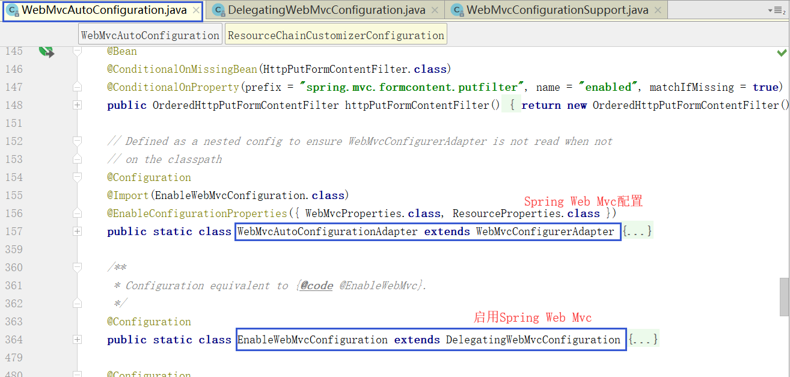

### HttpMessageConvertersAutoConfiguration

Spring Boot的自动配置类`HttpMessageConvertersAutoConfiguration`声明如下：

```java
@Configuration
@ConditionalOnClass(HttpMessageConverter.class)
@AutoConfigureAfter({ GsonAutoConfiguration.class, JacksonAutoConfiguration.class })
@Import({ JacksonHttpMessageConvertersConfiguration.class,
		GsonHttpMessageConvertersConfiguration.class })
public class HttpMessageConvertersAutoConfiguration {
```

构造函数如下：

```java
public HttpMessageConvertersAutoConfiguration(
        ObjectProvider<List<HttpMessageConverter<?>>> convertersProvider) {
    this.converters = convertersProvider.getIfAvailable();
}
```

其构造函数注入了`ObjectProvider`，`ObjectProvider`会注入所有类型为`HttpMessageConverter`的实现类，
这些类一般都是通过`*AutoConfig`自动配置，例如`StringHttpMessageConverterConfiguration`。

```java
@Bean
@ConditionalOnMissingBean
public HttpMessageConverters messageConverters() {
    return new HttpMessageConverters(this.converters == null
            ? Collections.<HttpMessageConverter<?>>emptyList() : this.converters);
}
```

>`new HttpMessageConverters()`默认会添加 默认的HttpMessageConverter

通过上面的代码可知，该`HttpMessageConvertersAutoConfiguration`注册了`HttpMessageConverters` bean。
如果`converters`不为null，则传入该值，否则传入一个`EmptyList`。

### WebMvcAutoConfiguration



##### class WebMvcAutoConfigurationAdapter extends WebMvcConfigurerAdapter

其中`WebMvcAutoConfigurationAdapter`类继承`WebMvcConfigurerAdapter`抽象类，
`WebMvcConfigurerAdapter`抽象类又实现了`WebMvcConfigurer`接口

`WebMvcAutoConfigurationAdapter`类通过构造函数注入了`HttpMessageConverters`，并重写了`configureMessageConverters`方法。

```java
public WebMvcAutoConfigurationAdapter(ResourceProperties resourceProperties,
        WebMvcProperties mvcProperties, ListableBeanFactory beanFactory,
        @Lazy HttpMessageConverters messageConverters,
        ObjectProvider<ResourceHandlerRegistrationCustomizer> resourceHandlerRegistrationCustomizerProvider) {
    this.resourceProperties = resourceProperties;
    this.mvcProperties = mvcProperties;
    this.beanFactory = beanFactory;
    this.messageConverters = messageConverters;
    this.resourceHandlerRegistrationCustomizer = resourceHandlerRegistrationCustomizerProvider
            .getIfAvailable();
}

@Override
public void configureMessageConverters(List<HttpMessageConverter<?>> converters) {
    converters.addAll(this.messageConverters.getConverters());
}
```

### WebMvcConfigurationSupport

提供对由`RequestMappingHandlerAdapter`和`ExceptionHandlerExceptionResolver`使用的共享`HttpMessageConverter`s的访问。
这个方法不能被覆盖，改用`configureMessageConverters(List) `。
另请参阅可用于添加默认消息转换器的`addDefaultHttpMessageConverters(List) `。

```java
protected final List<HttpMessageConverter<?>> getMessageConverters() {
    if (this.messageConverters == null) {// 初次get时，为null
        this.messageConverters = new ArrayList<HttpMessageConverter<?>>();// new ArrayList()
        configureMessageConverters(this.messageConverters);// 添加用户配置的HttpMessageConverter
        if (this.messageConverters.isEmpty()) {// 如果用户未配置HttpMessageConverter，则添加默认的。如果用户配置了HttpMessageConverter，则不再添加默认的。
            addDefaultHttpMessageConverters(this.messageConverters);
        }
        extendMessageConverters(this.messageConverters);// 添加用户通过扩展方式配置的HttpMessageConverter
    }
    return this.messageConverters;
}
```

##### class EnableWebMvcConfiguration extends DelegatingWebMvcConfiguration

>💡 简单介绍下`DelegatingWebMvcConfiguration`:
>
>`DelegatingWebMvcConfiguration`类继承了`WebMvcConfigurationSupport`类，
>通过`setConfigurers`方法注入所有`WebMvcConfigurer`的实现类 bean，
>来实现将`WebMvcConfigurationSupport`的自定义配置委托给`WebMvcConfigurer`的实现类。

```java
private final WebMvcConfigurerComposite configurers = new WebMvcConfigurerComposite();


@Autowired(required = false)
public void setConfigurers(List<WebMvcConfigurer> configurers) {
    if (!CollectionUtils.isEmpty(configurers)) {// 如果存在WebMvcConfigurer实现类的bean，则将其设置到WebMvcConfigurerComposite的List<WebMvcConfigurer> delegates集合中。
        this.configurers.addWebMvcConfigurers(configurers);
    }
}
```

`DelegatingWebMvcConfiguration`类通过上述方式注入了所有`WebMvcConfigurer`的实现类，也即注入了`WebMvcAutoConfigurationAdapter`类。

然后`DelegatingWebMvcConfiguration`类通过重写`configureMessageConverters`方法导入所有这些`WebMvcConfigurer`的实现类中定义的`HttpMessageConverter`。